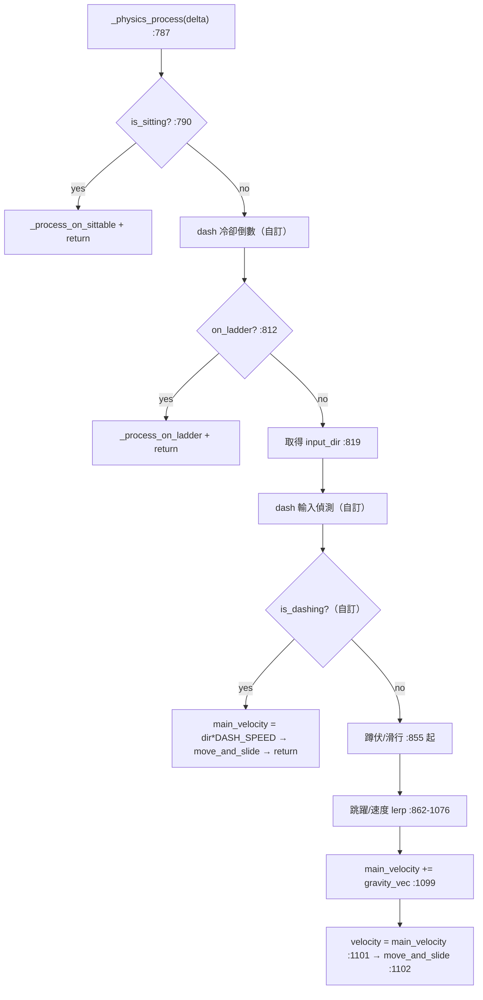
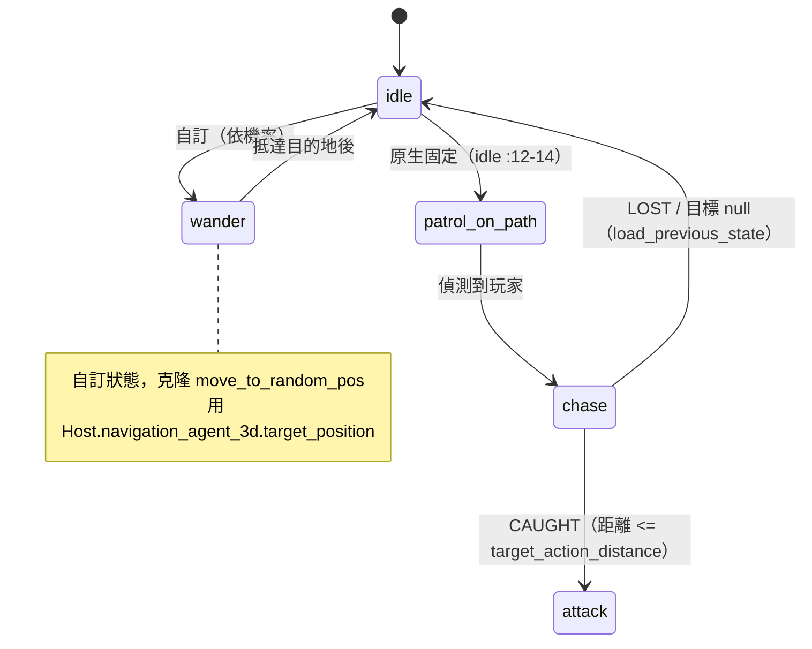

# 教學：如何替玩家與 NPC 添加新動作

本教學以完整可執行的程式碼，說明如何在 COGITO 中為玩家添加「衝刺 (Dash)」機制，以及為 NPC 建立「隨機遊走 (Wander)」狀態。

> 所有行號均對照 `Cogito-1.1.5` 原始碼實際確認（撰寫於 2026-05-29）。Godot 腳本改版後行號可能漂移，套用前請以 Grep 重新核對函數名稱所在行。

## 前置知識
- 已閱讀 [Level 5E: 玩家完整移動系統](../architecture/level5e_player_movement.md)。
- 已閱讀 [Level 3B: NPC 狀態機行為](../architecture/level3_npc_states.md)。

---

## 既有 vs 自訂：先釐清邊界

| 項目 | 來源 | 位置 |
|---|---|---|
| 玩家走/跑/蹲/滑/跳/梯子/坐 | **既有** | `cogito_player.gd:_physics_process`（`:787` 起） |
| 衝刺 (Dash) | **本教學自訂** | 需新增變數與函數至 `cogito_player.gd` |
| NPC 狀態機（場景樹掛載式） | **既有** | `npc_state_machine.gd` |
| NPC idle / patrol_on_path / move_to_random_pos / chase / attack / switch_stance | **既有** | `addons/cogito/CogitoNPC/npc_states/*.gd` |
| NPC 隨機遊走 (Wander) | **本教學自訂**（克隆自 `move_to_random_pos`） | 需新增 `npc_state_wander.gd` |

關鍵原生機制（皆已用 Read 確認）：

- 狀態機在 `npc_state_machine.gd:setup()`（`:65`）掃描子節點，以 `child.name` 為鍵存入 `states`（`:66-67`），並注入 `Host`/`host`/`States`/`states`（`:69-79`）。
- 切換狀態走 `goto(state, args)`（`npc_state_machine.gd:110`）：先 `await caller("_state_exit")`（`:119`）→ 移除舊節點（`:123`）→ 加入新節點（`:128`）→ `await caller("_state_enter", args)`（`:130`）。
- `has(state)` 安全檢查狀態是否掛載（`npc_state_machine.gd:50`）。
- `save_state_as_previous(name, args)`（`:91`）/ `load_previous_state(fallback)`（`:97`）支援返回上一個狀態。
- NPC 用 `Host.navigation_agent_3d`（`cogito_npc.gd:70`，`@onready var navigation_agent_3d: NavigationAgent3D = $NavigationAgent3D`）做導航。
  - **重要更正**：本機制不存在 `Host.navigation_agent`，也沒有 `Host.set_navigation_target()`。設定目標一律直接寫 `Host.navigation_agent_3d.target_position = ...`（原生範例見 `npc_state_move_to_random_pos.gd:15`）。

---

## 一、玩家動作：添加「衝刺 (Dash)」

### 原始碼導航
- `addons/cogito/CogitoObjects/cogito_player.gd`（修改此檔案）

### 玩家移動系統概述
`cogito_player.gd` 的物理流程在 `_physics_process(delta)`（`:787`）中以線性順序執行。流程末段的速度組裝固定為：

- `main_velocity.x/z` 由 `direction * current_speed` 寫入（`:1071-1076`）
- 加上重力 `main_velocity += gravity_vec`（`:1099`）
- 賦值 `velocity = main_velocity`（`:1101`）後 `move_and_slide()`（`:1102`）

衝刺要在「進入一般速度組裝之前」短路：直接覆寫 `main_velocity` 並提前 `move_and_slide()` 後 `return`，跳過走/跑/蹲/滑邏輯與樓梯偵測。



### 實作步驟

#### 1. 在 Input Map 加入新動作
Godot 頂部選單 → **Project → Project Settings → Input Map** → 點擊 Add 加入 `dash`，綁定到例如 `Shift + W` 或獨立按鍵 `Q`。

> 既有移動已使用的動作鍵：`left` / `right` / `forward` / `back`（`cogito_player.gd:819`）、`sprint`（`:867`）、`crouch`（`:856`）。請勿與這些衝突。

#### 2. 定義衝刺變數
緊接在 `Movement Properties` 匯出組（`cogito_player.gd:72`，組內含 `WALKING_SPEED :75` / `SPRINTING_SPEED :76`）之後加入：
```gdscript
# addons/cogito/CogitoObjects/cogito_player.gd
@export_group("Dash Properties")
@export var DASH_SPEED : float = 20.0
@export var DASH_DURATION : float = 0.2
@export var DASH_COOLDOWN : float = 0.8  # 防止連衝

var is_dashing : bool = false
var dash_cooldown_timer : float = 0.0
var _dash_direction : Vector3 = Vector3.ZERO
```

#### 3. 計時器遞減
在 `_physics_process(delta)`（`:787`）內、**`is_sitting` 早期返回之後**（`:790-792` 之後）、`on_ladder` 判斷（`:812`）之前加入。放在坐下判斷後可避免坐著時也倒數冷卻：
```gdscript
# 衝刺冷卻倒數
if dash_cooldown_timer > 0:
    dash_cooldown_timer -= delta
```

#### 4. 輸入偵測
在取得 `input_dir`（`:817-821`）之後、蹲伏處理（`:855`）之前加入：
```gdscript
# 衝刺輸入偵測（地面且不在衝刺中且冷卻結束）
if Input.is_action_just_pressed("dash") and is_on_floor() and !is_dashing and dash_cooldown_timer <= 0:
    start_dash()
```

#### 5. 啟動衝刺函數
在腳本末尾加入。方向取自既有的輸入鍵與 `body`（`:185`）/ `head`（`:187`）節點：
```gdscript
func start_dash() -> void:
    is_dashing = true
    dash_cooldown_timer = DASH_COOLDOWN
    # 使用當前 input_dir 決定衝刺方向，無輸入則向前（相機朝向）
    var input_dir = Input.get_vector("left", "right", "forward", "back")
    if input_dir != Vector2.ZERO:
        # 與既有移動相同：以 body.global_transform.basis 轉成世界方向（對照 :1056）
        _dash_direction = (body.global_transform.basis * Vector3(input_dir.x, 0, input_dir.y)).normalized()
    else:
        _dash_direction = -head.global_transform.basis.z  # 相機正前方
    _dash_direction.y = 0  # 鎖在水平面，避免衝向天花板/地板

    await get_tree().create_timer(DASH_DURATION).timeout
    is_dashing = false
```

#### 6. 物理整合（短路）
在步驟 4 的輸入偵測**之後**、蹲伏處理（`:855`）之前加入。沿用既有 `main_velocity`（宣告於 `:161`）與 `gravity_vec`（宣告於 `:146`）：
```gdscript
if is_dashing:
    main_velocity.x = _dash_direction.x * DASH_SPEED
    main_velocity.z = _dash_direction.z * DASH_SPEED
    main_velocity += gravity_vec        # 保留重力，衝刺中仍會落地（對照 :1099）
    velocity = main_velocity            # 對照 :1101
    move_and_slide()                    # 對照 :1102
    return  # ← 短路：衝刺期間不執行其餘物理
```

> 注意：此短路在 `gravity_vec` **本輪尚未更新**的情況下沿用上一輪的值（重力累積發生於 `:963-966`，在短路點之後）。對 0.2 秒的短衝刺視覺上無感；若要嚴格正確，可在短路前自行補一行 `gravity_vec += gravity_vector * gravity * delta`（對照 `:966`）。

### 驗證方式
1. 在 Input Map 確認 `dash` 動作已設定，且不與 `sprint`/`crouch` 衝突。
2. 運行場景，按衝刺鍵，確認角色有明顯短距離加速。
3. 連續按衝刺鍵，確認冷卻時間有效（不會無限連續衝刺）。
4. 確認衝刺不影響重力（衝刺後會正常落地）。
5. 對著牆衝刺，確認 `move_and_slide()` 正常擋住，不會穿牆。

---

## 二、NPC 動作：添加「隨機遊走 (Wander)」狀態

COGITO 的 NPC 狀態機使用「場景樹掛載式狀態」——每個狀態是 `NPC_State_Machine` 下的子節點，節點 `name` 即是狀態鍵值。新增狀態只需三步：**寫腳本 → 掛節點 → 觸發切換**。

### 原始碼導航
- `addons/cogito/CogitoNPC/npc_states/` — 所有狀態腳本（注意：路徑在 `npc_states/` 子目錄，狀態機本身也在此，`npc_state_machine.gd`）
- `addons/cogito/CogitoNPC/npc_states/npc_state_move_to_random_pos.gd` — 參考實作（隨機位置移動），本教學的 Wander 直接克隆其結構
- `addons/cogito/CogitoNPC/cogito_npc.gd:70` — `@onready var navigation_agent_3d: NavigationAgent3D`

### 狀態機運作原理（快速回顧）
`npc_state_machine.gd` 在 `setup()`（`:65`，由 `_enter_tree()` `:24-25` 呼叫）時：
1. 掃描所有子節點，以其 `name` 作為鍵存入 `states` Dictionary（`:66-67`）。
2. 注入 `Host`（NPC 根節點，即 `get_host()` `:16`）與 `States`（狀態機本身）到每個狀態節點（`:69-79`）。
3. 非當前狀態的節點會被 `remove_child` 暫存（`:81-82`），切換時才重新 `add_child`。
4. 狀態切換時呼叫 `_state_exit()` → 換節點 → 呼叫 `_state_enter()`（`goto()` `:110-130`）。



### 步驟一：建立 npc_state_wander.gd

**完整實作，參照 `npc_state_move_to_random_pos.gd`（已逐行核對）的模式：**

```gdscript
# addons/cogito/CogitoNPC/npc_states/npc_state_wander.gd
extends Node

# 由 NPC_State_Machine.setup() 自動注入（對照 npc_state_machine.gd:69-79）
var Host  # CogitoNPC 實例（get_host() 回傳）
var States  # NPC_State_Machine 實例

@export var max_wander_distance : float = 8.0
@export var idle_after_wander : bool = true

enum WanderStatus { RUNNING, WAITING, SUCCESS, FAILURE }
var current_status : WanderStatus = WanderStatus.RUNNING


func _state_enter() -> void:
    CogitoGlobals.debug_log(true, "npc_state_wander.gd", "Wander state entered")
    Host.navigation_agent_3d.target_position = _pick_random_destination()
    current_status = WanderStatus.RUNNING


func _state_exit() -> void:
    # 保存本狀態名稱，讓 load_previous_state() 能返回此狀態（對照 :91 / move_to_random_pos :20）
    States.save_state_as_previous(self.name, null)
    CogitoGlobals.debug_log(true, "npc_state_wander.gd", "Wander state exiting")


func _physics_process(delta: float) -> void:
    Host.update_animations(delta)  # 更新動畫混合樹（cogito_npc.gd:117）

    match current_status:
        WanderStatus.RUNNING:
            _handle_running(delta)
        WanderStatus.WAITING:
            # 緩慢停下（對照 move_to_random_pos :27-34，使用 Host.move_speed :33）
            Host.velocity.x = move_toward(Host.velocity.x, 0, delta * Host.move_speed)
            Host.velocity.z = move_toward(Host.velocity.z, 0, delta * Host.move_speed)
            Host.move_and_slide()
            if Host.velocity.length_squared() < 0.01:
                current_status = WanderStatus.SUCCESS
        WanderStatus.SUCCESS:
            if idle_after_wander:
                States.goto("idle")
            else:
                # 直接再找一個新目的地
                Host.navigation_agent_3d.target_position = _pick_random_destination()
                current_status = WanderStatus.RUNNING
        WanderStatus.FAILURE:
            # 無法到達目的地，重新選點
            Host.navigation_agent_3d.target_position = _pick_random_destination()
            current_status = WanderStatus.RUNNING


func _handle_running(delta: float) -> void:
    if Host.navigation_agent_3d.is_navigation_finished():
        current_status = WanderStatus.WAITING
        return
    if not Host.navigation_agent_3d.is_target_reachable():
        current_status = WanderStatus.FAILURE
        return
    _move_to_next_position(delta)


func _move_to_next_position(delta: float) -> void:
    var next_pos = Host.navigation_agent_3d.get_next_path_position()

    # 補重力（對照 move_to_random_pos :69-70）
    if not Host.is_on_floor():
        Host.velocity += Host.get_gravity() * delta

    var direction = Host.global_position.direction_to(next_pos)
    var look_target = Vector3(
        Host.global_position.x + Host.velocity.x,
        Host.global_position.y,
        Host.global_position.z + Host.velocity.z
    )

    if direction:
        Host.face_direction(look_target)                   # cogito_npc.gd:134
        Host.velocity.x = direction.x * Host.move_speed     # move_speed 預設 2（cogito_npc.gd:33）
        Host.velocity.z = direction.z * Host.move_speed
    else:
        Host.velocity.x = move_toward(Host.velocity.x, 0, Host.move_speed)
        Host.velocity.z = move_toward(Host.velocity.z, 0, Host.move_speed)

    Host.move_and_slide()


func _pick_random_destination() -> Vector3:
    # 注意：與原生 move_to_random_pos 的差異——
    # 原生 random_position() 回傳「相對原點」的向量（:86-90，未加 Host 位置），
    # 這裡明確以「Host 當前位置」為中心向外取點，行為較直覺。
    var angle = randf_range(0, TAU)
    var dist = randf_range(2.0, max_wander_distance)
    return Host.global_position + Vector3(cos(angle) * dist, 0, sin(angle) * dist)
```

### 步驟二：在 Godot 編輯器中掛載狀態

1. 開啟 NPC 場景（範例 NPC 場景，找含 `NPC_State_Machine` 子節點者）。
2. 在場景樹中找到 `NPC_State_Machine` 節點（其 `host` 匯出指向 NPC 根節點，`npc_state_machine.gd:6`）。
3. 在 `NPC_State_Machine` 下**新增一個 Node 子節點**（基礎 `Node` 即可，狀態腳本 `extends Node`）。
4. 在 Inspector 的 Script 欄位附加 `npc_state_wander.gd`。
5. **關鍵**：將該節點重新命名為 `wander`（狀態機以節點名稱 `child.name` 為鍵，`npc_state_machine.gd:67`，大小寫須與 `goto("wander")` 完全一致）。
6. 調整 `max_wander_distance` 等 @export 屬性。
7. （選用）若想讓 NPC 一開機就遊走，可把 `NPC_State_Machine` 的 `start_state`（`:9`）設為 `wander`；否則沿用既有 `idle` 起始並靠步驟三觸發。

### 步驟三：修改 npc_state_idle.gd 觸發切換

原始 `npc_state_idle.gd:9-14` 在固定等待 **3 秒**後（`await get_tree().create_timer(3).timeout`，`:12`）固定跳到 `patrol_on_path`（`:14`）。改為依機率決定，並安全檢查 `wander` 是否掛載：

```gdscript
# addons/cogito/CogitoNPC/npc_states/npc_state_idle.gd（修改 _state_enter）
@export var wander_probability : float = 0.5  # 50% 機率遊走

func _state_enter():
    CogitoGlobals.debug_log(true, "npc_state_idle.gd", "Idle state entered")
    await get_tree().create_timer(randf_range(2.0, 5.0)).timeout  # 隨機閒置時間

    if States.has("wander") and randf() < wander_probability:
        States.goto("wander")
    elif States.has("patrol_on_path"):
        States.goto("patrol_on_path", null)
    # 否則停留在 idle（goto 同名狀態會 restart，npc_state_machine.gd:116-117）
```

**`States.has(state_name)`**（`npc_state_machine.gd:50`）：安全地檢查狀態是否存在，避免 NPC 場景沒有掛載 `wander` / `patrol_on_path` 節點時 `goto()` 觸發 `push_error`（`:111-113`）。

### 步驟四：NPC 失去追蹤後恢復 wander（選用）

原生 `npc_state_chase.gd` 在追丟玩家時已自動處理：`stop_chasing()`（`:104-107`，由 `chase_wait_timer` 逾時觸發，`:32`）會把狀態設為 `ChaseStatus.LOST`，下一個 `_physics_process` 落到 `LOST` 分支（`:80-84`）呼叫 `States.load_previous_state()`。也就是說，**它會返回進入 chase 之前的狀態**（可能就是 `wander`，因為 `wander._state_exit()` 已 `save_state_as_previous`）。

若你想強制改成「追丟後優先遊走」，可修改 `npc_state_chase.gd` 的 `LOST` 分支：
```gdscript
# npc_state_chase.gd:80-84（修改）
ChaseStatus.LOST:
    host_animation_statemachine.travel(neutral_stance)
    chase_ended.emit()
    if States.has("wander"):
        States.goto("wander")
    else:
        States.load_previous_state()
```
> 不要新寫 `if current_chase_status == ChaseStatus.LOST` 這種外部輪詢——`LOST` 是內部狀態，原生已在 match 分支處理，重複判斷會造成雙重切換。

### 存檔整合

NPC 的 `save()` 把當前狀態存進 `saved_enemy_state`（`cogito_npc.gd:191`，`saved_enemy_state = npc_state_machine.current`），讀檔時 `set_state()`（`:179`）會 `npc_state_machine.goto(saved_enemy_state)`（`:183`）。因此 `wander` 狀態若在存檔當下是當前狀態，讀檔後會自動以 `goto("wander")` 恢復——前提是該 NPC 場景確實掛載了 `wander` 節點，否則 `goto` 會 `push_error` 並停在原狀態。

### 驗證方式
1. 放置一個帶有 `wander` 狀態節點的 NPC 到場景，並確認場景已烘焙 NavigationMesh（否則 `is_target_reachable()` 恆為 false，NPC 會卡在 FAILURE 重選點）。
2. 把 `NPC_State_Machine` 的 `logging`（`:7`）設為 true，並確認 `CogitoGlobals` 的除錯輸出開啟。
3. 運行遊戲，觀察 Console：應看到 `Idle state entered` → 等待幾秒 → `Wander state entered` → NPC 移動 → 抵達後 `Idle state entered`。
4. 確認 NPC 在地板上正確移動、會 `face_direction` 轉向、不穿牆。
5. 存檔後重讀，確認 NPC 狀態正確恢復。

---

## 常見陷阱（皆已對照原始碼確認）

| 陷阱 | 原因 / 原始碼依據 | 對策 |
|---|---|---|
| 寫 `Host.navigation_agent` 或 `Host.set_navigation_target()` | 兩者皆不存在；NPC 只有 `navigation_agent_3d`（`cogito_npc.gd:70`） | 一律 `Host.navigation_agent_3d.target_position = ...`（範例 `move_to_random_pos.gd:15`） |
| 找不到 `npc_state_machine.gd` | 它在 `npc_states/` 子目錄，不在 `CogitoNPC/` 根 | 路徑為 `CogitoNPC/npc_states/npc_state_machine.gd` |
| 狀態節點命名錯誤導致 `goto` 報錯 | 鍵 = `child.name`（`:67`），`goto` 找不到會 `push_error`（`:111-113`） | 節點名須與 `goto("wander")` 完全一致（含大小寫） |
| NPC 原地踏步、不移動 | NavigationMesh 未烘焙，`is_target_reachable()` 為 false → 一直 FAILURE 重選 | 場景加 `NavigationRegion3D` 並烘焙 |
| Wander 取點落在導航網外 | 隨機點可能在牆外/空中 | 已用 `is_target_reachable()` 檢查；可再用 `NavigationServer3D.map_get_closest_point` 吸附 |
| 直接抄 `move_to_random_pos.random_position()` 取點偏離 | 原生 `random_position()`（`:86-90`）回傳相對原點向量、未加 Host 位置 | 本教學 `_pick_random_destination()` 已改為以 Host 位置為中心 |
| 衝刺穿過地板/飛天 | `_dash_direction` 含 y 分量（相機俯仰） | `start_dash()` 已 `_dash_direction.y = 0` 鎖水平 |
| 衝刺與蹲伏/滑行打架 | 衝刺短路在蹲伏處理（`:855`）之前但需先 `return` | 物理整合段務必以 `return` 短路，跳過 `:855` 起的後續邏輯 |
| `dash` 鍵與既有動作衝突 | 既有用 `left/right/forward/back/sprint/crouch`（`:819/:867/:856`） | Input Map 選不重疊的鍵 |
| 在 chase LOST 外再寫輪詢 | `LOST` 是內部狀態，已在 match 分支處理（`:80-84`） | 直接改 `LOST` 分支，勿外部 `if == LOST` |
| 讀檔後 NPC 狀態沒恢復 | `set_state()`→`goto(saved_enemy_state)`（`:183`）要求該狀態已掛載 | 確保存檔的 NPC 場景含對應狀態節點 |
