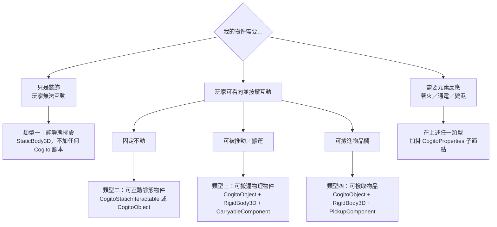
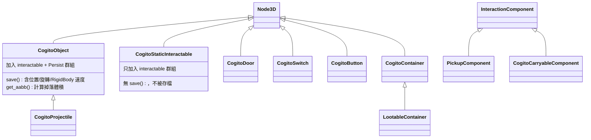

# 教學：如何添加 3D 物件與特效 (VFX)

本教學深度說明如何在 COGITO 中建立各類 3D 物件，以及如何整合撿取、物理碰撞、元素特效等系統，確保物件能被正確存讀檔。

> 本文所有行號皆對照 `/home/lorkhan/code/Cogito-1.1.5` 原始碼（版本 1.1.5）實際確認。

## 前置知識
- 已閱讀 [Level 3A: 互動物件系統](../architecture/level3_interactive_objects.md)。
- 已閱讀 [Level 4A: CogitoProperties 物質反應系統](../architecture/level4_properties_system.md)。

---

## 先釐清三個常見誤解（重要）

進入教學前，先校正三個 COGITO 新手（與舊版教學）常見的錯誤認知，後續設定才不會走偏：

1. **「可互動」由群組決定，不是由 Physics Layer 決定。**
   玩家的偵測射線 `InteractionRayCast`/`InteractionShapecast` 的 `collision_mask = 3`（即 Layer 1 **加** Layer 2，二進位 `11`），見 `addons/cogito/Components/interaction_raycast.tscn:35,43`。射線打到任何 Layer 1 或 2 的物體後，**還要再用群組過濾**：`addons/cogito/Scripts/interaction_raycast.gd:64`（raycast）與 `:92`（shapecast）只接受 `is_in_group("interactable")` 的碰撞體，其餘一律視為 null。
   → 所以「裝飾品不會跳出互動提示」的真正原因是**它不在 `interactable` 群組／沒有 InteractionComponent**，而不是「它在 Layer 1」。Layer 2 取名 `Interactables`（`project.godot:249`）只是組織上的命名慣例。

2. **內建互動物件大多直接 `extends Node3D`，並非繼承 `CogitoObject`。**
   實際上 `CogitoObjects/` 中**只有 `cogito_projectile.gd` 繼承 `CogitoObject`**（`cogito_projectile.gd:3`）。門、開關、按鈕、容器都是各自 `extends Node3D` 並自帶 `class_name`：
   - `cogito_door.gd:4` `extends Node3D`（class `CogitoDoor`，`:3`）
   - `cogito_switch.gd:3` `extends Node3D`（class `CogitoSwitch`，`:2`）
   - `cogito_button.gd:2` `extends Node3D`（class `CogitoButton`，`:3`）
   - `cogito_container.gd:2` `extends Node3D`（class `CogitoContainer`，`:3`）；`cogito_lootable_container.gd:1` 才再繼承 `CogitoContainer`
   → 因此「自訂互動物件一定要繼承 CogitoObject」是錯的。你可以繼承 `CogitoObject` 取得它的存檔/AABB/properties 掃描，**也可以**像門/容器那樣只繼承 `Node3D` 自己實作。下文會標明每種做法。

3. **存檔有兩套群組，用途不同。**
   - `"Persist"`：整個節點會被**刪除後重新實例化**（需 `.tscn` 來源 + `save()`）。`CogitoObject._ready()` 自動加入此群組（`cogito_object.gd:51`）。
   - `"save_object_state"`：節點本身**留在場景**，只還原其狀態（門開關、容器內容等）。門與容器加入的是這個群組（`cogito_door.gd:137`、`cogito_container.gd:42`）。
   兩者由 `cogito_scene_manager.gd` 分別處理：Persist 在 `:391` 起、save_object_state 在 `:421` 起。

---

## 物件類型決策樹



> 注意：類型二「固定可互動」其實有兩條路（見下文）——用內建 `CogitoStaticInteractable`（不存檔、最輕量），或用 `CogitoObject`（含完整存檔）。

## 物件類別階層

下圖呈現 `CogitoObjects/` 中各腳本的實際繼承關係（已逐一以 `extends` 確認）：



重點：互動「組件」（`PickupComponent`、`CogitoCarryableComponent`）繼承的是 `InteractionComponent`（`PickupComponent.gd:1`、`CarryableComponent.gd:1`），掛在物件之下；互動「物件」彼此多半是平行的 `Node3D` 子類，**不是**一條長繼承鏈。

---

## 類型一：純靜態擺設

最簡單的物件，不參與任何遊戲邏輯。

### 節點結構
- `StaticBody3D`
  - `MeshInstance3D`
  - `CollisionShape3D`

### Physics Layer 設定
- **Layer 1 (Environment)**：勾選此 Layer。
- 原因：`PlayerInteractionComponent` 的 `InteractionRayCast` 僅掃描 **Layer 2**，Layer 1 的物件不會被偵測為「可互動物件」。

### 重要注意
不要繼承 `CogitoObject`，因為 `CogitoObject._ready()` 會自動加入 `"interactable"` 與 `"Persist"` 群組，導致場景管理器嘗試對它執行 `save()`，引發 `get_scene_file_path()` 回傳空字串的警告。

---

## 類型二：可互動靜態物件

固定在場景中、玩家可以看向並互動的物件（如書架、佈告欄）。

### 節點結構
- `CogitoStaticInteractable` (StaticBody3D + cogito_static_interactable.gd)
  - `MeshInstance3D`
  - `CollisionShape3D`
  - `BasicInteraction`
    - (此節點已繼承自 InteractionComponent)

或者，若要完整 CogitoObject 功能（含存檔）：
- `CogitoObject` (Node3D + cogito_object.gd)
  - `StaticBody3D`
    - `MeshInstance3D`
    - `CollisionShape3D`
  - `BasicInteraction`

### Physics Layer 設定
- **Layer 2 (Interactables)**：物件的 `StaticBody3D` 或 `RigidBody3D` 應勾選此 Layer，讓 `InteractionRayCast` 能掃描到它。

### BasicInteraction 設定（`InteractionComponent.gd:9-28`）
在 Inspector 中：
| 屬性 | 說明 | 範例值 |
|---|---|---|
| `input_map_action` | 觸發按鍵（須與 Input Map 一致） | `"interact"` |
| `interaction_text` | 顯示在準心旁的提示文字 | `"[E] 查看"` |
| `is_disabled` | 若為 true，互動提示不顯示 | `false` |
| `ignore_open_gui` | 開啟物品欄時是否忽略此互動 | `true` |

### 連接互動信號
```gdscript
# 在 BasicInteraction 的 Inspector 中連接信號：
# was_interacted_with(interaction_text, input_map_action) → 您的根節點方法

# 範例：根節點腳本
func _on_basic_interaction_was_interacted_with(_text, _action):
    Audio.play_sound(my_sound)
    label_node.visible = !label_node.visible
```

### Attribute Check（可選）
`InteractionComponent` 支援互動前的屬性門檻檢查（`InteractionComponent.gd:31-58`）：
```gdscript
# 在 Inspector 設定：
# attribute_check = FAIL_MESSAGE（屬性不足時顯示提示）或 HIDE_INTERACTION（直接隱藏互動）
# attribute_to_check = "health"（玩家字典中的屬性名稱）
# min_value_to_pass = 50.0（最低需求值）
# message_on_fail = "你太虛弱了，無法搬動這個箱子"
```

---

## 類型三：可搬運物理物件

可以被推動，或可以被玩家「撿起並攜帶」的物件（如箱子、瓶子）。

### 節點結構
- `CogitoObject` (Node3D + cogito_object.gd) ← 掛此腳本以支援存檔
  - `RigidBody3D`
    - `MeshInstance3D`
    - `CollisionShape3D`
    - `ImpactSounds` ← 碰撞音效
    - `CarryableComponent` ← 允許玩家抬起

**重要**：`CogitoObject` 的 `save()` 會向上爬父節點尋找 `RigidBody3D`（`cogito_object.gd:122-128`），因此根節點是 `Node3D` 而 `RigidBody3D` 是其子節點的結構是正確的。

### Physics Layer 設定
- 根節點的 `CollisionShape3D` 歸屬的 `RigidBody3D` 設定在 **Layer 1 (Environment)** + **Layer 2 (Interactables)**。
- Layer 2 讓玩家射線能偵測到它，Layer 1 讓玩家能站在上面（若物理允許）。

### ImpactSounds 設定（`ImpactSounds.gd:15-22`）
- `ImpactSounds` 必須是 `RigidBody3D` 的**直接子節點**。
- 它在 `_ready()` 中自動連接父節點的 `body_entered` 信號。
- 設定 `impact_sounds`（`AudioStreamRandomizer`）即可；可在 `next_impact_time` 設定最短碰撞間隔（避免連續碰撞重複播音）。

### CarryableComponent 設定（`CarryableComponent.gd`）
- 同樣必須是 `RigidBody3D` 的子節點。
- 關鍵 @export 屬性：
  | 屬性 | 說明 | 建議值 |
  |---|---|---|
  | `carrying_velocity_multiplier` | 越高越「貼手」，越低越「飄浮」 | `10` |
  | `drop_distance` | 超過此距離自動放下（防卡牆） | `1.5` |
  | `lock_rotation_when_carried` | 攜帶時是否鎖定旋轉 | `true` |
  | `is_carryable_while_wielding` | 持武器時是否能攜帶 | `false` |
  | `enable_manual_rotating` | 允許按住次要動作鍵旋轉物件 | `true` |

---

## 類型四：可撿取物品

玩家可以撿進物品欄的道具。

### 節點結構
- `CogitoObject` (Node3D + cogito_object.gd)
  - `RigidBody3D`
    - `MeshInstance3D`
    - `CollisionShape3D`
    - `PickupComponent` ← 撿取進物品欄

### PickupComponent 設定（`PickupComponent.gd:4-5`）
最關鍵的欄位是 `slot_data`（`InventorySlotPD` Resource）。

**建立 InventorySlotPD 步驟：**
1. 在 FileSystem 右鍵 → **New Resource** → 選擇 `InventorySlotPD`。
2. 展開後設定：
   - `inventory_item`：指向對應的 `.tres` 物品資源（如 `key_rusty.tres`）。
   - `quantity`：初始數量（預設 1）。
3. 存檔為 `slot_key_rusty.tres`。
4. 將此資源拖入 `PickupComponent` 的 `slot_data` 欄位。

**`display_item_name`**（`PickupComponent.gd:12-14`）：若勾選，物件的 `display_name` 會自動設為物品的名稱。

---

## 添加特效 (VFX)

### 特效一：元素狀態特效（`CogitoProperties`）

掛載 `CogitoProperties` 後，可在以下欄位設定對應狀態觸發的特效場景：

| 欄位 | 觸發條件 |
|---|---|
| `spawn_on_ignite` | 物件著火時 |
| `spawn_on_wet` | 物件變濕時 |
| `spawn_on_electrified` | 物件通電時 |

**特效場景建立範例：**
- `FireEffect.tscn`
  - `GPUParticles3D`
    - (設定 Amount、Lifetime、EmissionShape 等)
    - (粒子材質使用 ParticleProcessMaterial)

**已知 Bug（`cogito_properties.gd:276`）**：`spawn_elemental_vfx()` 中的上限判斷條件寫反：
```gdscript
# 原始（錯誤）：size() <= max_spawned_vfx + 1 幾乎永遠成立，導致每次都清除
if spawned_effects.size() <= max_spawned_vfx + 1:
    clear_spawned_effects()

# 應為：只在超過上限時才清除
if spawned_effects.size() >= max_spawned_vfx:
    clear_spawned_effects()
```
若您的特效不斷消失/重生，這就是原因。建議手動修正此行。

### 特效二：投射物碰撞特效（`CogitoProjectile`）

`CogitoProjectile`（`cogito_projectile.gd:19`）的 `spawn_on_death : Array[PackedScene]` 在彈丸消亡時生成特效：
```gdscript
# cogito_projectile.gd:117-127
func die():
    if sound_on_death:
        Audio.play_sound_3d(sound_on_death).global_position = global_position
    for scene in spawn_on_death:
        if scene:
            var spawned_object = scene.instantiate()
            spawned_object.position = position
            get_tree().current_scene.add_child(spawned_object)
    queue_free()
```
使用方式：建立彈孔/火花等特效場景，加入 `spawn_on_death` 陣列。

### 特效三：死亡/破壞特效（`CogitoHealthAttribute`）

`CogitoHealthAttribute`（`cogito_health_attribute.gd:42-60`）的 `spawn_on_death : Array[PackedScene]` 在血量歸零時生成：
```gdscript
func on_death(_attribute_name, _value_current, _value_max):
    death.emit()
    parent_position = get_parent().global_position  # 記憶父節點位置
    for scene in spawn_on_death:
        if scene:
            var spawned_object = scene.instantiate()
            spawned_object.position = parent_position  # 生成於父節點位置
            get_tree().current_scene.add_child(spawned_object)
```
**注意**：因為特效生成後父節點可能已 `queue_free()`，特效場景必須以 `current_scene` 作為父節點，所以位置是透過 `parent_position` 記憶的。

### 特效四：手動腳本生成

若需要在自訂邏輯中生成特效：
```gdscript
# 正確的生成方式（避免父節點被 queue_free 導致特效消失）
func spawn_vfx_at(vfx_scene: PackedScene, world_pos: Vector3) -> void:
    var vfx = vfx_scene.instantiate()
    get_tree().current_scene.add_child(vfx)
    vfx.global_position = world_pos
    # 特效場景通常有自動結束（OneShot 粒子 + queue_free 邏輯）
```

---

## 存讀檔整合

若使用 `CogitoObject`，物件會自動加入 `"Persist"` 群組（`cogito_object.gd:51`），`CogitoSceneManager` 存檔時會呼叫其 `save()`。

**正確做法**：物件**必須是 PackedScene**（從 `.tscn` 實例化），否則 `get_scene_file_path()` 回傳空字串，讀檔時無法重建。

`save()` 儲存的資料（`cogito_object.gd:91-119`）：
- 位置/旋轉
- 若是 `RigidBody3D`：線速度與角速度（確保讀檔後靜止）
- `spawned_loot_item` 旗標（用於識別動態生成的戰利品）

---

## 驗證清單

| 測試項目 | 預期結果 |
|---|---|
| 看向物件，準心無反應 | Physics Layer 設為 Layer 1 ✓（靜態裝飾）|
| 看向物件，準心出現互動提示 | Physics Layer 包含 Layer 2 ✓ |
| 按互動鍵，無反應 | 檢查 `input_map_action` 是否與 Input Map 一致 |
| 推動物件，無撞擊音效 | 確認 `ImpactSounds` 是 RigidBody3D 的子節點 |
| 撿起物件，物品欄無更新 | 確認 `slot_data` 已指定有效的 InventorySlotPD |
| 存檔後重讀，物件位置消失 | 確認物件是從 `.tscn` 實例化（非直接放入場景的孤立節點） |
| 著火但無特效 | 確認 `ElementalProperties` 勾選了 `FLAMABLE`；或修正 spawn_elemental_vfx 的 `<=` Bug |
