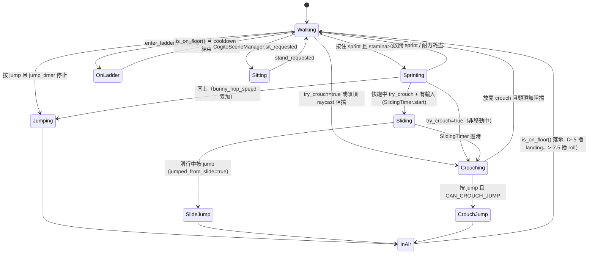

# 教學：進階動作與移動（蹲伏／滑行／趴下／翻滾／ADS 減速）

本教學在精讀 `addons/cogito/CogitoObjects/cogito_player.gd` 的 `_physics_process`（`cogito_player.gd:787`）後，先逐段解析**既有移動狀態機**與可調參數，再說明如何把**自訂動作**正確掛接進去。

所有行號均對應本機 `/home/lorkhan/code/Cogito-1.1.5` 的 v1.1.5 原始碼，已逐一 Grep/Read 核對。

## 前置知識
- 已閱讀 [Level 5E: 玩家完整移動系統](../architecture/level5e_player_movement.md)（節點層級、狀態變數、主流程順序）。

---

## 一、釐清「既有」vs「需自訂」

| 機制 | 狀態 | 真實依據 |
|---|---|---|
| 走路／快跑／蹲下 | 內建 | `cogito_player.gd:854-934` 三段 lerp |
| 滑行（sprint+crouch） | 內建 | `cogito_player.gd:864-868`、`1065-1067` |
| 滑跳（slide jump） | 內建 | `cogito_player.gd:1021-1025` |
| Bunny hop | 內建 | `cogito_player.gd:896-898`、`1038-1039` |
| 跳躍 / 蹲跳 | 內建 | `cogito_player.gd:1005-1051` |
| 空中控制（air lerp） | 內建 | `cogito_player.gd:1059-1064` |
| 自由視角（free_look） | 內建 | `cogito_player.gd:935-955` |
| 樓梯爬升（body_test_motion） | 內建 | `step_check()` `cogito_player.gd:1148` |
| 梯子 | 內建 | `_process_on_ladder()` `cogito_player.gd:701` |
| 落地音效 / 落地翻滾動畫 | 內建 | `cogito_player.gd:799-807`、`991-998` |
| 外力 / 覆寫重力 | 內建 | `apply_external_force()` `:1280`、`override_gravity()` `:1287` |
| **趴下 (Prone)** | **需自訂** | 本教學第三節 |
| **主動翻滾 (Dodge Roll)** | **需自訂** | 本教學第四節（注意：內建只有「落地」被動翻滾動畫） |
| **ADS 移動減速** | **需自訂** | 本教學第五節（武器有 ADS 縮放，但不影響移動速度） |

> 重要區分：`cogito_player.gd:996` 的 `animationPlayer.play("roll")` 是**落地時**（`last_velocity.y <= -7.5`）的被動翻滾**動畫**，**不**改變水平位移，也沒有 i-frame，與第四節要做的「主動位移翻滾」是兩回事。

---

## 二、既有移動狀態機逐段解析

### 2.1 入口短路（`cogito_player.gd:787-814`）

`_physics_process` 開頭依序短路：

- `is_sitting` → 走 `_process_on_sittable(delta)` 後 `return`（`:790-792`）
- 落地音效判斷：`was_in_air and last_velocity.y < landing_threshold`（`:800`，`landing_threshold` 預設 -2.0，`:55`）
- `on_ladder` → 走 `_process_on_ladder(delta)` 後 `return`（`:812-814`）

因此**任何自訂動作的速度覆寫，都必須寫在這三個 `return` 之後**，否則坐下／爬梯時會誤觸發。

### 2.2 蹲伏 / 滑行判斷（`cogito_player.gd:854-882`）

```gdscript
# TOGGLE_CROUCH 模式（:856）：按一下切換 try_crouch
if TOGGLE_CROUCH and Input.is_action_just_pressed("crouch"):
    try_crouch = !try_crouch
elif !TOGGLE_CROUCH:                                  # :858 按住模式
    try_crouch = Input.is_action_pressed("crouch")
```

進入蹲伏分支的條件（`:862`）：

```gdscript
if crouched_jump or (not jumped_from_slide and is_on_floor() and try_crouch or crouch_raycast.is_colliding()):
```

注意 `crouch_raycast.is_colliding()`（`crouch_raycast` 是 `RayCast3D`，`:194`）——**頭頂有障礙時強制維持蹲伏**，這是「鑽過矮縫無法站起」的真正機制。它**從未被 disable**，全程啟用偵測。

蹲伏分支內的滑行觸發（`:864-868`）：

```gdscript
if is_sprinting and input_dir != Vector2.ZERO and is_on_floor():
    sliding_timer.start()          # SlidingTimer，:195
    slide_vector = input_dir
elif !Input.is_action_pressed("sprint"):
    sliding_timer.stop()
```

### 2.3 速度 lerp 三分支（`cogito_player.gd:872-934`）

| 狀態 | 目標速度 | 行號 |
|---|---|---|
| 蹲伏（非滑行） | `CROUCHING_SPEED` (3.0) | `:872` |
| 滑行中 | 由計時器算 `(time_left/wait_time + 0.5) * SLIDING_SPEED` | `:1067` |
| 快跑（有 stamina 且 `value_current > 0`） | `bunny_hop_speed`/`SPRINTING_SPEED` (8.0) | `:895-908` |
| 快跑（**無** stamina_attribute） | 同上，但不檢查耐力 | `:909-921` |
| 走路 | `WALKING_SPEED` (5.0) | `:926` |

`current_speed` 統一在 `:1069` 被 `clamp(current_speed, 0.5, 12.0)` 夾住——**自訂任何超過 12 的衝刺速度都會被截斷**，必須改這個上限。

### 2.4 跳躍與滑跳（`cogito_player.gd:1005-1051`）

```gdscript
if Input.is_action_pressed("jump") and !is_movement_paused and is_on_floor() and jump_timer.is_stopped():
    jump_timer.start()                                       # 防連跳，:1006
    var doesnt_need_stamina = not stamina_attribute or stamina_attribute.value_current >= stamina_attribute.jump_exhaustion  # :1009
    ...
    if !sliding_timer.is_stopped():                          # 滑行中起跳 = 滑跳
        main_velocity.y = JUMP_VELOCITY * SLIDE_JUMP_MOD     # :1023
        jumped_from_slide = true
```

`stamina_attribute.jump_exhaustion` 來自 `cogito_stamina_attribute.gd:6`（每跳消耗 1）。

### 2.5 方向 lerp 與最終 move_and_slide（`cogito_player.gd:1052-1102`）

```gdscript
if sliding_timer.is_stopped():
    if is_on_floor():
        direction = lerp(direction, (body.global_transform.basis * Vector3(input_dir.x, 0, input_dir.y)).normalized(), delta * LERP_SPEED)   # 地面 :1054
    elif input_dir != Vector2.ZERO:
        direction = lerp(direction, ..., delta * AIR_LERP_SPEED)   # 空中控制 :1059
...
main_velocity.x = direction.x * current_speed                      # :1072
main_velocity += gravity_vec                                       # :1099
velocity = main_velocity
move_and_slide()                                                   # :1102
```

**這是唯一的 `move_and_slide()` 呼叫點（`:1102`）**（梯子 `:745`、外力 `:1284`、override_gravity `:1295` 另有獨立呼叫）。自訂動作若要完全接管移動，最乾淨的做法是在 `:816` 之後、`:1099` 之前覆寫 `main_velocity` 與 `direction`，讓既有的單一 `move_and_slide()` 幫你執行。

### 2.6 耐力消耗（`cogito_stamina_attribute.gd:36-52`）

```gdscript
func _process(delta):
    if player.is_sprinting and player.current_speed > player.WALKING_SPEED and player.velocity.length() > 0.1:  # :43
        regen_timer.stop()
        subtract(_run_exhaustion() * delta)                  # :47
```

耐力**只在 `is_sprinting` 為真時消耗**。若自訂衝刺動作沒設 `is_sprinting = true`，就不會掉耐力。`_run_exhaustion()`（`:61`）還會依坡度（`get_floor_normal()` dot 移動方向）放大消耗。

---

## 三、移動狀態轉移圖



> 圖中 `Crouching` 與「頭頂 raycast 阻擋」的迴圈，正是無法在矮縫起身的原因（`cogito_player.gd:862`）。

---

## 四、自訂一：趴下 (Prone)

趴下是比蹲下更低、需要**第三個碰撞形狀**的狀態，掛接點在第 2.2 節的蹲伏判斷（`cogito_player.gd:854`）之後。

### 4.1 節點設定

打開 `cogito_player.tscn`，在根節點 `CogitoPlayer` 下新增 `CollisionShape3D`，命名 `ProningCollisionShape`：
- `CapsuleShape3D`，Height ≈ 0.5，Radius ≈ 0.3
- `position.y` 下降貼地（依你的角色高度微調）

注意：原玩家用 `crouch_raycast`（`RayCast3D`，`:194`）偵測頭頂，建議**新增**一條 `ProneRayCast`（同樣 `RayCast3D`，長度設為「蹲下高度」），讓趴下起身時能正確判斷頭頂是否容許恢復到蹲姿。

### 4.2 變數宣告（接在 `cogito_player.gd` 變數區，例如 `:179` 之後）

```gdscript
# --- 自訂趴下 ---
@export var PRONING_SPEED : float = 1.5
@export var PRONING_DEPTH : float = -1.2     # head.position.y 最低點（比 CROUCHING_DEPTH -0.9 更低）
@onready var proning_collision_shape: CollisionShape3D = $ProningCollisionShape
@onready var prone_raycast: RayCast3D = $ProneRayCast
var is_proning : bool = false
```

### 4.3 切換邏輯（掛在 `cogito_player.gd:860` 之後，即 crouch 處理段末尾）

不要佔用 `crouch` 鍵的既有語意；新增一個 `prone` 輸入動作（在 Project Settings → Input Map 加，與既有 `crouch`/`sprint` 同層，見 `project.godot:109` 的格式）。

```gdscript
# 接在 :860（crouch 處理）之後
if !is_movement_paused and Input.is_action_just_pressed("prone"):
    if is_proning:
        _try_leave_prone()
    else:
        is_proning = true
        try_crouch = false
        standing_collision_shape.disabled = true
        crouching_collision_shape.disabled = true
        proning_collision_shape.disabled = false


func _try_leave_prone() -> void:
    # 用 RayCast3D 偵測頭頂是否容許恢復到蹲姿（仿 :862 的 crouch_raycast.is_colliding()）
    prone_raycast.force_raycast_update()
    if prone_raycast.is_colliding():
        return                                  # 頭頂有阻擋，維持趴下
    is_proning = false
    proning_collision_shape.disabled = true
    crouching_collision_shape.disabled = false  # 先回到蹲姿，下一幀 crouch 判斷再決定是否站起
    standing_collision_shape.disabled = true
```

### 4.4 速度與相機深度（掛在 `cogito_player.gd:872` 之前，即蹲伏速度計算之前）

由於趴下會壓過蹲伏分支，最穩的做法是在進入 `:862` 那段 `if` **之前**先攔截：

```gdscript
# 接在 :860（crouch 處理）之後、:862（蹲伏判斷 if）之前
if is_proning:
    current_speed = lerp(current_speed, PRONING_SPEED, delta * LERP_SPEED)
    head.position.y = lerp(head.position.y, PRONING_DEPTH, delta * LERP_SPEED)
    # 趴下時 wiggle 與 sprint 都不適用，is_crouching 設 false 避免蹲伏分支再覆寫
    is_crouching = false
    is_sprinting = false
    is_walking = false
```

並在跳躍判斷（`cogito_player.gd:1005`）加上 `and !is_proning`：

```gdscript
if Input.is_action_pressed("jump") and !is_movement_paused and is_on_floor() and jump_timer.is_stopped() and !is_proning:
```

> 不要照搬「先 disable crouch_raycast 再判斷」的舊寫法——`crouch_raycast` 在原碼**全程啟用**（`:862` 直接讀 `is_colliding()`），手動 disable 它會破壞「矮縫無法站起」的既有行為。用獨立的 `prone_raycast` 並以 `force_raycast_update()` 取得當幀結果才正確。

---

## 五、自訂二：主動翻滾 (Dodge Roll)

目標是「按鍵→朝輸入方向位移→期間短路移動」。要與內建的**落地被動翻滾動畫**（`:996`）區分開。

### 5.1 動畫資源

`animationPlayer` 路徑為 `$Body/Neck/Head/Eyes/AnimationPlayer`（`cogito_player.gd:190`）。內建已有名為 `"roll"` 的動畫（被 `:996` 使用），可直接重用，或自建新 clip。注意 `disable_roll_anim`（`:86`）只控制落地動畫，不影響你主動播放。

### 5.2 新增輸入動作

`dodge` 在 `project.godot` 的 `[input]` 區（`:77` 起）**並不存在**——需自行在 Input Map 新增 `dodge`。

### 5.3 變數與輸入接收

```gdscript
@export var DODGE_DISTANCE : float = 4.0
@export var DODGE_COOLDOWN : float = 1.0
var is_dodging : bool = false
var is_rolling : bool = false        # i-frame 用，與 is_dodging 區分（動畫可能比位移長）
var dodge_cooldown : float = 0.0
var _dodge_direction : Vector3 = Vector3.ZERO
```

翻滾屬於離散事件，放在 `_input(event)`（`cogito_player.gd:365`）末尾接收（不要新增 `_unhandled_input`，因為玩家輸入既有都集中在 `_input`）：

```gdscript
# 接在 _input() 末尾（:419 之後）
if event.is_action_pressed("dodge") and is_on_floor() and !is_dodging and dodge_cooldown <= 0 and !is_movement_paused:
    start_dodge_roll()
```

### 5.4 翻滾啟動與位移短路

```gdscript
func start_dodge_roll() -> void:
    is_dodging = true
    is_rolling = true
    dodge_cooldown = DODGE_COOLDOWN

    var input_dir := Input.get_vector("left", "right", "forward", "back")
    if input_dir != Vector2.ZERO:
        _dodge_direction = (body.global_transform.basis * Vector3(input_dir.x, 0, input_dir.y)).normalized()  # 與 :1056 同樣用 body.global_transform.basis
    else:
        _dodge_direction = -body.global_transform.basis.z   # 無輸入則往前

    animationPlayer.play("roll")
    var roll_duration: float = animationPlayer.current_animation_length if animationPlayer.current_animation_length > 0 else 0.5
    await get_tree().create_timer(roll_duration).timeout
    is_dodging = false
    is_rolling = false
```

冷卻倒數放在 `_physics_process` 最前面、`:790` 的 `is_sitting` 短路**之前**（否則坐下時冷卻不會走）：

```gdscript
func _physics_process(delta):
    if dodge_cooldown > 0:
        dodge_cooldown -= delta
    if is_sitting:                # 既有 :790
        ...
```

位移短路掛在 `cogito_player.gd:1052`（方向 lerp）之前最簡單，直接覆寫 `direction` 與 `current_speed`，讓既有 `:1099-1102` 的 `move_and_slide()` 幫你執行（重力照常套用，翻滾不會飄起）：

```gdscript
# 接在 :1052（方向 lerp 那段 if）之前
if is_dodging:
    direction = _dodge_direction
    current_speed = DODGE_DISTANCE / 0.5      # 速度 = 距離 / 預期時間
    # 注意：current_speed 會在 :1069 被 clamp(0.5, 12.0)，若要更快需放寬上限
```

### 5.5 無敵時間 (I-Frames)

`PlayerInteractionComponent` **沒有** `is_invulnerable` 屬性（已 Grep 確認 `addons/cogito/Components/PlayerInteractionComponent.gd` 無此欄位）。傷害最終都經 `decrease_attribute("health", ...)`（`cogito_player.gd:1003` 落地傷害、以及外部呼叫）。在 `decrease_attribute`（`:297`）開頭加旗標判斷即可一網打盡：

```gdscript
func decrease_attribute(attribute_name: String, value: float):
    if attribute_name == "health" and is_rolling:
        return                                  # 翻滾中免疫所有 health 扣除
    var attribute = player_attributes.get(attribute_name)
    ...
```

> 注意：這會同時免疫落地傷害（`:1001`），如不想要可改成只在外部傷害來源端判斷。

---

## 六、自訂三：ADS（瞄準）移動減速

武器的 ADS 只做 FOV 縮放與準星切換（`wieldable_toy_pistol.gd:76` 的 `action_secondary(is_released:bool)`），**不影響移動速度**。要讓瞄準減速，需在武器存旗標、玩家端讀取。

### 6.1 在武器加旗標

`wieldable_toy_pistol.gd:76` 的 `action_secondary` 目前只 tween FOV 與準星。加入 `is_aiming`：

```gdscript
# wieldable_toy_pistol.gd 類別變數區加：
var is_aiming : bool = false

func action_secondary(is_released:bool):
    var camera = get_viewport().get_camera_3d()
    if is_released:
        is_aiming = false
        # ... 既有 zoom out（:80-86）
    else:
        is_aiming = true
        # ... 既有 zoom in（:89-95）
```

### 6.2 玩家端讀取武器狀態

正確的武器存取方式是 `player_interaction_component.equipped_wieldable_node`（`PlayerInteractionComponent.gd:59` 宣告、`:220` 賦值）。**不存在** `get_current_wieldable()` 方法（已 Grep 確認）。

掛接點：第 2.3 節速度 lerp 之後、`:1069` clamp 之前，對 `current_speed` 乘上係數：

```gdscript
# 接在 :934（速度 lerp 三分支結束）之後、:1069（clamp）之前
var wieldable = player_interaction_component.equipped_wieldable_node
if wieldable != null and wieldable.get("is_aiming") == true:   # get() 安全存取：無此屬性返回 null
    current_speed *= 0.5                                       # 瞄準時減速 50%
```

> 為何用 `wieldable.get("is_aiming")` 而非 `wieldable.is_aiming`？因為手電筒、雷射槍等其他 wieldable 沒有此屬性；`get()` 在屬性不存在時回傳 `null`（與 `== true` 比對為 false），避免拋錯。
>
> 切勿照「`current_speed = target_speed * ads_multiplier`」這種寫法——`cogito_player.gd` **沒有** `target_speed` 變數，目標速度是用 `lerp(current_speed, SPRINTING_SPEED, ...)` 這類就地累進的。直接對既有的 `current_speed` 乘係數才正確。

---

## 七、滑步閃避（既有滑行 + 側向推力組合）

純複用既有滑行（`SlidingTimer`，`:195`），在快跑+側向輸入時觸發並加側推：

```gdscript
# 接在 _input() 末尾（:419 之後）
if event.is_action_pressed("dodge") and is_sprinting and is_on_floor() and !is_movement_paused:
    var lateral_dir := Input.get_vector("left", "right", "forward", "back")
    if absf(lateral_dir.x) > 0.3:               # 有橫向輸入才側滾
        sliding_timer.start()                    # 復用既有滑行計時器
        slide_vector = lateral_dir               # :866 滑行讀的就是 slide_vector
        var slide_dir := (body.global_transform.basis * Vector3(lateral_dir.x, 0, 0)).normalized()
        main_velocity += slide_dir * SLIDING_SPEED * 0.8
```

由於設了 `slide_vector`，既有的 `:1066` 會接手 `direction`，`:1067` 接手 `current_speed`，行為與快跑滑行一致。

---

## 八、常見陷阱

| 陷阱 | 後果 | 正解 |
|---|---|---|
| 把速度覆寫寫在 `:790`/`:814` 兩個 `return` 之前 | 坐下／爬梯時誤觸發 | 寫在第 2.5 節的覆寫窗口（`:816`～`:1099`） |
| 用 `current_speed = ...` 直接賦極大值 | 被 `:1069` `clamp(0.5, 12.0)` 截斷 | 要更快得改 clamp 上限 |
| 自訂衝刺忘了設 `is_sprinting = true` | 不消耗耐力（`cogito_stamina_attribute.gd:43`） | 想耗耐力就設 `is_sprinting=true`，反之留 false |
| 手動 `disable` `crouch_raycast` 去做趴下起身 | 破壞「矮縫無法站起」（`:862` 全程讀 `is_colliding()`） | 新增獨立 `prone_raycast` + `force_raycast_update()` |
| 用 `get_current_wieldable()` 取武器 | 方法不存在，執行期報錯 | 用 `equipped_wieldable_node`（PIC `:59`） |
| 假設 `PlayerInteractionComponent.is_invulnerable` 存在 | 屬性不存在 | i-frame 自行加旗標，在 `decrease_attribute()`（`:297`）攔截 |
| 把主動翻滾誤當成內建 `:996` 的 `"roll"` | 後者只播動畫、無位移無 i-frame | 主動翻滾要自行覆寫 `direction`/`current_speed` |
| 用 `wieldable.is_aiming` 直接存取 | 其他武器無此屬性時報錯 | 用 `wieldable.get("is_aiming")` 安全存取 |
| `dodge`/`prone` 沒在 Input Map 註冊就用 | `is_action_pressed` 永遠 false | 先到 Project Settings → Input Map 新增（格式見 `project.godot:109`） |
| 多處新增 `move_and_slide()` | 一幀多次位移、抖動 | 盡量只覆寫 `main_velocity`/`direction`，沿用 `:1102` 唯一呼叫 |

---

## 九、驗證清單

| 測試項目 | 預期結果 |
|---|---|
| 站立按 `prone` 一次再按一次 | 趴下→起身（頭頂無阻擋時） |
| 趴下在矮縫中按 `prone` 起身 | `prone_raycast` 命中，維持趴下 |
| 趴下時按跳躍 | 不起跳（`:1005` 加了 `!is_proning`） |
| 移動中按 `dodge` | 朝輸入方向明顯位移，播 `"roll"` |
| 翻滾期間被擊中 | health 不變（`decrease_attribute` 攔截） |
| 冷卻期間連按 `dodge` | 不觸發（`dodge_cooldown > 0`） |
| 持手槍按住次要鍵移動 | 速度降 50%；換手電筒則無影響（`get()` 回 null） |
| 快跑中側向按 `dodge` | 復用滑行 + 側推，行為近似 sprint 滑行 |
