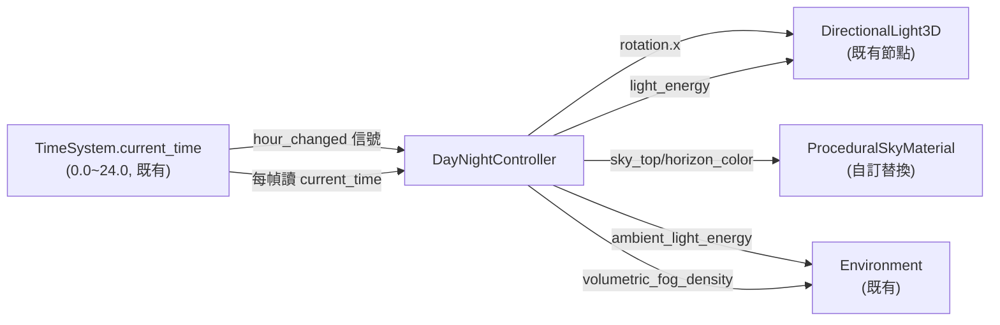
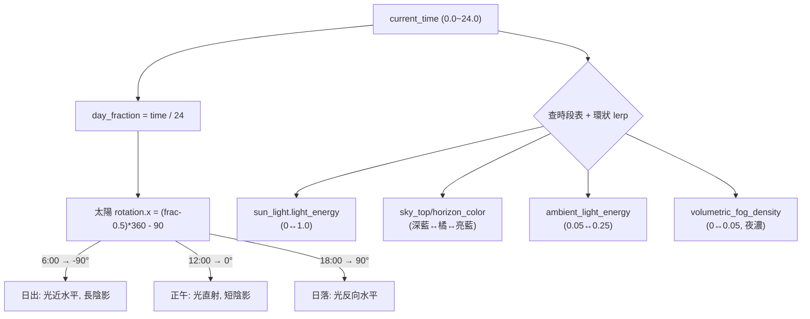

# 教學：日夜循環視覺效果（Day-Night Cycle Visual）

本教學說明如何將 `TimeSystem`（`npc_radiant_ai_schedule.md` 中建立的 Autoload）與場景的視覺元素連接，讓天空、太陽角度、環境色與霧隨遊戲時間動態變化。

> **重要：COGITO 1.1.5 沒有任何內建日夜／時間／天氣系統。** 全文以 grep 確認 `addons/cogito/` 下無 `day_night`、`DayNight`、`weather`、`TimeSystem` 等檔。本教學所有時間驅動邏輯皆為**自訂**，並**復用** `npc_radiant_ai_schedule.md` 已建立的 `TimeSystem` Autoload，不另造一套不相容的 API。下方會逐一標示「既有 vs 自訂」。

## 前置知識
- 已完成 [教學：NPC 輻射 AI 排程](./npc_radiant_ai_schedule.md)（`TimeSystem` Autoload 已存在）。
- 已閱讀 [教學：畫面表現設定](./visual_presentation_and_rendering.md)。

---

## 一、先搞清楚：COGITO 既有的環境與光照設定（真相層）

動手前必須先讀懂 demo 場景**已經是什麼樣子**，才知道哪些是要動的、哪些動了會壞。下表全部以實際 `.tscn` 行號為證。

### 1.1 既有環境資源（Environment）

以 Lobby 為例（Laboratory 結構幾乎相同）：

| 設定 | 值 | 來源 | 意義 |
|---|---|---|---|
| `background_mode` | `2`（=Sky） | `COGITO_3_Lobby.tscn:120` | 背景用天空繪製 |
| `sky` → `sky_material` | `PanoramaSkyMaterial` | `COGITO_3_Lobby.tscn:113,116-117` | **全景貼圖天空，非程序化** |
| `sky_rotation` | `Vector3(0, 1.74533, 0.174533)` | `COGITO_3_Lobby.tscn:122` | 天空貼圖整體旋轉 |
| `ambient_light_sky_contribution` | `0.2` | `COGITO_3_Lobby.tscn:123` | 環境光取自天空的比例 |
| `ambient_light_energy` | `0.2` | `COGITO_3_Lobby.tscn:124` | 環境光強度 |
| `tonemap_mode` | `3`（=ACES） | `COGITO_3_Lobby.tscn:125` | 色調映射，影響色彩觀感 |
| `ssao_enabled` | `true` | `COGITO_3_Lobby.tscn:126` | 螢幕空間環境光遮蔽 |
| `glow_enabled` / `glow_intensity` | `true` / `1.0` | `COGITO_3_Lobby.tscn:127-128` | 泛光 |
| `volumetric_fog_enabled` | `true` | `COGITO_3_Lobby.tscn:132` | **體積霧（非 legacy fog）** |
| `volumetric_fog_density` | `0.0` | `COGITO_3_Lobby.tscn:133` | 預設密度為 0（看不到霧） |

Laboratory 對照：`Environment_bftoa` 於 `COGITO_4_Laboratory.tscn:78-95`，同樣是 `PanoramaSkyMaterial`(`:72-76`)＋ `volumetric_fog`(`:91-95`)。

> **關鍵更正（相對舊版教學）**：demo **沒有用 `ProceduralSkyMaterial`，而是 `PanoramaSkyMaterial`**。`PanoramaSkyMaterial` 只有一個 `panorama` 貼圖屬性，**沒有 `sky_top_color` / `sky_horizon_color` 可動態 lerp**。要做「天空頂色／地平線色隨時間漸變」，必須先把天空材質換成 `ProceduralSkyMaterial`（見第三節）。同理 demo 用的是 **`volumetric_fog_*`**，不是舊版教學寫的 `env.fog_density` / `env.fog_enabled`（那是 legacy distance fog，與這裡的體積霧是兩套）。

### 1.2 既有主光源（DirectionalLight3D）

| 設定 | 值 | 來源 |
|---|---|---|
| 節點 | `DirectionalLight3D`（場景根的直接子節點） | `COGITO_3_Lobby.tscn:3254` |
| `transform` | `Transform3D(0.5, -0.224144, 0.836516, …, 0, 2, 0)` | `COGITO_3_Lobby.tscn:3255` |
| `light_color` | `Color(1, 0.929167, 0.75, 1)`（暖白） | `COGITO_3_Lobby.tscn:3256` |
| `shadow_enabled` | `true` | `COGITO_3_Lobby.tscn:3257` |
| `shadow_opacity` | `0.8` | `COGITO_3_Lobby.tscn:3258` |
| `WorldEnvironment` 節點 | 引用 `Environment_obnk3` | `COGITO_3_Lobby.tscn:3260-3261` |

Laboratory 的 `DirectionalLight3D` 設定**完全相同**（`COGITO_4_Laboratory.tscn:916-920`，連 transform 數值都一樣），`WorldEnvironment` 於 `:922-923`。

> 注意：transform 是固定旋轉，**`light_energy` 沒有在 .tscn 中覆寫**（採 Godot 預設 `1.0`）。我們的控制器要動的就是這個 `rotation` 與 `light_energy`。

### 1.3 既有「局部」霧：FogVolume（容易混淆，先釐清）

Lobby 另外放了一個**局部** `FogVolume` 節點（`COGITO_3_Lobby.tscn:3263-3266`，材質 `FogMaterial_4avjx` 於 `:138-139`，`density = 0.04`）。這是**空間中某一塊區域的霧**（如地窖角落），與「全場景隨時間變化的霧」是不同概念。本教學的日夜霧操作的是 `Environment.volumetric_fog_density`（全域），**不要去動這個局部 FogVolume**。

### 1.4 渲染器與抗鋸齒（專案層）

| 設定 | 值 | 來源 |
|---|---|---|
| 渲染後端 | Forward+（`project.godot` 無 `rendering_method` 鍵 → 取預設 Forward+） | `project.godot`（grep 無此鍵） |
| `anti_aliasing/quality/msaa_3d` | `1`（=2× MSAA） | `project.godot:257` |

體積霧（`volumetric_fog`）、SSAO、SDFGI 等只在 **Forward+** 下有效；這也是 demo 能用體積霧的前提。

---

## 二、日夜循環的核心視覺元素（自訂控制對象）

| 元素 | 既有狀態 | 我們要做的事 | 節點／屬性 |
|---|---|---|---|
| 太陽方向 | 固定 transform | 隨時間旋轉 `rotation` | `DirectionalLight3D.rotation` |
| 太陽強度 | 預設 1.0（未覆寫） | 隨時間調 `light_energy` | `DirectionalLight3D.light_energy` |
| 天空色彩 | 全景貼圖（不可調色） | **換成 `ProceduralSkyMaterial`** 後調頂色／地平線色 | `Environment.sky.sky_material` |
| 環境光 | `ambient_light_energy = 0.2` | 夜晚調暗 | `Environment.ambient_light_energy` |
| 全域霧 | `volumetric_fog_density = 0.0` | 夜晚加重 | `Environment.volumetric_fog_density` |



---

## 三、把天空換成可調色的 ProceduralSkyMaterial（必要前置）

demo 的 `PanoramaSkyMaterial`（`COGITO_3_Lobby.tscn:113`）無法分時段調色。在 Godot 編輯器中：

1. 選取 `WorldEnvironment` 節點（`COGITO_3_Lobby.tscn:3260`）。
2. Inspector → `Environment` → `Sky` → `Sky Material`，將型別由 `PanoramaSkyMaterial` 改為 **`ProceduralSkyMaterial`**（New ProceduralSkyMaterial）。
3. 保留 `background_mode = 2 (Sky)` 不變。

> **副作用提醒**：`ProceduralSkyMaterial` 會影響 `ambient_light_sky_contribution`（`:123` = 0.2）取得的環境色，並改變 SSAO/glow 的觀感。換完先以原本時間（08:00）對照亮度，再微調 `ambient_light_energy`。
>
> **若要保留全景貼圖**：那就**不要動天空材質**，改成只驅動「太陽角度＋太陽強度＋環境光＋霧」即可（控制器中把天空調色那段拿掉）。全景天空的「日夜感」靠太陽旋轉＋體積霧＋環境光營造也很可行，只是天空貼圖本身不會變色。

---

## 四、TimeSystem 的既有 API（復用，務必對齊）

`npc_radiant_ai_schedule.md` 建立的 `TimeSystem`（`res://scripts/time_system.gd`）公開介面如下，本教學**全部沿用，不新增不相容欄位**：

| 成員 | 型別 | 說明 |
|---|---|---|
| `current_time` | `float` `0.0~24.0` | 連續遊戲時間（小數即分鐘） |
| `time_speed` | `float` | 流速；`60.0` = 1 真實秒 = 1 遊戲分鐘 |
| `signal hour_changed(hour: int)` | 信號 | 整點切換時發射 |
| `get_hour() -> int` | 方法 | `floori(current_time)` |

> **與舊版本教學的關鍵差異（已修正）**：舊稿誤用了 `TimeSystem.game_hour` / `game_minute` / `time_scale` 以及一個不存在的 `minute_changed` 信號——這些**在實際 `time_system.gd` 中都不存在**。`TimeSystem` 用的是**單一 `current_time: float`**。本教學的控制器因此改為**每幀讀 `current_time`** 來做平滑視覺過渡，整點切換仍可選用既有 `hour_changed`，**無需修改 `TimeSystem`**。

---

## 五、DayNightController：場景內的視覺控制器（自訂）

建立 `res://scripts/day_night_controller.gd`，掛在 demo 場景根節點下（與 `DirectionalLight3D`、`WorldEnvironment` 同層，方便 `@export` 連線）。它**每幀讀 `TimeSystem.current_time`** 做平滑過渡，不依賴任何不存在的信號。

```gdscript
# res://scripts/day_night_controller.gd
extends Node

## 既有節點：場景根的 DirectionalLight3D（COGITO_3_Lobby.tscn:3254）
@export var sun_light: DirectionalLight3D
## 自訂（選用）：另一盞 DirectionalLight3D 當月光，強度較低
@export var moon_light: DirectionalLight3D
## 既有節點：WorldEnvironment（COGITO_3_Lobby.tscn:3260）
@export var world_environment: WorldEnvironment

## 每幀更新視覺；關掉可改用 hour_changed 整點更新以省效能
@export var smooth_update: bool = true

## 時段 → [天頂色, 地平線色]（需天空已換成 ProceduralSkyMaterial，見第三節）
var sky_colors: Dictionary = {
	0:  [Color(0.02, 0.02, 0.08), Color(0.05, 0.05, 0.15)],  # 深夜
	5:  [Color(0.10, 0.05, 0.15), Color(0.40, 0.20, 0.10)],  # 黎明前
	6:  [Color(0.20, 0.30, 0.60), Color(0.80, 0.50, 0.20)],  # 日出
	8:  [Color(0.15, 0.40, 0.90), Color(0.70, 0.85, 1.00)],  # 早晨
	12: [Color(0.10, 0.30, 0.80), Color(0.60, 0.75, 0.90)],  # 正午
	17: [Color(0.20, 0.25, 0.60), Color(0.90, 0.50, 0.15)],  # 傍晚
	19: [Color(0.08, 0.05, 0.20), Color(0.30, 0.10, 0.05)],  # 日落後
	21: [Color(0.02, 0.02, 0.10), Color(0.05, 0.04, 0.12)],  # 夜晚
}

## 時段 → 太陽 light_energy（demo 未覆寫，預設 1.0）
var sun_energy: Dictionary = {0: 0.0, 5: 0.1, 6: 0.4, 8: 0.8, 12: 1.0, 17: 0.7, 19: 0.2, 21: 0.0}

## 時段 → 月光 light_energy
var moon_energy: Dictionary = {0: 0.15, 5: 0.05, 6: 0.0, 8: 0.0, 12: 0.0, 17: 0.0, 19: 0.05, 21: 0.10}

## 時段 → 環境光強度（既有 ambient_light_energy = 0.2，COGITO_3_Lobby.tscn:124）
var ambient_energy: Dictionary = {0: 0.05, 6: 0.12, 8: 0.20, 12: 0.25, 18: 0.18, 21: 0.07}

## 時段 → 體積霧密度（既有 volumetric_fog_density = 0.0，COGITO_3_Lobby.tscn:133）
var fog_density: Dictionary = {0: 0.03, 2: 0.05, 5: 0.035, 6: 0.01, 12: 0.0, 18: 0.01, 21: 0.02}

var _sky_material: ProceduralSkyMaterial
var _env: Environment


func _ready() -> void:
	if world_environment:
		_env = world_environment.environment
		if _env and _env.sky:
			# 只有換成 ProceduralSkyMaterial 後才抓得到（第三節）
			_sky_material = _env.sky.sky_material as ProceduralSkyMaterial

	# 復用既有 TimeSystem.hour_changed（整點立即校正一次）
	if TimeSystem:
		TimeSystem.hour_changed.connect(_on_hour_changed)
	_update_visuals(TimeSystem.current_time)


func _process(_delta: float) -> void:
	if smooth_update:
		_update_visuals(TimeSystem.current_time)


func _on_hour_changed(_hour: int) -> void:
	_update_visuals(TimeSystem.current_time)


## time 為連續小時數（0.0~24.0），直接取自 TimeSystem.current_time
func _update_visuals(time: float) -> void:
	# --- 太陽旋轉：12:00 → 0°(直射正下方)，6:00 → -90°(東方水平) ---
	var day_fraction := time / 24.0          # 0.0~1.0
	var sun_angle_x := (day_fraction - 0.5) * 360.0 - 90.0
	if sun_light:
		sun_light.rotation_degrees.x = sun_angle_x
		sun_light.light_energy = _lerp_at(sun_energy, time)
	if moon_light:
		moon_light.rotation_degrees.x = sun_angle_x + 180.0
		moon_light.light_energy = _lerp_at(moon_energy, time)

	# --- 天空色彩（需 ProceduralSkyMaterial） ---
	if _sky_material:
		var colors := _lerp_colors_at(sky_colors, time)
		_sky_material.sky_top_color = colors[0]
		_sky_material.sky_horizon_color = colors[1]

	# --- 環境光 + 體積霧（既有 Environment 屬性） ---
	if _env:
		_env.ambient_light_energy = _lerp_at(ambient_energy, time)
		var density := _lerp_at(fog_density, time)
		_env.volumetric_fog_density = density
		# density 為 0 時關閉體積霧計算，省效能
		_env.volumetric_fog_enabled = density > 0.001


## 在時間表（鍵為整點）上對 time(連續小時) 做環狀線性插值
func _lerp_at(table: Dictionary, time: float) -> float:
	var keys: Array = table.keys()
	keys.sort()
	var prev_h: int = keys[-1]
	var next_h: int = keys[0]
	for h in keys:
		if h <= time:
			prev_h = h
	for h in keys:
		if h > time:
			next_h = h
			break
	var t := _ring_t(prev_h, next_h, time)
	return lerp(float(table[prev_h]), float(table[next_h]), t)


func _lerp_colors_at(table: Dictionary, time: float) -> Array:
	var keys: Array = table.keys()
	keys.sort()
	var prev_h: int = keys[-1]
	var next_h: int = keys[0]
	for h in keys:
		if h <= time:
			prev_h = h
	for h in keys:
		if h > time:
			next_h = h
			break
	var t := _ring_t(prev_h, next_h, time)
	var c0: Color = table[prev_h][0].lerp(table[next_h][0], t)
	var c1: Color = table[prev_h][1].lerp(table[next_h][1], t)
	return [c0, c1]


## 計算環狀（跨午夜）插值比例 t
func _ring_t(prev_h: int, next_h: int, time: float) -> float:
	var prev_t := float(prev_h)
	var next_t := float(next_h)
	var cur := time
	if next_t <= prev_t:
		next_t += 24.0
	if cur < prev_t:
		cur += 24.0
	if is_equal_approx(next_t, prev_t):
		return 0.0
	return clampf((cur - prev_t) / (next_t - prev_t), 0.0, 1.0)
```

### 掛載方式

- **COGITO_3_Lobby**（場景根）
  - `DirectionalLight3D` — 既有 (:3254)
  - `WorldEnvironment` — 既有 (:3260)
  - `FogVolume` — 既有局部霧，勿動 (:3263)
  - （選用）`MoonLight`（`DirectionalLight3D`）— 自訂新增
  - `DayNightController`（+ `day_night_controller.gd`）— 自訂
    - Inspector：
      - `sun_light` = `../DirectionalLight3D`
      - `moon_light` = `../MoonLight`（選用）
      - `world_environment` = `../WorldEnvironment`

---

## 六、時鐘 HUD 顯示（自訂，對齊既有 API）

```gdscript
# res://scripts/clock_hud.gd — 掛在 HUD 的 Label 節點
extends Label

func _ready() -> void:
	TimeSystem.hour_changed.connect(func(_h): _refresh())
	_refresh()

func _process(_delta: float) -> void:
	_refresh()   # 每幀刷新分鐘；嫌頻繁可改成只在 hour_changed 刷新

func _refresh() -> void:
	var t: float = TimeSystem.current_time     # 0.0~24.0（既有欄位）
	var h: int = int(t)
	var m: int = int((t - h) * 60.0)
	text = "%02d:%02d" % [h, m]
```

---

## 七、光照與陰影效能建議

日夜循環最大的效能風險是**每幀變動方向光導致陰影貼圖每幀重算**，以及體積霧成本。建議：

- **方向光陰影更新**：`DirectionalLight3D` 在 Forward+ 下用 PSSM。太陽每幀微旋轉會讓陰影持續抖動與重算。若場景偏靜態，可考慮 `smooth_update = false`（只在 `hour_changed` 整點更新），用「整點跳變」換取大幅省算。需要平滑時再開每幀。
- **`directional_shadow_max_distance`**：demo 未覆寫（取預設）。室內為主的 Lobby/Laboratory 可調小最大陰影距離以提升陰影解析度與效能（Inspector → DirectionalLight3D → Shadow → Max Distance）。
- **`shadow_opacity = 0.8`**（`COGITO_3_Lobby.tscn:3258`）：既有設定，夜晚太陽 `light_energy` 趨近 0 時陰影自然變淡，無需另外動它。
- **體積霧**：`volumetric_fog` 是逐幀體積運算，成本不低。控制器已在 `density <= 0.001` 時把 `volumetric_fog_enabled` 關掉（白天無霧時段直接省去整個體積霧 pass）。
- **太陽落到地平線下時**：`sun_energy` 表在 21:00~05:00 給 0，`light_energy = 0` 的方向光仍會參與計算。若要極致省算，可在 `light_energy` 為 0 時 `sun_light.visible = false`（停用該光源與其陰影）。
- **MSAA**：專案為 `msaa_3d = 1`（2×，`project.godot:257`）。日夜循環不影響 AA 成本，維持即可；低階機可在低畫質檔降為 0。

---

## 八、時間 → 視覺參數映射（Mermaid）



對照（控制器內表格值）：

| 遊戲時間 | 太陽角 rotation.x | 太陽 energy | 天空 | 環境光 | 體積霧 |
|---|---|---|---|---|---|
| 00:00 | -270°/(=90°反向)地平線下 | 0.0 | 深夜暗藍 | 0.05 | 0.03 |
| 06:00 | -90°（東方水平） | 0.4 | 日出橘紅 | 0.12 | 0.01 |
| 12:00 | 0°（直射下方） | 1.0 | 正午亮藍 | 0.25 | 0.0（霧關閉） |
| 18:00 | 90°（西方水平） | ~0.2 | 傍晚橘→暗 | 0.18 | 0.01 |
| 21:00 | 地平線下 | 0.0 | 夜深藍 | 0.07 | 0.02 |

---

## 九、常見陷阱表

| 陷阱 | 症狀 | 對策 |
|---|---|---|
| 沿用舊版 `TimeSystem.game_hour` / `game_minute` / `time_scale` / `minute_changed` | 執行期報「Invalid get index」或信號不存在 | `TimeSystem` 實際只有 `current_time:float`、`time_speed`、`hour_changed`、`get_hour()`（見第四節）；本控制器直接讀 `current_time` |
| demo 天空是 `PanoramaSkyMaterial`（`COGITO_3_Lobby.tscn:113`） | `_sky_material as ProceduralSkyMaterial` 取到 `null`，天空不變色 | 先依第三節把天空材質換成 `ProceduralSkyMaterial`；或不做天空調色 |
| 用了 `env.fog_density` / `env.fog_enabled`（legacy fog） | 看不到霧變化 | demo 用的是 `volumetric_fog_density` / `volumetric_fog_enabled`（`:132-133`）；體積霧才是 demo 啟用的那套 |
| 去調了局部 `FogVolume`（`:3263`） | 只有某一塊區域霧變、全場景沒反應 | 全域日夜霧要動 `Environment.volumetric_fog_density`，別動局部 FogVolume |
| 非 Forward+ 渲染器 | 體積霧 / SSAO 完全無效 | demo 預設 Forward+（`project.godot` 無 `rendering_method` 鍵）；勿改成 Mobile/Compatibility |
| `smooth_update=true` 但場景大 | 陰影每幀抖動、掉幀 | 改 `smooth_update=false` 走整點更新，或調小 `directional_shadow_max_distance` |
| 太陽 `light_energy=0` 仍計算陰影 | 夜晚仍有方向光開銷 | `light_energy==0` 時 `sun_light.visible=false` |
| 換成 ProceduralSkyMaterial 後室內過亮/過暗 | 整體曝光跑掉 | `ambient_light_sky_contribution`(`:123`=0.2) 取自天空色會變，重新校 `ambient_light_energy` |
| 時段表鍵不是整點或無序 | 插值錯亂、午夜跳變 | 鍵用整點 int，控制器內部 `keys.sort()` 並做環狀 `_ring_t` 處理跨午夜 |

---

## 十、驗證清單

| 測試步驟 | 預期結果 |
|---|---|
| 把 `TimeSystem.time_speed` 設大（如 600） | 天空／光照快速過渡，可目視整個日夜循環 |
| 06:00 時刻 | 天空轉橘紅（若已換 ProceduralSky），`DirectionalLight3D` 近水平、陰影最長 |
| 12:00 時刻 | 天空最亮，太陽直射、陰影最短，`volumetric_fog_density` 降到 0（霧關閉） |
| 21:00 時刻 | 天空深藍近黑，太陽 energy=0，霧加重，月光（若有）微亮 |
| 與 NPC 排程同步 | `npc_radiant_ai_schedule.md` 的作息切換時間與這裡的夜晚一致（共用同一 `TimeSystem`） |
| HUD 時鐘 | 顯示與 `current_time` 一致的時分 |
| `smooth_update=false` | 視覺改為整點跳變，幀數明顯回升（驗證效能建議） |
