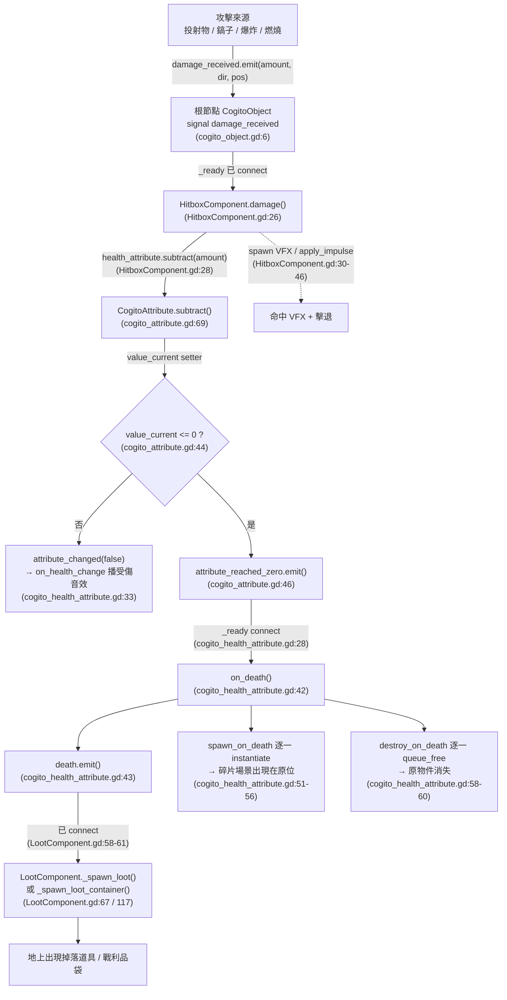
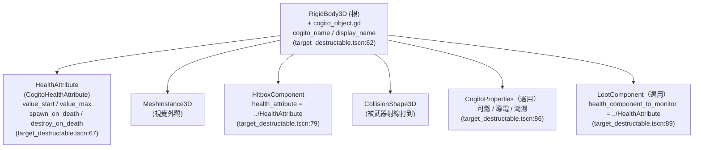
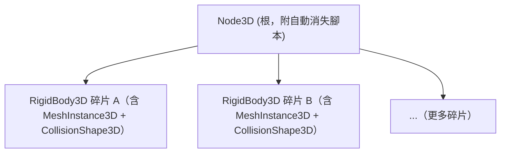

# 教學：如何實作可破壞場景與物件

本教學深度說明如何結合 COGITO 的血量系統（`CogitoHealthAttribute`）、命中箱（`HitboxComponent`）與戰利品系統（`LootComponent`），製作「被攻擊 → 血量歸零 → 死亡 → 生成碎片 / 掉落物品」的可破壞物件。

> 所有引用以 `/home/lorkhan/code/Cogito-1.1.5` 為基準，路徑省略 `res://`。行號已用實際原始碼核對（Cogito 1.1.5）。

## 前置知識
- 已閱讀 [Level 5B: Attribute 屬性系統](../architecture/level5b_attributes.md)。
- 已閱讀 [Level 5C: Loot 系統](../architecture/level5c_loot_system.md)。

## Cogito 既有 vs 需要你自訂

| 元件 | 來源 | 說明 |
|---|---|---|
| `CogitoObject`（`damage_received` 信號） | **Cogito 既有** | `addons/cogito/CogitoObjects/cogito_object.gd:6` |
| `HitboxComponent` | **Cogito 既有** | `addons/cogito/Components/HitboxComponent.gd`，附帶 `HitboxComponent.tscn` |
| `CogitoHealthAttribute` | **Cogito 既有** | `addons/cogito/Components/Attributes/cogito_health_attribute.gd`，附帶 `HealthAttribute.tscn` |
| `LootComponent` | **Cogito 既有** | `addons/cogito/Components/LootComponent.gd` |
| `target_destructable.tscn`（完整可破壞範例） | **Cogito 既有** | `addons/cogito/PackedScenes/target_destructable.tscn` |
| `barrel.tscn`（可破壞木桶範例） | **Cogito 既有** | `addons/cogito/DemoScenes/DemoPrefabs/barrel.tscn` |
| 碎片場景（`FragmentedCrate.tscn` 等） | **你自訂** | Cogito 不提供現成碎片，需自備模型與場景 |
| 你的木箱 / 陶罐 `.tscn` | **你自訂** | 可直接複製 `target_destructable.tscn` 改造 |

> **最快上手法**：直接複製 `addons/cogito/PackedScenes/target_destructable.tscn`，替換 MeshInstance3D 與 CollisionShape3D，再調整數值即可。本教學第三節即以它為藍本。

---

## 一、系統傷害流程（完整路徑，附真實行號）

理解這條鏈路是建立可破壞物件的關鍵。Cogito 的傷害「不是函式直接呼叫」，而是**以根節點的 `damage_received` 信號為總線**，各方都往這個信號 emit，由 `HitboxComponent` 接收。

### 1.1 傷害來源（誰 emit `damage_received`）

| 來源 | emit 位置 | 觸發條件 |
|---|---|---|
| 投射物 / 槍 | `cogito_projectile.gd:112`：`collider.damage_received.emit(damage_amount, bullet_direction, bullet_position)` | `_on_body_entered()` 先檢查 `collider.has_signal("damage_received")`（`cogito_projectile.gd:60`） |
| 近戰（鎬子） | `wieldable_pickaxe.gd:80`：`collider.damage_received.emit(item_reference.wieldable_damage, bullet_direction, hit_position)` | 同樣先檢查 `has_signal("damage_received")`（`wieldable_pickaxe.gd:59`） |
| 爆炸 | `explosion.gd:89`：`collider.damage_received.emit(damage_amount, damage_dir, Vector3.ZERO)`（`deal_damage()`） | `_on_body_entered()` 檢查 `has_signal("damage_received")`（`explosion.gd:77`） |
| 燃燒（持續傷害） | `cogito_properties.gd:230`：`get_parent().damage_received.emit(burn_damage_amount)` | `apply_burn_damage()` 由 `DamageTimer` 定時呼叫 |
| 物理撞擊 | `ImpactAttributeDamage.gd:29`：`attribute.subtract(damage)` | **特例**：此元件**直接呼叫 `subtract()`**，不經過 `damage_received` 信號（見 §6） |

> 注意傷害信號的完整簽章帶三個參數：`damage_received(damage_value, hit_direction, hit_position)`。但 `cogito_object.gd:6` 只宣告了 `signal damage_received(damage_value:float)`——GDScript 允許 emit 時帶比宣告更多的參數（連接的回呼會收到全部），`HitboxComponent.damage()` 正是用三參數的版本接收（`HitboxComponent.gd:26`）。

### 1.2 信號被接收（`HitboxComponent`）

`HitboxComponent._ready()`（`HitboxComponent.gd:18-23`）把自己的 `damage()` 連到**父節點**的 `damage_received`：

```gdscript
# HitboxComponent.gd:18-23
func _ready() -> void:
    if get_parent().has_signal("damage_received"):
        if !get_parent().damage_received.is_connected(damage):
            get_parent().damage_received.connect(damage)
    else:
        CogitoGlobals.debug_log(true, "HitboxComponent", "Parent " + get_parent().name + " is missing a damage_received() signal.")
```

`HitboxComponent.damage()`（`HitboxComponent.gd:26-48`）做四件事，**不只是扣血**：

```gdscript
# HitboxComponent.gd:26-48 節錄
func damage(damage_amount: float, _hit_direction:= Vector3.ZERO, _hit_position:= Vector3.ZERO):
    if health_attribute:                          # ← 透過 @export 指定的引用，非自動尋找
        health_attribute.subtract(damage_amount)
    if spawn_at_global_collision != null:         # 在命中點生成 VFX（世界座標）
        ...
    if spawn_at_local_collision != null:          # 在命中點生成 VFX（父節點本地座標）
        ...
    if apply_force_on_hit:                         # 對 RigidBody3D / CharacterBody3D 施加擊退
        if parent is RigidBody3D:
            parent.apply_impulse(_hit_direction * damage_amount * applied_force_multipler, _hit_position)
        ...
    got_hit.emit()                                 # HitboxComponent 唯一自有信號
```

> **重要修正**：`HitboxComponent` **不會自動尋找**父節點底下的 `CogitoHealthAttribute`。它扣血的對象是 `@export var health_attribute : CogitoHealthAttribute`（`HitboxComponent.gd:6`），**必須在場景裡手動指定 NodePath**（範例見 `target_destructable.tscn:80`：`health_attribute = NodePath("../HealthAttribute")`）。若忘記指定，被打時 `if health_attribute:` 為假，物件不會掉血但也不報錯。

### 1.3 扣血與歸零（`CogitoAttribute` / `CogitoHealthAttribute`）

`subtract()` 定義在父類 `CogitoAttribute`（`cogito_attribute.gd:69-75`），最終改動 `value_current` 的 setter：

```gdscript
# cogito_attribute.gd:33-46 節錄（value_current 的 setter）
var value_current : float:
    set(value):
        var prev_value = value_current
        value_current = value
        ...
        elif prev_value > value_current:          # 數值下降
            value_current = clamp(value_current, 0, value_max)
            attribute_changed.emit(attribute_name, value_current, value_max, false)  # has_increased = false
        if value_current <= 0:
            value_current = 0
            attribute_reached_zero.emit(attribute_name, value_current, value_max)    # 歸零！
```

`CogitoHealthAttribute._ready()` 把兩個信號接到自己的處理函式（`cogito_health_attribute.gd:26-30`）：

```gdscript
# cogito_health_attribute.gd:26-30
func _ready() -> void:
    value_current = value_start
    attribute_reached_zero.connect(on_death)       # ← 歸零 → on_death
    attribute_changed.connect(on_health_change)    # ← 任何變化 → on_health_change（音效）
    attribute_changed.emit(attribute_name, value_current, value_max, true)
```

- `on_health_change()`（`cogito_health_attribute.gd:33-39`）：未歸零時播放受擊／受傷音效，並 emit `damage_taken`。
- `on_death()`（`cogito_health_attribute.gd:42-60`）：死亡核心邏輯（見 §1.4）。

### 1.4 死亡處理（生成碎片 + 摧毀自己）

```gdscript
# cogito_health_attribute.gd:42-60（完整）
func on_death(_attribute_name:String, _value_current:float, _value_max:float):
    death.emit()                                   # ← LootComponent 監聽的就是這個信號
    parent_position = get_parent().global_position # 先記住位置（之後自己會被 queue_free）
    parent_rotation = get_parent().global_rotation

    if sound_on_death:
        Audio.play_sound_3d(sound_on_death).position = parent_position

    for scene in spawn_on_death:                    # spawn_on_death : Array[PackedScene]
        if scene:
            var spawned_object = scene.instantiate()
            spawned_object.position = parent_position
            spawned_object.rotation = parent_rotation   # 連旋轉一起套用
            get_tree().current_scene.add_child(spawned_object)

    for nodepath in destroy_on_death:               # destroy_on_death : Array[NodePath]
        if get_node(nodepath):
            get_node(nodepath).queue_free()
```

### 1.5 戰利品掉落（`LootComponent`，與碎片並行）

`LootComponent._ready()` 用 `call_deferred` 延後設定引用（`LootComponent.gd:48-49`），避免在樹建構期間取到 null。`_set_up_references()`（`LootComponent.gd:53-63`）依 `spawning_logic` 把對應函式接到 **HealthAttribute 的 `death` 信號**：

```gdscript
# LootComponent.gd:58-63
if spawning_logic == SpawningLogic.SPAWN_ITEM:
    health_component_to_monitor.death.connect(_spawn_loot)
elif spawning_logic == SpawningLogic.SPAWN_CONTAINER:
    health_component_to_monitor.death.connect(_spawn_loot_container)
else:
    CogitoGlobals.debug_log(..., "Spawning Logic ... set to None. Component will not function. ...")
```

> **重要修正（保留先前更正）**：`LootComponent` **沒有** `drop_loot()` 之類的對外方法，也**不會自動找**血量元件。它的觸發來源是 `@export var health_component_to_monitor : CogitoHealthAttribute`（`LootComponent.gd:30`）必須在場景裡指定（範例：`target_destructable.tscn:95`：`health_component_to_monitor = NodePath("../HealthAttribute")`）。實際生成函式是 `_spawn_loot()`（`LootComponent.gd:67`，散射道具）與 `_spawn_loot_container()`（`LootComponent.gd:117`，生成戰利品袋）。

### 1.6 Mermaid：破壞資料流



**三條重點結論**：
1. 根節點**必須有 `signal damage_received`**——`CogitoObject` 已內建（`cogito_object.gd:6`），自訂根節點則需自行宣告。
2. `HitboxComponent` 本身沒有 `damage_received` 信號，它監聽**父節點**的信號（`HitboxComponent.gd:19-21`），且扣血對象需手動指定 `health_attribute`（`HitboxComponent.gd:6`）。
3. 碎片（`spawn_on_death`）與掉落物（`LootComponent`）走**兩條獨立路徑**：碎片由 `on_death()` 直接生成，掉落物由 `death` 信號觸發 `LootComponent`。兩者互不依賴。

---

## 二、可破壞物件節點結構（以真實範例為準）

Cogito 範例 `target_destructable.tscn` 採用**單一 RigidBody3D 當根節點並直接掛 `cogito_object.gd`**，其餘元件全是它的直接子節點（`target_destructable.tscn:62-99`）。這與「外面包一層 Node3D、裡面再放 StaticBody3D」不同——前者更簡潔、且能直接被打飛。



> 若不需要物理被推動，可把根節點換成 `StaticBody3D` 並一樣掛 `cogito_object.gd`；但 `HitboxComponent.apply_force_on_hit` 的擊退只對 `RigidBody3D` / `CharacterBody3D` 生效（`HitboxComponent.gd:43-46`）。

---

## 三、從零建立可破壞物件（端到端步驟）

以「可破壞木箱」為例。**最穩做法是複製 `target_destructable.tscn` 改造**，以下列出每一步與要設定的欄位。

### 3.1 建立根節點

1. 新建場景，根節點選 `RigidBody3D`（要可被打飛）或 `StaticBody3D`（固定不動）。
2. 對根節點附加腳本 `addons/cogito/CogitoObjects/cogito_object.gd`。
3. Inspector 設定（`cogito_object.gd:9-11`）：
   - `cogito_name`：存檔識別字串（範例裡甚至可留空 `""`，見 `target_destructable.tscn:65`）。
   - `display_name`：互動時顯示的名稱，留白則不顯示。
4. `_ready()` 會自動把物件加入 `interactable` 與 `Persist` 群組（`cogito_object.gd:49-53`）——`Persist` 是存檔系統能記住「這個箱子已被破壞」的關鍵，不需手動加。

> 若你堅持不用 `CogitoObject`（例如已有自訂腳本），就必須自行宣告信號讓 `HitboxComponent` 能連接：
> ```gdscript
> extends RigidBody3D
> signal damage_received(damage_value: float)
> ```
> 但這樣會失去 `Persist` 群組與 AABB 等 CogitoObject 功能，不建議。

### 3.2 加入外觀與碰撞

1. 子節點加 `MeshInstance3D`，指定木箱模型 / Mesh。
2. 子節點加 `CollisionShape3D`，給一個 BoxShape3D。
3. **物理層提醒**：把根節點的 `collision_layer` 設在武器能掃描到的層（Cogito 預設可互動物件常用 Layer 2 "Interactables"）。武器只用 `has_signal("damage_received")` 判斷是否造成傷害，但前提是 `body_entered` 先偵測到——這由物理 Layer / Mask 決定（見 §4）。

### 3.3 加入 HealthAttribute（血量）

1. 用實例化方式加入 `addons/cogito/Components/Attributes/HealthAttribute.tscn`（它已預設 `attribute_name = "health"`、圖示、顏色等，見 `HealthAttribute.tscn`）。
2. Inspector 調整（欄位定義在 `cogito_attribute.gd` 與 `cogito_health_attribute.gd`）：

| 欄位 | 定義位置 | 說明 | 木箱建議值 |
|---|---|---|---|
| `attribute_name` | `cogito_attribute.gd:11` | 屬性識別名（全小寫無空格） | `"health"` |
| `value_start` | `cogito_attribute.gd:21` | 初始血量 | `50.0` |
| `value_max` | `cogito_attribute.gd:19` | 最大血量 | `50.0` |
| `sound_on_hit` | `cogito_health_attribute.gd:12` | 每次被打都響（含死亡） | 撞擊聲 |
| `sound_on_damage_taken` | `cogito_health_attribute.gd:14` | 受傷但**未死**才響 | 木材破裂聲 |
| `sound_on_death` | `cogito_health_attribute.gd:16` | 死亡時響 | 重擊聲 |
| `spawn_on_death` | `cogito_health_attribute.gd:20` | `Array[PackedScene]`，死亡時在原位生成 | `[FragmentedCrate.tscn]` |
| `destroy_on_death` | `cogito_health_attribute.gd:18` | `Array[NodePath]`，死亡時 `queue_free` | `[NodePath("..")]`（指向根節點） |

> **`destroy_on_death` 路徑陷阱**：`get_node(nodepath)`（`cogito_health_attribute.gd:58-60`）的路徑是**相對於 HealthAttribute 節點本身**。HealthAttribute 是根節點的子節點，因此要摧毀整個物件應填 `".."`（上一層 = 根節點），不是 `"."`（會只刪掉 HealthAttribute 自己）。範例 `target_destructable.tscn:69` 正是 `NodePath("..")`。

### 3.4 加入 HitboxComponent（橋接傷害）

1. 用實例化方式加入 `addons/cogito/Components/HitboxComponent.tscn`。
2. **務必**在 Inspector 把 `Health Attribute` 欄位指到 §3.3 的 HealthAttribute 節點（`target_destructable.tscn:80` 即 `health_attribute = NodePath("../HealthAttribute")`）。漏設則永遠不掉血。
3. 其餘 `@export` 為選用（`HitboxComponent.gd:7-14`）：
   - `spawn_at_global_collision` / `spawn_at_local_collision`：命中時生成的 VFX（如火花、灰塵）。
   - `apply_force_on_hit` + `applied_force_multipler`：被打時的物理擊退（`HitboxComponent.tscn` 預設 `apply_force_on_hit = true`、`applied_force_multipler = 2`）。

### 3.5 建立碎片場景（你自訂）

`spawn_on_death` 需要你自備碎片場景。Cogito 範例只生成 `simple_particle_puff.tscn`（一團粒子煙霧，`target_destructable.tscn:70`）；要做「碎成多塊」需自製：

1. 在 Blender 用 Cell Fracture 或手動切割模型成 5–10 個碎片。
2. 匯入 Godot 後建立 `FragmentedCrate.tscn`：



3. 根節點掛自動消失腳本（這是你寫的，非 Cogito 既有）：

```gdscript
# fragment_auto_despawn.gd（自訂）
extends Node3D
@export var lifetime : float = 5.0

func _ready():
    # 給每塊碎片一個隨機爆炸衝量
    for child in get_children():
        if child is RigidBody3D:
            var impulse = Vector3(randf_range(-3,3), randf_range(2,6), randf_range(-3,3))
            child.apply_central_impulse(impulse)
    await get_tree().create_timer(lifetime).timeout
    queue_free()
```

> 注意 `on_death()` 生成碎片時會套用 `parent_position` 與 `parent_rotation`（`cogito_health_attribute.gd:54-55`），所以碎片會出現在原箱子的位置與朝向。

### 3.6 加入 LootComponent（選用，掉落物品）

1. 子節點加 `Node3D`，附加 `addons/cogito/Components/LootComponent.gd`（範例是用純腳本節點，非 .tscn 實例，見 `target_destructable.tscn:89-90`）。
2. Inspector 設定：

| 欄位 | 定義位置 | 範例值（`target_destructable.tscn`） |
|---|---|---|
| `spawning_logic` | `LootComponent.gd:12` | `SPAWN_ITEM`（散射道具，列舉值 1，見 `:91`） |
| `loot_table` | `LootComponent.gd:20` | `LootTableGeneric.tres`（`:92`） |
| `amount_of_items_to_drop` | `LootComponent.gd:22` | `5`（`:93`） |
| `health_component_to_monitor` | `LootComponent.gd:30` | `NodePath("../HealthAttribute")`（`:95`） |
| `loot_bag_scene` | `LootComponent.gd:26` | 僅 `SPAWN_CONTAINER` 模式需要（如 `loot_chest.tscn`） |

3. 連接是自動的：`_ready()` → `call_deferred("_set_up_references")` → 依 `spawning_logic` connect `death`（`LootComponent.gd:48-61`）。**不要**手動連接，會重複觸發。

---

## 四、武器設定（確保打得到物件）

### 投射物 / 槍
`CogitoProjectile._on_body_entered()` 先檢查 `collider.has_signal("damage_received")`（`cogito_projectile.gd:60`），通過才在 `deal_damage()` 裡 emit（`cogito_projectile.gd:112`）。→ 確認物件根節點有 `damage_received` 信號即可。

### 近戰（鎬子）
`wieldable_pickaxe.gd` 在 `_ready()` 把 `damage_area.body_entered` 接到 `_on_body_entered`（`wieldable_pickaxe.gd:21`）；`_on_body_entered()` 同樣檢查 `has_signal("damage_received")`（`wieldable_pickaxe.gd:59`），再以 `item_reference.wieldable_damage` emit（`wieldable_pickaxe.gd:80`）。

### 爆炸
`explosion.gd`（掛在 `Area3D` 上，`explosion.gd:1`）在 `_on_body_entered()` 檢查信號（`explosion.gd:77`）後以 `damage_amount` emit（`explosion.gd:89`）。預設 `damage_amount = 6.0`、`damage_force = 10.0`（`explosion.gd:5-6`）。

**物理層提醒**：以上來源都靠 `body_entered`（Area3D / RigidBody3D 監測）先偵測到碰撞，才會檢查信號。請確認物件 `CollisionShape3D` 所在的 `collision_layer` 落在武器 `damage_area` 的 `collision_mask` 內，否則信號永遠不會被觸發。

---

## 五、CogitoProperties：可燃 / 導電 / 潮濕（進階，選用）

`target_destructable.tscn:86` 還掛了 `CogitoProperties`。它讓物件能對「火、電、水」做系統性反應（`cogito_properties.gd`）：

- 位元旗標 `elemental_properties`（`cogito_properties.gd:29`）：`CONDUCTIVE` / `FLAMMABLE` / `WET`。
- 著火後由 `DamageTimer` 定時 `apply_burn_damage()`（`cogito_properties.gd:227-233`），其中 `get_parent().damage_received.emit(burn_damage_amount)` 把燒傷接回同一條 `damage_received` 總線——**所以燃燒也會經 HitboxComponent 扣血、走 §1 的死亡流程**。
- 反應由碰撞觸發：`CogitoObject._on_body_entered/_on_body_exited`（`cogito_object.gd:131-140`）呼叫 `cogito_properties.start_reaction_threshold_timer()` / `check_for_reaction_timer_interrupt()`。

> 若只是要做「打碎的木箱」，可不掛 CogitoProperties；要做「燒得起來的木桶」才需要，並把 `material_properties` / `elemental_properties` 設成 `FLAMMABLE`。

---

## 六、特例：ImpactAttributeDamage（撞擊自傷，不走信號）

`ImpactAttributeDamage`（`ImpactAttributeDamage.gd`）是另一種致傷途徑，與上述信號流**不同**：它掛在 RigidBody3D 上，當該 body 高速撞到東西時**直接** `attribute.subtract(damage)`（`ImpactAttributeDamage.gd:29`），不經 `damage_received`。

- `_ready()` 要求父節點是 RigidBody3D，否則只印錯誤（`ImpactAttributeDamage.gd:20-24`）。
- 連接 `parent_node.body_entered`（`ImpactAttributeDamage.gd:24`），並用 `linear_velocity.length_squared() >= minimum_velocity_squared` 過濾輕碰（`ImpactAttributeDamage.gd:28`）。
- `next_impact_time` 提供冷卻（`ImpactAttributeDamage.gd:13, 32-35`）。

用途：做「摔落會碎的陶罐」——把陶罐做成 RigidBody3D + CogitoObject，掛 HealthAttribute 與 ImpactAttributeDamage（`attribute` 指向 HealthAttribute），玩家撿起後摔到地上即觸發。注意它直接打 `subtract()`，所以**不會經過 HitboxComponent 的 VFX / 擊退**，但**仍會經 `value_current` setter → `attribute_reached_zero` → `on_death`**，因此碎片與掉落照常運作。

---

## 七、完整驗證清單

| 測試步驟 | 預期結果 | 若失敗 → 檢查 |
|---|---|---|
| 用武器打擊物件 | 血量減少、播 `sound_on_hit` | 根節點有 `damage_received` 信號（`cogito_object.gd:6`）；物理 Layer/Mask 對得上 |
| 打擊後不掉血但無報錯 | — | `HitboxComponent.health_attribute` 漏指定（`HitboxComponent.gd:6`，範例 `target_destructable.tscn:80`） |
| 受傷未死 | 播 `sound_on_damage_taken` | `on_health_change` 條件 `not _health_current <= 0`（`cogito_health_attribute.gd:38`） |
| 血量歸零 | `death` 信號觸發、播 `sound_on_death` | `attribute_reached_zero` → `on_death` 已連（`cogito_health_attribute.gd:28`，自動） |
| 歸零後 | 碎片 / 粒子出現在原位與原朝向 | `spawn_on_death` 陣列有設定（`cogito_health_attribute.gd:20, 51-56`） |
| 歸零後 | 原物件消失 | `destroy_on_death` 填 `NodePath("..")` 指向根節點，**非** `"."`（`cogito_health_attribute.gd:18, 58-60`） |
| 歸零後 | 地上出現掉落物 | `LootComponent.health_component_to_monitor` 已指定（`LootComponent.gd:30`）；`spawning_logic != NONE`（`LootComponent.gd:12`） |
| 掉落數量總是 0 | — | `amount_of_items_to_drop > 0`（`LootComponent.gd:75` / `129` 才會執行）；`loot_table` 已指定 |
| 存檔讀檔後 | 已破壞物件不再出現 | 物件由 `.tscn` 實例化並在 `Persist` 群組（`CogitoObject._ready()` 自動加，`cogito_object.gd:51`） |
| 摔落不碎（陶罐） | — | `ImpactAttributeDamage.minimum_velocity` 太高（`ImpactAttributeDamage.gd:9`）；父節點非 RigidBody3D（`:20-24`） |

---

## 八、常見陷阱速查

| 陷阱 | 原因 | 解法 |
|---|---|---|
| 打了不掉血 | `HitboxComponent.health_attribute` 未指定 | 在 Inspector 指到 HealthAttribute（`HitboxComponent.gd:6`） |
| 整個物件沒消失，只少一個節點 | `destroy_on_death` 填了 `"."`（HealthAttribute 自己） | 改填 `NodePath("..")`（`cogito_health_attribute.gd:58`） |
| 碎片出現在世界原點 (0,0,0) | 自寫流程沒套 `parent_position` | Cogito 內建已處理（`cogito_health_attribute.gd:54`）；自訂時務必先記位置再 queue_free |
| 掉落物不出現 | `spawning_logic = NONE`（預設）或 `health_component_to_monitor` 未指定 | 設為 `SPAWN_ITEM` / `SPAWN_CONTAINER`（`LootComponent.gd:12, 30`） |
| 嘗試呼叫 `LootComponent.drop_loot()` 報錯 | 此方法不存在 | 用信號驅動，連接由 `_set_up_references()` 自動完成（`LootComponent.gd:53-61`） |
| `damage_received` emit 時報參數不符 | 自訂根節點只宣告 0 參數 | 宣告 `signal damage_received(damage_value: float)`，emit 多帶的參數 GDScript 會傳給回呼 |
| 燃燒不扣血 | 物件無 `FLAMMABLE` 或無 HitboxComponent | `elemental_properties` 設 FLAMMABLE（`cogito_properties.gd:29`）且須有 HitboxComponent 接 `damage_received` |
| 武器打不到 | 物理 Layer/Mask 不匹配 | 對齊物件 `collision_layer` 與武器 `damage_area.collision_mask`（§4） |
| RigidBody 不被打飛 | `apply_force_on_hit` 關閉或根節點非 RigidBody3D | 開啟並用 RigidBody3D 根節點（`HitboxComponent.gd:41-46`） |
