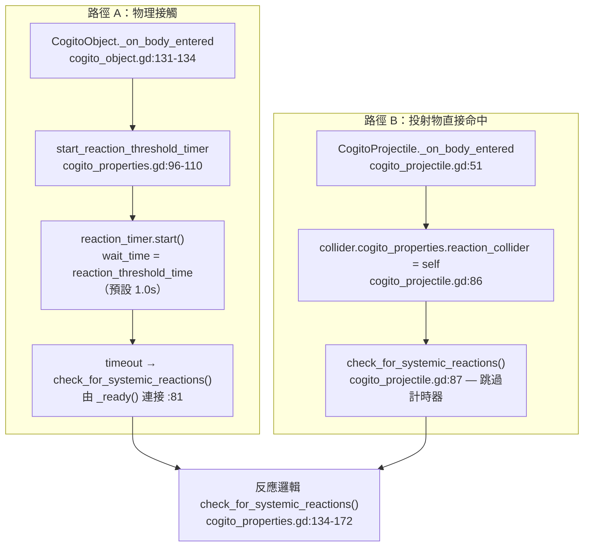
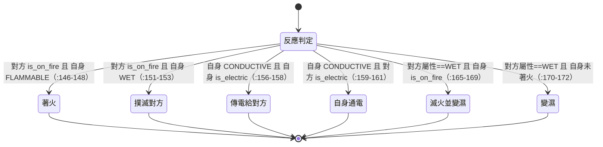

# 教學：如何擴充元素機制與物質反應系統

COGITO 的 `CogitoProperties` 組件內建火 (Flammable)、水 (Wet)、電 (Conductive) 三種基礎元素，並透過「反應邏輯」處理元素交互。本教學逐行解析系統的實際運作路徑，釐清**既有機制 vs 自訂擴充**，並以「冰凍 (Frozen)」為完整端到端範例，最後整理常見陷阱（含一個確認過的 VFX Bug）。

> 真相層：所有行號以 `/home/lorkhan/code/Cogito-1.1.5` 為準，引用格式 `path/file.gd:line`。

## 前置知識
- 已閱讀 [Level 4A: CogitoProperties 物質反應系統](../architecture/level4_properties_system.md)。
- 核心檔案：
  - `addons/cogito/Components/Properties/cogito_properties.gd`（屬性／反應主體）
  - `addons/cogito/CogitoObjects/cogito_object.gd`（接觸觸發路徑）
  - `addons/cogito/CogitoObjects/cogito_projectile.gd`（投射物直接觸發路徑）
  - `addons/cogito/Components/HitboxComponent.gd`（傷害與命中 VFX）

---

## 一、雙層位元旗標（既有機制）

`CogitoProperties` 用兩個獨立的位元旗標欄位描述一個物件，兩層用途不同、處理路徑不同：

| 層 | 欄位 | 宣告 | 用途 | 由誰消費 |
|---|---|---|---|---|
| 元素層 | `elemental_properties` | `cogito_properties.gd:29` | 火／水／電的系統反應 | `check_for_systemic_reactions()` |
| 材質層 | `material_properties` | `cogito_properties.gd:31` | 投射物穿透／傷害判定 | `CogitoProjectile._on_body_entered()` |

### 1.1 元素枚舉（`cogito_properties.gd:14-18`）

```gdscript
enum ElementalProperties{
	CONDUCTIVE = 1,
	FLAMMABLE = 2,
	WET = 4,
}
```

值必須是 **2 的冪次**，才能用位元 OR 組合、位元 AND 測試。Inspector 暴露於 `cogito_properties.gd:29`（注意原始碼字串拼字為 `FLAMABLE`，少一個 M，但不影響功能，僅是 Inspector 顯示文字）：

```gdscript
@export_flags("CONDUCTIVE", "FLAMABLE", "WET") var elemental_properties: int = 0
```

### 1.2 材質枚舉（`cogito_properties.gd:20-22`、宣告於 `:31`）

```gdscript
enum MaterialProperties{
	SOFT = 1,
}
```

材質層**不參與元素反應**，而是在投射物命中時決定「軟投射物打軟物件才造成傷害」（見第四節）。既有教學常忽略這一層；要做「布偶／橡膠彈」這類機制就靠它。

### 1.3 位元運算慣例（出現在原始碼各處）

| 操作 | 寫法 | 出處 |
|---|---|---|
| 測試是否含某屬性 | `elemental_properties & ElementalProperties.FLAMMABLE` | `cogito_properties.gd:146` |
| 切換（Toggle）屬性 | `elemental_properties ^ ElementalProperties.WET` | `cogito_properties.gd:189` |
| 設置某 bit（擴充建議用） | `elemental_properties |= ElementalProperties.COLD` | 本教學第三節 |
| 清除某 bit（擴充建議用） | `elemental_properties &= ~ElementalProperties.WET` | 本教學第三節 |

> 注意：既有 `make_conductive() / make_flammable() / make_wet()` 用的是 **XOR 切換**（`cogito_properties.gd:178, 182, 189`），不是 OR 設置。對「已經是該狀態」的物件再呼叫一次會把 bit **關掉**——這是擴充時容易踩的雷（見陷阱表）。

---

## 二、兩條觸發路徑（既有機制）

反應有兩個入口，差別在於**是否經過閾值計時器**。



### 2.1 路徑 A：物理接觸（要持續接觸才反應）

`cogito_object.gd:131-134`：

```gdscript
func _on_body_entered(body: Node) -> void:
	if body.has_method("save") and cogito_properties:
		cogito_properties.start_reaction_threshold_timer(body)
```

只有具備 `save()` 方法（即另一個 `CogitoObject`）的碰撞體才會被視為反應對象。`start_reaction_threshold_timer()`（`cogito_properties.gd:96-110`）做三件事：① 檢查對方有無 `cogito_properties`（無則 return）② 把對方存進 `reaction_collider` 並加入 `reaction_bodies` 陣列 ③ 啟動 `reaction_timer`（`wait_time = reaction_threshold_time`，預設 1.0 秒，宣告於 `:34`）。

計時器到期才執行反應，連接於 `cogito_properties.gd:81`：

```gdscript
reaction_timer.timeout.connect(check_for_systemic_reactions)
```

物體離開時 `check_for_reaction_timer_interrupt()`（`cogito_properties.gd:113-131`）會把對方移出 `reaction_bodies`，若離開的正是當前 `reaction_collider` 就 `stop()` 計時器；當 `reaction_bodies` 清空且非 `electric_on_ready` 時呼叫 `loose_electricity()`（`:129-131`）。

**設計意圖**：避免擦過就觸發。火堆旁邊走過去不會著火，要「站在火裡 1 秒」才點燃。

### 2.2 路徑 B：投射物（即時反應）

`cogito_projectile.gd:86-87`，當投射物與被命中物**雙方都有** `CogitoProperties` 時：

```gdscript
collider.cogito_properties.reaction_collider = self
collider.cogito_properties.check_for_systemic_reactions()
```

直接設好 `reaction_collider` 再呼叫反應，**完全跳過計時器**——火焰箭命中即燃。

---

## 三、反應邏輯逐行解析（既有機制，`cogito_properties.gd:134-172`）

這是整套系統的心臟。**它混用了兩種判定方式**，這一點是擴充時最大的認知陷阱：

- 火、電反應用 **位元 AND（`&`）測試**——可組合屬性也能命中。
- 水反應用 **`match` 整數精確比對**——只有「純 WET（值剛好 == 4）」才命中。



### 3.1 火焰反應（位元測試，`:145-153`）

```gdscript
if reaction_collider.cogito_properties.is_on_fire:
	if elemental_properties & ElementalProperties.FLAMMABLE:
		set_on_fire()
	...
	if elemental_properties & ElementalProperties.WET:
		reaction_collider.cogito_properties.extinguish()
```

對方在燃燒時：自身若易燃 → `set_on_fire()`（`:204-219`）；自身若溼潤 → 撲滅對方 `extinguish()`（`:236-244`）。兩個 `if` 各自獨立，所以「又溼又易燃」的物件兩者都會發生。

### 3.2 電力反應（位元測試，雙向，`:155-161`）

```gdscript
if elemental_properties & ElementalProperties.CONDUCTIVE:
	if is_electric:
		reaction_collider.cogito_properties.make_electric()
	if reaction_collider.cogito_properties.is_electric:
		make_electric()
```

只有自身導電才進入這塊：自身帶電 → 把電傳給對方；對方帶電 → 自身被電到。`make_electric()`（`:253-262`）成功後會呼叫 `recheck_systemic_reactions()`（`:294-300`），對 `reaction_bodies` 內**所有**接觸體重啟反應計時器，形成導電鏈擴散。

### 3.3 水反應（精確比對，`:164-172`）— 重要陷阱

```gdscript
match reaction_collider.cogito_properties.elemental_properties:
	ElementalProperties.WET:
		if is_on_fire:
			extinguish()
			make_wet()
		else:
			make_wet()
```

`match` 比對的是 `elemental_properties` 這個**整數的完整值**，而 `ElementalProperties.WET == 4`。也就是說，只有對方的元素屬性**剛好等於 4（純 WET）**才會觸發水反應。若對方是 `WET | CONDUCTIVE`（值 5）或 `WET | FLAMMABLE`（值 6），這個 `match` **不會命中**，物件不會變濕。火、電用的是 `&` 位元測試所以沒這問題——但水反應因為寫成 `match` 而行為不對稱。設計自訂「導電的水」時務必記得這個限制。

---

## 四、材質層與投射物傷害閘門（既有機制，`cogito_projectile.gd:60-87`）

`material_properties` 只在投射物命中時被消費，決定是否造成傷害：

| 情境 | 行為 | 出處 |
|---|---|---|
| 雙方都無 properties | 照常造成傷害 | `cogito_projectile.gd:61-64` |
| 只有被命中物有 properties | 目前忽略屬性，照常傷害 | `:66-68` |
| 只有投射物有 properties 且為 SOFT | 預設不造成傷害（軟彈打無屬性物件無傷） | `:70-77` |
| 雙方都有 properties 且皆 SOFT | 造成傷害 | `:79-83` |

之後（不論材質結果如何）只要雙方都有 properties，就會接著跑 `:86-87` 的元素反應。換言之**材質傷害與元素反應是兩條並行邏輯**：軟彈可以「不造成傷害」卻仍然「傳遞元素屬性」。

> 真正扣血是 `HitboxComponent.damage()`（`HitboxComponent.gd:26-48`），它監聽父節點的 `damage_received` 信號（`:19-21`），扣 `health_attribute`、生成命中 VFX、施加擊退。元素燃燒傷害則走另一路：`apply_burn_damage()`（`cogito_properties.gd:227-233`）emit `deal_burn_damage` 並轉發 `get_parent().damage_received`。

---

## 五、完整範例：添加「冰凍 (Frozen)」元素（自訂擴充）

> 以下全部是**新增程式碼**，請勿與既有行號混淆。每段標明插入位置。

### 5.1 擴充元素枚舉（改 `cogito_properties.gd:14-18`）

```gdscript
enum ElementalProperties{
	CONDUCTIVE = 1,
	FLAMMABLE = 2,
	WET = 4,
	COLD = 8,    # 新增：低溫（2 的冪次）
}
```

同步更新 `cogito_properties.gd:29` 的 `@export_flags`（字串順序對應 bit 1,2,4,8…）：

```gdscript
@export_flags("CONDUCTIVE", "FLAMABLE", "WET", "COLD") var elemental_properties: int = 0
```

### 5.2 新增狀態變數與信號

接在既有 signal 區塊（`cogito_properties.gd:6-12`）之後、狀態變數區塊（`:70-77`）附近加入：

```gdscript
signal has_frozen()
signal has_thawed()

@export_group("Freeze Parameters")
@export var spawn_on_frozen : PackedScene
@export var freeze_move_speed_multiplier : float = 0.0  # 0 = 完全停止

var is_frozen : bool = false
```

### 5.3 擴充反應邏輯（在 `check_for_systemic_reactions()` 的 `match` 之後，`cogito_properties.gd:172` 後加入）

注意這裡**刻意改用位元測試 `&`**，避免重蹈水反應 `match` 只認純值的覆轍：

```gdscript
	# — 冰凍反應：自身 WET + 對方 COLD → 結冰 —
	if (elemental_properties & ElementalProperties.WET):
		if (reaction_collider.cogito_properties.elemental_properties & ElementalProperties.COLD):
			if not is_frozen:
				make_frozen()

	# — 解凍反應：自身已凍 + 對方著火 → 解凍 —
	if is_frozen and reaction_collider.cogito_properties.is_on_fire:
		thaw()
```

（縮排為一個 Tab，與 `check_for_systemic_reactions()` 函式體內既有層級一致。函式開頭 `:135-141` 已先 guard 過 `reaction_collider` 與其 `cogito_properties` 為非 null，故此處可安全存取。）

### 5.4 實作狀態轉變方法（接在 `loose_electricity()`，`cogito_properties.gd:265-268` 之後加入）

```gdscript
func make_frozen() -> void:
	is_frozen = true
	has_frozen.emit()
	# 水結冰後不再是液態：清 WET、設 COLD（用 OR/AND-NOT，不用 XOR 切換）
	elemental_properties &= ~ElementalProperties.WET
	elemental_properties |= ElementalProperties.COLD
	if spawn_on_frozen:
		spawn_elemental_vfx(spawn_on_frozen)   # 注意 VFX bug，見第七節
	if get_parent().has_method("on_frozen"):
		get_parent().on_frozen(freeze_move_speed_multiplier)


func thaw() -> void:
	is_frozen = false
	has_thawed.emit()
	elemental_properties &= ~ElementalProperties.COLD
	elemental_properties |= ElementalProperties.WET
	clear_spawned_effects()                     # clear_spawned_effects() 既有於 :246-250
	if get_parent().has_method("on_thawed"):
		get_parent().on_thawed()
```

### 5.5 整合到 NPC（可選：冰凍使 NPC 停止移動）

`make_frozen()` 透過 duck-typing 呼叫 `get_parent().on_frozen()`，所以宿主只要實作對應方法即可（避免硬相依 NPC 類別）。在你的 NPC 腳本加入：

```gdscript
var _pre_freeze_speed : float = 0.0

func on_frozen(speed_multiplier: float) -> void:
	_pre_freeze_speed = move_speed   # 請依實際 NPC 腳本的速度欄位名調整
	move_speed = _pre_freeze_speed * speed_multiplier

func on_thawed() -> void:
	move_speed = _pre_freeze_speed
```

> 警告：請先用 Grep 確認你的 NPC 腳本確實有 `move_speed` 與 `animation_tree` 之類欄位再呼叫，否則執行期報錯。本教學不臆造 NPC API。

---

## 六、建立「冷氣彈」投射物（傳遞 COLD 屬性，自訂擴充）

目標：投射物擊中帶 WET 的物件時不靠傷害、而是靠**屬性傳遞**觸發冰凍。

1. 在投射物場景的 `CogitoProjectile` 節點下，掛一個 `CogitoProperties` 子組件，`@export_flags` 勾選 `COLD`（同時可設 `material_properties = SOFT`，讓它本身不造成傷害）。
2. 命中時 `cogito_projectile.gd:86-87` 會設定 `reaction_collider = self` 並立即呼叫 `check_for_systemic_reactions()`，**跳過計時器**。
3. 被命中物的 `check_for_systemic_reactions()` 跑到我們在 5.3 加入的冰凍判斷：自身 WET 且 `reaction_collider`（冷氣彈）COLD → `make_frozen()`。

> 對稱性提醒：第 5.3 的「對方 COLD」判斷寫在**被命中物**身上。冷氣彈作為 `reaction_collider` 不會反過來跑自己的反應（投射物路徑只對被命中物呼叫一次反應）。所以判斷必須放在「會被命中的物件」這側才會生效。

---

## 七、確認過的 VFX Bug（`cogito_properties.gd:271-280`）

`spawn_elemental_vfx()` 的上限判斷方向相反，已於原始碼確認：

```gdscript
func spawn_elemental_vfx(vfx_packed_scene:PackedScene):
	var spawned_object = vfx_packed_scene.instantiate()
	get_parent().add_child.call_deferred(spawned_object)

	# 原始（錯誤）：cogito_properties.gd:276
	if spawned_effects.size() <= max_spawned_vfx + 1:
		clear_spawned_effects()

	spawned_effects.append(spawned_object)
	spawned_object.position = Vector3(0,0,0)
```

**Bug 分析**：`max_spawned_vfx` 預設 5（`:36`），條件等同 `size() <= 6`。意圖是「超過上限才清除」，但寫成 `<=`：

- 當 `spawned_effects` 從 0 累積到 6 個的整個過程，每次呼叫都先 `clear_spawned_effects()` 把先前全部 `queue_free()`，再 append 新的一個——導致**特效幾乎永遠只剩 1 個、不斷閃爍**。
- 諷刺的是，只有當數量「真的超過 6」之後才**不**清除，與設計意圖完全相反。

架構分析 `level4_properties_system.md:222` 已記載此 Bug（「應為 `>=` 才觸發清除…邏輯反向」），本教學實機核對行號（`:276`）後**確認屬實**。

**建議修法**：

```gdscript
	# 先 append 再判斷數量，超過上限才清，且只清不要每次全砍
	spawned_effects.append(spawned_object)
	if spawned_effects.size() >= max_spawned_vfx:
		clear_spawned_effects()
	spawned_object.position = Vector3(0,0,0)
```

> 取捨：`clear_spawned_effects()`（`:246-250`）是「全清」語意，達上限後一次清空再重新累積，仍會有視覺跳動但不再每幀閃爍。若要平滑，需改成 FIFO 只 `queue_free()` 最舊一個——超出本教學範圍，依需求自訂。

---

## 八、常見陷阱表

| 陷阱 | 後果 | 規避 | 出處 |
|---|---|---|---|
| **VFX 上限判斷反向** | 特效不斷閃爍、達上限後反而不清 | 改 `<=` 為 `>=` 並先 append 後判斷 | `cogito_properties.gd:276` |
| **水反應用 `match` 而非 `&`** | `WET|CONDUCTIVE`（值 5）等組合**不會變濕** | 自訂反應一律用 `&` 位元測試；勿仿照水反應 | `cogito_properties.gd:164` |
| **新元素值不是 2 的冪次** | bit 重疊，AND/OR 判斷錯亂 | 新元素值用 8、16、32… | `cogito_properties.gd:14-18` |
| **沿用 XOR 切換設狀態** | 對「已是該狀態」物件再呼叫會把屬性**關掉** | 設置用 `|=`、清除用 `&= ~`，勿用 `^` | `cogito_properties.gd:178,182,189` |
| **`make_dry()` 用 XOR** | 對「本來就乾」的物件呼叫會把它**變濕** | 改前先測 `if elemental_properties & WET` | `cogito_properties.gd:198-201` |
| **物理接觸需持續 1 秒** | 擦過不反應，誤以為功能壞掉 | 投射物路徑可即時觸發；或調低 `reaction_threshold_time` | `cogito_properties.gd:34,108-110` |
| **`@export_flags` 字串順序** | 勾錯 bit，Inspector 與 enum 不對應 | 字串順序須對應 bit 1,2,4,8…；現有第二項拼字為 `FLAMABLE`（無害但易混淆） | `cogito_properties.gd:29` |
| **反應判斷放錯一側** | 投射物作 `reaction_collider` 不跑自身反應 | 把判斷寫在「會被命中的物件」這側 | `cogito_projectile.gd:86-87` |
| **狀態不持久化** | 存讀檔後 `is_on_fire`/`is_frozen` 歸初始 | `CogitoObject.save()` 未序列化 properties 狀態，需在宿主 save/set_state 手動處理 | `cogito_object.gd:91-119` |
| **材質傷害 ≠ 元素反應** | 以為軟彈不傷害就不會傳屬性 | 兩條邏輯並行，軟彈仍會跑 `:86-87` 反應 | `cogito_projectile.gd:60-87` |

---

## 九、驗證清單

| 測試步驟 | 預期結果 |
|---|---|
| 建立帶 WET 的物件 A（純 WET，值 = 4）；建立帶 COLD（值 8）的投射物 B | — |
| 以投射物 B 擊中物件 A | A 觸發 `make_frozen()`，`is_frozen = true`，WET 清除、COLD 設置 |
| 讓 A 改為 `WET|CONDUCTIVE`（值 5）後重試 | 既有水反應的 `match` 不命中，但 5.3 的冰凍用 `&` 仍命中（驗證兩種判定差異） |
| 以著火物件接觸已凍結的 A，持續 ≥ `reaction_threshold_time`（1 秒） | A 觸發 `thaw()`，特效清除、恢復 WET |
| 凍結 NPC 時 `on_frozen()` 被呼叫 | NPC 速度乘上 `freeze_move_speed_multiplier`（0 = 停止） |
| 連續呼叫 `set_on_fire()` 觀察火焰特效 | 若未修 VFX bug：特效閃爍只剩 1 個；修後：累積至上限才清 |
| 存檔讀檔 | `is_frozen` 回到 false（狀態未序列化，屬已知限制） |

---

## 十、既有 vs 自訂 一覽

| 項目 | 既有（原始碼已有） | 自訂（本教學新增） |
|---|---|---|
| 元素 | CONDUCTIVE / FLAMMABLE / WET | COLD |
| 狀態 | `is_on_fire` / `is_electric` | `is_frozen` |
| 反應 | 火 / 電（`&`）、水（`match`） | 冰凍 / 解凍（`&`） |
| 觸發路徑 | 接觸計時器 + 投射物直呼 | 沿用，不新增路徑 |
| VFX | `spawn_elemental_vfx`（含 bug） | 沿用 + 建議修 bug |
| 宿主整合 | `damage_received` / Hitbox | duck-typed `on_frozen` / `on_thawed` |
