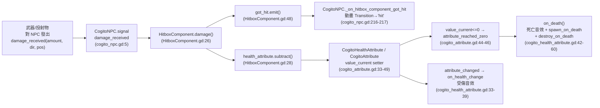
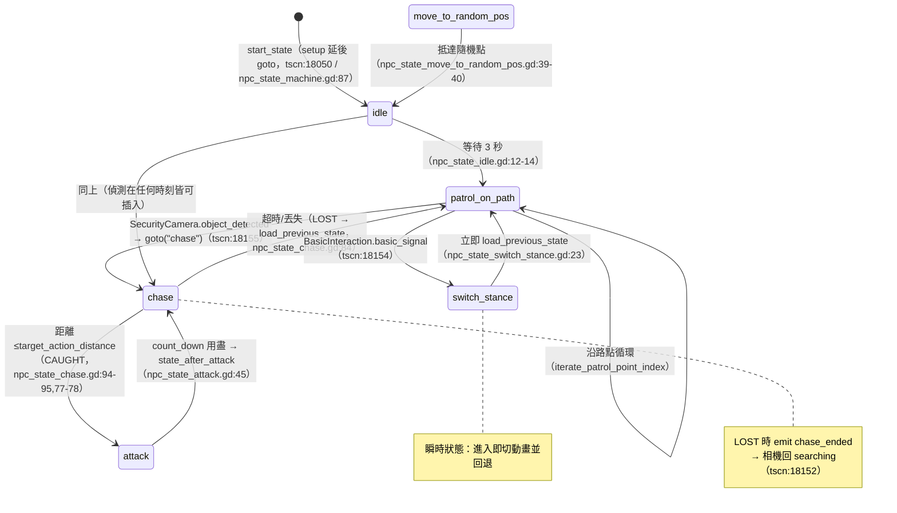

# 教學：如何修改與擴充 NPC AI 行為

COGITO 的 NPC（`CogitoNPC`，繼承 `CharacterBody3D`）使用一套**基於場景樹掛載**的狀態機（`NPC_State_Machine`）：同一時刻只有「當前狀態」這個子節點掛在樹上接收 `_physics_process`，其餘狀態節點被移出樹但保留在 `states` 字典中。狀態之間以 `States.goto("state_name")` 切換。

本教學分兩部分：
- **上半（一～六章）**：逐行剖析 Cogito **原生**狀態機的掛載、轉移、感知、傷亡整合機制，所有行號均對應 `/home/lorkhan/code/Cogito-1.1.5` 實際原始碼。
- **下半（七～十章）**：在不破壞原生機制的前提下，示範**新增自訂狀態（Flee 逃跑）**、視覺圓錐、聽覺、群體協同等擴充。下半的程式碼是**衍生範例**，原版 Cogito 不含，閱讀時請與上半的「真相層」區分。

## 前置知識
- 已閱讀 [Level 3B: NPC 狀態機行為](../architecture/level3_npc_states.md)。
- 對 Godot 4 的 `NavigationAgent3D`、`AnimationTree`(StateMachine + BlendSpace2D)、`Area3D`、`RayCast3D` 有基本概念。

> **重要前提（已確認，2026-05-29 複核仍正確）**：Cogito 原生的 `CogitoNPC` **預設不會把自己加入任何戰鬥群組**。`cogito_npc.gd:80-84` 的 `_ready()` 只做 `add_to_group("interactable")` 與 `add_to_group("Persist")`，沒有 `add_to_group("Enemy")`。因此下半章節中任何依賴 `get_nodes_in_group("Enemy")` 的群體協同，都必須**自行為 NPC 加入該群組**（見第九章）。玩家端則確實存在 `"Player"` 群組，NPC 透過 `get_tree().get_first_node_in_group("Player")` 取得玩家（`cogito_npc.gd:225`）。

---

# 上半：原生狀態機真相層

## 一、CogitoNPC 主體與節點結構

**位置**：`addons/cogito/CogitoNPC/cogito_npc.gd`（`class_name CogitoNPC`，`cogito_npc.gd:2`）。

實際場景 `cogito_npc.tscn` 的關鍵節點與連線（行號取自 `cogito_npc.tscn`）：

| 節點 | 型別 | 用途 / 行號 |
|---|---|---|
| `NPC_State_Machine` | Node | 狀態機根，`start_state = "idle"`（tscn:18046-18050） |
| 六個狀態子節點（`NPC_State_Machine` 之下） | Node | `idle`、`move_to_random_pos`、`patrol_on_path`、`switch_stance`、`chase`、`attack`（tscn:18052-18077） |
| `NavigationAgent3D` | NavigationAgent3D | 路徑規劃，別名 `nav_agent` 與 `navigation_agent_3d`（`cogito_npc.gd:69-70`） |
| `AnimationTree` | AnimationTree | 雙軌動畫樹（`cogito_npc.gd:71`） |
| `LookAtArea` | Area3D | 偵測玩家是否在範圍以驅動頭部朝向（`cogito_npc.gd:47`） |
| `Rig/Skeleton3D/LookAtModifier3D` | LookAtModifier3D | 頭部轉向玩家（`cogito_npc.gd:48`） |
| `CheckPlayerTimer` | Timer | 定期更新頭部追蹤目標（tscn:18141；connection tscn:18157） |
| `SecurityCamera` | Node3D | **原生唯一的玩家偵測來源**（tscn:18108） |
| `HitboxComponent` | Node | 受擊入口（tscn:18082） |
| `CogitoHealthAttribute` | Node | 血量屬性（tscn:18088） |
| `BasicInteraction` | (instance) | 互動觸發 `switch_stance`（connection tscn:18154） |

**tscn 內的關鍵 signal 連線**（決定整套 AI 如何被觸發，全部在 tscn 末尾）：

| 來源信號（節點） | 目標處理 | tscn 行號 |
|---|---|---|
| `chase_ended`（NPC_State_Machine/chase） | → `SecurityCamera.switch_to_searching` | tscn:18152 |
| `got_hit`（HitboxComponent） | → `CogitoNPC._on_hitbox_component_got_hit` | tscn:18153 |
| `basic_signal`（BasicInteraction） | → `NPC_State_Machine.goto`，bind `["switch_stance"]` | tscn:18154 |
| `object_detected`（SecurityCamera） | → `NPC_State_Machine.goto`，bind `["chase"]` | tscn:18155 |
| `send_detected_object`（SecurityCamera） | → `CogitoNPC._on_security_camera_object_detected` | tscn:18156 |
| `timeout`（CheckPlayerTimer） | → `CogitoNPC._on_check_player_timer_timeout` | tscn:18157 |

### 1.1 共用方法（給各狀態呼叫）

**`face_direction(face_direction: Vector3)`**（`cogito_npc.gd:134-139`）：
- `face_at_target = global_position.direction_to(face_direction)`（`:135`）
- 去除 Y 分量保留 XZ（`:136`），用 `Basis.looking_at(face_at_target_xz, Vector3.UP, false)`（`:138`）
- `basis = basis.slerp(target_basis, rotation_speed)`（`:139`）——以 `rotation_speed`（預設 0.2，`cogito_npc.gd:37`）平滑轉向。
- 注意：傳入的參數常是「位置 = 自身座標 + velocity」的前瞻點（look-ahead），而非目標座標。各移動狀態都這樣呼叫（如 `npc_state_patrol_on_path.gd:117,120`）。

**`update_animations(_delta)`**（`cogito_npc.gd:117-126`）：
- `relative_velocity = global_basis.inverse() * ((velocity * Vector3(1,0,1)) / sprint_speed)`（`:118`）——除以 `sprint_speed` 正規化，並以本地座標表示。
- `rel_velocity_xz = Vector2(relative_velocity.x, -relative_velocity.z)`（`:119`）。
- 有速度時寫入 `parameters/Movement/blend_position`，否則寫 `Vector2.ZERO`（`:123-126`）——驅動八方向移動混合。

**`set_upper_body_state(state_name)`**（`cogito_npc.gd:129-131`）：對 `parameters/UpperBodyState/playback` 取得 `AnimationNodeStateMachinePlayback` 並 `travel()`。

### 1.2 擊退系統（Knockback）

- `apply_knockback(direction)`（`cogito_npc.gd:173-175`）：`knockback_force = direction.normalized() * knockback_strength`（預設 10.0，`:42`），`knockback_timer = knockback_duration`（預設 0.5，`:41`）。
- `_physics_process(delta)` 開頭優先處理擊退（`cogito_npc.gd:103-109`）：當 `knockback_timer > 0`，每幀遞減計時、`velocity = knockback_force`、把力 `lerp` 向 0 衰減（`:107`）、`move_and_slide()` 後**直接 `return`**——擊退期間略過腳步等其餘 `_physics_process` 邏輯。
- **重要**：`cogito_npc.gd:_physics_process` 本身**沒有呼叫狀態邏輯的移動**；實際移動由「當前狀態」自己的 `_physics_process` 完成（因為只有當前狀態掛在樹上）。主體的 `_physics_process` 只負責擊退與腳步（`:111-112`）。

### 1.3 腳步音效

`npc_footsteps(delta)`（`cogito_npc.gd:143-170`）：用 `sin(wiggle_index)` 的峰值（`> 0.9`）觸發一次腳步，依 `round(velocity.length()) >= sprint_speed` 區分跑/走兩段音量與頻率（`WIGGLE_ON_SPRINTING_SPEED` / `WIGGLE_ON_WALKING_SPEED`，`:60-62`）。

### 1.4 存讀檔（持久化）

- `save()`（`cogito_npc.gd:187-206`）：先把 `patrol_path.get_path()` 存成 `patrol_path_nodepath`（`:188-189`），把 `npc_state_machine.current` 存成 `saved_enemy_state`（`:191`），連同位置/旋轉打包成 dict。
- `set_state()`（`cogito_npc.gd:179-183`）：`load_patrol_points()` 由 nodepath 還原 `patrol_path`（`:209-212`），再 `npc_state_machine.goto(saved_enemy_state)`（`:183`）恢復到存檔當下的狀態。
- **陷阱**：原始碼 `:180` 有 TODO 註明「目前無法儲存 health attribute 的血量」——讀檔後 NPC 血量會回到初始值。

---

## 二、NPC_State_Machine 掛載與轉移機制

**位置**：`addons/cogito/CogitoNPC/npc_states/npc_state_machine.gd`（`extends Node`）。

### 2.1 場景樹掛載（setup）

`_enter_tree()` 直接呼叫 `setup()`（`npc_state_machine.gd:24-25`）。`setup()`（`:65-88`）：
- 走訪所有子節點，存入 `states[child.name] = child`（`:67`）。
- **依鴨子型別注入參照**：若子節點有 `States`/`states` 屬性則注入狀態機自身（`:69-73`）；若有 `Host`/`host` 屬性則注入 NPC 主體（`get_host()`，`:75-79`）。各狀態檔頂部宣告的 `var Host` / `var States`（如 `npc_state_idle.gd:4-5`）就是被這裡填入的。
- **把非 `current` 的子節點移出樹**：`if child.name != current: self.remove_child(child)`（`:81-82`）。tscn 沒有設 `current`（預設空字串 `:8`），所以初始時所有狀態都被移出。
- `self.restart()`（`:84`）對當前狀態再呼叫一次 `_state_enter`（但此時 current 為空，`caller` 會因 `not len(current)` 而直接返回，見 `:135`）。
- 最後 `goto.call_deferred(start_state)`（`:87-88`）——延後一幀以確保 `Host` 已 ready，進入 `start_state`（tscn 設為 `"idle"`）。

### 2.2 goto() 轉移流程

`goto(state, args = null)`（`npc_state_machine.gd:110-130`）：
1. 找不到目標狀態 → `push_error` 並返回（`:111-113`）。
2. **若目標等於當前狀態 → 改呼叫 `restart(args)`**（只重跑 `_state_enter`，不重置變數）（`:116-117`）。
3. `await self.caller("_state_exit")`——等待舊狀態退出（支援 async，因為 `caller` 用 `await`，`:119`）。
4. 若當前有狀態，`remove_child(states[current])` 把舊狀態移出樹（`:121-123`）。
5. 設 `current = state`、`emit_signal("state_changed", current)`（`:125-126`）。
6. `add_child(states[current])`——新狀態進入樹，自此開始接收 `_physics_process`（`:128`）。
7. `await self.caller("_state_enter", args)`（`:130`）。

`caller(method, args)`（`:134-146`）：對「當前狀態」呼叫指定方法；若 current 為空或方法不存在則直接返回（`:135-139`）。這保證 goto 對缺漏方法的狀態仍安全。

### 2.3 previous_state（回退）機制

- `save_state_as_previous(state, args=null)`（`:91-95`）：把 `previous_state = state`（並選擇性記住 `previous_args`）。
- **慣例**：每個會被「插隊」的狀態都在自己的 `_state_exit()` 裡呼叫 `States.save_state_as_previous(self.name, null)`，把自己登記為「上一個狀態」。例如 `npc_state_idle.gd:18`、`npc_state_patrol_on_path.gd:37`、`npc_state_move_to_random_pos.gd:20`。
- `load_previous_state(_fallback_state="")`（`:97-106`）：若沒有 previous，回退到 `_fallback_state` 或 `"idle"`（`:98-102`）；否則 `goto(previous_state)`（帶 args 則一起傳，`:103-106`）。
- **陷阱（原始碼真實行為）**：`load_previous_state` 在「沒有 previous」分支裡 `goto(...)` 後**沒有 `return`**，會繼續往下執行到 `:103-106` 再 `goto(previous_state)`。由於此時 `previous_state` 仍為 `null`，第二次 `goto(null)` 會在 `:111` 因 `null not in states` 而 `push_error` 並安全返回——所以實務上不致崩潰，但會留一行錯誤日誌。擴充時若依賴回退，建議確保 `previous_state` 必被設定。

> 設計重點：`switch_stance` 與 `attack` 這類「插隊型」狀態，靠的就是被插隊狀態先 `save_state_as_previous`，自己處理完再 `load_previous_state()` 回去。

### 2.4 其他輔助 API

- `has(state) -> bool`（`:50-51`）：狀態是否存在。
- `now(state) -> bool`（`:55-56`）：當前是否為某狀態。
- `is_current() -> bool`（`:43-46`）：用 `get_stack()` 判斷呼叫端是否就是當前狀態的 script。
- `_call(args, method)`（`:150-151`）：供 signal bind 反向掛載（先 method 後 args 的順序橋接）。
- `_exit_tree()`（`:28-39`）：清理時把所有狀態 `queue_free()`，`current = "_exit"`。

---

## 三、各狀態詳細行為（進入 / 退出 / 轉移）

所有狀態 `extends Node`，頂部宣告 `var Host` / `var States`（由 setup 注入）。

### 3.1 idle（`npc_state_idle.gd`）
- `_state_enter()`（`:9-14`）：`await get_tree().create_timer(3).timeout` 後 `States.goto("patrol_on_path", null)`。**3 秒硬編碼**。
- `_state_exit()`（`:17-19`）：`States.save_state_as_previous(self.name, null)`。
- `_physics_process`（`:22-23`）：`pass`，純被動等待。

### 3.2 patrol_on_path（`npc_state_patrol_on_path.gd`）
內嵌 `enum TravelStatus{ SUCCESS, FAILURE, RUNNING, WAITING = 3 }`（`:12`），初值 `WAITING`（`:13`）。

- `_enter_tree()`（`:19-24`）：建立 one_shot 的 `patrol_wait_timer`，`timeout` 接 `resume_patrolling`。
- `_state_enter()`（`:27-34`）：若有 `Host.patrol_path`，把 `nav_agent.target_position` 設為下一巡邏點並轉 `RUNNING`；無路徑則只記 log（**不會移動**）。
- `_state_exit()`（`:36-38`）：`save_state_as_previous(self.name, null)`。
- `_physics_process`（`:41-60`）：先 `Host.update_animations`，再 `match` 狀態：
  - `WAITING`：`move_toward` 把速度降到 0、`move_and_slide`、`return`（`:45-50`）。
  - `RUNNING`：`_running(delta)`（`:51-52`）。
  - `FAILURE`：`iterate_patrol_point_index()` 跳下一點並回到 RUNNING（`:56-60`）。
- `_running(delta)`（`:74-84`）：若 `!is_target_reachable()` → 跳下一點（`:75-78`）；若 `is_navigation_finished()` → `wait_at_patrol_point`（`:80-82`）；否則 `move_host_to_next_position`。
- `iterate_patrol_point_index()`（`:99-106`）：到尾端歸 0，否則 +1（循環巡邏）。
- 移動：`move_host_to_next_position`（`:109-127`）取 `get_next_path_position`、補重力、`face_direction`（傳前瞻點，`:117,120`）、設 XZ 速度 = `direction * move_speed`、`move_and_slide`。

### 3.3 move_to_random_pos（`npc_state_move_to_random_pos.gd`）
- `_state_enter()`（`:13-16`）：`nav_agent.target_position = pick_destination()`、轉 RUNNING。
- `_state_exit()`（`:19-20`）：`save_state_as_previous`。
- `_physics_process`（`:23-44`）：RUNNING → `_running`；到達後（WAITING 把速度降到 0 且 `length_squared()==0`）轉 `SUCCESS`（`:32-33`）；`SUCCESS` → `States.goto("idle")`（`:39-40`）；`FAILURE` → 重新 `pick_destination`。
- `pick_destination()`（`:49-52`）→ `random_position(random_direction())`：方向是 `Vector3(randf_range(-1,1),0,randf_range(-1,1)).normalized()`（`:93-98`），距離 `randi_range(1, max_distance_from_host)`（`:88`）。
- **已知 bug**：`random_position` 回傳 `direction * distance`（`:89`）是**以世界原點為基準的相對向量**，並未加上 `Host` 當前位置（`pick_destination` 取了 `current_position` 卻沒用，`:50`）。因此 NPC 漫遊目標其實是繞著世界原點，而非繞著自身。擴充隨機漫遊時應改為 `Host.global_position + direction * distance`。

### 3.4 chase（`npc_state_chase.gd`）
內嵌 `enum ChaseStatus{ CAUGHT, LOST, CHASING, WAITING = 3 }`（`:9`）。匯出參數：`target_action_distance`（預設 1.0，`:13`）、`action_when_caught`（預設 `"attack"`，`:14`）、`giveup_chase_time`（預設 10.0，`:16`）、`face_target_while_waiting`（預設 true，`:17`）、動畫姿態名 `chase_stance` / `neutral_stance`（`:20-21`）。

- `_enter_tree()`（`:28-33`）：建立 one_shot `chase_wait_timer`（`wait_time = giveup_chase_time`），`timeout` 接 `stop_chasing`。
- `_state_enter()`（`:36-46`）：
  - `chase_target = Host.attention_target`（`:37`）。
  - 取上半身動畫 playback（`:38`）。
  - **若 `attention_target` 為 null → `States.load_previous_state()` 立刻退回**（`:40-42`）。
  - 否則 `host_animation_statemachine.travel(chase_stance)`、`Host.move_speed = Host.sprint_speed`（**追擊時切衝刺速度**，`:44-45`）、轉 `CHASING`。
- `_state_exit()`（`:49-50`）：`chase_target = null`（注意：**chase 不呼叫 save_state_as_previous**——它依賴被它中斷的巡邏/idle 早已登記過 previous）。
- `_physics_process`（`:53-84`）：
  - `WAITING`：降速、`move_and_slide`、（可選）`face_direction(chase_target.global_position)`（`:63-64`）、持續更新 target，若 `is_target_reachable()` 重新可達 → 停計時器並回 `CHASING`（`:66-70`）、`return`。
  - `CHASING`：`_running`（`:74-75`）。
  - `CAUGHT`：`States.goto(action_when_caught)`（預設 attack，`:77-78`）。
  - `LOST`：`travel(neutral_stance)`、`emit chase_ended`（驅動 SecurityCamera 回 searching）、`load_previous_state()`（`:80-84`）。
- `_running(delta)`（`:90-100`）：更新 `target_position = chase_target.global_position`；距離 ≤ `target_action_distance` → `CAUGHT`（`:94-95`）；不可達 → `start_waiting`（`:97-98`）；`move_host_to_next_position`。
- `stop_chasing()`（`:104-107`）：恢復 `walk_speed`、轉 `LOST`。`start_waiting()`（`:111-113`）：啟動超時計時器、轉 `WAITING`。

### 3.5 attack（`npc_state_attack.gd`）
匯出：`state_after_attack`（`:7`，通常設回 `"chase"`）、`attack_duration`（0.5，`:11`）、`attack_damage`（1，`:13`）、`attack_stagger`（8.0，`:15`）、`attack_sound`（`:16`）。

- `_state_enter()`（`:22-30`）：`target = Host.attention_target`；null 則 `load_previous_state()`（`:25-27`）；否則 `count_down = attack_duration` 並立即 `attempt_attack()`（`:29-30`）。
- `_physics_process`（`:37-47`）：先把速度 `move_toward` 到 0（攻擊時停止移動，`:39-41`）；`count_down <= 0` → 再 `attempt_attack()` 並 `States.goto(state_after_attack)`（`:43-45`）；否則 `count_down -= delta`。
- `attempt_attack()`（`:50-56`）：重設 `count_down`；**無條件**觸發攻擊動畫 `parameters/UpperBodyState/RaisedFists/attack/request = ONE_SHOT_REQUEST_FIRE`（`:53`）；僅當距離 ≤ 1.5 才實際 `attack(target)`（`:55-56`）。
- `attack(target)`（`:59-79`）：`await create_timer(0.15).timeout`（硬編碼對齊動畫，原始碼 `:62` 自註「GET RID OF MAGIC NUMBER」）；播放音效；若 `target is CogitoPlayer` → `apply_external_force` 擊飛 + `decrease_attribute("health", attack_damage)`（`:67-71`）；若 target 有 `damage_received` signal → `target.damage_received.emit(attack_damage, damage_direction)` 並 `return`（`:72-76`）。

### 3.6 switch_stance（`npc_state_switch_stance.gd`）
- 由 `BasicInteraction.basic_signal` → `goto("switch_stance")` 觸發（tscn:18154）——是**互動切換戰鬥姿態**，與戰鬥流程無關。
- `_state_enter()`（`:12-23`）：取上半身 playback，依 `stance_active` 在 `RaisedFists` / `Neutral` 間 `travel` 切換（`:14-21`），然後**立刻 `States.load_previous_state()` 退回**（`:23`）——典型「一次性瞬時/中間件狀態」。

---

## 四、玩家偵測：原生機制 = 板載 SecurityCamera

`CogitoNPC` 主體**沒有**內建視野判斷；`attention_target` 的設定與 `chase` 的觸發，原生靠的是掛在 NPC 上的 `SecurityCamera` 節點（`cogito_security_camera.gd`，tscn:18108）。

偵測流程（`cogito_security_camera.gd`）：
1. `_physics_process` 驅動狀態（searching / detecting / detected）（`:72-`）。
2. `find_visible_targets_within_detection_area()`（`:152-160`）：在 `DetectionArea3D` 重疊體中，逐一用 `object_visibile_for_detector()`（`:162-`）以 `DetectionRayCast3D` 做**視線阻擋檢查**。
3. `detecting(delta)`（`:96-119`）：累積 `detection_time`（可選用 lightmeter 依亮度加速，`:102-104`）；達 `detection_threshold` 時：
   - `send_detected_object.emit(detected_objects[0])`（`:116`）→ NPC `_on_security_camera_object_detected(object)`（`cogito_npc.gd:220-221`）把 `attention_target = object`。
   - `object_detected.emit()`（`:117`）→ `NPC_State_Machine.goto("chase")`（tscn:18155）。
4. 丟失目標時 `stop_detecting()`（`:122-131`）：`object_no_longer_detected.emit()`；若父節點是 `CogitoNPC` 則清空 `attention_target`（`:128-129`）。
5. `chase` 結束時 emit `chase_ended` → 相機 `switch_to_searching()`（tscn:18152），形成閉環。

**頭部朝向（與偵測無關）**：`CheckPlayerTimer.timeout` → `_on_check_player_timer_timeout()`（`cogito_npc.gd:224-231`）：用 `get_first_node_in_group("Player")` 與 `look_at_area.get_overlapping_bodies()` 比對，命中則把 `look_at_modifier_3d.target_node` 設為玩家 head 路徑，否則清空。這只影響頭部 IK，不觸發追擊。

> 結論：原生 Cogito 的「看到玩家就追」是由 SecurityCamera 完成的，**感知與狀態機解耦**（透過 signal）。下半的「視覺圓錐 / 聽覺」是在沒有相機、或想做純潛行 NPC 時的替代擴充。

---

## 五、傷亡整合：HitboxComponent ↔ HealthAttribute ↔ NPC

這是 NPC 受傷與死亡的完整資料流（行號已核對）。



逐點說明：
1. **受傷入口**：`CogitoNPC` 宣告 `signal damage_received(damage_value:float)`（`cogito_npc.gd:5`）。`HitboxComponent._ready()` 若父節點有此 signal 就連到自己的 `damage`（`HitboxComponent.gd:18-23`）；沒有則記警告 log。**這正是第 3.5/attack 章 `target.damage_received.emit(...)`（`npc_state_attack.gd:75`）打到 NPC 身上的接收端**——NPC 之間也能互相傷害。
2. **HitboxComponent.damage()**（`HitboxComponent.gd:26-48`）：
   - `health_attribute.subtract(damage_amount)`（`:27-28`）。
   - 可在全域/本地碰撞點 spawn 特效（`:30-39`）。
   - `apply_force_on_hit` 時：`RigidBody3D` 用 `apply_impulse`；**`CharacterBody3D`（即 NPC）用 `parent.apply_knockback(...)`**（`:45-46`）——這把擊退接回了 `cogito_npc.gd:173` 的 knockback 系統。
   - 最後 `got_hit.emit()`（`:48`）→ NPC 播放受擊動畫（`cogito_npc.gd:216-217`，寫 `parameters/Transition/transition_request = "hit"`）。
3. **CogitoHealthAttribute**（`cogito_health_attribute.gd`，`class_name CogitoHealthAttribute extends CogitoAttribute`）：
   - `_ready()` 把 `attribute_reached_zero` 接到 `on_death`、`attribute_changed` 接到 `on_health_change`（`:26-30`）。
   - `subtract` 走基底 `CogitoAttribute.subtract`（`cogito_attribute.gd:69-`），最終改寫 `value_current` setter（`:33-49`）：減少時 emit `attribute_changed(...,false)`（`:40-42`）；`<=0` 時 emit `attribute_reached_zero`（`:44-46`）。
   - `on_health_change`（`:33-39`）：受傷播 `sound_on_hit` / `sound_on_damage_taken`。
   - `on_death`（`:42-60`）：emit `death`；記住父節點位置/旋轉；播 `sound_on_death`；`spawn_on_death` 逐一實例化（如屍體/掉落物，`:51-56`）；`destroy_on_death` 逐一 `queue_free`（`:58-60`）。
4. **死亡後狀態機**：原生 `on_death` **不會**主動停掉 `NPC_State_Machine`；常見作法是把 NPC 主體（或其關鍵節點）列入 `destroy_on_death`，靠 `queue_free` 觸發 `_exit_tree`（`npc_state_machine.gd:28-39`）來收尾。若你要做「倒地動畫再消失」，需自行接 `CogitoHealthAttribute.death` signal 處理（見第十章陷阱）。

---

## 六、原生狀態轉移圖



> 說明：`move_to_random_pos` 在 tscn 中存在但**未被任何原生轉移觸發**（沒有 goto 指向它），屬於可供場景設計者手動 `goto("move_to_random_pos")` 的備用漫遊狀態。`switch_stance` / `chase` / `attack` 的回退目標皆取決於「誰最後呼叫了 `save_state_as_previous`」。

---

# 下半：擴充範例（衍生，非原生）

> 以下程式碼為教學示範，**Cogito 1.1.5 原版不含**。請放在自己的專案腳本或繼承類中，避免直接污染 addon。所有對原生 API 的引用仍標註行號以確保正確。

## 七、新增自訂狀態：Flee（逃跑）完整可運行範例

目標：當 NPC 血量過低時，背對玩家逃離一段時間，安全後回到先前狀態。此範例完整示範「如何掛到狀態機、如何宣告轉移」。

### 7.1 建立狀態腳本

新增 `res://my_npc_states/npc_state_flee.gd`（放專案目錄，不動 addon）：

```gdscript
extends Node

# 由 NPC_State_Machine.setup() 自動注入（npc_state_machine.gd:69-79 的鴨子型別注入）
var Host
var States

@export var flee_speed_is_sprint : bool = true   # 逃跑用衝刺速度
@export var flee_duration : float = 6.0           # 逃跑最長秒數
@export var safe_distance : float = 18.0          # 離玩家多遠算安全
@export var neutral_stance : String = "Neutral"   # 對應 chase 的 chase_stance/neutral_stance（npc_state_chase.gd:20-21）

var _flee_target : Node3D
var _timer : float = 0.0


func _state_enter() -> void:
	# 沿用原生取得玩家的方式（cogito_npc.gd:225）
	_flee_target = Host.attention_target
	if not _flee_target:
		_flee_target = get_tree().get_first_node_in_group("Player")
	if not _flee_target:
		# 沒有威脅來源 → 用原生回退機制（npc_state_machine.gd:97）
		States.load_previous_state("patrol_on_path")
		return

	_timer = flee_duration
	# 切回中立上半身姿態（沿用 chase 的動畫狀態機路徑，npc_state_chase.gd:38,44）
	var ub = Host.animation_tree.get("parameters/UpperBodyState/playback")
	ub.travel(neutral_stance)
	Host.move_speed = Host.sprint_speed if flee_speed_is_sprint else Host.walk_speed


func _state_exit() -> void:
	# 登記自己，讓後續插隊狀態能回退到 flee（npc_state_machine.gd:91）
	States.save_state_as_previous(self.name, null)
	Host.move_speed = Host.walk_speed   # 還原速度（對應 chase stop_chasing 的做法，npc_state_chase.gd:106）


func _physics_process(delta: float) -> void:
	Host.update_animations(delta)   # 沿用主體動畫更新（cogito_npc.gd:117）

	_timer -= delta
	var dist := Host.global_position.distance_to(_flee_target.global_position)

	# 逃跑結束條件：超時 或 已拉開安全距離
	if _timer <= 0.0 or dist >= safe_distance:
		States.load_previous_state("patrol_on_path")
		return

	# 計算「遠離玩家」的方向（與 chase 相反）
	var away_dir := _flee_target.global_position.direction_to(Host.global_position)
	var flee_point := Host.global_position + away_dir * 4.0
	# 用 NavigationAgent3D 規劃可行路徑（與原生移動狀態一致，npc_state_patrol_on_path.gd:110）
	Host.navigation_agent_3d.target_position = flee_point
	var next_pos := Host.navigation_agent_3d.get_next_path_position()

	if not Host.is_on_floor():
		Host.velocity += Host.get_gravity() * delta   # 補重力（npc_state_chase.gd:120-121）

	var direction := Host.global_position.direction_to(next_pos)
	# 逃跑時面向「前進方向」= 背對玩家；用前瞻點呼叫 face_direction（cogito_npc.gd:134）
	var look_ahead := Vector3(Host.global_position.x + Host.velocity.x, Host.global_position.y, Host.global_position.z + Host.velocity.z)
	Host.face_direction(look_ahead)
	Host.velocity.x = direction.x * Host.move_speed
	Host.velocity.z = direction.z * Host.move_speed
	Host.move_and_slide()
```

### 7.2 掛到狀態機（編輯器步驟）

1. 開 `cogito_npc.tscn`（或你繼承的 NPC 場景）。
2. 在 `NPC_State_Machine` 節點下**新增一個 Node 子節點**，命名為 `flee`（名稱即 `States.goto("flee")` 用的 key——對應 `setup()` 的 `states[child.name] = child`，`npc_state_machine.gd:67`）。
3. 把 `npc_state_flee.gd` 掛到此 `flee` 節點。
4. 不需手動接 `Host`/`States`——`setup()` 會自動注入（`npc_state_machine.gd:75-79`）。

### 7.3 宣告轉移（兩條方向）

**進入 flee**：在受擊或血量變化時觸發。最乾淨的方式是接 `CogitoHealthAttribute` 的 signal。於 NPC 主體（自製繼承腳本或附加腳本）：

```gdscript
# 在 NPC 的 _ready() 之後，連接血量屬性的受傷 signal
func _ready_flee_hook() -> void:
	var hp := $CogitoHealthAttribute   # 對應 tscn:18088
	hp.attribute_changed.connect(_on_hp_changed)   # cogito_attribute.gd:6

func _on_hp_changed(_name: String, current: float, value_max: float, increased: bool) -> void:
	if increased:
		return
	# 血量低於 30% 且不在攻擊中就逃跑
	if current / value_max <= 0.3 and npc_state_machine.current not in ["flee", "attack"]:
		npc_state_machine.goto("flee")   # npc_state_machine.gd:110
```

**離開 flee**：已在 `_physics_process` 用 `States.load_previous_state("patrol_on_path")` 宣告（超時或安全後回退）。

> 為何能直接 `goto("flee")`？因為 `goto` 只檢查 `state in states`（`npc_state_machine.gd:111`），而 `flee` 已在 setup 時登記。`load_previous_state` 的回退則靠先前狀態的 `save_state_as_previous`（如 patrol 的 `:37`）。

---

## 八、強化感知（替代相機）：視覺圓錐 (Vision Cone)

若你的 NPC 不掛 SecurityCamera、要做純潛行視野，可在巡邏狀態加視線檢測。節點設定：在 `Head`/`Rig` 下加 `VisionRayCast (RayCast3D)`，`enabled = true`，`collision_mask` 設為玩家所在的物理層。

```gdscript
# 在自製的 patrol 衍生狀態或 NPC 腳本中（不要直接改 addon）
@onready var vision_raycast : RayCast3D = Host.find_child("VisionRayCast")

func _check_vision() -> void:
	var player = get_tree().get_first_node_in_group("Player")   # 沿用原生群組（cogito_npc.gd:225）
	if not player or not vision_raycast:
		return
	var dist = Host.global_position.distance_to(player.global_position)
	if dist > 15.0:
		return
	var dir_to_player = Host.global_position.direction_to(player.global_position)
	var forward = -Host.global_transform.basis.z
	if forward.dot(dir_to_player) < 0.5:   # cos(60°)≈0.5 → 左右各 60°，共 120° 視野
		return
	vision_raycast.target_position = vision_raycast.to_local(player.global_position)
	vision_raycast.force_raycast_update()
	if vision_raycast.is_colliding():
		var collider = vision_raycast.get_collider()
		if collider == player or (collider and collider.is_in_group("Player")):
			Host.attention_target = player    # 與相機相同的入口（cogito_npc.gd:30,221）
			States.goto("chase")              # 觸發原生 chase（_state_enter 會讀 attention_target，npc_state_chase.gd:37）
```

要點：必須先設 `Host.attention_target` **再** `goto("chase")`，否則 `chase._state_enter` 會因 `attention_target` 為 null 而立刻 `load_previous_state()`（`npc_state_chase.gd:40-42`）。

---

## 九、聽覺與群體協同

聽覺需要一個全域信號橋（Autoload，命名 `SignalBus`），宣告 `signal noise_made(position: Vector3, volume: float)`，在腳步/開槍處 emit，NPC 在 `_ready` 訂閱後依距離決定是否進 chase/alert。實作概念與第八章一致：命中即設 `attention_target` 再 `goto`。

**群體協同**最關鍵的前提（呼應開頭鐵則）：NPC 原生**不在任何 Enemy 群組**（`cogito_npc.gd:80-84` 只加 `interactable` / `Persist`）。要讓「一隻發現、附近同伴一起追」，必須先讓 NPC 自行入群：

```gdscript
# 自製繼承腳本的 _ready 中（不直接改 addon）
func _ready() -> void:
	add_to_group("Enemy")   # 原生沒有，必須自己加

func receive_alert(target: Node3D) -> void:
	# 只在非戰鬥狀態響應（用原生的 current 查詢，npc_state_machine.gd:8）
	if npc_state_machine.current in ["idle", "patrol_on_path", "move_to_random_pos"]:
		attention_target = target
		npc_state_machine.goto("chase")
```

廣播端（例如在自製 chase 衍生狀態 `_state_enter` 或偵測命中時）：`for ally in get_tree().get_nodes_in_group("Enemy"): if ally != Host and ally.has_method("receive_alert") and 距離 <= 半徑: ally.receive_alert(Host.attention_target)`。

---

## 十、常見陷阱（Pitfalls）

| 陷阱 | 說明 / 對應原始碼 |
|---|---|
| **以為 NPC 在 "Enemy" 群組** | 原生只加 `interactable`/`Persist`（`cogito_npc.gd:80-84`）。群體協同前必須自行 `add_to_group("Enemy")`。 |
| **goto("chase") 前忘了設 attention_target** | `chase._state_enter` 讀不到目標會立刻 `load_previous_state()`（`npc_state_chase.gd:37,40-42`），追擊「秒退」。 |
| **狀態節點名稱拼錯** | `goto` 以節點 `name` 為 key（`npc_state_machine.gd:67,111`）。名稱不符會 `push_error` 並什麼都不做。 |
| **在非當前狀態寫 `_physics_process` 期望它跑** | 非當前狀態已被移出樹（`npc_state_machine.gd:81-82,123`），不會收到 `_physics_process`。邏輯只在掛載期間有效。 |
| **隨機漫遊 NPC 跑去地圖原點** | `move_to_random_pos` 的目標是相對世界原點而非自身（`npc_state_move_to_random_pos.gd:86-90`，`pick_destination` 沒用上 `current_position`）。自訂時改成 `Host.global_position + dir * distance`。 |
| **攻擊只播動畫不掉血** | `attempt_attack` 無條件播動畫，但只在距離 ≤ 1.5 才真正 `attack`（`npc_state_attack.gd:53-56`）。距離判定與 chase 的 `target_action_distance`（預設 1.0，`:13`）需協調，否則會「揮空」。 |
| **依賴 attack 後回到 chase 但忘了設 state_after_attack** | `state_after_attack` 是空字串時 `goto("")` 會 `push_error`（`npc_state_attack.gd:45` → `npc_state_machine.gd:111`）。Inspector 必須填值（通常 `"chase"`）。 |
| **load_previous_state 留錯誤日誌** | 無 previous 時的分支缺 `return`，會二次 `goto(null)`（`npc_state_machine.gd:97-106`）。不崩潰但有 error log；自訂回退時請確保 previous 已設或傳入 fallback。 |
| **讀檔後 NPC 滿血** | `save()`/`set_state()` 不持久化 health（`cogito_npc.gd:180` 的 TODO）。需要血量存檔得自行擴充。 |
| **死亡後狀態機仍在跑** | `on_death` 不主動停狀態機（`cogito_health_attribute.gd:42-60`）。要乾淨收尾，把 NPC 列入 `destroy_on_death` 或自接 `death` signal 處理。 |
| **擊退期間狀態邏輯失效是正常的** | `cogito_npc.gd:103-109` 在 knockback 期間 `return`，且狀態移動在各狀態自己的 `_physics_process`——擊退與狀態移動可能短暫互相覆寫，調 `knockback_duration`（`:41`）。 |
| **直接改 addon 內檔案** | 升級 Cogito 會被覆蓋。擴充請用繼承腳本或專案目錄的自製狀態節點，靠 setup 的鴨子型別注入（`npc_state_machine.gd:69-79`）介接。 |

---

## 十一、驗證清單

| 測試項目 | 預期結果 / 依據 |
|---|---|
| 啟動後 NPC 自動巡邏 | idle 等 3 秒 → patrol_on_path（`npc_state_idle.gd:12-14`） |
| 走進 SecurityCamera 偵測範圍且有視線 | 累積到 `detection_threshold` 後進 chase（`cogito_security_camera.gd:108-117` → tscn:18155） |
| 追到 ≤ target_action_distance | 進 attack 並播攻擊動畫（`npc_state_chase.gd:94-95` / `npc_state_attack.gd:53`） |
| 玩家逃出視線超過 giveup_chase_time | chase LOST → 回 patrol（`npc_state_chase.gd:80-84`） |
| 對 NPC 造成傷害 | 播 hit 動畫 + 受傷音效（`cogito_npc.gd:216-217` / `cogito_health_attribute.gd:33-39`） |
| 血量歸零 | 觸發 death：spawn/destroy（`cogito_health_attribute.gd:42-60`） |
| 血量低於 30%（裝了第七章 Flee） | 切到 flee 背對玩家逃跑，安全/超時後回 patrol |
| 存檔讀檔 | NPC 位置與 `saved_enemy_state` 恢復（`cogito_npc.gd:187-206,179-183`），但血量回滿（已知限制） |
