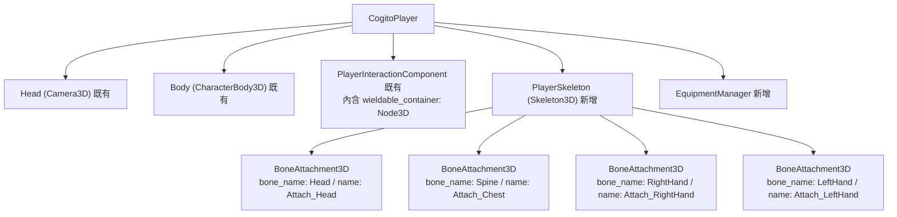
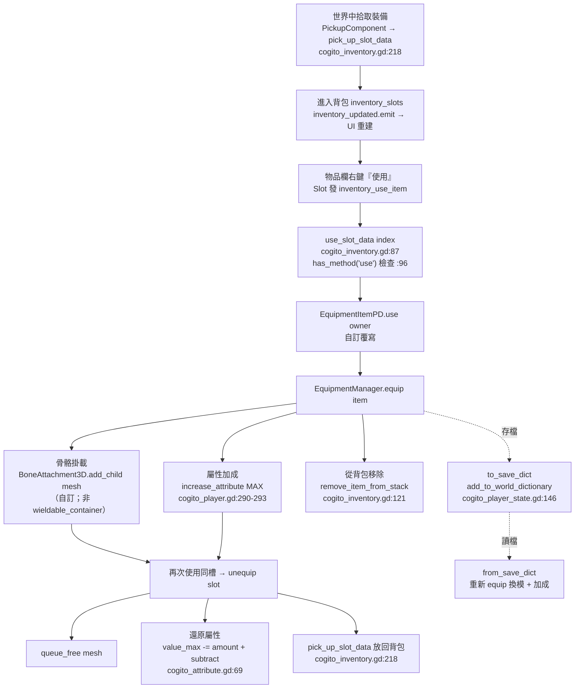

# 教學：紙娃娃裝備系統（Paper Doll & EquipmentManager）

本教學說明如何在 COGITO 中實作裝備槽系統：穿上護甲後改變屬性數值、裝備模型掛載到骨架對應位置、裝備欄 UI。

> **重要前提（Cogito 原生 vs 本教學自訂）**
> Cogito 1.1.5 **沒有**內建「裝備槽 / 紙娃娃」概念。它只有兩種「使用物品」的途徑：
> 1. 一般物品：基底 `InventoryItemPD` 是純 `Resource`，**本身沒有 `use()` 方法**（見 `InventoryPD/CustomResources/InventoryItemPD.gd:1`，整支沒有 `func use`）。
> 2. 可手持物品 `WieldableItemPD`：覆寫了 `use()`（`InventoryPD/CustomResources/WieldableItemPD.gd:29`），切換「拿出／收起」雙態，模型由 `PlayerInteractionComponent` 的 `wieldable_container`（第一人稱相機下的 `Node3D`）持有，**不是掛在骨骼上**。
>
> 因此本教學的「裝備槽、紙娃娃 UI、BoneAttachment3D 換模、裝備屬性加成」**全為自訂代碼**，建立在 Cogito 既有的物品欄／屬性／存檔骨架之上。下文會逐一標明哪些是呼叫 Cogito 既有 API、哪些是新寫的。

## 前置知識
- 已閱讀 [Level 3A: 屬性系統](../architecture/level3_attributes.md) 與 [Level 5A: 物品欄 UI](../architecture/level5a_inventory_ui.md)。
- 已完成 [教學：Skyrim 升級系統](./skyrim_leveling_system.md)（`LevelManager` 已存在；本教學第四節的升級鉤子為選用）。

---

## 〇、Cogito 既有機制速查（自訂代碼會用到的真實 API）

| 需求 | Cogito 既有 API（含真實位置） | 說明 |
|---|---|---|
| 物品被「使用」 | `CogitoInventory.use_slot_data(index)`（`InventoryPD/cogito_inventory.gd:87`） | 內部檢查 `inventory_item.has_method("use")`（同檔 `:96`），有才呼叫 `inventory_item.use(owner)`（`:99`），`owner` 是物品欄的擁有者（玩家節點），**不是** PlayerInteractionComponent |
| 物品從背包消耗 | `remove_item_from_stack(slot_data)`（`cogito_inventory.gd:121`） | 數量 -1，歸零時 `null_out_slots` 並解除快捷槽綁定 |
| 放回背包 | `pick_up_slot_data(slot_data) -> bool`（`cogito_inventory.gd:218`） | 找空位塞入，會 emit `inventory_updated` 與 `picked_up_new_inventory_item` |
| 屬性永久加成（提升上限） | `CogitoPlayer.increase_attribute(name, value, ConsumableItemPD.ValueType.MAX)`（`CogitoObjects/cogito_player.gd:280`） | `MAX` 分支同時 `attribute.value_max += value` 並 `attribute.add(value)`（`cogito_player.gd:290-293`） |
| 屬性扣減 | `CogitoPlayer.decrease_attribute(name, value)`（`cogito_player.gd:297`） | 內部呼叫 `attribute.subtract(value)`（`cogito_player.gd:302`） |
| 底層屬性增減 | `CogitoAttribute.add(amount)` / `subtract(amount)`（`Components/Attributes/cogito_attribute.gd:61` / `:69`） | **注意：方法名是 `add` / `subtract`，不是 `increase` / `decrease`**；`value_current` 是帶 clamp 的 setter（`cogito_attribute.gd:33-49`），`value_max` 是普通 `@export`（`:19`），要動上限得直接賦值 |
| 玩家屬性查表 | `CogitoPlayer.player_attributes`（Dictionary，`cogito_player.gd:131`，於 `:230` 由 `find_children(..., "CogitoAttribute")` 填入） | key = `attribute.attribute_name` |
| 手持物換模 | `PlayerInteractionComponent.equip_wieldable(item)`（`Components/PlayerInteractionComponent.gd:214`） | `build_wieldable_scene()` 後 `wieldable_container.add_child(...)`（`:218-219`） |
| 存檔擴充 | `CogitoPlayerState.add_to_world_dictionary(key, data)`（`SceneManagement/cogito_player_state.gd:146`） | 任意自訂存檔資料的官方掛點 |

> 之所以「裝備加成」推薦用 `increase_attribute(..., ValueType.MAX)`：它是 Cogito 唯一原生能「臨時改動屬性上限」的入口，卸下時對稱地 `value_max -= value` + `subtract(value)` 即可還原。詳見第四節。

---

## 一、EquipmentItemPD：擴充物品資源

裝備物品繼承自 `InventoryItemPD`（`InventoryPD/CustomResources/InventoryItemPD.gd:1`，本身是純 `Resource`）。注意基底**沒有** `defense` 等戰鬥欄位，需自行新增。

建立 `res://scripts/equipment_item_pd.gd`：

```gdscript
# res://scripts/equipment_item_pd.gd
extends InventoryItemPD
class_name EquipmentItemPD

enum EquipSlot {
    HEAD,       # 頭盔
    CHEST,      # 胸甲
    HANDS,      # 手套
    FEET,       # 靴子
    RIGHT_HAND, # 右手武器
    LEFT_HAND,  # 左手/盾牌
}

## 裝備位置
@export var equip_slot: EquipSlot = EquipSlot.CHEST
## 裝備後附加到骨架的場景（含 MeshInstance3D）。第三人稱/紙娃娃用，純第一人稱可留空
@export var equip_mesh: PackedScene

@export_group("Attribute Modifiers")
## 裝備時對哪個 CogitoAttribute 加成（key 須對應 attribute_name，如 "health"、"stamina"）
## value 為提升的「上限」數值（透過 increase_attribute 的 MAX 模式套用）
@export var attribute_modifiers: Dictionary = {}   # { "health": 20.0, "stamina": 10.0 }

@export_group("Combat")
## 防禦加成（命中時減少傷害的固定百分比基數，第四節使用）
@export var defense_bonus: float = 0.0
## 攻擊加成（加算到武器 wieldable_damage）
@export var attack_bonus: float = 0.0

@export_group("Optional")
## 升級時獲得 XP 的技能名稱（對應 LevelManager，選用）
@export var armor_skill: String = "light_armor"
```

> 不要新增 `weight` 欄位來「對應 Cogito 重量」——Cogito 物品的物理尺寸欄位叫 `item_drop_size`（`InventoryItemPD.gd:20`，用於丟棄時的球形碰撞半徑），與重量／耐力無關。若要做負重系統，請另接屬性，而非沿用此欄位。

在 Godot Editor 中，`右鍵 → New Resource → EquipmentItemPD` 即可建立裝備資源。

---

## 二、為玩家加入骨架掛點

> 釐清：Cogito 預設第一人稱手持物**不走骨骼**，而是被加進 `PlayerInteractionComponent.wieldable_container`（`PlayerInteractionComponent.gd:55`，型別 `Node3D`），這個容器掛在相機下，由 `equip_wieldable()`（`:214-225`）負責 `add_child` / `queue_free`。本教學的紙娃娃換模是**另起一套**用於第三人稱／可見身體的掛載，與既有手持物系統並行，互不干擾。

**節點結構**（在 `CogitoPlayer` 下加入）：



**設定 BoneAttachment3D**：選取 BoneAttachment3D → Inspector → `Bone Name` 設為對應骨骼名稱（須與 Skeleton3D 的骨骼名稱一致）。

若只需第一人稱（不顯示身體、純數值計算），可不放 Skeleton：把 `EquipmentItemPD.equip_mesh` 留空，`EquipmentManager` 換模那段會自動略過（見第三節判斷式），裝備只影響屬性加成。

---

## 三、EquipmentManager：核心管理器

建立 `res://scripts/equipment_manager.gd`，作為 `CogitoPlayer` 的子節點（**不是** Autoload，因為需要存取玩家的骨架與 `player_attributes`）：

```gdscript
# res://scripts/equipment_manager.gd
extends Node
class_name EquipmentManager

## 各槽位對應的 BoneAttachment3D 節點路徑（純第一人稱可全部留空）
@export var attach_head: NodePath
@export var attach_chest: NodePath
@export var attach_right_hand: NodePath
@export var attach_left_hand: NodePath
@export var attach_feet: NodePath

## 目前各槽位裝備資源： EquipSlot -> EquipmentItemPD
var _equipped: Dictionary = {}
## 目前各槽位已實例化的 Mesh 節點： EquipSlot -> Node3D
var _meshes: Dictionary = {}
## slot -> BoneAttachment3D 對應表（_ready 建立）
var _attachments: Dictionary = {}

@onready var _player: CogitoPlayer = owner   # EquipmentManager 掛在 CogitoPlayer 下


func _ready() -> void:
    _attachments = {
        EquipmentItemPD.EquipSlot.HEAD:       get_node_or_null(attach_head),
        EquipmentItemPD.EquipSlot.CHEST:      get_node_or_null(attach_chest),
        EquipmentItemPD.EquipSlot.RIGHT_HAND: get_node_or_null(attach_right_hand),
        EquipmentItemPD.EquipSlot.LEFT_HAND:  get_node_or_null(attach_left_hand),
        EquipmentItemPD.EquipSlot.FEET:       get_node_or_null(attach_feet),
    }


func equip(item: EquipmentItemPD) -> void:
    var slot: int = item.equip_slot
    # 先卸下同槽位舊裝備（含其屬性還原）
    if _equipped.has(slot):
        unequip(slot)

    _equipped[slot] = item

    # (1) 附加 Mesh 到骨架掛點（equip_mesh 為空 / 無對應掛點時自動略過，純第一人稱可省）
    var attach_point := _attachments.get(slot) as Node3D
    if item.equip_mesh != null and attach_point != null:
        var mesh_node: Node3D = item.equip_mesh.instantiate()
        attach_point.add_child(mesh_node)
        _meshes[slot] = mesh_node

    # (2) 套用屬性加成（提升上限 + 回補等量當前值）
    _apply_modifiers(item, true)


func unequip(slot: int) -> EquipmentItemPD:
    if not _equipped.has(slot):
        return null
    var removed: EquipmentItemPD = _equipped[slot]

    # (1) 移除 Mesh
    if _meshes.has(slot):
        _meshes[slot].queue_free()
        _meshes.erase(slot)

    # (2) 還原屬性加成
    _apply_modifiers(removed, false)

    _equipped.erase(slot)
    return removed


## 套用 / 還原裝備的屬性修飾。equip=true 加成、false 還原
func _apply_modifiers(item: EquipmentItemPD, equip: bool) -> void:
    for attr_name in item.attribute_modifiers:
        var amount: float = item.attribute_modifiers[attr_name]
        if equip:
            # ValueType.MAX：value_max += amount 且 add(amount)（cogito_player.gd:290-293）
            _player.increase_attribute(attr_name, amount, ConsumableItemPD.ValueType.MAX)
        else:
            # 對稱還原：直接動底層 CogitoAttribute（decrease_attribute 不會降上限）
            var attribute: CogitoAttribute = _player.player_attributes.get(attr_name)
            if attribute:
                attribute.value_max -= amount        # 還原上限（普通 @export，無 setter）
                attribute.subtract(amount)           # 還原當前值（cogito_attribute.gd:69）


func get_total_defense() -> float:
    var total := 0.0
    for slot in _equipped:
        total += _equipped[slot].defense_bonus
    return total


func get_total_attack_bonus() -> float:
    var total := 0.0
    for slot in _equipped:
        total += _equipped[slot].attack_bonus
    return total


func get_equipped(slot: int) -> EquipmentItemPD:
    return _equipped.get(slot, null)


func is_slot_occupied(slot: int) -> bool:
    return _equipped.has(slot)
```

> **為何還原時不用 `decrease_attribute`？** `CogitoPlayer.decrease_attribute()`（`cogito_player.gd:297-302`）只呼叫 `attribute.subtract(value)`，**不會把 `value_max` 降回去**。裝備時用了 `ValueType.MAX` 抬高了上限，卸下時必須對稱地把 `value_max` 也減回（`cogito_attribute.gd` 的 `value_max` 是無 setter 的普通 `@export`，可直接賦值），否則上限會永久膨脹。

---

## 四、串接傷害系統（選用）

### 防禦減少受傷

`CogitoPlayer.decrease_attribute()` 是所有扣血的單一入口（`cogito_player.gd:297`；例如墜落傷害 `cogito_player.gd:1003` 也走它）。在它「呼叫 `attribute.subtract` 之前」插入減傷：

```gdscript
# cogito_player.gd:297 decrease_attribute() 修改版（在原函式體最前面插入 health 分支）
func decrease_attribute(attribute_name: String, value: float):
    var attribute = player_attributes.get(attribute_name)   # 既有：cogito_player.gd:298
    if not attribute:
        CogitoGlobals.debug_log(is_logging, "cogito_player.gd", "Decrease attribute: " + attribute_name + " - Attribute not found")
        return

    if attribute_name == "health":
        var eq_manager = find_child("EquipmentManager", true, false)
        if eq_manager:
            # 每點防禦減 1% 傷害，上限 75%
            var reduction = min(eq_manager.get_total_defense() * 0.01, 0.75)
            value *= (1.0 - reduction)
            # （選用）受傷升防禦技能，需先完成 LevelManager 教學
            if value > 0 and Engine.has_singleton("LevelManager"):
                LevelManager.add_xp("light_armor", value * 0.3)

    attribute.subtract(value)   # 既有：cogito_player.gd:302
```

### 攻擊加算武器加成

近戰命中走 `wieldable_pickaxe.gd:58 _on_body_entered(collider)`，傷害取自 `item_reference.wieldable_damage`（`WieldableItemPD.gd:25`），最後以 `collider.damage_received.emit(...)`（`wieldable_pickaxe.gd:80`）送出。注意 `_on_body_entered` 的真實簽名只收一個 `collider` 參數、玩家由 `player_interaction_component.get_parent()` 取得（`wieldable_pickaxe.gd:60`），不要臆造 `bullet_direction` 參數：

```gdscript
# wieldable_pickaxe.gd:58 修改版（在 emit 前加入裝備攻擊加成）
func _on_body_entered(collider):
    if collider.has_signal("damage_received"):
        var player = player_interaction_component.get_parent()   # 既有：wieldable_pickaxe.gd:60
        var hit_position : Vector3
        var bullet_direction : Vector3
        # ...（既有 use_camera_collision / hitbox 分支，wieldable_pickaxe.gd:64-78 原樣保留）...

        var eq_manager = player.find_child("EquipmentManager", true, false)
        var attack_bonus = eq_manager.get_total_attack_bonus() if eq_manager else 0.0
        var final_damage = item_reference.wieldable_damage + attack_bonus
        collider.damage_received.emit(final_damage, bullet_direction, hit_position)   # 對應既有 :80
```

---

## 五、從物品欄觸發裝備

關鍵：`CogitoInventory.use_slot_data(index)`（`cogito_inventory.gd:87`）會先檢查 `inventory_item.has_method("use")`（`:96`），有才呼叫 `inventory_item.use(owner)`（`:99`）。`owner` 是 `CogitoInventory.owner`（`cogito_inventory.gd:18`），指向擁有此物品欄的節點（玩家）。因此在 `EquipmentItemPD` 中覆寫 `use()`，並以 `owner` 為 player：

```gdscript
# 在 equipment_item_pd.gd 中加入
# 注意：use_slot_data 傳進來的是物品欄 owner（玩家節點），不是 PlayerInteractionComponent
func use(target) -> bool:
    var player = target if target else CogitoSceneManager._current_player_node
    var eq_manager = player.find_child("EquipmentManager", true, false)
    if not eq_manager:
        push_warning("EquipmentItemPD: EquipmentManager not found on player")
        return false

    if eq_manager.is_slot_occupied(equip_slot):
        # 同槽已有裝備 → 卸下並放回物品欄
        var removed: EquipmentItemPD = eq_manager.unequip(equip_slot)
        var slot_data := InventorySlotPD.new()       # InventorySlotPD.gd:1
        slot_data.inventory_item = removed
        slot_data.quantity = 1
        player.inventory_data.pick_up_slot_data(slot_data)   # cogito_inventory.gd:218

    eq_manager.equip(self)

    # 從背包移除此物品（用 Cogito 既有 API，正確處理多格/快捷槽）
    for slot in player.inventory_data.inventory_slots:
        if slot and slot.inventory_item == self:
            player.inventory_data.remove_item_from_stack(slot)   # cogito_inventory.gd:121
            break
    return true
```

> 觸發路徑：物品欄右鍵「使用」→ `Slot._on_gui_input` 發 `inventory_use_item`（見 `level5a_inventory_ui.md` 第四節）→ `use_slot_data()` → 此處 `use()`。
> 陷阱：`use_slot_data` 在 `use_successful` 後**只有當物品 `has_method("is_consumable")` 才會自動 -1**（`cogito_inventory.gd:100-103`）。`EquipmentItemPD` 沒有 `is_consumable`，所以不會被自動消耗——這正好，我們自己用 `remove_item_from_stack` 精準移除，避免重複扣除。

---

## 六、存讀檔整合

Cogito 的存檔走 `CogitoPlayerState`（`SceneManagement/cogito_player_state.gd`），由 `CogitoSceneManager.save_player_state()`（`cogito_scene_manager.gd:215`）與 `load_player_state()`（`:116`）統一處理。它**不會**自動知道你的 `EquipmentManager` 狀態——背包物品本身會被存（`player_inventory = player.inventory_data`，`cogito_scene_manager.gd:221`），但裝備物品**已被你從背包移除**，故必須額外持久化。

官方提供的自訂存檔掛點是 **world_dictionary**（`add_to_world_dictionary`，`cogito_player_state.gd:146`；載入時被複製回 `_current_world_dict`，`cogito_scene_manager.gd:182-186`）。最穩做法：讓 `EquipmentManager` 自行序列化／反序列化裝備資源路徑。

```gdscript
# 在 equipment_manager.gd 中加入

const SAVE_KEY := "equipment_manager_state"

## 序列化：slot(int) -> 資源路徑(String)
func to_save_dict() -> Dictionary:
    var data := {}
    for slot in _equipped:
        var res_path: String = _equipped[slot].resource_path
        if res_path != "":   # 內嵌 .tres 才有路徑；run-time 動態建立的資源需另存
            data[str(slot)] = res_path
    return data

## 反序列化：清空現況後依存檔重新 equip（會重新換模 + 重新套用屬性加成）
func from_save_dict(data: Dictionary) -> void:
    for slot in _equipped.keys():
        unequip(slot)
    for slot_str in data:
        var item := load(data[slot_str]) as EquipmentItemPD
        if item:
            equip(item)
```

接著掛到 Cogito 存讀檔流程。最低侵入做法是讓 `CogitoPlayer` 在存檔時寫入、在 `player_state_loaded` 信號後讀回（玩家有 `signal player_state_loaded`，`cogito_player.gd:9`，並在 `_on_player_state_loaded()` `cogito_player.gd:1318` 有對應回呼可擴充）：

```gdscript
# 在 cogito_scene_manager.gd:215 save_player_state() 結尾追加：
var eq := player.find_child("EquipmentManager", true, false)
if eq:
    _player_state.add_to_world_dictionary(eq.SAVE_KEY, eq.to_save_dict())  # cogito_player_state.gd:146

# 在 cogito_scene_manager.gd:116 load_player_state() 載入 world_dictionary（:182-186）之後追加：
var eq_l := player.find_child("EquipmentManager", true, false)
if eq_l and _player_state.world_dictionary.has(eq_l.SAVE_KEY):
    eq_l.from_save_dict(_player_state.world_dictionary[eq_l.SAVE_KEY])
```

> **存檔陷阱**
> 1. 屬性加成的「上限提升」會被 Cogito 一併存進 `player_attributes`（存的是 `Vector2(value_current, value_max)`，`cogito_scene_manager.gd:266`）。若讀檔時**先**還原了屬性（`set_attribute`，`:172`）**又**重新 `equip` 加成一次，上限會被疊加兩次。解法：`from_save_dict` 一定要在屬性還原**之後**呼叫，且 `equip` 時的 `increase_attribute(MAX)` 是建立在「已還原成穿戴前」的基礎值上——所以存檔的屬性數值應為「未穿裝備的基礎值」，或乾脆在存檔前先把所有裝備 `unequip`（記錄槽位）、存完再 `equip` 回來。本教學的 `from_save_dict` 採前者假設；若你的 `player_attributes` 存的是「含加成的值」，請改為存檔前暫卸、讀檔後重穿。
> 2. `resource_path` 為空的 run-time 動態資源無法用路徑復原，務必把裝備做成獨立 `.tres`。

---

## 七、裝備資料流（Mermaid）



---

## 八、常見陷阱

| 陷阱 | 說明 | 對策 |
|---|---|---|
| 以為 `InventoryItemPD` 有 `use()` | 基底是純 `Resource`，`InventoryItemPD.gd` 整支沒有 `func use`；只有 `WieldableItemPD.use()`（`:29`）等子類有 | 自訂裝備類務必自己覆寫 `use()`，否則 `use_slot_data` 在 `:96` 直接 return |
| 把裝備模型塞進 `wieldable_container` | 那是第一人稱手持物的容器（`PlayerInteractionComponent.gd:55`），由 `equip_wieldable` 管理，與紙娃娃骨架無關 | 紙娃娃換模用獨立的 `BoneAttachment3D`，別動 `wieldable_container` |
| 屬性方法名寫成 `increase` / `decrease` | `CogitoAttribute` 底層只有 `add` / `subtract`（`cogito_attribute.gd:61` / `:69`）；`increase_attribute` / `decrease_attribute` 是 `CogitoPlayer` 的包裝（`cogito_player.gd:280` / `:297`） | 玩家層用 `increase_attribute`/`decrease_attribute`，屬性層用 `add`/`subtract` |
| 卸裝時上限沒降回 | `decrease_attribute` 只 `subtract`，不動 `value_max` | 卸裝時直接 `attribute.value_max -= amount` 再 `subtract`（見第三節 `_apply_modifiers`） |
| 讀檔後屬性加成被疊加 | 屬性已存「含加成值」又重新 `equip` 一次 | 見第六節存檔陷阱 1：存前暫卸或存基礎值 |
| 用 `is_consumable` 期待自動扣除 | 裝備沒有 `is_consumable`，`use_slot_data` 不會自動 -1（`cogito_inventory.gd:100`） | 自己用 `remove_item_from_stack` 精準移除 |
| `_on_body_entered` 簽名寫錯 | 真實簽名是 `_on_body_entered(collider)` 單參數（`wieldable_pickaxe.gd:58`） | 玩家用 `player_interaction_component.get_parent()` 取得（`:60`） |
| 動態資源存不回來 | `resource_path` 為空無法 `load()` 復原 | 裝備做成獨立 `.tres` |

---

## 九、驗證清單

| 測試步驟 | 預期結果 | 對應原始碼 |
|---|---|---|
| 物品欄右鍵裝備護甲 | 護甲 Mesh 出現在骨架對應位置（若有設 equip_mesh） | `equip()` → `BoneAttachment3D.add_child` |
| 裝備後查屬性 | 對應 `CogitoAttribute.value_max` 上升、`value_current` 同步回補 | `cogito_player.gd:290-293` |
| 再次右鍵同槽裝備 | 舊護甲卸下回背包、屬性上限還原，新護甲裝上 | `unequip()` `_apply_modifiers(false)` |
| 穿護甲後被攻擊（含墜落） | 傷害依 `defense_bonus` 降低 | `cogito_player.gd:297` 修改版 |
| 近戰命中 | 傷害 = `wieldable_damage` + `get_total_attack_bonus()` | `wieldable_pickaxe.gd:80` 修改版 |
| 存檔 → 重開 → 讀檔 | 裝備狀態恢復、Mesh 重新附加、屬性加成不重複疊加 | `to_save_dict` / `from_save_dict` + world_dictionary |
