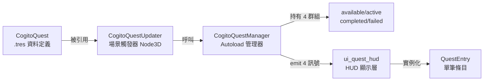
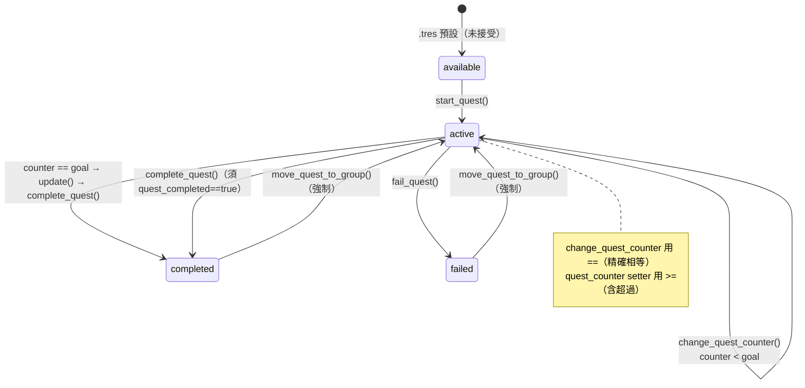

# 教學：任務系統完整工作流程（Quest Creation Workflow）

本教學說明從建立 `CogitoQuest` 資源到在遊戲中接受、推進、完成任務的完整流程，涵蓋 `CogitoQuest`、`CogitoQuestManager`、`CogitoQuestUpdater`、`ui_quest_hud.gd`，以及與 Dialogic 的整合。所有機制描述均對照 `addons/cogito/QuestSystem/` 原始碼，並標註真實行號。

> 來源真相：`/home/lorkhan/code/Cogito-1.1.5/addons/cogito/QuestSystem/`。本文行號以該版本為準。

## 前置知識
- 已閱讀 [Level 5F: 對話整合](../architecture/level5f_dialogue.md)。
- 已取消注解 `DialogicInteraction.gd`（見 [教學：對話介面調整](./ui_modification_dialogue.md)）。此檔預設整段被注解，需手動取消（見其檔頭安裝說明 `Components/Interactions/DialogicInteraction.gd:1-7`）。

---

## 〇、五個核心角色（先建立心智模型）



| 角色 | 檔案 | 繼承 | 職責 |
|---|---|---|---|
| `CogitoQuest` | `CustomResources/cogito_quest.gd` | `Resource` | 任務資料 + 自身狀態方法 |
| `CogitoQuestGroup` | `CustomResources/cogito_quest_group.gd` | `Node` | 任務陣列容器（四個子類） |
| `CogitoQuestManager` | `cogito_quest_manager.gd` | `Node`（Autoload） | 群組搬移 + 訊號 + 反射 API |
| `CogitoQuestUpdater` | `Components/cogito_quest_updater.gd` | `Node3D` | 無代碼場景觸發橋接 |
| `ui_quest_hud` | `Components/ui_quest_hud.gd` | `Node` | 訂閱訊號 + 全量重建列表 |
| `QuestEntry` | `Components/quest_entry.gd` | `Control` | 單筆任務的三個 Label |

---

## 一、建立 CogitoQuest 資源

`CogitoQuest` 是一個 Godot `Resource`（`cogito_quest.gd:3-4`），在 Editor 中建立：

1. `FileSystem → 右鍵 → New Resource → CogitoQuest`
2. 命名：`quest_kill_bandits.tres`

**Inspector 欄位說明**（逐欄對照 `cogito_quest.gd`）：

| 欄位 | 原始碼位置 | 說明 |
|---|---|---|
| `quest_name` | `cogito_quest.gd:10` | 程式邏輯用識別名（全小寫、無空格）；存讀檔以此為鍵 |
| `quest_title` | `cogito_quest.gd:13` | 顯示在 QuestHUD 的標題（會被 `tr()` 當本地化鍵） |
| `quest_description_active` | `cogito_quest.gd:16` | 進行中描述（`@export_multiline`） |
| `quest_description_completed` | `cogito_quest.gd:19` | 完成描述，預設 `"You completed this quest."` |
| `quest_description_failed` | `cogito_quest.gd:22` | 失敗描述，預設 `"You failed this quest."` |
| `quest_description` | `cogito_quest.gd:37` | **當前動態描述**，由 `start/complete/failed` 切換時改寫，HUD 讀的是這欄 |
| `quest_counter_current` | `cogito_quest.gd:40` | 當前進度，預設 `0` |
| `quest_counter_goal` | `cogito_quest.gd:43` | 完成門檻 |
| `quest_completed` | `cogito_quest.gd:46` | 完成旗標 |
| `quest_failed` | `cogito_quest.gd:49` | 失敗旗標 |
| `audio_on_start/complete/fail` | `cogito_quest.gd:28,31,34` | 各狀態音效，在 `@export_group("Quest Audio")` 群組下 |

> 注意：`quest_description_active`（`cogito_quest.gd:16`）**沒有預設值**，未填時 HUD 會顯示空字串；completed/failed 有預設英文值。

**兩種任務類型**：
- **計數型**：`quest_counter_goal > 0`，每次 `change_quest_counter(quest, 1)` 累加，達標自動完成。
- **直接完成型**：`quest_counter_goal = 0`（預設），由 `CogitoQuestManager.complete_quest(quest)` 直接完成。

### 1.1 quest_counter 的響應式 setter（關鍵機制）

`quest_counter` 是計算屬性，而非儲存欄位（`cogito_quest.gd:53-61`）：

```gdscript
var quest_counter: int:
	get:
		return quest_counter_current
	set(value):
		quest_counter_current = value
		# Check if goal has been reached or exceeded
		if quest_counter_current >= quest_counter_goal and !quest_completed:
			complete()
```

重點：
- **透過 `quest.quest_counter = N` 賦值**會自動檢查 `>= goal`（含超過）並呼叫 `complete()`。
- **直接寫 `quest.quest_counter_current = N`** 則**不會**觸發自動完成（只改底層欄位）。
- 這個 `>=` 與 `CogitoQuestManager.change_quest_counter()` 用的 `==`（`cogito_quest_manager.gd:101`）**判斷不一致**，見第三節陷阱。

### 1.2 四個自身狀態方法

`CogitoQuest` 自帶四個方法，**只改自己的欄位、不搬群組**（搬群組是 Manager 的事）：

```gdscript
# cogito_quest.gd:65-75
func start(_mute: bool = false) -> void:
	if audio_on_start and not _mute:
		Audio.play_sound(audio_on_start)
	quest_description = quest_description_active   # 切到進行中描述
	quest_completed = false
	quest_failed = false

# cogito_quest.gd:78-82  ⚠ 占位實作
func update() -> void:
	quest_completed = true   # 只設旗標，沒有其他邏輯
	pass  # Pending implementation

# cogito_quest.gd:86-99
func complete(_mute: bool = false) -> void:
	if audio_on_complete and not _mute:
		Audio.play_sound(audio_on_complete)
	quest_description = quest_description_completed
	quest_counter_current = quest_counter_goal     # 強制把計數補到目標值
	quest_completed = true
	quest_failed = false

# cogito_quest.gd:103-113
func failed(_mute: bool = false) -> void:
	if audio_on_fail and not _mute:
		Audio.play_sound(audio_on_fail)
	quest_description = quest_description_failed
	quest_failed = true
	quest_completed = false
```

`_mute` 參數在存讀檔重建任務時會傳 `true`，避免讀檔瞬間播一串音效（見第六節 `cogito_scene_manager.gd:131,144,149`）。

---

## 二、場景中的 CogitoQuestUpdater

`CogitoQuestUpdater`（`cogito_quest_updater.gd:1-2`，`extends Node3D`）是掛在場景物件上的觸發器，**設計者不需寫腳本**，只在 Inspector 設定即可。

### Inspector 欄位（`cogito_quest_updater.gd:4-8`）

```gdscript
@export var quest_to_update : CogitoQuest        # 拖入目標 .tres
enum UpdateType {Start, Complete, Fail, ChangeCounter}
@export var update_type: UpdateType               # 四選一
@export var counter_change: int = 0               # ChangeCounter 增量，可為負
```

### 用法一：玩家進入區域觸發（Area3D）

節點結構：
- `Area3D`
  - `CollisionShape3D`
  - `CogitoQuestUpdater`（設定 `quest_to_update` / `update_type=ChangeCounter` / `counter_change=1`）

在 Editor 把 `Area3D` 的 `body_entered` 信號連到 `CogitoQuestUpdater._on_body_entered`。該方法已內建（`cogito_quest_updater.gd:34-36`）：

```gdscript
func _on_body_entered(body: Node3D) -> void:
	if body.is_in_group("Player"):
		update_quest()
```

### 用法二：撿取物品觸發

`CogitoQuestUpdater` 也內建撿取回呼（`cogito_quest_updater.gd:39-40`）：

```gdscript
func _on_pickup_component_was_interacted_with(_interaction_text, _input_map_action) -> void:
	update_quest()
```

把 `PickupComponent` 的 `was_interacted_with` 信號（定義於 `InteractionComponent.gd:6`，由 `PickupComponent.gd:27,47` emit）連到此回呼即可。

### update_quest() 的四種分派（`cogito_quest_updater.gd:14-31`）

```gdscript
func update_quest():
	CogitoGlobals.debug_log(true, "cogito_quest_updater.gd", "Attempting to update quest " + quest_to_update.quest_name)
	match update_type:
		UpdateType.Start:
			CogitoQuestManager.start_quest(quest_to_update)
		UpdateType.Complete:
			quest_to_update.update()                      # 先把 quest_completed 設 true
			CogitoQuestManager.complete_quest(quest_to_update)
		UpdateType.Fail:
			CogitoQuestManager.fail_quest(quest_to_update)
		UpdateType.ChangeCounter:
			if has_been_triggered:                        # 防重複（cogito_quest_updater.gd:26）
				return
			if !CogitoQuestManager.is_quest_active(quest_to_update):
				CogitoQuestManager.start_quest(quest_to_update)   # 沒接過先自動接
			CogitoQuestManager.change_quest_counter(quest_to_update, counter_change)
			has_been_triggered = true
```

重點：
- **`ChangeCounter` 的自動啟動**：若任務還沒接，會先 `start_quest()` 再加計數，省去另外擺一個 `Start` 觸發器。
- **`has_been_triggered`**（`cogito_quest_updater.gd:10`）只擋 `ChangeCounter`，`Start/Complete/Fail` 不受此旗標保護，理論上可被重複觸發（但群組防衛檢查會擋下重複，見第三節）。

### 用法三：NPC 死亡觸發（需自行接線）

`CogitoQuestUpdater` 本身沒有「NPC 死亡」回呼，須由你的 NPC 腳本主動呼叫。最簡單是把一個 `CogitoQuestUpdater` 掛在 NPC 上、設成 `ChangeCounter`，死亡時找到它並呼叫 `update_quest()`：

```gdscript
# 在 NPC 死亡狀態的 enter() 中（節點名自訂）
var updater := find_child("BanditQuestUpdater", true, false)
if updater:
	updater.update_quest()
```

或不用 Updater、直接持有資源引用呼叫 Manager（注意 `change_quest_counter` 要求任務已在 active，否則直接 return，見 `cogito_quest_manager.gd:94-95`）：

```gdscript
@export var quest_on_death: CogitoQuest
func _on_npc_died() -> void:
	if quest_on_death and CogitoQuestManager.is_quest_active(quest_on_death):
		CogitoQuestManager.change_quest_counter(quest_on_death, 1)
```

> `is_quest_active()` 確實存在（`cogito_quest_manager.gd:134-137`）。

### 持久化（`cogito_quest_updater.gd:43-58`）

```gdscript
func set_state():
	pass     # 空實作：屬性還原由場景狀態載入流程反射處理
func save():
	return {
		"node_path": self.get_path(),
		"has_been_triggered": has_been_triggered,
		"pos_x/y/z": ..., "rot_x/y/z": ...
	}
```

把此節點加入 `"save_object_state"` 群組後，`has_been_triggered` 會隨場景存讀，玩家離場再回來不會重複加計數。

---

## 三、CogitoQuestManager API 速查

`cogito_quest_manager.gd` 是 Autoload（`extends Node`），持有四個群組（`cogito_quest_manager.gd:18-21`）並在 `_init()`（`:25-30`）把它們 `add_child`。

```gdscript
# 開始任務（傳 CogitoQuest 資源，不是字串！）— cogito_quest_manager.gd:34
CogitoQuestManager.start_quest(quest: CogitoQuest) -> CogitoQuest

# 完成任務（必須先在 active，且 quest_completed==true）— :60
CogitoQuestManager.complete_quest(quest: CogitoQuest) -> CogitoQuest

# 失敗任務（必須先在 active）— :78
CogitoQuestManager.fail_quest(quest: CogitoQuest) -> CogitoQuest

# 計數型進度（達標自動 complete）— :93
CogitoQuestManager.change_quest_counter(quest, value_change:int) -> CogitoQuest

# 反射式操作（以 quest_id 索引）— :159 / :175
CogitoQuestManager.call_quest_method(quest_id:int, method:String, args:Array)
CogitoQuestManager.set_quest_property(quest_id:int, property:String, value)

# 查詢 — :110-156
get_available_quests() / get_active_quests() / get_completed_quests() / get_failed_quests()
is_quest_available(quest)   # :127
is_quest_active(quest)      # :134
is_quest_completed(quest)   # :141
is_quest_in_group(quest, group_name)  # :148

# 強制搬群組（繞過正常流程）— :205
move_quest_to_group(quest, old_group, new_group)
# 清空群組 — :220
reset_group(group_name)

# 訊號（Autoload 上）— :3-6
quest_activated / quest_updated / quest_completed / quest_failed
```

> 上一版教學寫的 `quest_updated` 訊號名稱正確；但請注意四個訊號各自參數都是 `(quest: CogitoQuest)`。

### 3.1 start_quest 的防衛檢查（`cogito_quest_manager.gd:34-56`）

```gdscript
func start_quest(quest: CogitoQuest) -> CogitoQuest:
	assert(quest != null)
	if active.is_quest_inside(quest):    return quest   # 已在進行中 → 直接返回
	if completed.is_quest_inside(quest): return quest   # 已完成 → 直接返回
	if failed.is_quest_inside(quest):    return quest   # 已失敗 → 直接返回
	available.remove_quest(quest)
	active.add_quest(quest)
	quest_activated.emit(quest)
	quest.start()
	Audio.play_sound(COGITO_QUEST_START).volume_db = quest_audio_volume_db
	return quest
```

因此重複呼叫 `start_quest()` 是安全的（會被前三個 guard 擋下）。

### 3.2 complete_quest 的雙重門檻（`cogito_quest_manager.gd:60-74`）

```gdscript
func complete_quest(quest: CogitoQuest) -> CogitoQuest:
	if not active.is_quest_inside(quest): return quest   # 必須在 active
	if quest.quest_completed == false:    return quest   # 必須已標記完成
	quest.complete()
	active.remove_quest(quest)
	completed.add_quest(quest)
	quest_completed.emit(quest)
	Audio.play_sound(COGITO_QUEST_COMPLETE).volume_db = quest_audio_volume_db
	return quest
```

**關鍵連鎖**：`complete_quest()` 需要 `quest_completed == true` 才動作。這個旗標通常由前一步設好——
- 計數達標時 `change_quest_counter` 先呼叫 `quest.update()`（把旗標設 true），再呼叫 `complete_quest`；或
- `CogitoQuestUpdater` 的 `Complete` 類型先呼叫 `quest_to_update.update()` 再 `complete_quest`（`cogito_quest_updater.gd:20-21`）。

若你直接呼叫 `complete_quest()` 而沒先讓 `quest_completed=true`，**會靜默 return、什麼都不做**。

### 3.3 change_quest_counter 的 == 判斷（`cogito_quest_manager.gd:93-106`）

```gdscript
func change_quest_counter(quest: CogitoQuest, value_change:int) -> CogitoQuest:
	if not active.is_quest_inside(quest): return quest
	quest.quest_counter_current += value_change      # 直接改 _current，不走 setter
	quest_updated.emit(quest)
	if quest.quest_counter_current == quest.quest_counter_goal:   # ⚠ 精確相等
		quest.update()
		complete_quest(quest)
	return quest
```

注意此處改的是 `quest_counter_current`（底層欄位），**沒走 1.1 的 setter**，所以完成判斷靠這裡的 `==`，而非 setter 的 `>=`。差異見下方陷阱。

### 3.4 反射 API 與 id 的現況

`call_quest_method`（`:159`）/ `set_quest_property`（`:175`）都靠 `group.get_quest_from_id(id)` 找任務（`cogito_quest_group.gd:27-31`，內部讀 `quest.id`）。但 `CogitoQuest.id` 目前**整行被注解**（`cogito_quest.gd:6-7`：`#@export var id: int`）。因此：

- `get_quest_from_id()` 會在存取 `quest.id` 時報錯（屬性不存在），這兩個反射 API 與 `get_ids_from_quests()`（`cogito_quest_group.gd:34-38`）目前**不可用**。
- 想用 Dialogic 以 id 呼叫任務，必須先取消注解 `cogito_quest.gd:6-7` 並給每個 `.tres` 設定唯一 `id`。否則改用第四節的 `quest_name` 字串橋接方案。

---

## 四、Dialogic 整合：NPC 對話接任務

> 前提：已取消注解 `DialogicInteraction.gd`（`Components/Interactions/DialogicInteraction.gd`，整檔預設注解）。

由於 `CogitoQuest.id` 被注解（見 3.4），最穩妥的橋接是自建一個以 **quest_name 字串** 索引的 Autoload，避開反射 API：

```gdscript
# res://scripts/quest_bridge.gd  (Autoload: QuestBridge)
extends Node

@export var kill_bandits: CogitoQuest
@export var find_herb: CogitoQuest

func start_quest(quest_name: String) -> void:
	var quest = get(quest_name)
	if quest:
		CogitoQuestManager.start_quest(quest)

func get_quest_status(quest_name: String) -> String:
	var quest = get(quest_name)
	if not quest: return "unknown"
	if CogitoQuestManager.is_quest_completed(quest): return "completed"   # :141
	if CogitoQuestManager.is_quest_active(quest):    return "active"      # :134
	return "available"
```

### Dialogic Timeline：接任務（`guard_quest.dtl`）

```
Guard: 冒險者！我們村子附近有盜賊作亂。你願意幫忙嗎？
- 我願意
	[call node="QuestBridge" method="start_quest" args=["kill_bandits"]]
	Guard: 太好了！前往東邊廢墟，消滅 3 名盜賊。
- 抱歉，我很忙
	Guard: ...好吧。
```

### Dialogic Timeline：回報並發獎勵（`guard_report.dtl`）

`increase_currency` 確實存在於玩家腳本（`cogito_player.gd:306`，簽名 `increase_currency(currency_name: String, value: float) -> bool`），透過 `CogitoSceneManager._current_player_node` 取得玩家：

```
[if {QuestBridge.get_quest_status("kill_bandits")} == "completed"]
	Guard: 你真的做到了！感謝你保護村子。
	[call node="CogitoSceneManager._current_player_node" method="increase_currency" args=["gold", 100]]
[else]
	Guard: 盜賊還沒清乾淨，繼續加油！
[/if]
```

---

## 五、ui_quest_hud 的顯示機制

`ui_quest_hud.gd`（`extends Node`）在 `_ready()` 連接全部訊號（`ui_quest_hud.gd:18-29`）：

```gdscript
func _ready():
	CogitoQuestManager.quest_activated.connect(_on_quest_activated)
	CogitoQuestManager.quest_completed.connect(_on_quest_completed)
	CogitoQuestManager.quest_failed.connect(_on_quest_failed)
	CogitoQuestManager.quest_updated.connect(_on_quest_updated)
	player_hud.show_inventory.connect(_show_quest_display)
	player_hud.hide_inventory.connect(_hide_quest_display)
	quest_display.hide()
```

`player_hud` 型別是 `CogitoPlayerHudManager`（`ui_quest_hud.gd:16`），其 `show_inventory` / `hide_inventory` 訊號定義於 `Scripts/player_hud_manager.gd:4-5`。

### 5.1 兩條獨立路徑：通知 vs 列表

- **即時通知（Hint Prompt）**：四個 `_on_quest_*` 回呼（`ui_quest_hud.gd:81-91`）在 `send_quest_notifications` 開啟時，呼叫 `player_hud._on_set_hint_prompt`（`player_hud_manager.gd:329`）顯示一行字。文字全走 `tr()` 本地化鍵（`QUEST_start` / `QUEST_complete` / `QUEST_fail` / `QUEST_update`）。
- **完整列表**：只有玩家**開啟物品欄**（`show_inventory` 訊號）才呼叫 `_show_quest_display()`（`ui_quest_hud.gd:32-36`）重建列表。任務狀態改變的當下**不會**即時刷新列表，下次開物品欄才看得到。

### 5.2 全量重建（無增量更新）

`update_active_quests()`（`ui_quest_hud.gd:42-50`）：

```gdscript
func update_active_quests():
	for node in active_group.get_children():
		node.queue_free()                       # 清掉舊條目
	for quest in CogitoQuestManager.get_active_quests():
		var instanced_quest_entry = quest_entry.instantiate()
		active_group.add_child(instanced_quest_entry)
		instanced_quest_entry.set_quest_info(
			quest.quest_title,
			quest.quest_description,
			str(quest.quest_counter_current) + "/" + str(quest.quest_counter_goal))
```

`completed`（`:53-61`）/ `failed`（`:64-72`）三段邏輯完全相同，只差讀哪個群組。節點掛載點：`active_group`/`completed_group`/`failed_group`（`ui_quest_hud.gd:11-13`），分別對應 `QuestDisplay/VBoxContainer/TabContainer/` 下的 `QUESTS_active`/`QUESTS_completed`/`QUESTS_failed`。

### 5.3 單筆條目 QuestEntry（`quest_entry.gd:8-15`）

```gdscript
func set_quest_info(_passed_quest_name, _passed_quest_description, _passed_quest_counter):
	quest_name_label.text = _passed_quest_name
	quest_description_label.text = _passed_quest_description
	if _passed_quest_counter == "0/0":
		quest_counter_label.text = ""           # 非計數型任務隱藏進度
	else:
		quest_counter_label.text = _passed_quest_counter
```

三個 Label 掛在 `$VBoxContainer/QuestName`、`/QuestDescription`、`/QuestCounter`（`quest_entry.gd:4-6`）。要自訂外觀就改 `quest_entry`（`ui_quest_hud.gd:6` 的 `@export var quest_entry: PackedScene`）指向的場景。

---

## 六、任務存讀檔

任務狀態由 `CogitoSceneManager` 處理，檔案在 **`SceneManagement/cogito_scene_manager.gd`**（注意不在 `CogitoObjects/`）。

### 存檔（`cogito_scene_manager.gd:224-240`）

```gdscript
_player_state.player_active_quests.clear()
for quest in CogitoQuestManager.active.quests:
	_player_state.player_active_quests.append(quest)
# completed / failed 同樣搬進對應陣列（:229-235）
_player_state.player_active_quest_progression.clear()
for quest in CogitoQuestManager.active.quests:
	_player_state.add_to_active_quest_dictionary(quest.quest_name, quest.quest_counter_current)
```

存的是 `CogitoQuest` 資源本身 + 一份 `{quest_name: counter}` 進度字典（`add_to_active_quest_dictionary` 定義於 `cogito_player_state.gd:156-158`，欄位宣告 `cogito_player_state.gd:37-40`）。

### 讀檔（`cogito_scene_manager.gd:128-150`）

```gdscript
CogitoQuestManager.active.clear_group()
for quest in _player_state.player_active_quests:
	quest.start(true)                              # mute 重新初始化
	CogitoQuestManager.active.add_quest(quest)
var _temp = _player_state.player_active_quest_progression
for entry in _temp:
	for quest in CogitoQuestManager.active.quests:
		if quest.quest_name == entry:
			quest.quest_counter = _temp[entry]     # ⚠ 走 setter（見陷阱）
# completed: quest.complete(true) ; failed: quest.failed(true)（:142-150）
```

讀檔還原進度時用的是 `quest.quest_counter = ...`（`cogito_scene_manager.gd:138`），**會觸發 1.1 的 setter**；若存檔當下進度已 `>= goal`，讀檔瞬間就會再跑一次 `complete()`（但因 mute 不播音效）。一般情況下達標的任務早已搬到 completed 群組，不在 active 進度字典裡，因此通常安全；但若靠 `complete_quest` 的 guard 被擋而未真正搬群組，重載時行為要留意。

**注意**：`CogitoQuest` 必須是**存到磁碟的 .tres**（有 `resource_path`）才能被正確序列化；純 `CogitoQuest.new()` 的記憶體實例無法跨存檔還原。

---

## 七、從零建立一個完整任務（端到端）

以「殺 3 名盜賊」為例，完整步驟：

1. **建資源**：`FileSystem` 右鍵 → New Resource → `CogitoQuest`，存成 `quest_kill_bandits.tres`。
2. **填欄位**：`quest_name="kill_bandits"`、`quest_title="清除盜賊"`、`quest_description_active="消滅 3 名盜賊"`、`quest_counter_goal=3`（其餘描述/音效選填）。
3. **接任務觸發器**：在村口放一個 `Area3D`，子節點掛 `CogitoQuestUpdater`，設 `quest_to_update=quest_kill_bandits.tres`、`update_type=Start`。把 `Area3D.body_entered` 連到 `CogitoQuestUpdater._on_body_entered`。
4. **計數觸發器**：在每個盜賊 NPC 上掛一個 `CogitoQuestUpdater`，設 `update_type=ChangeCounter`、`counter_change=1`，並在 NPC 死亡邏輯呼叫該 updater 的 `update_quest()`（見用法三）。因 `ChangeCounter` 會自動 start，步驟 3 可省，但保留 Start 觸發器語意更清楚。
5. **掛 HUD**：確認場景中有 `ui_quest_hud` 節點，其 `player_hud` 指到玩家的 `CogitoPlayerHudManager`，`quest_entry` 指到條目場景，`send_quest_notifications` 勾選。（COGITO 範例場景的 `Player`/HUD 已內建此結構。）
6. **存讀檔（選用）**：把計數型 `CogitoQuestUpdater` 加入 `"save_object_state"` 群組，避免重整場景後重複計數。
7. **驗證**：見第九節清單。

> Autoload 檢查：`CogitoQuestManager` 必須已註冊為 Autoload，否則 `CogitoQuestManager.xxx` 會是 null。COGITO 的 `plugin.cfg` 已自動註冊；自建專案要確認 Project Settings → Autoload 有它。

---

## 八、任務狀態流轉圖



---

## 九、常見陷阱（均經原始碼確認）

| # | 陷阱 | 原始碼依據 | 後果與對策 |
|---|---|---|---|
| 1 | `quest.update()` 是占位實作，只設 `quest_completed=true` | `cogito_quest.gd:78-82` | `Complete` 類型仰賴它先設旗標再讓 `complete_quest` 通過 guard；它沒有其他副作用，別期待它做進度結算 |
| 2 | `== goal` vs `>= goal` 不一致 | `change_quest_counter` 用 `==`（`cogito_quest_manager.gd:101`）；`quest_counter` setter 用 `>=`（`cogito_quest.gd:60`） | 若 `counter_change` 一次跨過目標（goal=5、current=3、+3 → 6），`==5` 不成立、任務不完成。對策：用 `+1` 增量，或改走 `quest.quest_counter = N`（setter `>=` 會完成，但它走的是另一條路、不發 `quest_updated`） |
| 3 | `complete_quest` 需 `quest_completed==true` 才動作 | `cogito_quest_manager.gd:64-65` | 直接呼叫 `complete_quest()` 而沒先 `update()`/達標，會靜默 return；`CogitoQuestUpdater` 的 `Complete` 已先呼叫 `update()`（`cogito_quest_updater.gd:20`），手動呼叫時要自己補 |
| 4 | `has_been_triggered` 無法重置 | `cogito_quest_updater.gd:10,26,31`；`save()` 會持久化（`:49`） | 一個 `ChangeCounter` updater 一輩子只觸發一次；需要多次計數請放多個 updater，或自寫腳本繞過此旗標 |
| 5 | `CogitoQuest.id` 被注解 | `cogito_quest.gd:6-7` | `get_quest_from_id`/`call_quest_method`/`set_quest_property`/`get_ids_from_quests` 全部不可用；要用就先取消注解並設 id，否則改用 quest_name 字串橋接 |
| 6 | HUD 列表不即時刷新 | `_show_quest_display` 只在 `show_inventory` 觸發（`ui_quest_hud.gd:26,32`） | 狀態變更只有 Hint 通知會即時出現，完整列表要等玩家開物品欄才重建 |
| 7 | `change_quest_counter` 改的是 `_current` 不走 setter | `cogito_quest_manager.gd:97` | 與 1.1 setter 是兩條獨立完成路徑，別混用導致重複 `complete()` |
| 8 | 計數任務的 `quest_description` 顯示的是動態欄位 | HUD 讀 `quest.quest_description`（`ui_quest_hud.gd:50`），該值由 `start/complete/failed` 改寫（`cogito_quest.gd:71,92,109`） | 別在 Inspector 期待改 `quest_description` 生效；要改進行中文案請改 `quest_description_active` |
| 9 | `reset_group` 對非空字串走 `group.reset()` | `cogito_quest_manager.gd:223` 呼叫 `group.reset()`，但 `CogitoQuestGroup` 只有 `clear_group()`（`:41`） | 傳空字串時走 `group.reset()`（不存在 → 報錯）；傳具體群組名才走 `clear_group()`（`:227`）。此 API 目前以空字串呼叫會出錯，少用 |

---

## 十、驗證清單

| 測試步驟 | 預期結果 | 觀測點 |
|---|---|---|
| 玩家進入 `Start` 觸發區（或對話接任務） | Console 印 `Quest kill_bandits has been started.` | `cogito_quest_manager.gd:55` |
| 開啟物品欄 | 「進行中」分頁出現此任務、計數 `0/3` | `ui_quest_hud.gd:42-50` |
| 殺死 1 名盜賊 | 出現 `QUEST_update` 通知；下次開物品欄計數 `1/3` | `ui_quest_hud.gd:90`、`cogito_quest_manager.gd:98` |
| 殺死第 3 名盜賊 | 任務自動完成、移到「已完成」分頁 | `==goal` 觸發 `complete_quest`（`:101-104`） |
| 回報任務領獎 | 金幣增加 | `cogito_player.gd:306 increase_currency` |
| 存檔再讀檔 | active/completed 狀態與計數保留 | `cogito_scene_manager.gd:128-150,224-240` |
| 場景重整後重入已觸發的計數區 | 不再重複加計數 | `has_been_triggered` 隨 `save()` 持久化（`cogito_quest_updater.gd:49`） |
