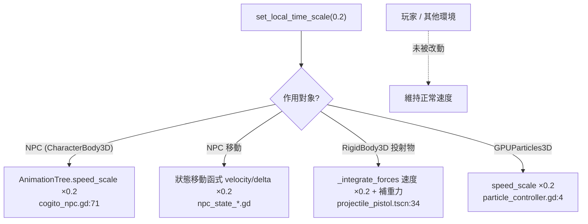
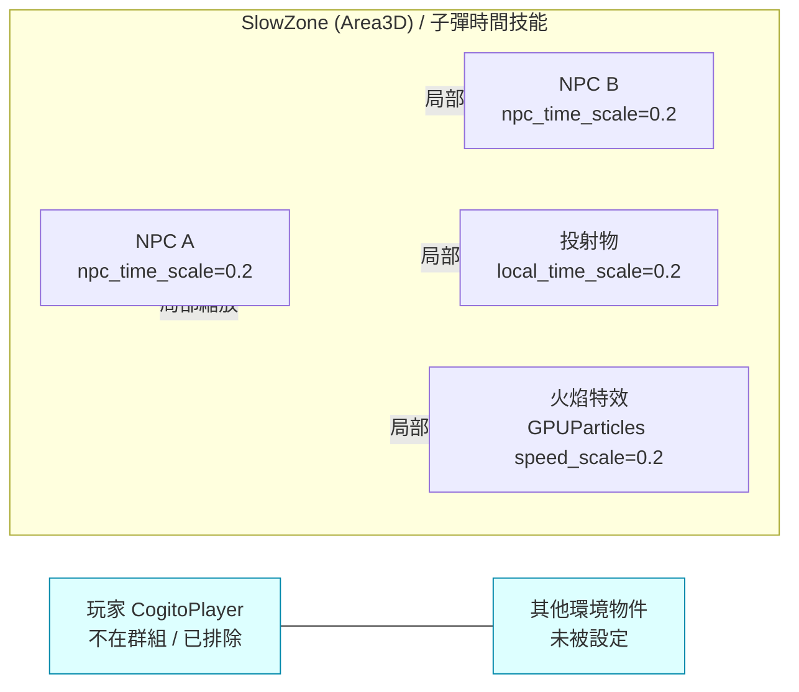

# 教學：如何實現局部時間緩速 (Selective Time Dilation)

本教學實作「局部時間縮放」——讓特定 NPC、物理物件或特效變慢，而玩家與其他環境保持正常速度。

> **重要定位（衍生實作型教學）**：Cogito 1.1.5 **沒有**內建任何局部時間縮放機制（`local_time_scale`、`TimeSlowComponent` 皆為本教學新增的自訂代碼）。本教學的價值在於：先指出 Cogito 既有、可以「接管」的真實接點（附真實行號），再說明要新增哪些自訂代碼把它們串起來。
>
> 全文以下列標記區分來源：
> - 🟦 **Cogito 既有**：附 `path/file.gd:line` 真實行號，原始碼確實存在。
> - 🟩 **教學新增**：本教學要你自己寫進專案的自訂代碼，Cogito 中不存在。

## 前置知識
- 已閱讀 [Level 3B: NPC 狀態機行為](../architecture/level3_npc_states.md)。
- 引擎：Godot **4.6**（`project.godot:19` → `config/features=PackedStringArray("4.6", "Forward Plus")`）。

---

## 一、先盤點 Cogito 既有可接點（真實行號）

在寫任何自訂代碼前，先確認「時間是怎麼在 Cogito 裡流動的」。局部緩速的本質就是：**找到每個用 `delta` 或速度推進的地方，乘上一個係數**。下表為 NPC / 物理物件的真實驅動點：

| 系統 | 驅動方式 | 真實位置（🟦 Cogito 既有） | 縮放介入點 |
|---|---|---|---|
| NPC 動畫 | `AnimationTree`（`@onready`）混合 blend space | `cogito_npc.gd:71`、`cogito_npc.gd:117` `update_animations()` | `AnimationTree.speed_scale` |
| NPC 移動（漫遊） | 各狀態自己的 `_physics_process` | `npc_state_move_to_random_pos.gd:23`、移動實作 `:65-83` | 速度乘係數 / `delta` 乘係數 |
| NPC 移動（追擊） | 同上 | `npc_state_chase.gd:53`、移動實作 `:116-134` | 同上 |
| 投射物 | `RigidBody3D`，由 PhysicsServer 驅動 | `projectile_pistol.tscn:34`（root `type="RigidBody3D"`）+ `cogito_projectile.gd` | `_integrate_forces` 縮放 |
| 可拾取物 | `RigidBody3D` | `cogito_pickup.gd:1`（`extends RigidBody3D`） | 同上 |
| 粒子特效 | `GPUParticles3D` | `particle_controller.gd:4`（`@export var particles : Array[GPUParticles3D]`） | `GPUParticles3D.speed_scale` |

### 1.1 關鍵釐清：NPC 沒有 AnimationPlayer，只有 AnimationTree

很多時間縮放教學會同時設 `AnimationPlayer.speed_scale` 與 `AnimationTree.speed_scale`。但 Cogito 的 NPC 場景**只掛 `AnimationTree`**：

- 🟦 `cogito_npc.gd:71`：`@onready var animation_tree: AnimationTree = $AnimationTree`
- 🟦 `cogito_npc.gd` 中**沒有** `AnimationPlayer` 的 `@onready`（Grep 確認）。`AnimationPlayer` 只存在於 wieldable（如 `wieldable_throwable.gd:22` 的 `animation_player.play(...)`），那是「玩家手持物」不是 NPC。

因此對 NPC 做動畫緩速，正確做法是設 `AnimationTree.speed_scale`。`speed_scale` 是 `AnimationMixer`（`AnimationTree` 的父類）的內建屬性，整棵動畫樹的時間都會被縮放，無需在 blend tree 內額外加節點。

> **避坑**：本教學**不**使用 `animation_tree.set("parameters/TimeScale/scale", ...)`。Grep `cogito_npc_animation_blend_tree.tres` 確認其節點只有 `Animation / Movement / Transition / UpperBodyBlend / UpperBodyState`（`:124-133`），**沒有 `AnimationNodeTimeScale` 節點**，那種寫法會找不到參數路徑而無效。

### 1.2 關鍵釐清：NPC 移動不在 cogito_npc.gd，而在各狀態

🟦 `cogito_npc.gd:103` 的 `_physics_process(delta)` **只處理 knockback 與腳步聲**，連 `move_and_slide()` 都被註解掉（`cogito_npc.gd:114`）。真正的位移發生在各狀態腳本：

- 🟦 `npc_state_move_to_random_pos.gd:23` `_physics_process(_delta)` → 先呼叫 `Host.update_animations(_delta)`（`:24`）→ 再依 `current_travel_status` 呼叫 `move_host_to_next_position(_delta)`（實作在 `:65-83`）。
- 🟦 `npc_state_chase.gd:53` `_physics_process(_delta)` 同樣先 `Host.update_animations(_delta)`（`:54`），追擊位移在 `move_host_to_next_position(_delta)`（`:116-134`）。

所以「NPC 緩速」要改的是**這兩個狀態的移動函式**，不是 `cogito_npc.gd`。

---

## 二、核心概念：為何不用 Engine.time_scale

`Engine.time_scale` 是全域的，影響**所有**物件（含玩家），適合整體暫停或「所有東西都慢下來」的子彈時間。局部緩速需要對「個別物件」乘係數：

| 物件類型 | 全域做法（不要） | 局部做法（本教學） |
|---|---|---|
| NPC 動畫 | `Engine.time_scale` | 🟩 `AnimationTree.speed_scale = scale` |
| NPC 移動 | — | 🟩 移動函式內速度乘 `scale`、`delta` 乘 `scale` |
| RigidBody3D | — | 🟩 `_integrate_forces` 內縮放速度 + 補償重力 |
| 粒子 | — | 🟩 `GPUParticles3D.speed_scale = scale` |



---

## 三、TimeSlowComponent 組件實作（🟩 教學新增）

> ⚠️ **此整個組件 Cogito 不存在**，是本教學新增。建立可掛載到任何節點的通用組件，自動把縮放套到「該節點子樹下的動畫與粒子」。它**不**處理移動與剛體（那兩者要分別在第四、五節接管）。

```gdscript
# 🟩 新增檔案：addons/cogito/Components/TimeSlowComponent.gd
extends Node
class_name TimeSlowComponent

## 1.0 = 正常速度，0.1 = 十分之一速度，0.0 = 完全停止
@export var local_time_scale : float = 1.0:
    set(value):
        local_time_scale = clampf(value, 0.0, 10.0)
        _apply_to_visuals()

var _parent : Node


func _ready() -> void:
    _parent = get_parent()
    _apply_to_visuals()


func _apply_to_visuals() -> void:
    if not _parent:
        return

    # AnimationTree（Cogito NPC 用這個，對應 cogito_npc.gd:71 的 $AnimationTree）
    # speed_scale 是 AnimationMixer 內建屬性，縮放整棵樹的時間。
    var anim_tree = _parent.find_child("AnimationTree", true, false)
    if anim_tree is AnimationTree:
        anim_tree.speed_scale = local_time_scale

    # AnimationPlayer（NPC 本身沒有；保留給有 AnimationPlayer 的自訂物件）
    var anim_player = _parent.find_child("AnimationPlayer", true, false)
    if anim_player is AnimationPlayer:
        anim_player.speed_scale = local_time_scale

    # 粒子（對應 particle_controller.gd:4 的 GPUParticles3D 陣列）
    for p in _parent.find_children("*", "GPUParticles3D", true, false):
        p.speed_scale = local_time_scale
    for p in _parent.find_children("*", "CPUParticles3D", true, false):
        p.speed_scale = local_time_scale
```

> **為何 `find_child` 用字串而非型別**：`AnimationTree` 在 Cogito NPC 場景的節點名就叫 `AnimationTree`（`cogito_npc.gd:71` 的 `$AnimationTree`），用名稱找最直接；粒子數量不定故用型別批次找。

---

## 四、NPC 移動的時間縮放（接管 🟦 既有狀態函式）

NPC 的位移是各狀態的 `move_host_to_next_position()`，本節示範如何加最小侵入的縮放。

### 4.1 在 cogito_npc.gd 加入縮放變數（🟩 新增）

🟦 `cogito_npc.gd` 目前**沒有** `local_time_scale`（Grep 確認）。在 `@export_group("Movement")`（`cogito_npc.gd:32`）附近加入：

```gdscript
# 🟩 加到 cogito_npc.gd（建議放在 :37 rotation_speed 之後）
@export var npc_time_scale : float = 1.0  ## 1.0=正常；此 NPC 專屬的時間係數
```

> **命名注意**：避免和組件的 `local_time_scale` 撞名造成混淆，這裡用 `npc_time_scale`。下面狀態腳本用 `Host.get("npc_time_scale", 1.0)` 讀取——`get(name, default)` 在屬性不存在時回傳預設值，因此即使某 NPC 沒加此變數也不會報錯。

### 4.2 修改漫遊狀態（🟦 既有 → 🟩 改動）

🟦 既有實作（**原文如下，行號真實**，`npc_state_move_to_random_pos.gd:65-83`）：

```gdscript
# 🟦 Cogito 既有：npc_state_move_to_random_pos.gd:65-83
func move_host_to_next_position(_delta: float) -> void:
    var next_position = Host.navigation_agent_3d.get_next_path_position()

    # Add the gravity.
    if not Host.is_on_floor():
        Host.velocity += Host.get_gravity() * _delta

    var direction = Host.global_position.direction_to(next_position)
    var face_direction := Vector3(Host.global_position.x + Host.velocity.x, Host.global_position.y, Host.global_position.z + Host.velocity.z)

    if direction:
        Host.face_direction(face_direction)
        Host.velocity.x = direction.x * Host.move_speed
        Host.velocity.z = direction.z * Host.move_speed
    else:
        Host.velocity.x = move_toward(Host.velocity.x, 0, Host.move_speed)
        Host.velocity.z = move_toward(Host.velocity.z, 0, Host.move_speed)

    Host.move_and_slide()
```

🟩 改動後（加一個 `ts` 係數，乘到水平速度與重力累加）：

```gdscript
# 🟩 改動後：npc_state_move_to_random_pos.gd:65-83
func move_host_to_next_position(_delta: float) -> void:
    var ts : float = Host.get("npc_time_scale", 1.0)  # 🟩 新增
    var next_position = Host.navigation_agent_3d.get_next_path_position()

    # 重力是「加速度」，乘 ts 讓下墜也變慢
    if not Host.is_on_floor():
        Host.velocity += Host.get_gravity() * _delta * ts  # 🟩 加 * ts

    var direction = Host.global_position.direction_to(next_position)
    var face_direction := Vector3(Host.global_position.x + Host.velocity.x, Host.global_position.y, Host.global_position.z + Host.velocity.z)

    if direction:
        Host.face_direction(face_direction)
        # 速度是「每秒值」，直接乘 ts，不要乘 delta（delta 由 move_and_slide 內部處理）
        Host.velocity.x = direction.x * Host.move_speed * ts  # 🟩 加 * ts
        Host.velocity.z = direction.z * Host.move_speed * ts  # 🟩 加 * ts
    else:
        Host.velocity.x = move_toward(Host.velocity.x, 0, Host.move_speed)
        Host.velocity.z = move_toward(Host.velocity.z, 0, Host.move_speed)

    Host.move_and_slide()
```

> **為什麼速度乘 ts、重力也乘 ts，但 `move_and_slide()` 不動**：`CharacterBody3D.move_and_slide()` 內部用 `velocity * delta` 位移。我們已把 `velocity` 縮小成 `×ts`，所以位移自然變慢；重力是加速度（每幀往 velocity 累加），故同樣乘 ts 讓加速也變慢。`face_direction()`（🟦 `cogito_npc.gd:134`）用 `slerp` 不吃 delta，視覺上轉身仍順，可接受。

### 4.3 修改追擊狀態（🟦 既有 → 🟩 改動）

🟦 追擊的移動函式是**獨立的另一份**（`npc_state_chase.gd:116-134`），結構與漫遊版幾乎相同。真實的速度賦值在 `npc_state_chase.gd:128-129`：

```gdscript
# 🟦 Cogito 既有：npc_state_chase.gd:128-129
        Host.velocity.x = direction.x * Host.move_speed
        Host.velocity.z = direction.z * Host.move_speed
```

🟩 同樣改法（並對 `:121` 的重力累加加 ts）：

```gdscript
# 🟩 改動後：npc_state_chase.gd:116-134（節錄）
func move_host_to_next_position(_delta: float) -> void:
    var ts : float = Host.get("npc_time_scale", 1.0)  # 🟩 新增
    var next_position = Host.navigation_agent_3d.get_next_path_position()
    if not Host.is_on_floor():
        Host.velocity += Host.get_gravity() * _delta * ts  # 🟩 加 * ts（原 :121）
    var direction = Host.global_position.direction_to(next_position)
    var face_direction := Vector3(Host.global_position.x + Host.velocity.x, Host.global_position.y, Host.global_position.z + Host.velocity.z)
    if direction:
        Host.face_direction(face_direction)
        Host.velocity.x = direction.x * Host.move_speed * ts  # 🟩 原 :128
        Host.velocity.z = direction.z * Host.move_speed * ts  # 🟩 原 :129
    else:
        Host.velocity.x = move_toward(Host.velocity.x, 0, Host.move_speed)
        Host.velocity.z = move_toward(Host.velocity.z, 0, Host.move_speed)
    Host.move_and_slide()
```

> **注意 WAITING 狀態的減速段**：🟦 `npc_state_move_to_random_pos.gd:29-30` 與 `npc_state_chase.gd:59-60` 還有一段 `move_toward(..., _delta * Host.move_speed)` 的煞停邏輯。若要完全一致的緩速感，這段的 `_delta` 也可乘 ts；但因只是停止前的收尾，影響很小，本教學略過以保持改動最小。

### 4.4 動畫一起變慢（🟩 串接）

NPC 動畫由 🟦 `update_animations()`（`cogito_npc.gd:117`）每幀更新 blend space（`:124`），但它**不控制播放速度**。播放速度交給 `AnimationTree.speed_scale`。最簡單：在設定 `npc_time_scale` 時同步設動畫樹速度。把 4.1 的變數改成 setter：

```gdscript
# 🟩 cogito_npc.gd：把純變數換成帶 setter 的版本
@export var npc_time_scale : float = 1.0:
    set(value):
        npc_time_scale = value
        if is_inside_tree() and animation_tree:   # animation_tree 來自 :71
            animation_tree.speed_scale = value
```

這樣移動與動畫會一起緩速，無需再掛 `TimeSlowComponent` 到 NPC（組件適合用在「沒有移動邏輯、純視覺」的物件）。

---

## 五、RigidBody3D 物件的時間縮放（接管 🟦 投射物 / 拾取物）

🟦 Cogito 的投射物（`projectile_pistol.tscn:34` root `type="RigidBody3D"` + `cogito_projectile.gd`）與拾取物（`cogito_pickup.gd:1` `extends RigidBody3D`）由 PhysicsServer 驅動，要靠 `_integrate_forces` 介入。

> ⚠️ `CogitoProjectile` 的父類 `CogitoObject` 其實是 `extends Node3D`（`cogito_object.gd:3`），但**投射物場景的 root 節點是 RigidBody3D**（`projectile_pistol.tscn:34`），腳本掛在該 RigidBody3D 上，所以 `self.linear_velocity`（🟦 `cogito_projectile.gd:56`）才合法。要加緩速，就在這個 RigidBody3D 的腳本（或一個掛在其上的 🟩 新腳本）加 `_integrate_forces`。

```gdscript
# 🟩 加到投射物/拾取物的 RigidBody3D 腳本（Cogito 既有腳本沒有 _integrate_forces，Grep 確認）
@export var local_time_scale : float = 1.0

func _integrate_forces(state: PhysicsDirectBodyState3D) -> void:
    if is_equal_approx(local_time_scale, 1.0):
        return  # 正常速度，不干預

    # 縮放線速度與角速度（每幀壓縮，產生「濃稠」緩速感）
    state.linear_velocity *= local_time_scale
    state.angular_velocity *= local_time_scale

    # 補償重力：引擎每幀仍會加完整重力 g*delta（未縮放），
    # 我們已把 linear_velocity 縮小，但引擎這幀又會加一次全額重力，導致下墜偏快。
    # 用 state 提供的 total_gravity 抵銷多餘的 (1 - scale) 比例。
    var g : Vector3 = state.total_gravity   # PhysicsDirectBodyState3D 內建，含此 body 實際受到的重力向量
    state.apply_central_force(-g * mass * (1.0 - local_time_scale))
```

> **重力補償改用 `state.total_gravity`**：Godot 4 的 `PhysicsDirectBodyState3D` 直接提供 `total_gravity`（該 body 當前受到的重力向量），比手動查 `PhysicsServer3D.area_get_param(...)` 簡潔且涵蓋多重力區疊加。`apply_central_force` 施加的是力（牛頓），故乘上 `mass` 抵銷對應加速度。若你的物件不受重力（`gravity_scale = 0`），此項自然為零。

---

## 六、觸發緩速的實際場景（🟩 教學新增）

### 場景一：「子彈時間」技能（玩家按鍵暫時凍結所有敵人）

```gdscript
# 🟩 player_skill.gd（附加在 CogitoPlayer 或其子節點）
@export var bullet_time_duration : float = 3.0
@export var bullet_time_scale : float = 0.2
var _slow_targets : Array[Node] = []


func activate_bullet_time() -> void:
    for enemy in get_tree().get_nodes_in_group("Enemy"):
        # NPC：設 npc_time_scale（第四節的 setter 會連動動畫樹）
        if "npc_time_scale" in enemy:
            enemy.npc_time_scale = bullet_time_scale
            _slow_targets.append(enemy)
        # 掛了 TimeSlowComponent 的純視覺物件
        var comp = enemy.find_child("TimeSlowComponent", true, false)
        if comp:
            comp.local_time_scale = bullet_time_scale

    await get_tree().create_timer(bullet_time_duration).timeout
    deactivate_bullet_time()


func deactivate_bullet_time() -> void:
    for target in _slow_targets:
        if is_instance_valid(target):
            target.npc_time_scale = 1.0
            var comp = target.find_child("TimeSlowComponent", true, false)
            if comp:
                comp.local_time_scale = 1.0
    _slow_targets.clear()
```

> NPC 需先 `add_to_group("Enemy")`。Cogito NPC 在 🟦 `cogito_npc.gd:81-82` 只自動加入 `interactable` 與 `Persist` 群組，`Enemy` 群組需你自己在場景或腳本加（例如在 `_ready` 補 `add_to_group("Enemy")`）。

### 場景二：進入特定區域觸發緩速（Area3D 觸發器）

```gdscript
# 🟩 slow_zone_trigger.gd（掛在 Area3D，連接 body_entered / body_exited 訊號）
@export var time_scale_in_zone : float = 0.3
@export var affect_npc : bool = true
@export var affect_player : bool = false  # 預設不影響玩家，維持「局部」特性

func _set_scale_on(body: Node3D, value: float) -> void:
    if body.is_in_group("Player") and not affect_player:
        return
    if "npc_time_scale" in body and affect_npc:
        body.npc_time_scale = value
    if "local_time_scale" in body:   # RigidBody3D 投射物/物件
        body.local_time_scale = value
    var comp = body.find_child("TimeSlowComponent", true, false)
    if comp:
        comp.local_time_scale = value

func _on_body_entered(body: Node3D) -> void:
    _set_scale_on(body, time_scale_in_zone)

func _on_body_exited(body: Node3D) -> void:
    _set_scale_on(body, 1.0)
```

---

## 七、作用範圍示意（局部 vs 全域）



要點：縮放是「逐物件設定屬性」，沒被點名的玩家與環境完全不受影響——這正是與 `Engine.time_scale`（全域）的根本差異。

---

## 八、常見陷阱表

| 陷阱 | 症狀 | 正解 |
|---|---|---|
| 把 NPC 速度同時乘 `ts` 又乘 `delta` | NPC 幾乎不動（被縮放兩次） | 速度是「每秒值」只乘 `ts`；`delta` 由 `move_and_slide()`/重力累加處理 |
| RigidBody3D 改 `_process` 裡的 `position` | 抖動、穿牆、撞測無效 | 剛體只能在 `_integrate_forces` 改 `state.linear_velocity`，勿直接寫 transform |
| `_integrate_forces` 縮速度但沒補重力 | 物件「水平慢、垂直照常掉」很不協調 | 用 `state.total_gravity` 抵銷 `(1-scale)` 比例（第五節） |
| 用 `animation_tree.set("parameters/TimeScale/scale", x)` | 報錯找不到參數 / 無效 | NPC blend tree 沒有 TimeScale 節點（`cogito_npc_animation_blend_tree.tres:124-133`）；改用 `AnimationTree.speed_scale` |
| 同時設 `AnimationPlayer` 與 `AnimationTree` 給 NPC | `AnimationPlayer` 找不到（NPC 沒有） | NPC 只有 `AnimationTree`（`cogito_npc.gd:71`）；`AnimationPlayer` 是 wieldable 才有 |
| 只改 `cogito_npc.gd` 的 `_physics_process` 想讓 NPC 變慢 | 完全沒效果 | 移動在各狀態（`npc_state_*.gd`），`cogito_npc.gd:103` 只管 knockback/腳步 |
| 漫遊與追擊只改其中一個 `move_host_to_next_position` | 切到另一狀態就恢復原速 | 兩份是獨立函式（`move_to_random_pos:65` / `chase:116`），都要改 |
| 用全域 `Engine.time_scale` 想做「只慢敵人」 | 玩家也跟著慢 | 改用逐物件屬性（本教學） |
| 把投射物 `local_time_scale` 設 0（完全停） | 卡死、且永不命中／不觸發 `_on_body_entered` | 速度為 0 不會移動也不會碰撞；要「凍結」用很小值（如 0.02）或暫停其碰撞層 |

---

## 九、驗證清單

| 測試步驟 | 預期結果 | 涉及真實接點 |
|---|---|---|
| 設 NPC `npc_time_scale = 0.2`（4.4 setter 版） | 動畫 0.2 速、移動降為 20% | `cogito_npc.gd:71` + `npc_state_move_to_random_pos.gd:65-83` |
| NPC 進入追擊後再設 0.2 | 追擊位移同樣降為 20% | `npc_state_chase.gd:116-134` |
| 投射物 `local_time_scale = 0.1` | 緩緩飛行、緩緩下墜（不偏快） | `projectile_pistol.tscn:34` + `_integrate_forces` |
| 觸發子彈時間技能 | `Enemy` 群組全慢，3 秒後恢復 | 群組需先 `add_to_group("Enemy")`（非 `cogito_npc.gd:81-82` 預設） |
| 玩家進入 SlowZone（`affect_player=false`） | 玩家正常、NPC/物件變慢 | 第六節場景二 |
| 火焰特效設 `TimeSlowComponent.local_time_scale=0.2` | `GPUParticles3D.speed_scale` 降低 | `particle_controller.gd:4` |
