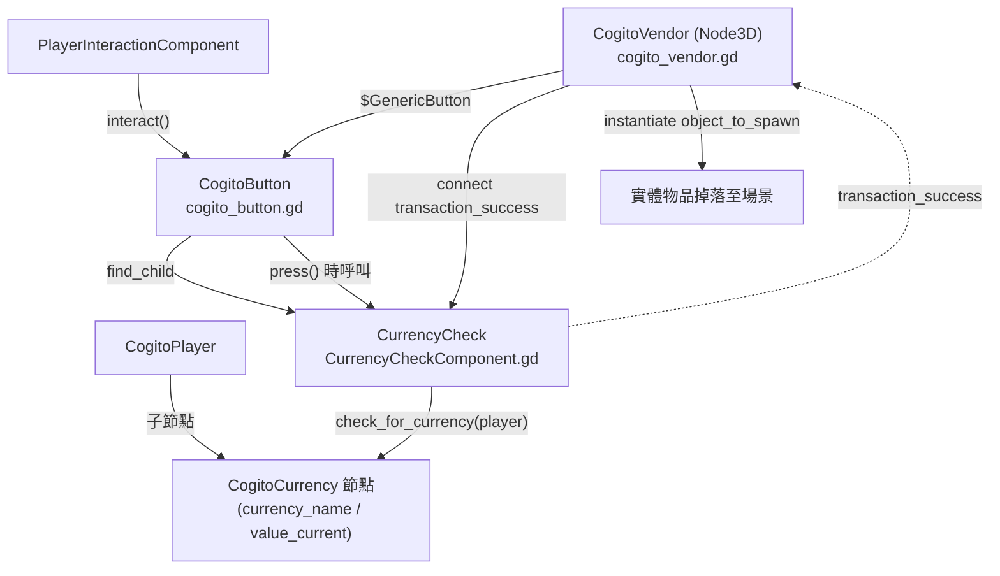
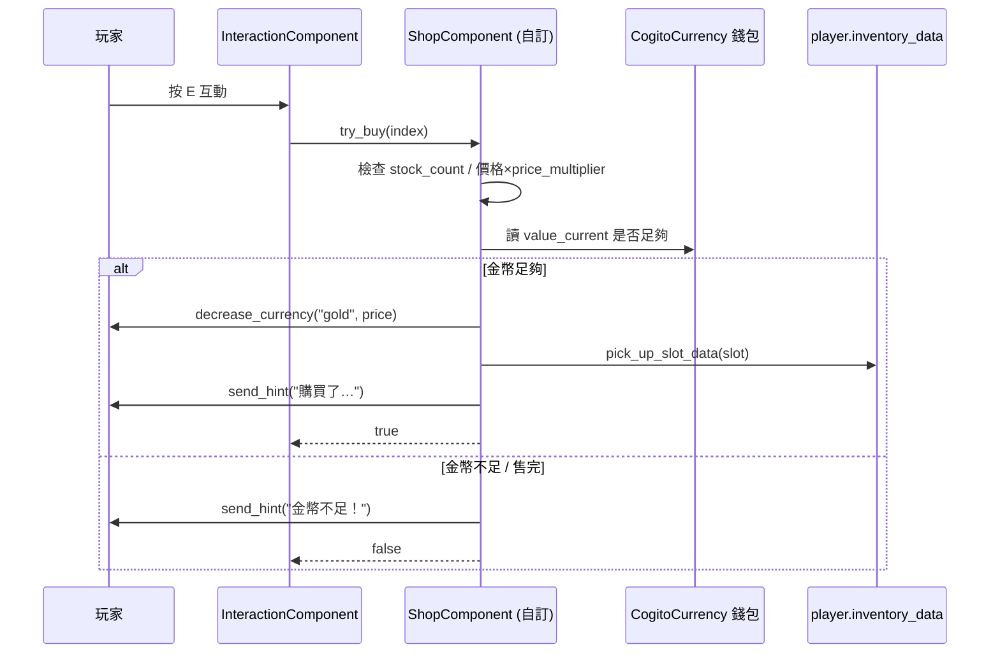

# 教學：商店與商人交易系統（Shop & Merchant System）

本教學說明 COGITO 內建的交易機制，以及如何在其上擴充出 NPC 商人（買進／賣出、進階定價、庫存補貨）。

> **重要前提（讀前必看）**
>
> COGITO **沒有**內建「開啟商店 UI、列出商品清單、買賣價差、賣回物品」的 RPG 式商人系統。它內建的是一台**自動販賣機（Vending Machine）**：玩家對著一個按鈕互動 → 扣貨幣 → 在出貨點生成一個實體物件掉下來。
>
> 因此本教學分成兩半：
> - **第一～四節**：逐行解析 COGITO **真正既有**的交易積木（`CogitoVendor` + `CurrencyCheck` + `CogitoCurrency` + `CurrencyItemPD`）。這些行號皆對應 Cogito-1.1.5 原始碼，可直接信賴。
> - **第五節起**：在既有積木上**自訂擴充**出 RPG 商人（含買賣價差、補貨）。凡標示「自訂」者皆為本教學提供之新程式碼，原專案不存在，行號僅供本文件內部對照。

## 前置知識
- 已閱讀架構分析 `architecture/level3_interactive_objects.md`（第六節 CogitoVendor）與 `architecture/level5c_loot_system.md`（LootGenerator 加權隨機）。
- 了解 `PlayerInteractionComponent` 與 `interact()` 互動流程。

---

## 一、COGITO 既有交易積木總覽

COGITO 的交易能力由四個獨立、可組合的元件構成，彼此以**信號**鬆耦合：



| 元件 | 類別 / 檔案 | 職責 |
|---|---|---|
| 貨幣 | `CogitoCurrency` / `InventoryPD/CustomResources/cogito_currency.gd` | 掛在玩家下，存錢包餘額，發 `currency_changed` 信號 |
| 貨幣物品 | `CurrencyItemPD` / `InventoryPD/CustomResources/CurrencyItemPD.gd` | 背包裡的「錢袋」道具，撿起或使用時轉成貨幣 |
| 收費檢查 | `CurrencyCheck` / `Components/CurrencyCheckComponent.gd` | 檢查並扣款，成功發 `transaction_success` |
| 按鈕 | `CogitoButton` / `CogitoObjects/cogito_button.gd` | 互動入口，`press()` 時觸發 `CurrencyCheck` |
| 販賣機 | `CogitoVendor`（無 class_name）/ `CogitoObjects/cogito_vendor.gd` | 監聽交易成功 → 扣庫存 → 延遲生成物品 |

> 既有示範場景：`addons/cogito/DemoScenes/DemoPrefabs/vending_machine.tscn`（賣健康藥水，售價 5）。

---

## 二、CogitoCurrency：玩家貨幣

`CogitoCurrency`（`cogito_currency.gd:3`，`class_name CogitoCurrency extends Node`）是掛在 `CogitoPlayer` 下的子節點，扮演「錢包」。

### 關鍵欄位（`cogito_currency.gd:11-25`）
| 欄位 | 行 | 說明 |
|---|---|---|
| `currency_name : String` | 11 | 程式邏輯比對用，全小寫、無空白（預設範例為 `"credits"`） |
| `currency_display_name : String` | 13 | UI 顯示名 |
| `currency_color : Color` | 15 | HUD 用色 |
| `currency_icon : Texture2D` | 17 | HUD 圖示（**注意：是 `Texture2D`**，與 `CurrencyCheck.currency_icon` 的字串路徑不同，見陷阱章） |
| `value_max : float` | 19 | 上限 |
| `value_start : float` | 21 | 初始值，`_ready()` 時寫入 `value_current`（`cogito_currency.gd:30`） |
| `is_locked : bool` | 23 | 鎖定後 `add`/`subtract` 不改值但仍發信號 |

### 餘額是一個帶 setter 的屬性（`cogito_currency.gd:32-45`）
`value_current` 不是普通變數，而是 setter 屬性：每次賦值都比較新舊值，據此 emit `currency_changed(currency_name, value_current, value_max, has_increased)`，並自動夾在 `[0, value_max]`：

```gdscript
var value_current : float:
    set(value):
        var prev_value = value_current
        value_current = value
        if prev_value < value_current:
            currency_changed.emit(currency_name,value_current,value_max,true)
        elif prev_value > value_current:
            currency_changed.emit(currency_name,value_current,value_max,false)
        if value_current <= 0:
            value_current = 0
        if value_current > value_max:
            value_current = value_max
```

> 修改餘額**永遠**走 `add()`（`cogito_currency.gd:59`）/ `subtract()`（`:67`），它們會尊重 `is_locked`。直接寫 `value_current` 雖可行，但會繞過 `is_locked` 檢查。

### 玩家端 API（`cogito_player.gd`）
玩家在 `_ready()` 中自動收集所有 `CogitoCurrency` 子節點建索引（`cogito_player.gd:250-252`）：
```gdscript
for currency in find_children("", "CogitoCurrency", false):
    player_currencies[currency.currency_name] = currency
```
對外操作介面（皆走 `add`/`subtract`）：
- `increase_currency(name, value) -> bool`（`cogito_player.gd:306`，找不到貨幣回 `false`）
- `decrease_currency(name, value)`（`cogito_player.gd:316`，無回傳值）

> 範例節點設定（在 `CogitoPlayer` 下新增一個 `Node`，掛 `cogito_currency.gd`）：
> - `CogitoPlayer`
>   - `GoldCurrency`（Node, script = cogito_currency.gd）
>     - `currency_name` = `"gold"`（全小寫，邏輯用）
>     - `currency_display_name` = `"金幣"`
>     - `value_start` = `100`
>     - `value_max` = `99999`
>     - `currency_icon` = `<一張 Texture2D>`

---

## 三、CurrencyItemPD：背包裡的「錢袋」道具

`CurrencyItemPD`（`CurrencyItemPD.gd:2`，`extends InventoryItemPD`）讓貨幣能以**背包物品**形式存在（撿到的錢袋、寶箱裡的金幣）。

關鍵欄位（`CurrencyItemPD.gd:6-11`）：
- `currency_name`（6）：要灌入哪個 `CogitoCurrency`。
- `currency_change_amount`（8）：灌入的數量（可為負）。
- `add_on_pickup : bool = true`（11）：撿起即入帳；若為 `false` 則進背包，需手動「使用」才入帳。

`use(target)`（`CurrencyItemPD.gd:13-24`）的防呆：若 `target` 為 null 或是外部容器（`external_inventory` 群組），會改用 `CogitoSceneManager._current_player_node`，再呼叫 `target.increase_currency(...)`。

> 用途差異：`CurrencyItemPD` 是「拿到錢」；下一節的 `CurrencyCheck` 是「花掉錢」。

---

## 四、CurrencyCheck + CogitoButton + CogitoVendor：既有交易主幹

### 4.1 CurrencyCheck（收費閘門）

`CurrencyCheck`（`CurrencyCheckComponent.gd:2`，`class_name CurrencyCheck extends Node`）是真正執行扣款的元件。

欄位（`CurrencyCheckComponent.gd:11-21`）：
| 欄位 | 行 | 說明 |
|---|---|---|
| `currency_cost : int` | 11 | 費用；**設為 0 時整個收費機制被跳過** |
| `currency_text_joiner` | 13 | 互動提示用的連接字（如 `" | Cost: "`） |
| `currency_name : String` | 15 | 要扣哪個貨幣，預設 `"credits"`（**必須與玩家 `CogitoCurrency.currency_name` 完全相符**） |
| `currency_icon` | 17 | **字串路徑**（給 BBCode 用），非 Texture2D |
| `apply_transaction : bool` | 21 | 是否真的扣款（false 可做「需有錢才開門但不扣錢」） |

核心邏輯 `check_for_currency(player)`（`CurrencyCheckComponent.gd:35-49`）：
```gdscript
func check_for_currency(player: Node) -> bool:
    var found_currency
    for attribute in player.find_children("", "CogitoCurrency", false):
        if attribute is CogitoCurrency and attribute.currency_name == currency_name:
            found_currency = attribute
            break
    if found_currency and found_currency.value_current >= currency_cost:
        if apply_transaction:
            found_currency.value_current -= currency_cost
        transaction_success.emit()
        return true
    else:
        transaction_failed.emit()
        return false
```
它發出 `transaction_success`（`:5`）或 `transaction_failed`（`:6`）兩個信號——這是整個交易系統的「事件總線」。

> **注意**：扣款是直接寫 `found_currency.value_current -= currency_cost`（`:44`），會觸發 `currency_changed` 信號但**繞過 `is_locked`**。

### 4.2 CogitoButton 何時觸發收費

`CogitoButton`（`cogito_button.gd:3`）在 `_ready()` 用 `find_child("CurrencyCheck", true, true)` 自動抓子節點的收費元件（`cogito_button.gd:58`），並把費用拼進互動提示文字（`:60`）。

關鍵時序——**扣款發生在 `press()` 而非 `interact()`**（`cogito_button.gd:100-106`）：
```gdscript
func press():
    # 收費只在按壓確實成立後才執行，
    # 否則可能扣了錢卻沒真的按下按鈕。
    if currency_check and currency_check.currency_cost != 0:
        if not currency_check.check_for_currency(player_interaction_component.get_parent()):
            player_interaction_component.send_hint(null, currency_check.not_enough_currency_hint)
            return
    pressed.emit()
    ...
```
原始碼在 `:84-88` 留有被註解掉的舊版（曾把檢查放在 `interact()`），註解明說移到 `press()` 是為了修「扣了錢卻沒按成」的 bug。改寫交易邏輯時務必沿用此順序。

> `check_for_currency` 的引數是 `player_interaction_component.get_parent()`，即 `CogitoPlayer` 本體——貨幣節點要找到，必須掛在玩家底下。

### 4.3 CogitoVendor 完整販賣流程

`CogitoVendor`（`cogito_vendor.gd:1`，`extends Node3D`，**無 class_name**）監聽按鈕的交易結果並出貨。

固定子節點需求（`cogito_vendor.gd:15-19`，皆以 `@onready $路徑` 硬綁）：
- `$GenericButton`（一個 `CogitoButton` 實例）
- `$GenericButton/CurrencyCheck`
- `$Spawnpoint`（`Marker3D`，出貨點）
- `$StaticBody3D/StockLabel`、`$StaticBody3D/StockCounter`（兩個 `Label3D`，顯示庫存）

匯出欄位（`cogito_vendor.gd:5-13`）：`starting_amount`（庫存，預設 3）、`object_to_spawn`（PackedScene）、`spawn_delay`、`spawn_rotation`、三段提示文字、`dispensing_sound`。

`_ready()`（`cogito_vendor.gd:28-45`）：
1. 加入 `save_object_state` 群組（庫存可存讀檔）。
2. `amount_remaining = starting_amount`，更新顯示。
3. 若庫存 >1 允許重複互動（`:32`）。
4. **防呆**：`spawn_delay` 必須短於按鈕冷卻 `press_cooldown_time`，否則強制縮短並印錯誤（`:34-36`）——否則庫存計數會錯亂。
5. 連接 `currency_check.transaction_success → _on_transaction_success`（`:37`）。
6. 隔一幀後抓玩家、比對 `currency_name` 找出對應 `CogitoCurrency`（`:42-45`）。

出貨 `_on_transaction_success()`（`cogito_vendor.gd:48-58`）：
```gdscript
func _on_transaction_success() -> void:
    player_interaction_component.send_hint(currency_attribute.currency_icon, purchased_hint_text)
    amount_remaining -= 1
    _update_vendor_state()
    is_dispensing = true
    _delayed_object_spawn()
```
`_delayed_object_spawn()`（`:61-71`）播音效 → 等 `spawn_delay` → `object_to_spawn.instantiate()` → 設座標／旋轉 → `add_child` 到 `current_scene`。**物品是實體掉到場景，不是進背包**。

`_update_vendor_state()`（`:74-82`）：庫存歸零時關閉重複互動、改顯示 `stock_empty_text`，並更新計數 `Label3D`。

存讀檔 `save()`（`:93-106`）：保存 `amount_remaining`、`is_dispensing`、座標旋轉；`set_state()`（`:85-90`）載入時若正在出貨會續跑 `_delayed_object_spawn()`。

> **示範場景對照** `vending_machine.tscn`：`object_to_spawn` = `pickup_health_potion.tscn`（`:28`）、`GenericButton/CurrencyCheck` 的 `currency_cost = 5`（`:103`）。

---

## 五、自訂擴充（一）：RPG 式商人組件 ShopComponent

從這節起為**本教學自訂程式碼**，原 Cogito 不存在。設計取捨：

- 既有 `CogitoVendor` 一台機器只賣一種物品、且物品掉到地上。要做「一個 NPC 賣多樣商品、買賣價差、直接入背包」就得自寫。
- 但我們**沿用既有積木**：貨幣仍用 `CogitoCurrency` + 玩家的 `increase_currency`/`decrease_currency`；不重造錢包。

### 5.1 商品定義資源（自訂）

```gdscript
# res://scripts/shop_data.gd  （自訂）
extends Resource
class_name ShopData

@export var shop_name: String = "村莊商店"
@export var stock: Array[ShopEntry] = []

class ShopEntry:
    extends Resource
    ## 商品物品資源（InventoryItemPD 或其子類）
    @export var item: InventoryItemPD
    ## 一次購買數量
    @export var quantity: int = 1
    ## 買進價（玩家付出）
    @export var buy_price: float = 10.0
    ## 賣出回收價（玩家獲得），通常 < buy_price 形成價差
    @export var sell_price: float = 5.0
    ## 庫存（-1 = 無限）
    @export var stock_count: int = -1
```

### 5.2 ShopComponent（自訂，掛在商人 NPC 下）

下列 API 全部對應真實的 Cogito 介面：
- `CogitoSceneManager._current_player_node`：當前玩家（既有，全域單例）。
- `player.player_currencies`（`cogito_player.gd:136`）/ `decrease_currency`（`:316`）/ `increase_currency`（`:306`）。
- `player.player_interaction_component.send_hint(icon, text)`：既有提示 API（CogitoVendor 亦用之，見 `cogito_vendor.gd:50`）。
- 入／出背包：`player.inventory_data`（`CogitoInventory`），以 `InventorySlotPD` 包裝物品。

> **驗證提醒**：`inventory_data` 的加入／移除方法名稱請以你版本的 `cogito_inventory.gd` 為準（搜 `func add_inventory_item` / `func remove_slot_data` / `func pick_up_slot_data`）。不同 Cogito 版本方法名有差異，套用前務必 Grep 確認，**勿照抄方法名**。

```gdscript
# res://scripts/shop_component.gd  （自訂）
extends Node
class_name ShopComponent

@export var shop_data: ShopData

## 進階定價：可選的全域加成（例如聲望折扣、地區物價）
@export var price_multiplier: float = 1.0

signal transaction_done(success: bool, message: String)


func _get_player():
    return CogitoSceneManager._current_player_node


## 購買第 entry_index 項商品；回傳是否成功
func try_buy(entry_index: int) -> bool:
    if entry_index < 0 or entry_index >= shop_data.stock.size():
        return false
    var entry: ShopData.ShopEntry = shop_data.stock[entry_index]
    var player = _get_player()
    if not player:
        return false

    if entry.stock_count == 0:
        _notify(player, false, "已售完")
        return false

    var price := entry.buy_price * price_multiplier
    var wallet = player.player_currencies.get("gold")   # 對應 CogitoCurrency.currency_name
    if not wallet or wallet.value_current < price:
        _notify(player, false, "金幣不足！")
        return false

    player.decrease_currency("gold", price)             # cogito_player.gd:316

    var slot := InventorySlotPD.new()
    slot.inventory_item = entry.item
    slot.quantity = entry.quantity
    # 注意：方法名依版本，先 Grep cogito_inventory.gd 確認
    player.inventory_data.pick_up_slot_data(slot)

    if entry.stock_count > 0:
        entry.stock_count -= 1

    _notify(player, true, "購買了 " + entry.item.name)
    return true


## 玩家賣出背包某 slot；回傳實際取得金幣
func try_sell(item_slot: InventorySlotPD) -> float:
    var player = _get_player()
    if not player or not item_slot or not item_slot.inventory_item:
        return 0.0

    var sell_value := 0.0
    for entry in shop_data.stock:
        if entry.item == item_slot.inventory_item:
            sell_value = entry.sell_price * price_multiplier
            break
    if sell_value <= 0.0:
        _notify(player, false, "這家店不收這件物品")
        return 0.0

    # 移除背包物品（方法名依版本 Grep 確認）
    player.inventory_data.remove_slot_data(item_slot)
    player.increase_currency("gold", sell_value)        # cogito_player.gd:306
    _notify(player, true, "賣出，獲得 " + str(sell_value) + " 金幣")
    return sell_value


func _notify(player, ok: bool, msg: String) -> void:
    if player.player_interaction_component:
        player.player_interaction_component.send_hint(null, msg)   # 既有 API
    transaction_done.emit(ok, msg)
```

> 比較既有物品比對：原 `CurrencyCheck` 用 `currency_name` 字串比對；`LootGenerator` 直接用 `==` 比對 `InventoryItemPD`（`cogito_loot_generator.gd:146` 的 `if _slot == item`）。本教學賣出比對沿用 `==`（同一個 `.tres` 資源指向同一物件），比字串 `resource_path` 比對更穩。

---

## 六、自訂擴充（二）：商人庫存補貨（沿用 LootGenerator 加權隨機）

COGITO 的 `LootGenerator`（`cogito_loot_generator.gd`）本是掉落系統，但它的**加權隨機**正好可拿來做「商人每日進貨隨機補一批商品」。

關鍵可複用點：
- `generate(loot_table, amount, debug) -> Array[LootDropEntry]`（`cogito_loot_generator.gd:25`）：傳一張 `LootTable` 與要抽幾件，回傳抽中的條目陣列。
- 內部 `_roll_for_randomized_items()`（`:153`）用 Godot 4.3+ 的 `RandomNumberGenerator.rand_weighted()`（`:176`），權重來自每筆 `LootDropEntry.weight`（`:171`）。
- `guaranteed_drops_table`（droptype=1，`:67`）必出；`chance_drops_table`（droptype=2，`:69`）才參與加權抽取——可用此區分「常駐商品」與「隨機進貨」。

> **陷阱**：`LootGenerator._set_up_references()`（`:50-53`）會 `get_tree().get_first_node_in_group("Player")` 並讀 `_player.inventory_data`、找 `Player_HUD`。若場景沒有「Player」群組節點會崩。補貨情境若用不到 unique/quest 檢查，最穩做法是只取它的加權抽取概念，或確保玩家在場時才呼叫。

自訂補貨片段（沿用既有 generator）：
```gdscript
# 在 ShopComponent 內（自訂）
@export var restock_table: LootTable      # 一張 .tres，drops 為 chance 類型
@export var restock_amount: int = 3

func restock() -> void:
    var gen := LootGenerator.new()
    add_child(gen)                         # generator 需在樹內才能 get_tree()
    var rolled: Array = gen.generate(restock_table, restock_amount)
    for entry in rolled:                   # entry 是 LootDropEntry
        var shop_entry := ShopData.ShopEntry.new()
        shop_entry.item = entry.inventory_item   # LootDropEntry.inventory_item（見 level5c）
        shop_entry.buy_price = 10.0
        shop_entry.sell_price = 5.0
        shop_entry.stock_count = 1
        shop_data.stock.append(shop_entry)
    gen.queue_free()                       # 用完即刪（與 LootComponent 用法一致）
```

> `LootDropEntry` 的欄位（`inventory_item`、`weight`、`droptype`、`quest_id` 等）詳見 `architecture/level5c_loot_system.md` 第二節。

---

## 七、端到端工作流：建立一個可交易商人

以下兩條路線擇一。**路線 A** 是純既有積木（最省事、官方支援）；**路線 B** 才需要第五節的自訂程式碼。

### 路線 A：用既有 CogitoVendor 做「賣一種物品的攤位」（零自訂程式碼）

1. **玩家加錢包**：在 `CogitoPlayer` 下加 `Node`，掛 `cogito_currency.gd`，設 `currency_name = "gold"`、`value_start = 100`、`value_max = 99999`、指定 `currency_icon`。
2. **複製販賣機**：把 `addons/cogito/DemoScenes/DemoPrefabs/vending_machine.tscn` 複製到你的場景（或實例化）。
3. **設定商品**：選 `VendingMachine`（CogitoVendor）節點 → Inspector 設 `object_to_spawn` 為你的 pickup 場景（如某把劍的 `.tscn`）、`starting_amount`（庫存）、`purchased_hint_text`。
4. **設定價格與貨幣**：展開 `GenericButton/CurrencyCheck` → 設 `currency_cost`、把 `currency_name` 改成 `"gold"`（要與步驟 1 相符）。
5. **驗證**：見第九節清單。

### 路線 B：用自訂 ShopComponent 做「多商品 NPC 商人」

1. 玩家加錢包（同路線 A 步驟 1）。
2. 建立 `shop_data.gd`、`shop_component.gd`（第五節）。
3. 在 FileSystem 新增 `shop_blacksmith.tres`（型別 `ShopData`），填 `stock`：每筆指定 `item`、`buy_price`、`sell_price`、`stock_count`。
4. **節點結構**：
   - `CogitoNPC`（blacksmith）
     - `NPC_State_Machine`
     - `HitboxComponent`
     - `ShopComponent`（script = shop_component.gd, shop_data = shop_blacksmith.tres）
     - `InteractionComponent`（觸發開店 / 或接 Dialogic，見下節）
5. **觸發購買**：最簡單做法是寫一個 `InteractionComponent` 子類，`interact()` 內呼叫 `shop_component.try_buy(index)`：
   ```gdscript
   # simple_shop_interaction.gd  （自訂）
   extends InteractionComponent
   @export var shop_component: ShopComponent
   @export var entry_index: int = 0
   func interact(_pic: PlayerInteractionComponent) -> void:
       if shop_component:
           shop_component.try_buy(entry_index)
   ```
6. **驗證**：見第九節清單。

### 交易流程（自訂 ShopComponent，端到端）



---

## 八、（選用）整合 Dialogic 對話商店

若用 Dialogic 做「對話式選購」，因 Dialogic 的 `[call]` 只能呼叫場景節點，需一個橋接 Autoload（**自訂**）：

```gdscript
# res://scripts/shop_bridge.gd  (Autoload: ShopBridge，自訂)
extends Node
var _shops: Dictionary = {}
var last_result: String = ""

func register_shop(shop_id: String, shop_component: ShopComponent) -> void:
    _shops[shop_id] = shop_component

func buy_from_shop(shop_id: String, entry_index: int) -> void:
    var shop: ShopComponent = _shops.get(shop_id)
    if not shop:
        last_result = "商店不存在"
        return
    last_result = "購買成功！" if shop.try_buy(entry_index) else "購買失敗（金幣不足或無庫存）"
```
商人 `_ready()` 中 `ShopBridge.register_shop("blacksmith", $ShopComponent)`，再於 timeline 用 `[call node="ShopBridge" method="buy_from_shop" args=["blacksmith", 0]]`，並以 `{ShopBridge.last_result}` 回顯結果。

---

## 九、常見陷阱

| 陷阱 | 來源 | 對策 |
|---|---|---|
| 兩種 `currency_icon` 型別不同 | `CogitoCurrency.currency_icon` 是 `Texture2D`（`cogito_currency.gd:17`）；`CurrencyCheck.currency_icon` 是字串路徑（`CurrencyCheckComponent.gd:17`） | 別把兩者混填；`send_hint` 第一參數吃 Texture |
| `currency_name` 對不上就靜默失敗 | `CurrencyCheck`（`:38`）與 `CogitoVendor`（`cogito_vendor.gd:43`）皆用字串比對找錢包 | 玩家 `CogitoCurrency.currency_name` 必須與檢查端**完全一致**、全小寫 |
| 收費若放在 `interact()` 會「扣錢沒按成」 | `cogito_button.gd:84-88` 註解明載此 bug | 自訂按鈕邏輯一律把扣款放 `press()`（`:100`） |
| `currency_cost = 0` 時收費被整個跳過 | `CurrencyCheckComponent.gd:30`、`cogito_button.gd:103` | 免費物品才設 0；否則務必 >0 |
| 販賣機 `spawn_delay` ≥ 按鈕冷卻會錯算庫存 | `cogito_vendor.gd:34-36` 主動防呆並印錯誤 | 保持 `spawn_delay < press_cooldown_time` |
| 直接寫 `value_current` 繞過 `is_locked` | setter（`cogito_currency.gd:32`）不檢查 lock，只有 `add`/`subtract`（`:59`/`:67`）檢查 | 改餘額優先用 `add`/`subtract` 或玩家層 `increase/decrease_currency` |
| `inventory_data` 加／移除方法名各版本不同 | 自訂 ShopComponent 第五節 | 套用前 Grep `cogito_inventory.gd` 確認真實方法名，勿照抄 |
| `LootGenerator` 補貨會找「Player」群組與 Player_HUD | `cogito_loot_generator.gd:50-53` | 玩家在場時才呼叫；用完 `queue_free()` |
| CogitoVendor 沒有 `class_name` | `cogito_vendor.gd:1` 只有 `extends Node3D` | 不能用 `node is CogitoVendor` 判斷；靠節點群組或方法存在性判斷 |

---

## 十、驗證清單

| 測試步驟 | 預期結果 | 機制依據 |
|---|---|---|
| （A）對販賣機按鈕互動、金幣足夠 | 扣 `currency_cost`、出貨點掉出物品、提示 purchased_hint_text | `cogito_button.gd:100` → `CurrencyCheckComponent.gd:42` → `cogito_vendor.gd:48` |
| （A）金幣不足時互動 | 不扣錢、顯示 `not_enough_currency_hint`、不出貨 | `cogito_button.gd:104-106` |
| （A）庫存耗盡後 | 按鈕變 `unusable_interaction_text` / Stock 顯示 Sold Out | `cogito_vendor.gd:76-78` |
| （A）存讀檔後庫存 | `amount_remaining` 保留 | `cogito_vendor.gd:93` save / `:85` set_state |
| （B）ShopComponent 購買 | 金幣減 `buy_price×price_multiplier`、物品入背包 | 自訂 + `cogito_player.gd:316` |
| （B）賣出店家收的物品 | 物品消失、金幣增 `sell_price×price_multiplier` | 自訂 + `cogito_player.gd:306` |
| （B）賣出店家不收的物品 | 提示「不收」、無金幣變動 | 自訂 `try_sell` 比對失敗分支 |
| 貨幣 HUD 跟動 | 餘額變化即時更新 | `cogito_currency.gd:37` emit → `UI_CurrencyComponent.gd::on_currency_changed` |
