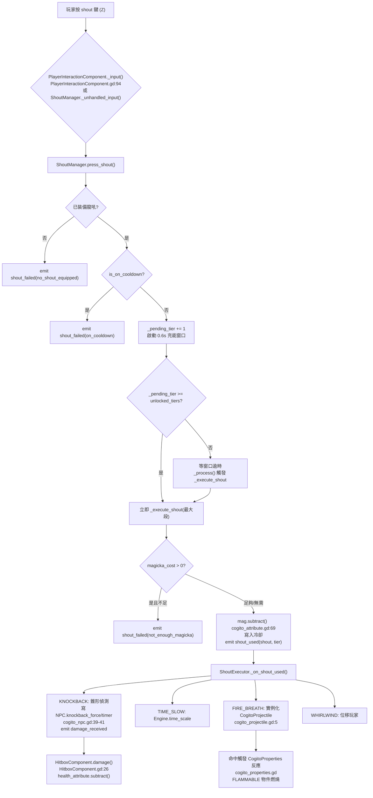

# 教學：龍吼系統（Skyrim 式 Shout）

本教學說明如何在 COGITO 中實作 Skyrim 風格的「龍吼」：獨立按鍵觸發、多段充能、各自冷卻計時器、效果分派（擊退／減速／位移／噴火），以及如何與既有 Wieldable 系統共存。

> **COGITO 沒有內建龍吼系統**。本教學以「自訂為主、接既有機制為輔」的方式構築。下表先釐清哪些是 **既有可接的引擎機制**（附真實行號），哪些是 **本教學自訂的新程式碼**，避免誤把自訂 API 當成 COGITO 內建。

## 前置知識

- 已閱讀 [教學：Skyrim 戰鬥機制](./skyrim_combat_mechanics.md)（與本文共用 `apply_knockback` 接點）。
- 已閱讀 [教學：魔法與魔力系統](./magic_and_magicka_system.md)（龍吼冷卻／消耗可改走 `CogitoAttribute`）。
- 了解 `CogitoWieldable` 基礎與 `PlayerInteractionComponent` 輸入流。

---

## 一、既有機制盤點（接點對照表）

| 機制 | 既有 / 自訂 | 真實位置 | 在龍吼系統中的用途 |
|---|---|---|---|
| NPC 擊退 `apply_knockback(direction)` | **既有** | `addons/cogito/CogitoNPC/cogito_npc.gd:173` | 龍吼 KNOCKBACK 效果推飛 NPC |
| NPC `knockback_strength`（@export，預設 10） | **既有** | `cogito_npc.gd:42` | 擊退「強度」由 NPC 自身決定，**非**呼叫端傳入 |
| NPC `knockback_force` / `knockback_timer` 衰減 | **既有** | `cogito_npc.gd:39-41, 104-107` | 擊退以 `velocity = knockback_force` 套用後 lerp 歸零 |
| NPC `damage_received` 信號 | **既有** | `cogito_npc.gd:5`（宣告 `damage_value:float`） | 龍吼附帶傷害 |
| `HitboxComponent.damage(amount, dir, pos)` | **既有** | `addons/cogito/Components/HitboxComponent.gd:26` | 接 `damage_received`，扣血並可對 RigidBody/CharacterBody 施力 |
| `CogitoProjectile`（投射型吼術載體） | **既有** | `addons/cogito/CogitoObjects/cogito_projectile.gd:5` | FIRE_BREATH 用投射物實作 |
| `CogitoProperties`（元素反應） | **既有** | `addons/cogito/Components/Properties/cogito_properties.gd:4` | 火焰吼術觸發 FLAMMABLE 物件燃燒 |
| `CogitoAttribute`（資源/冷卻載體） | **既有** | `addons/cogito/Components/Attributes/cogito_attribute.gd:3` | 可選：龍吼改吃 magicka 資源 |
| `player.player_attributes` 字典 | **既有** | `addons/cogito/CogitoObjects/cogito_player.gd:131, 230-231` | 以 `attribute_name` 取得自訂 magicka 屬性 |
| `player.camera`（節點名為 `Camera`） | **既有** | `cogito_player.gd:189`（`$Body/Neck/Head/Eyes/Camera`） | 取視線方向；**節點名不是 `Camera3D`** |
| Wieldable 雙態 `action_primary/secondary(_is_released)` | **既有** | `addons/cogito/Scripts/cogito_wieldable.gd:42, 47` | 若改走 wieldable 槽時的 use() 入口 |
| 動作輸入分派（按下/放開） | **既有** | `addons/cogito/Components/PlayerInteractionComponent.gd:94-114` | 本教學的獨立鍵位掛接點 |
| `ShoutData` 資源 | **自訂** | 新增 `res://scripts/shout_data.gd` | 定義單一龍吼 |
| `ShoutManager` Autoload | **自訂** | 新增 `res://scripts/shout_manager.gd` | 充能/冷卻/分派 |
| `ShoutExecutor` | **自訂** | 新增 `res://scripts/shout_executor.gd` | 效果落地 |

> **關鍵更正（與舊版教學差異）**
> 1. 玩家輸入入口是 `cogito_player.gd:365` 的 `_input(event)`，**沒有** `_unhandled_input()`。獨立鍵位建議掛在 `PlayerInteractionComponent._input()`（`PlayerInteractionComponent.gd:94`），它本就在此處理 `action_primary/secondary`。
> 2. 相機節點實際名稱是 `Camera`（`cogito_player.gd:189`），用 `find_child("Camera3D", ...)` 會回傳 `null`。直接用 `player.camera` 屬性。
> 3. `apply_knockback(direction)` 只取方向、強度用 NPC 自身的 `knockback_strength`（`cogito_npc.gd:173-175`）。要讓段數左右推力，必須**直接寫 NPC 的 `knockback_force`/`knockback_timer`**，不能靠把向量乘大。

---

## 二、ShoutData：龍吼資源定義（自訂）

建立 `res://scripts/shout_data.gd`：

```gdscript
# res://scripts/shout_data.gd  — 自訂 Resource
extends Resource
class_name ShoutData

## 龍吼名稱（如 "Fus Ro Dah"）
@export var shout_name: String
## 描述
@export_multiline var description: String
## 圖示
@export var icon: Texture2D

## 龍吼效果類型
enum ShoutEffect {
    KNOCKBACK,      # 推飛敵人
    TIME_SLOW,      # 慢動作
    FIRE_BREATH,    # 噴火（投射物）
    WHIRLWIND,      # 瞬移/位移
}
@export var effect: ShoutEffect = ShoutEffect.KNOCKBACK

## 龍吼的影響半徑（或射程）
@export var radius: float = 8.0
## 基礎威力數值（用途依效果類型而異）
@export var power: float = 20.0
## 推力強度（傳給 NPC.knockback_force 用，KNOCKBACK 專用）
@export var knockback_force: float = 14.0

## 三段充能各自的冷卻時間（秒）
## Skyrim 風格：只按一下用第一段，0.6 秒內連按累加段數
@export var cooldown_tier1: float = 4.0
@export var cooldown_tier2: float = 12.0
@export var cooldown_tier3: float = 30.0

## （可選）每段消耗的 magicka，0 表示不吃資源
@export var magicka_cost_tier1: float = 0.0
@export var magicka_cost_tier2: float = 0.0
@export var magicka_cost_tier3: float = 0.0

## 已解鎖的段數（1~3）
@export var unlocked_tiers: int = 1
```

---

## 三、ShoutManager：全域龍吼管理（自訂 Autoload）

建立 `res://scripts/shout_manager.gd`，於 `Project Settings → Autoload` 註冊為 `ShoutManager`：

```gdscript
# res://scripts/shout_manager.gd  — 自訂 Autoload: ShoutManager
extends Node

signal shout_used(shout: ShoutData, tier: int)
signal shout_cooldown_changed(shout: ShoutData, remaining: float)
signal equipped_shout_changed(shout: ShoutData)
signal shout_failed(shout: ShoutData, reason: String)

## 已解鎖的龍吼列表
var unlocked_shouts: Array[ShoutData] = []
## 目前裝備的龍吼
var equipped_shout: ShoutData = null
## 各龍吼的冷卻剩餘時間（resource_path → float）
var _cooldowns: Dictionary = {}

## 目前充能等級（玩家連按幾次）
var _pending_tier: int = 0
var _tier_window_timer: float = 0.0
const TIER_WINDOW: float = 0.6  # 充能窗口：0.6 秒內連按才累加段數


func _process(delta: float) -> void:
    # 更新所有冷卻計時
    for key in _cooldowns.keys():
        if _cooldowns[key] > 0.0:
            _cooldowns[key] -= delta
            if _cooldowns[key] <= 0.0:
                _cooldowns[key] = 0.0

    # 充能窗口計時：到期才實際執行
    if _tier_window_timer > 0.0:
        _tier_window_timer -= delta
        if _tier_window_timer <= 0.0:
            _execute_shout(_pending_tier)
            _pending_tier = 0


func equip_shout(shout: ShoutData) -> void:
    equipped_shout = shout
    equipped_shout_changed.emit(shout)


## 由獨立鍵位呼叫（見第四節）。
func press_shout() -> void:
    if not equipped_shout:
        shout_failed.emit(null, "no_shout_equipped")
        return
    if is_on_cooldown(equipped_shout):
        shout_failed.emit(equipped_shout, "on_cooldown")
        return

    _pending_tier += 1
    _tier_window_timer = TIER_WINDOW

    # 已達解鎖上限：不必再等窗口，直接執行最大段
    if _pending_tier >= equipped_shout.unlocked_tiers:
        _pending_tier = equipped_shout.unlocked_tiers
        _tier_window_timer = 0.0
        _execute_shout(_pending_tier)
        _pending_tier = 0


func _execute_shout(tier: int) -> void:
    if not equipped_shout or tier <= 0:
        return

    # （可選）扣 magicka：透過 player_attributes 取得自訂屬性
    var cost := _get_magicka_cost(equipped_shout, tier)
    if cost > 0.0:
        var mag := _get_player_magicka()
        if mag == null or mag.value_current < cost:
            shout_failed.emit(equipped_shout, "not_enough_magicka")
            return
        mag.subtract(cost)  # cogito_attribute.gd:69

    var cooldown := _get_cooldown_for_tier(equipped_shout, tier)
    _cooldowns[equipped_shout.resource_path] = cooldown
    shout_cooldown_changed.emit(equipped_shout, cooldown)
    shout_used.emit(equipped_shout, tier)


func _get_cooldown_for_tier(shout: ShoutData, tier: int) -> float:
    match tier:
        1: return shout.cooldown_tier1
        2: return shout.cooldown_tier2
        _: return shout.cooldown_tier3


func _get_magicka_cost(shout: ShoutData, tier: int) -> float:
    match tier:
        1: return shout.magicka_cost_tier1
        2: return shout.magicka_cost_tier2
        _: return shout.magicka_cost_tier3


## 透過既有的 player_attributes 字典取得自訂的 "magicka" 屬性。
## 來源：cogito_player.gd:131（var player_attributes）、:230-231（以 attribute_name 為 key 填入）。
func _get_player_magicka() -> CogitoAttribute:
    var player = CogitoSceneManager._current_player_node  # cogito_scene_manager.gd:16
    if not player:
        return null
    return player.player_attributes.get("magicka")


func is_on_cooldown(shout: ShoutData) -> bool:
    return _cooldowns.get(shout.resource_path, 0.0) > 0.0


func get_remaining_cooldown(shout: ShoutData) -> float:
    return _cooldowns.get(shout.resource_path, 0.0)


func unlock_shout(shout: ShoutData) -> void:
    if shout not in unlocked_shouts:
        unlocked_shouts.append(shout)
        if equipped_shout == null:
            equip_shout(shout)
```

---

## 四、輸入掛接：獨立鍵位（不佔 Wieldable 槽）

龍吼**不佔用** wieldable 槽（玩家可同時持武器與吼叫），所以走獨立 input action，不經 `WieldableItemPD.use()`。

### 步驟 1：新增 input action

`Project Settings → Input Map → 新增 action `"shout"`` → 綁定 `Z` 鍵。確認 `project.godot` 既有的 `action_primary`（`project.godot:145`）/`action_secondary`（`project.godot:151`）不與之衝突。

### 步驟 2：掛在 PlayerInteractionComponent（建議）

既有的 `PlayerInteractionComponent._input(event)`（`PlayerInteractionComponent.gd:94`）已是處理動作輸入的標準位置（它在此處理 `action_primary/secondary`，見 `:101-114`）。把龍吼鍵掛在這裡，最貼合既有風格：

```gdscript
# PlayerInteractionComponent.gd — 在 _input(event) 內、:114 之後加入
# （此檔 class_name PlayerInteractionComponent，extends Node3D；get_parent() 為 CogitoPlayer）
if event.is_action_pressed("shout") and !get_parent().is_movement_paused:
    ShoutManager.press_shout()
    get_viewport().set_input_as_handled()
```

> **避免修改插件原始碼？** 若不想動 `PlayerInteractionComponent.gd`，可改在 `ShoutManager`（Autoload）自己的 `_unhandled_input` 接收：

```gdscript
# 替代方案：寫在 shout_manager.gd 內，完全不碰 COGITO 插件檔
func _unhandled_input(event: InputEvent) -> void:
    if event.is_action_pressed("shout"):
        var player = CogitoSceneManager._current_player_node
        if player and not player.is_movement_paused:
            press_shout()
            get_viewport().set_input_as_handled()
```

> 注意 `cogito_player.gd` 的玩家輸入入口是 `_input(event)`（`cogito_player.gd:365`），**不是** `_unhandled_input()`；但 Autoload 用 `_unhandled_input` 接「未被 UI/玩家消費」的鍵位是安全的，因為 `_input` 鏈未呼叫 `set_input_as_handled()` 時事件會續傳到 `_unhandled_input`。

---

## 五、ShoutExecutor：效果落地（自訂）

效果由 `ShoutManager.shout_used` 信號觸發。建立 `res://scripts/shout_executor.gd`（掛在主場景的一個 Node 上，或併入 Autoload）：

```gdscript
# res://scripts/shout_executor.gd  — 自訂
extends Node

## 火焰吼術要用的投射物場景（指向一個繼承 CogitoProjectile 的場景）
@export var fire_projectile_scene: PackedScene


func _ready() -> void:
    ShoutManager.shout_used.connect(_on_shout_used)


func _on_shout_used(shout: ShoutData, tier: int) -> void:
    var player = CogitoSceneManager._current_player_node  # cogito_scene_manager.gd:16
    if not player:
        return

    match shout.effect:
        ShoutData.ShoutEffect.KNOCKBACK:
            _execute_knockback(player, shout, tier)
        ShoutData.ShoutEffect.TIME_SLOW:
            _execute_time_slow(shout, tier)
        ShoutData.ShoutEffect.FIRE_BREATH:
            _execute_fire_breath(player, shout, tier)
        ShoutData.ShoutEffect.WHIRLWIND:
            _execute_whirlwind(player, shout, tier)


func _execute_knockback(player: Node3D, shout: ShoutData, tier: int) -> void:
    # 用既有的 player.camera 屬性（節點名為 "Camera"，cogito_player.gd:189）
    var forward: Vector3 = -player.camera.global_basis.z
    var radius: float = shout.radius * tier

    for body in _get_bodies_in_cone(player.global_position, forward, radius, deg_to_rad(45)):
        # KNOCKBACK：段數越高推得越遠 → 直接寫 NPC 的 knockback_force/timer，
        #   不能用 apply_knockback() 後乘向量（它只取方向，強度用 NPC 自身 knockback_strength，
        #   見 cogito_npc.gd:173-175）。
        if "knockback_force" in body and "knockback_timer" in body:
            body.knockback_force = forward.normalized() * shout.knockback_force * tier  # cogito_npc.gd:39
            body.knockback_timer = body.knockback_duration                              # cogito_npc.gd:40-41
        elif body.has_method("apply_knockback"):
            body.apply_knockback(forward)  # 退路：固定 knockback_strength，cogito_npc.gd:173

        # 附帶傷害：emit 既有的 damage_received（HitboxComponent.damage 接此信號，
        #   簽名為 (amount, dir, pos)，HitboxComponent.gd:26；COGITO 自身亦以 3 參數 emit，
        #   見 cogito_projectile.gd:112）。
        if body.has_signal("damage_received"):
            body.damage_received.emit(shout.power * 0.5 * tier, forward, body.global_position)


func _execute_time_slow(shout: ShoutData, tier: int) -> void:
    var slow_factor: float = clampf(0.3 / float(tier), 0.05, 1.0)  # 段數越高越慢
    var real_duration: float = 3.0 * tier  # 以「真實秒數」計，避免被 time_scale 影響
    Engine.time_scale = slow_factor
    # 第 3 個參數 process_always=true、第 4 個 ignore_time_scale=true：
    #   讓計時器用真實時間，不受降速影響。
    get_tree().create_timer(real_duration, true, false, true).timeout.connect(
        func(): Engine.time_scale = 1.0
    )


func _execute_fire_breath(player: Node3D, shout: ShoutData, tier: int) -> void:
    if not fire_projectile_scene:
        push_warning("ShoutExecutor: fire_projectile_scene 未設定")
        return
    var cam: Camera3D = player.camera  # cogito_player.gd:189
    var forward: Vector3 = -cam.global_basis.z
    for i in range(tier * 3):  # 段數越高越多顆
        var proj := fire_projectile_scene.instantiate()
        get_tree().current_scene.add_child(proj)
        proj.global_position = cam.global_position + forward * 0.5
        # CogitoProjectile 繼承自 RigidBody3D 鏈，可設 linear_velocity；
        #   damage_amount 為其 var（cogito_projectile.gd:10）。
        proj.damage_amount = int(shout.power)
        var spread := Vector3(randf_range(-0.5, 0.5), 0, randf_range(-0.5, 0.5))
        proj.linear_velocity = forward * 15.0 + spread


func _execute_whirlwind(player: Node3D, shout: ShoutData, tier: int) -> void:
    # 位移：沿視線方向位移 tier * 5 公尺。
    var forward: Vector3 = -player.camera.global_basis.z
    player.global_position += forward * (tier * 5.0)


## 錐形範圍偵測：找出視線前方錐形內、碰撞層 2（Enemies）的 body。
func _get_bodies_in_cone(origin: Vector3, direction: Vector3, radius: float, half_angle: float) -> Array:
    var result := []
    var space_state := get_tree().current_scene.get_world_3d().direct_space_state
    var query := PhysicsShapeQueryParameters3D.new()
    var sphere := SphereShape3D.new()
    sphere.radius = radius
    query.shape = sphere
    query.transform = Transform3D(Basis(), origin)
    query.collision_mask = 0b10  # ← 依你的專案實際敵人層調整（範例為 Layer 2）

    for hit in space_state.intersect_shape(query, 32):
        var body = hit.collider
        var to_body := (body.global_position - origin).normalized()
        if to_body.dot(direction.normalized()) > cos(half_angle):  # 在錐形內
            result.append(body)
    return result
```

---

## 六、觸發 → 效果分派流（Mermaid）



---

## 七、龍吼 HUD 顯示（自訂，選用）

```gdscript
# shout_hud.gd — 自訂，掛在 HUD 控制節點
extends Control

@onready var shout_icon: TextureRect = $ShoutIcon
@onready var cooldown_bar: ProgressBar = $CooldownBar
@onready var shout_name_label: Label = $ShoutName


func _ready() -> void:
    ShoutManager.equipped_shout_changed.connect(_on_equipped_changed)
    if ShoutManager.equipped_shout:
        _on_equipped_changed(ShoutManager.equipped_shout)


func _process(_delta: float) -> void:
    var s := ShoutManager.equipped_shout
    if s:
        var remaining := ShoutManager.get_remaining_cooldown(s)
        # 以 tier1 冷卻當作恢復條基準（最常用段）
        var total: float = max(s.cooldown_tier1, 0.001)
        cooldown_bar.value = clampf(1.0 - (remaining / total), 0.0, 1.0)


func _on_equipped_changed(shout: ShoutData) -> void:
    if shout:
        shout_icon.texture = shout.icon
        shout_name_label.text = shout.shout_name
```

---

## 八、裝備/切換與解鎖龍吼（自訂）

龍吼不佔 wieldable 槽，因此切換走鍵位或選單，不經 `use()`：

```gdscript
# 在 PlayerInteractionComponent._input() 或自訂 UI 中
if event.is_action_pressed("shout_next") and ShoutManager.unlocked_shouts.size() > 0:
    var idx := ShoutManager.unlocked_shouts.find(ShoutManager.equipped_shout)
    var next := (idx + 1) % ShoutManager.unlocked_shouts.size()
    ShoutManager.equip_shout(ShoutManager.unlocked_shouts[next])
```

解鎖（例如撿到龍魂、完成任務）只要呼叫：

```gdscript
ShoutManager.unlock_shout(load("res://shouts/unrelenting_force.tres"))
```

### 存讀檔整合提醒

`ShoutManager` 是 Autoload，預設**不會**被 COGITO 的存檔系統（`CogitoPlayerState`，`cogito_player_state.gd:1`）序列化。要讓「已解鎖龍吼／裝備中龍吼」隨存檔保留，需自行把 `unlocked_shouts`（存各 `resource_path`）與 `equipped_shout` 寫進你自己的存檔通道，於讀檔時 `load()` 還原。

---

## 九、常見陷阱表

| 陷阱 | 症狀 | 正解 |
|---|---|---|
| 用 `find_child("Camera3D")` 取相機 | 回傳 `null`，後續 `.global_basis` 報錯 | 相機節點名是 `Camera`；直接用 `player.camera`（`cogito_player.gd:189`） |
| 把擊退向量乘大以為能加力 | NPC 推力固定不變 | `apply_knockback(dir)` 只取方向、強度用 NPC `knockback_strength`（`cogito_npc.gd:173-175`）。要按段數變強須直接寫 `knockback_force`/`knockback_timer`（`cogito_npc.gd:39-41`） |
| 把鍵位掛進 `cogito_player._unhandled_input()` | 函式不存在，程式碼不會被呼叫 | 玩家入口是 `_input(event)`（`cogito_player.gd:365`）；或掛 `PlayerInteractionComponent._input()`（`:94`）；或用 Autoload `_unhandled_input` |
| `damage_received.emit()` 只傳 1 個參數 | 火焰/擊退命中無擊退力、生成物位置錯 | 既有 `HitboxComponent.damage(amount, dir, pos)`（`HitboxComponent.gd:26`）吃 3 參數，COGITO 自身也以 3 參數 emit（`cogito_projectile.gd:112`），請傳 `(amount, dir, pos)` |
| TIME_SLOW 計時器被自己拖慢 | 慢動作遲遲不結束 | `create_timer(d, true, false, true)` 第 4 參 `ignore_time_scale=true`，用真實時間倒數 |
| 充能窗口邏輯把 `>` 寫成漏判 | 解鎖 1 段時按一下卡 0.6 秒才放 | 用 `_pending_tier >= unlocked_tiers` 立即執行（已修正於本文 §三） |
| 錐形偵測 `collision_mask = 0b10` 寫死 | 偵測不到敵人 | 依專案實際的敵人物理層調整 mask |
| 龍吼吃 magicka 卻找不到屬性 | `_get_player_magicka()` 回 `null`，吼術直接 fail | 須在玩家節點下掛一個 `attribute_name = "magicka"` 的 `CogitoAttribute`，才能被 `player_attributes` 收錄（`cogito_player.gd:230-231`） |
| FIRE_BREATH 投射物無傷害 | 命中不掉血 | 設 `proj.damage_amount`（`cogito_projectile.gd:10`），且目標需有 `damage_received` 信號＋`HitboxComponent` |
| 期望存檔保留解鎖龍吼 | 讀檔後龍吼歸零 | Autoload 不入 `CogitoPlayerState`，須自行序列化（見 §八） |

---

## 十、驗證清單

| 測試步驟 | 預期結果 |
|---|---|
| 按 Z（shout 鍵） | 觸發龍吼，前方錐形內 NPC 被推飛 |
| 冷卻中再按 Z | `shout_failed(on_cooldown)`，無效果 |
| 0.6 秒內快速按 Z 兩次（已解鎖 2 段） | 觸發第二段（推力／傷害更強、冷卻更長） |
| 解鎖僅 1 段時按 Z | 立即執行第 1 段（不等窗口） |
| TIME_SLOW 龍吼 | `Engine.time_scale` 下降，數秒（真實時間）後恢復 1.0 |
| FIRE_BREATH 命中 FLAMMABLE 物件 | 透過 `CogitoProperties` 點燃（`cogito_properties.gd:204` set_on_fire） |
| 冷卻條 | 隨時間恢復至滿格 |
| magicka 不足（若啟用消耗） | `shout_failed(not_enough_magicka)`，不進冷卻 |
| 存讀檔後 | 解鎖龍吼保持（需自行序列化，見 §八） |
