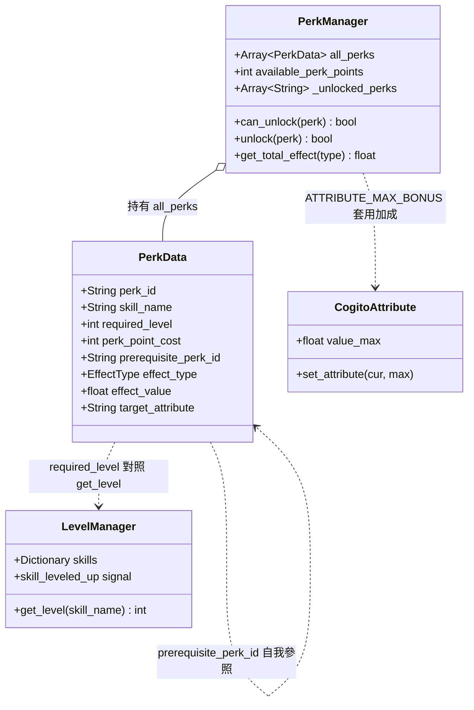
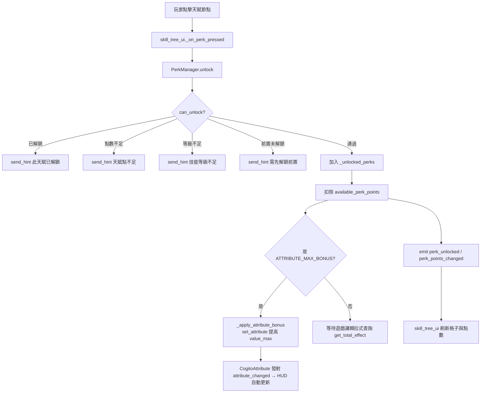

# 教學：技能樹 UI（Skill Tree UI）

本教學說明如何為 `LevelManager`（`skyrim_leveling_system.md`）建立可操作的技能樹介面：顯示技能等級、解鎖天賦（Perk）、消耗天賦點，以及天賦效果如何影響遊戲數值（含對 `CogitoAttribute` 的上限加成）。

## 前置知識
- 已完成 [教學：Skyrim 升級系統](./skyrim_leveling_system.md)（`LevelManager` 已存在，提供 `get_level()` / `skills` / `skill_leveled_up`）。
- 了解 Godot 4 `Control` 節點基礎。
- 對 Cogito UI 開關協議有概念，參見架構分析 [Level 5A 物品欄 UI](../architecture/level5a_inventory_ui.md) 與 [Level 5B 屬性系統](../architecture/level5b_attributes.md)。

---

## 〇、既有機制 vs. 自訂部分（先釐清邊界）

Cogito **沒有內建技能樹**，但有一套成熟的「外部 UI 開關協議」與屬性系統可以複用。本教學的技能樹必須**寄生在這套既有協議上**，而不是自己另造一套暫停／滑鼠捕捉邏輯。

| 部分 | 來源 | 說明 |
|---|---|---|
| UI 開關協議（暫停移動＋滑鼠切換） | **既有** | `cogito_player.gd` 的 `toggled_interface` 信號 → `player_hud_manager.gd:289` 的 `_on_external_ui_toggle()` |
| 移動暫停／滑鼠捕捉切換 | **既有** | `cogito_player.gd:331-342` 的 `_on_pause_movement()` / `_on_resume_movement()` |
| `is_showing_ui` 旗標 | **既有** | `cogito_player.gd:22`，移動／輸入邏輯據此判斷是否禁用 |
| ESC（menu）關閉外部 UI 的行為 | **既有** | `cogito_player.gd:399-419` 的 `_input()` 處理 |
| 屬性加成（修改 `value_max`） | **既有 API、自訂呼叫** | `cogito_attribute.gd:56` 的 `set_attribute()` |
| 玩家屬性字典查找 | **既有** | `cogito_player.gd` 的 `player_attributes` 字典（見 level5b） |
| 存檔持久化容器 | **既有** | `CogitoSceneManager._current_world_dict`（`cogito_scene_manager.gd:13`） |
| 提示訊息 | **既有** | `PlayerInteractionComponent.send_hint()`（`PlayerInteractionComponent.gd:328`） |
| 技能樹節點資料、解鎖判定、前置依賴、天賦點消耗 | **自訂** | 本教學的 `PerkData` / `PerkManager` / `skill_tree_ui.gd` |

> ⚠ **重要**：Cogito 沒有 `CommandManager.AddCommandShowUI` 之類的命令式 UI 註冊 API（那是其他引擎/專案的概念）。Cogito 一律走「信號 + HUD Manager 監聽」的模式。技能樹要被當成「外部 UI」對待，沿用 `toggled_interface` 即可，**不要自己呼叫 `Input.set_mouse_mode()`**，交給玩家節點處理（理由見第七、九節）。

---

## 一、資料結構：PerkData 資源

天賦是掛在技能樹節點上的資料，建立 `res://scripts/perk_data.gd`。為了讓資料驅動更乾淨，這裡額外引入兩個欄位：`skill_name`（明確指定所屬技能，取代用底線拆字串猜技能名的脆弱寫法）與 `perk_point_cost`（解鎖消耗的天賦點），以及一個讓加成能落到 `CogitoAttribute` 的 `target_attribute`：

```gdscript
# res://scripts/perk_data.gd
extends Resource
class_name PerkData

## 天賦唯一 ID（如 "one_handed_power_strike"）
@export var perk_id: String
## 所屬技能名（對應 LevelManager.skills 的 key，如 "one_handed"）。
## 明確指定，不要再用字串拆解去猜，避免命名一變就壞。
@export var skill_name: String
## 顯示名稱
@export var perk_name: String
## 描述
@export_multiline var description: String
## 解鎖所需技能等級
@export var required_level: int = 10
## 解鎖消耗的天賦點數
@export var perk_point_cost: int = 1
## 前置天賦（必須先解鎖此天賦才能解鎖本天賦）
@export var prerequisite_perk_id: String = ""
## 天賦效果類型
enum EffectType { DAMAGE_MULTIPLIER, STAMINA_REDUCTION, CRITICAL_CHANCE, ATTRIBUTE_MAX_BONUS, CUSTOM }
@export var effect_type: EffectType = EffectType.DAMAGE_MULTIPLIER
## 效果數值
@export var effect_value: float = 0.1
## 若 effect_type == ATTRIBUTE_MAX_BONUS，加成要套用到哪個 CogitoAttribute
## （對應 player.player_attributes 的 key，如 "health"、"stamina"）
@export var target_attribute: String = ""
## 圖示
@export var icon: Texture2D
```

> **設計說明**：`ATTRIBUTE_MAX_BONUS` 是新增的效果類型，讓「+20 最大耐力」這類天賦能直接落到 Cogito 既有的 `CogitoAttribute.value_max`（見第六節）。其餘類型（傷害倍率、暴擊率等）由你的遊戲邏輯在計算點主動查詢加總，屬於「拉式（pull）」加成。

### 技能樹資料結構（Mermaid）



---

## 二、PerkManager：天賦狀態管理（Autoload）

建立獨立 Autoload `PerkManager`（**Project Settings → Autoload**，名稱 `PerkManager`），與 `LevelManager` 同等地位。它管理：所有天賦清單、已解鎖集合、天賦點數、解鎖判定、加成查詢，以及存讀檔同步。

```gdscript
# res://scripts/perk_manager.gd (Autoload: PerkManager)
extends Node

signal perk_unlocked(perk: PerkData)
signal perk_points_changed(new_amount: int)

## 所有可用天賦，在 Inspector 中填入
@export var all_perks: Array[PerkData] = []

## 已解鎖的天賦 ID 集合
var _unlocked_perks: Array[String] = []

## 可用天賦點數
var available_perk_points: int = 0:
    set(value):
        available_perk_points = maxi(0, value)
        perk_points_changed.emit(available_perk_points)

## 存入 world_dict 時使用的鍵（避免與其他系統撞名）
const SAVE_KEY := "perk_manager_state"


func _ready() -> void:
    # 升級時自動發放天賦點（每升一級給 1 點，可自行調整規則）
    if LevelManager.has_signal("skill_leveled_up"):
        LevelManager.skill_leveled_up.connect(_on_skill_leveled_up)


func _on_skill_leveled_up(_skill_name: String, _new_level: int) -> void:
    available_perk_points += 1


func can_unlock(perk: PerkData) -> bool:
    if is_unlocked(perk.perk_id):
        return false
    if available_perk_points < perk.perk_point_cost:   # 點數不足
        return false
    if LevelManager.get_level(perk.skill_name) < perk.required_level:  # 技能等級不夠
        return false
    if perk.prerequisite_perk_id != "" and not is_unlocked(perk.prerequisite_perk_id):  # 前置天賦未解鎖
        return false
    return true


func unlock(perk: PerkData) -> bool:
    if not can_unlock(perk):
        return false
    _unlocked_perks.append(perk.perk_id)
    available_perk_points -= perk.perk_point_cost
    _apply_attribute_bonus(perk)
    perk_unlocked.emit(perk)
    return true


func is_unlocked(perk_id: String) -> bool:
    return perk_id in _unlocked_perks


## 取得某效果類型的加總數值（拉式加成：傷害倍率/暴擊率等由遊戲邏輯主動查詢）
func get_total_effect(effect_type: PerkData.EffectType) -> float:
    var total := 0.0
    for perk_id in _unlocked_perks:
        var perk := _find_perk(perk_id)
        if perk and perk.effect_type == effect_type:
            total += perk.effect_value
    return total


## 推式加成：解鎖即提高對應 CogitoAttribute 的 value_max（見第六節）
func _apply_attribute_bonus(perk: PerkData) -> void:
    if perk.effect_type != PerkData.EffectType.ATTRIBUTE_MAX_BONUS:
        return
    if perk.target_attribute == "":
        return
    var player = CogitoSceneManager._current_player_node
    if not player or not player.player_attributes.has(perk.target_attribute):
        return
    var attr: CogitoAttribute = player.player_attributes[perk.target_attribute]
    var new_max := attr.value_max + perk.effect_value
    # set_attribute() 先設 max 再 clamp current（cogito_attribute.gd:56），
    # 這裡同步把 current 也補上加成量，讓「+20 最大耐力」立即可用。
    attr.set_attribute(attr.value_current + perk.effect_value, new_max)


## 載入存檔後，重新把所有已解鎖的屬性加成套回 CogitoAttribute。
## 注意：載入時屬性的 current/max 已由 CogitoSceneManager 還原成「含加成的存檔值」，
## 因此這裡只需把「以 base 為基準計算的目標 max」對齊，不可重複疊加（見第八節陷阱）。
func reapply_attribute_bonuses_after_load() -> void:
    # 預設不重套，因為存檔已包含加成後的 value_max。
    # 僅在你的設計是「存 base 值、載入時重算」時才需要實作這裡。
    pass


func _find_perk(perk_id: String) -> PerkData:
    for perk in all_perks:
        if perk.perk_id == perk_id:
            return perk
    return null


## 存檔：序列化成可塞進 world_dict 的純資料字典
func save_to_dict() -> Dictionary:
    return {
        "unlocked": _unlocked_perks.duplicate(),
        "points": available_perk_points,
    }


## 讀檔：從字典還原
func load_from_dict(data: Dictionary) -> void:
    _unlocked_perks = data.get("unlocked", []).duplicate()
    available_perk_points = data.get("points", 0)
```

> **改動重點**：取消了原本用 `perk_id.split("_")` 拆字串猜技能名的 `_get_skill_from_perk()`（這在 `perk_id` 命名一變就壞、且對 `"archery_x"` 這類只有一個底線的 id 會越界）。改用明確的 `perk.skill_name` 欄位，更穩健也更易讀。

---

## 三、技能樹 UI 場景結構

在 `player_hud_manager.gd` 的 UI 下建立技能樹面板（與物品欄同層級，透過 Tab 切換）：

- **SkillTreePanel** (PanelContainer)
  - **MarginContainer**
    - **HBoxContainer**
      - **SkillList** (VBoxContainer) ← 左欄：技能選擇
        - SkillButton_OneHanded
        - SkillButton_Archery
        - ...
      - **PerkGrid** (GridContainer) ← 右欄：選定技能的天賦
        - (動態填入 PerkNode)

---

## 四、PerkNode：單一天賦節點

建立 `res://ui/perk_node.tscn`：

- **PerkNode** (PanelContainer) ← perk_node.gd
  - TextureRect (icon)
  - Label (perk_name)
  - Label (level_req，例如 "需要 Lv.10"）

```gdscript
# res://ui/perk_node.gd
extends PanelContainer

signal perk_pressed(perk: PerkData)

var _perk_data: PerkData = null

@onready var icon_rect: TextureRect = $TextureRect
@onready var name_label: Label = $PerkName
@onready var level_label: Label = $LevelReq


func setup(perk: PerkData) -> void:
    _perk_data = perk
    if perk.icon:
        icon_rect.texture = perk.icon
    name_label.text = perk.perk_name
    level_label.text = "Lv." + str(perk.required_level)
    _refresh_state()


func _refresh_state() -> void:
    if PerkManager.is_unlocked(_perk_data.perk_id):
        # 已解鎖：金色外框
        add_theme_stylebox_override("panel", _make_panel(Color(0.9, 0.7, 0.1)))
    elif PerkManager.can_unlock(_perk_data):
        # 可解鎖：亮色
        modulate = Color(1.0, 1.0, 1.0)
    else:
        # 鎖定：半透明灰色
        modulate = Color(0.5, 0.5, 0.5, 0.7)


func _make_panel(border_color: Color) -> StyleBoxFlat:
    var style := StyleBoxFlat.new()
    style.border_color = border_color
    style.set_border_width_all(2)
    return style


func _gui_input(event: InputEvent) -> void:
    if event is InputEventMouseButton and event.pressed and event.button_index == MOUSE_BUTTON_LEFT:
        perk_pressed.emit(_perk_data)
```

---

## 五、SkillTreeUI：主控腳本

```gdscript
# res://ui/skill_tree_ui.gd
extends Control

@export var perk_node_scene: PackedScene  # 指向 perk_node.tscn

@onready var skill_list: VBoxContainer = $MarginContainer/HBoxContainer/SkillList
@onready var perk_grid: GridContainer = $MarginContainer/HBoxContainer/PerkGrid
@onready var skill_name_label: Label = $MarginContainer/HBoxContainer/PerkGrid/SkillTitle
@onready var perk_points_label: Label = $MarginContainer/HBoxContainer/SkillList/PerkPoints

var _current_skill: String = "one_handed"

# 每個技能有哪些天賦（依 PerkData.skill_name 分組）
var _skill_perks: Dictionary = {}


func _ready() -> void:
    # 按技能分組天賦（用明確的 skill_name 欄位，不再拆字串）
    for perk in PerkManager.all_perks:
        if not _skill_perks.has(perk.skill_name):
            _skill_perks[perk.skill_name] = []
        _skill_perks[perk.skill_name].append(perk)

    _build_skill_buttons()
    _update_points_label()
    PerkManager.perk_unlocked.connect(_on_perk_unlocked)
    PerkManager.perk_points_changed.connect(_on_points_changed)
    LevelManager.skill_leveled_up.connect(_on_skill_leveled_up)


func _update_points_label() -> void:
    perk_points_label.text = "天賦點：" + str(PerkManager.available_perk_points)


func _on_points_changed(_amount: int) -> void:
    _update_points_label()
    _refresh_perk_grid()  # 點數變化可能讓某些天賦從不可解鎖變可解鎖


func _build_skill_buttons() -> void:
    for skill_name in LevelManager.skills.keys():
        var btn = Button.new()
        btn.text = skill_name.capitalize().replace("_", " ")
        btn.pressed.connect(_on_skill_selected.bind(skill_name))
        skill_list.add_child(btn)


func _on_skill_selected(skill_name: String) -> void:
    _current_skill = skill_name
    _refresh_perk_grid()


func _refresh_perk_grid() -> void:
    for child in perk_grid.get_children():
        child.queue_free()

    skill_name_label.text = _current_skill.capitalize().replace("_", " ") + \
                            "  Lv." + str(LevelManager.get_level(_current_skill))

    var perks_for_skill = _get_perks_for_skill(_current_skill)
    for perk in perks_for_skill:
        var node = perk_node_scene.instantiate()
        perk_grid.add_child(node)
        node.setup(perk)
        node.perk_pressed.connect(_on_perk_pressed)


func _get_perks_for_skill(skill_name: String) -> Array:
    return _skill_perks.get(skill_name, [])


func _on_perk_pressed(perk: PerkData) -> void:
    if PerkManager.unlock(perk):
        _refresh_perk_grid()
        _update_points_label()
    else:
        var player = CogitoSceneManager._current_player_node
        if player and player.player_interaction_component:
            var msg := ""
            if PerkManager.is_unlocked(perk.perk_id):
                msg = "此天賦已解鎖"
            elif PerkManager.available_perk_points < perk.perk_point_cost:
                msg = "天賦點不足（需要 " + str(perk.perk_point_cost) + " 點）"
            elif LevelManager.get_level(_current_skill) < perk.required_level:
                msg = "技能等級不足（需要 Lv." + str(perk.required_level) + "）"
            elif perk.prerequisite_perk_id != "" and not PerkManager.is_unlocked(perk.prerequisite_perk_id):
                msg = "需先解鎖前置天賦"
            # send_hint(hint_icon: Texture2D, hint_text: String) — PlayerInteractionComponent.gd:328
            player.player_interaction_component.send_hint(null, msg)


func _on_perk_unlocked(_perk: PerkData) -> void:
    _refresh_perk_grid()


func _on_skill_leveled_up(skill_name: String, _new_level: int) -> void:
    if skill_name == _current_skill:
        _refresh_perk_grid()
```

---

## 六、天賦效果套用（兩種模式）

天賦加成有兩種落地方式，搭配使用：

### 模式 A：拉式（pull）—— 遊戲邏輯主動查詢

倍率、減免、機率這類「在計算點才需要」的加成，由你的遊戲邏輯呼叫 `PerkManager.get_total_effect()` 加總：

```gdscript
# 近戰傷害加成（在武器命中時）
var base_damage = item_reference.wieldable_damage
var perk_mult = 1.0 + PerkManager.get_total_effect(PerkData.EffectType.DAMAGE_MULTIPLIER)
var final_damage = base_damage * perk_mult * LevelManager.get_damage_multiplier("one_handed")
collider.damage_received.emit(final_damage, direction, hit_pos)

# 耐力消耗減少（在 cogito_player.gd 的快跑消耗處）
var stamina_reduction = PerkManager.get_total_effect(PerkData.EffectType.STAMINA_REDUCTION)
var final_drain = sprint_stamina_drain * (1.0 - stamina_reduction)
decrease_attribute("stamina", final_drain * delta)
```

### 模式 B：推式（push）—— 解鎖即修改 CogitoAttribute 上限

「+20 最大生命/耐力」這種屬於屬性本身的永久加成，解鎖當下就寫進 Cogito 既有的 `CogitoAttribute`。`PerkManager._apply_attribute_bonus()`（第二節）呼叫的是既有 API：

- `CogitoAttribute.set_attribute(value_current, value_max)` — **位置 `cogito_attribute.gd:56`**，會先設 `value_max` 再對 `value_current` 做 clamp（`cogito_attribute.gd:57-58`）。
- 玩家屬性以 `player.player_attributes[attribute_name]` 字典查找（鍵為 `attribute_name`，見 [level5b](../architecture/level5b_attributes.md)）。

```gdscript
# PerkManager 內，解鎖 ATTRIBUTE_MAX_BONUS 天賦時自動執行：
var attr: CogitoAttribute = player.player_attributes[perk.target_attribute]
attr.set_attribute(attr.value_current + perk.effect_value, attr.value_max + perk.effect_value)
```

> 因為 `set_attribute()` 內部會發射 `attribute_changed`（`cogito_attribute.gd:39/42`），HUD 的屬性條會**自動更新**，不需手動刷新 UI。

### 解鎖流程（Mermaid）



---

## 七、開啟技能樹 + 暫停／滑鼠捕捉整合（沿用 Cogito 既有協議）

這是最容易做錯的部分。**不要**自己呼叫 `Input.set_mouse_mode()` 或自己管暫停，要把技能樹當成 Cogito 的「外部 UI」，沿用既有的 `toggled_interface` 協議。

### 既有協議怎麼運作（附行號）

Cogito 的外部 UI（readable、keypad、外部箱子等）開關，全部走同一條鏈：

1. `cogito_player.gd:11` 定義 `signal toggled_interface(is_showing_ui: bool)`。
2. `player_hud_manager.gd:116` 在 `connect_to_player_signals()` 把它接到 `_on_external_ui_toggle()`。
3. `player_hud_manager.gd:289-299` 的 `_on_external_ui_toggle(is_showing)`：
   - 顯示時呼叫 `player._on_pause_movement()`、設 `player.is_showing_ui = true`、隱藏準心與互動提示；
   - 隱藏時呼叫 `player._on_resume_movement()`、設 `player.is_showing_ui = false`、恢復準心。
4. `cogito_player.gd:331-342` 的 `_on_pause_movement()` / `_on_resume_movement()` 才是**真正切換滑鼠模式**的地方：
   - 暫停且輸入裝置為鍵鼠（`InputHelper.device_index == -1`）時 `Input.set_mouse_mode(MOUSE_MODE_VISIBLE)`（`cogito_player.gd:336`）；
   - 恢復時 `Input.set_mouse_mode(MOUSE_MODE_CAPTURED)`（`cogito_player.gd:342`）。

> 把滑鼠捕捉交給 `_on_pause_movement()`，能自動正確處理「手把模式下不顯示滑鼠」這個分支（`cogito_player.gd:335` 的 `device_index` 判斷）。自己 hard-code 反而會破壞手把支援——這正是第一個常見陷阱。

### 開啟／關閉技能樹

把技能樹面板放在 `player_hud_manager.gd` 的 HUD 樹下（與 `$InventoryInterface` 同層，見 `player_hud_manager.gd:57`），並在 HUD Manager 監聽自訂輸入：

```gdscript
# player_hud_manager.gd（新增；@onready 指向你放進 HUD 場景的技能樹節點）
@onready var skill_tree_ui: Control = $SkillTreeUI

func _ready():
    # ...既有內容不動...
    skill_tree_ui.hide()  # 預設隱藏

func _input(event: InputEvent) -> void:
    if event.is_action_pressed("open_skill_tree"):  # 需在 Project Settings → Input Map 新增（如綁 K）
        _toggle_skill_tree()

func _toggle_skill_tree() -> void:
    if skill_tree_ui.visible:
        _close_skill_tree()
    else:
        # 若已有其他外部 UI（物品欄）開著就不疊開，避免兩層 UI 互搶焦點
        if player.is_showing_ui:
            return
        skill_tree_ui.show()
        skill_tree_ui.refresh()            # 對外公開的刷新入口（見下）
        player.toggled_interface.emit(true)  # ← 走既有協議：暫停移動 + 顯示滑鼠

func _close_skill_tree() -> void:
    skill_tree_ui.hide()
    player.toggled_interface.emit(false)   # ← 走既有協議：恢復移動 + 捕捉滑鼠
```

在 `skill_tree_ui.gd` 補一個公開的 `refresh()`（包裝既有的 `_refresh_perk_grid()` 與點數刷新），避免外部直接呼叫底線私有方法：

```gdscript
# skill_tree_ui.gd
func refresh() -> void:
    _update_points_label()
    _refresh_perk_grid()
```

### 也讓 ESC 能關閉技能樹（與既有 menu 行為一致）

Cogito 在 `cogito_player.gd:399-419` 的 `_input()` 中，按 menu（ESC）時：若 `is_showing_ui` 為真，會 `emit menu_pressed` 並在物品欄開著時關掉物品欄。技能樹同理——最簡單的做法是在 HUD Manager 的 `_input()` 裡攔 `menu`：

```gdscript
# player_hud_manager.gd _input() 內，置於開啟判斷之後
    if event.is_action_pressed("menu") and skill_tree_ui.visible:
        _close_skill_tree()
        get_viewport().set_input_as_handled()  # 吃掉這次輸入，避免同時開啟暫停選單
```

> ⚠ 不吃掉輸入的話，同一個 `menu` 事件會被玩家節點 `cogito_player.gd:400` 再處理一次，導致「關技能樹的同時又彈出暫停選單」。

---

## 八、存檔整合（已解鎖天賦持久化）

Cogito 的存檔不要去改 `CogitoPlayerState` 資源（`cogito_player_state.gd`）那一長串 `@export` 欄位——那需要動引擎檔且容易在更新時衝突。**正確做法是用既有的 `world_dictionary` 通用容器**：

### world_dict 機制（附行號）

- `CogitoSceneManager` 持有運行期的 `_current_world_dict`（**`cogito_scene_manager.gd:13`**）。
- 存檔時：`save_player_state()` 把 `_current_world_dict` 整包複製進 `CogitoPlayerState.world_dictionary`（**`cogito_scene_manager.gd:285-290`**）。
- 讀檔時：`load_player_state()` 反向把 `world_dictionary` 還原回 `_current_world_dict`（**`cogito_scene_manager.gd:182-186`**），然後發射 `player.player_state_loaded`（**`cogito_scene_manager.gd:208`**）。
- 寫值的便利方法：`CogitoPlayerState.add_to_world_dictionary(key, value)`（`cogito_player_state.gd:146`）；但運行期我們直接操作 `_current_world_dict` 這個字典即可。

### 接線：存檔前寫入、讀檔後還原

在 `PerkManager` 補上掛鉤（`_ready()` 內連接）：

```gdscript
# perk_manager.gd
func _ready() -> void:
    if LevelManager.has_signal("skill_leveled_up"):
        LevelManager.skill_leveled_up.connect(_on_skill_leveled_up)

    # 讀檔完成後還原（player_state_loaded 由 CogitoSceneManager 於還原 world_dict 之後發射）
    var player = CogitoSceneManager._current_player_node
    if player:
        player.player_state_loaded.connect(_on_player_state_loaded)

    # 存檔通常在 CogitoSceneManager.save_player_state() 前一刻，
    # 最穩的做法是「每次解鎖／點數變動就即時寫回 _current_world_dict」，
    # 這樣不論何時存檔都拿到最新值。
    perk_unlocked.connect(func(_p): _sync_to_world_dict())
    perk_points_changed.connect(func(_a): _sync_to_world_dict())


func _sync_to_world_dict() -> void:
    CogitoSceneManager._current_world_dict[SAVE_KEY] = save_to_dict()


func _on_player_state_loaded() -> void:
    var data = CogitoSceneManager._current_world_dict.get(SAVE_KEY, {})
    if data is Dictionary and not data.is_empty():
        load_from_dict(data)
```

> **為何即時同步而非「存檔當下才寫」**：Cogito 沒有暴露「即將存檔」的信號給外部系統訂閱，`save_player_state()` 只讀 `_current_world_dict` 的當前值（`cogito_scene_manager.gd:286`）。因此採「狀態一變就寫回字典」，存檔時自然拿到最新內容。

### 屬性加成與存檔的關係（重要）

`ATTRIBUTE_MAX_BONUS` 透過 `set_attribute()` 改的 `value_max`，會被 Cogito 的屬性存檔機制原樣存下來：`save_player_state()` 存的是 `value_max`（含加成後的值，`cogito_scene_manager.gd:265`），讀檔時 `set_attribute(cur, max)` 直接還原（`cogito_scene_manager.gd:172`）。

因此 **讀檔後不可再對屬性重套一次加成**，否則會double。`PerkManager.reapply_attribute_bonuses_after_load()` 預設留空（pass）正是這個原因——`_unlocked_perks` 清單要還原（給 UI 顯示用），但屬性數值本身已由 Cogito 內建存檔處理好。

---

## 九、常見陷阱

| 陷阱 | 後果 | 正解 |
|---|---|---|
| 自己呼叫 `Input.set_mouse_mode()` 開關滑鼠 | 破壞手把支援（`cogito_player.gd:335` 的 device 判斷被繞過） | 一律 `player.toggled_interface.emit(true/false)`，讓 `_on_pause_movement()` 處理（`cogito_player.gd:331-342`） |
| ESC 關技能樹後又彈出暫停選單 | 同一個 menu 事件被兩處處理 | 關閉後 `get_viewport().set_input_as_handled()` 吃掉輸入 |
| 在物品欄已開時又疊開技能樹 | 兩層外部 UI 互搶焦點、`is_showing_ui` 狀態錯亂 | 開啟前檢查 `if player.is_showing_ui: return` |
| 讀檔後重複套用屬性加成 | 最大值被 double（如最大耐力 +20 變成 +40） | `value_max` 已由 Cogito 內建存檔還原（`cogito_scene_manager.gd:172/265`），勿重套 |
| 用 `perk_id.split("_")` 猜技能名 | id 只有一個底線時越界、命名一改就壞 | 用明確的 `PerkData.skill_name` 欄位 |
| 去改 `cogito_player_state.gd` 新增 `@export` 存技能 | 引擎檔衝突、升級難維護 | 用既有 `_current_world_dict`（`cogito_scene_manager.gd:13`） |
| 在 `Autoload` 的 `_ready()` 就抓 `_current_player_node` | 載入早期玩家可能還沒就緒（為 null） | 套用屬性加成時臨抓並判 null（見 `_apply_attribute_bonus()`） |
| 技能樹節點用 `_gui_input` 但 `mouse_filter` 設成 IGNORE | 點擊收不到 | `PanelContainer` 預設 `STOP`，確認子節點 Label 不要吃掉事件（設 `IGNORE`） |

---

## 十、驗證清單

| 測試步驟 | 預期結果 |
|---|---|
| 按 K 開啟技能樹 | 面板顯示，玩家無法移動，鍵鼠模式下滑鼠出現（`cogito_player.gd:336`） |
| 手把模式下開啟 | 移動暫停但滑鼠不強制顯示（device_index 判斷生效） |
| 物品欄開著時按 K | 不疊開技能樹（`is_showing_ui` 檢查） |
| 開技能樹後按 ESC | 技能樹關閉，且**不**彈出暫停選單 |
| 點選左欄技能 | 右欄顯示對應天賦節點 |
| 點數/等級/前置不足 | 半透明灰色，點擊由 `send_hint` 顯示對應原因 |
| 達標後點選天賦 | 解鎖、扣天賦點、顯示金色外框 |
| 解鎖 ATTRIBUTE_MAX_BONUS 天賦 | HUD 屬性條上限即時提高（`attribute_changed` 自動刷新） |
| 解鎖傷害天賦後攻擊 | 實際傷害數值提升（Console 可驗證 `get_total_effect`） |
| 存檔→重載 | 已解鎖天賦與天賦點還原；屬性上限不被 double |
