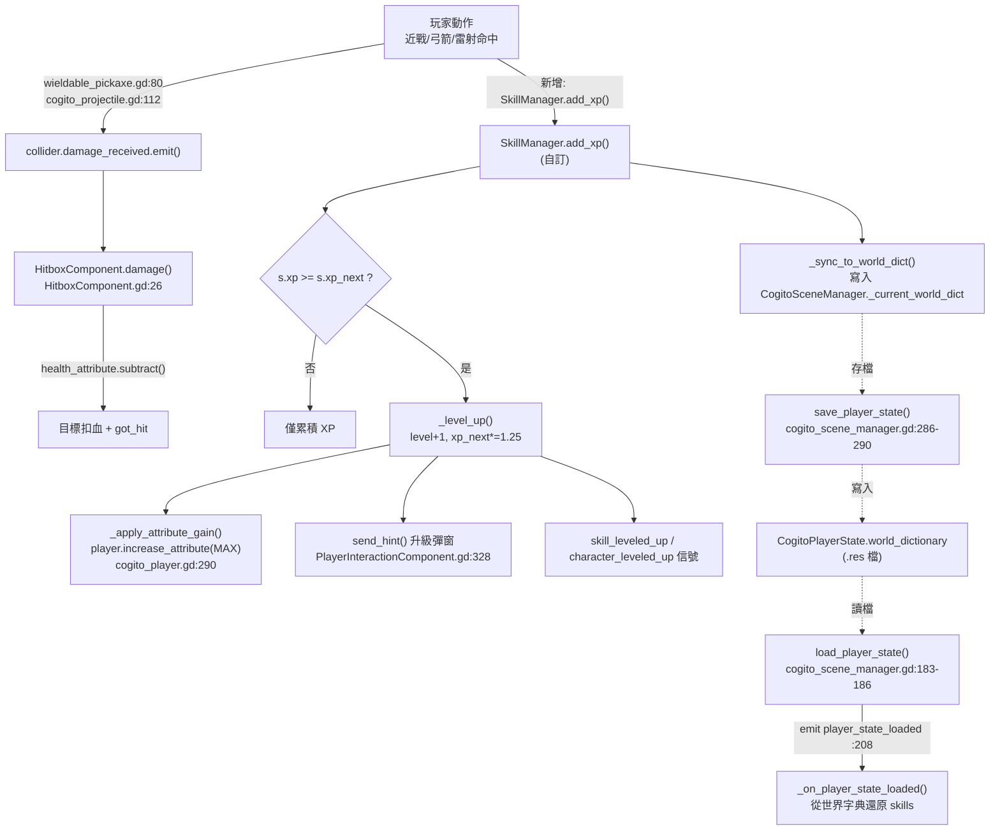

# 教學：實作 Skyrim 風格升級系統 (Learn by Doing)

Skyrim 的核心特色是「技能隨使用而成長」（learn by doing）。COGITO 本身**沒有**完整的 RPG 技能／等級系統，只提供了屬性（`CogitoAttribute`）、命中事件（`damage_received` 信號 + `HitboxComponent`）與存讀檔（`CogitoSceneManager` + `CogitoPlayerState`）等可接入點。本教學的工作是：

1. 自建一個全域 `SkillManager`（Autoload），負責 XP 累積、等級曲線、屬性提升；
2. 把它**正確掛接**到 COGITO 既有的命中事件、屬性 API 與存讀檔流程上。

> **重要區分**：下文每一段都會明確標示「COGITO 既有接入點（附真實行號）」與「教學新增的自訂代碼」。前者的行號皆已對 `/home/lorkhan/code/Cogito-1.1.5` 原始碼核對；後者是要你新建的檔案，不在原始碼內。

## 前置知識
- 已閱讀 [Level 3C: Wieldable 玩家動作](../architecture/level3_wieldables.md) 與 [Level 5B: 屬性系統](../architecture/level5b_attributes.md)。
- 瞭解 GDScript Autoload 與信號 (signal) 基礎。

---

## 〇、先盤點 COGITO 提供的接入點（真相層）

在動手前，先確認我們要鉤住的四個既有機制都真的存在：

| 接入點 | 原始碼位置 | 作用 |
|---|---|---|
| 武器命中發射 `damage_received` | `addons/cogito/Wieldables/wieldable_pickaxe.gd:80`、`wieldable_laser_rifle.gd:130`、`CogitoObjects/cogito_projectile.gd:112` | 近戰／雷射／投射物命中目標時發射 |
| 目標承接命中（`HitboxComponent`） | `addons/cogito/Components/HitboxComponent.gd:18-48` | 連到父節點的 `damage_received`，扣血並發射 `got_hit` 信號 |
| NPC 宣告 `damage_received` 信號 | `addons/cogito/CogitoNPC/cogito_npc.gd:5` | NPC 是「可受傷目標」的代表 |
| 玩家屬性 API | `addons/cogito/CogitoObjects/cogito_player.gd:280`（`increase_attribute`）、`:297`（`decrease_attribute`） | 提升／扣減屬性的官方入口 |
| 存讀檔（世界字典） | `addons/cogito/SceneManagement/cogito_scene_manager.gd:13`（`_current_world_dict`）、`:286-290`（存）、`:183-186`（讀） | 自訂資料持久化的最省力載體 |
| 載入完成信號 | `addons/cogito/CogitoObjects/cogito_player.gd:9`（`signal player_state_loaded`），`cogito_scene_manager.gd:208` 發射 | 讀檔後重建快取的時機點 |
| 玩家節點全域引用 | `addons/cogito/CogitoObjects/cogito_player.gd:219`（`CogitoSceneManager._current_player_node = self`） | Autoload 取得當前玩家 |
| HUD 提示 | `addons/cogito/Components/PlayerInteractionComponent.gd:328`（`send_hint`） | 升級彈窗文字 |

下面把這些點逐一串起來。

---

## 一、命中事件的真實資料流（理解後才好掛鉤）

近戰武器的命中偵測在 `wieldable_pickaxe.gd:58-81`（`::_on_body_entered`）。它的真實邏輯是：偵測 `damage_area`（一個 `Area3D`）的 `body_entered`，若進入的 `collider` **具有 `damage_received` 信號**就發射傷害：

```gdscript
# addons/cogito/Wieldables/wieldable_pickaxe.gd:58-81（既有原始碼，未修改）
func _on_body_entered(collider):
	if collider.has_signal("damage_received"):
		var player = player_interaction_component.get_parent()
		var hit_position : Vector3
		var bullet_direction : Vector3
		if use_camera_collision:
			hit_position = player_interaction_component.Get_Camera_Collision()
			bullet_direction = (hit_position - player.get_global_transform().origin).normalized()
		else:
			# Hitbox-Collider raycast ...
			...
		collider.damage_received.emit(item_reference.wieldable_damage, bullet_direction, hit_position)
```

接收端是 `HitboxComponent`：它在 `_ready()` 把自己的 `damage()` 連到父節點的 `damage_received`（`HitboxComponent.gd:18-23`），命中後扣 `health_attribute` 並發射 `got_hit`（`HitboxComponent.gd:26-48`）：

```gdscript
# addons/cogito/Components/HitboxComponent.gd:18-28, 48（既有原始碼）
func _ready() -> void:
	if get_parent().has_signal("damage_received"):
		if !get_parent().damage_received.is_connected(damage):
			get_parent().damage_received.connect(damage)
	...
func damage(damage_amount: float, _hit_direction:= Vector3.ZERO, _hit_position:= Vector3.ZERO):
	if health_attribute:
		health_attribute.subtract(damage_amount)
	...
	got_hit.emit()
```

> **修正既有教學的錯誤**：舊版教學在 §2 用 `collider.is_in_group("Enemy")` 判斷有效命中。COGITO 原始碼**沒有**使用 `"Enemy"` 群組，可受傷目標的判準是「有 `damage_received` 信號」（見上）。`CogitoNPC` 在 `cogito_npc.gd:5` 宣告該信號，因此 NPC 即合法目標。請改用 `collider.has_signal("damage_received")` 作判準。

兩種掛鉤策略，擇一即可：

- **A. 在武器腳本注入**（侵入式，但能拿到傷害值與命中點）：直接在 `wieldable_pickaxe.gd` 的命中分支尾端加一行 `SkillManager.add_xp(...)`。
- **B. 監聽 `HitboxComponent.got_hit`**（非侵入式，不改 addon 原始碼）：在目標的 `HitboxComponent` 旁掛一個小腳本監聽 `got_hit`。缺點是 `got_hit` 不帶傷害值（`HitboxComponent.gd:4` 只是 `signal got_hit`）。

本教學以 A 為主示範（資訊量大），並在 §九說明 B 的非侵入做法。

---

## 二、建立 SkillManager Autoload（自訂代碼）

> 以下整個檔案是**教學新增的自訂代碼**，不在 COGITO 原始碼內。建立 `res://scripts/skill_manager.gd`，並在 **Project Settings → Autoload** 加入（名稱：`SkillManager`，置於 `CogitoSceneManager` 之後以確保載入順序）。

```gdscript
# res://scripts/skill_manager.gd（自訂）
extends Node

## 技能升級時發射：技能鍵、新等級
signal skill_leveled_up(skill_name: String, new_level: int)
## 整體角色等級提升時發射（所有技能等級加總跨過門檻）
signal character_leveled_up(new_level: int)

## 對應到玩家屬性的提升設定：升一級時，對哪個屬性、加多少（走 MAX value type）
const SKILL_TO_ATTRIBUTE := {
	"one_handed":  {"attribute": "health",  "per_level": 2.0},
	"archery":     {"attribute": "stamina", "per_level": 1.0},
	"heavy_armor": {"attribute": "health",  "per_level": 3.0},
	"restoration": {"attribute": "health",  "per_level": 1.0},
}

## 技能狀態：名稱 → {level, xp, xp_next}
var skills : Dictionary = {
	"one_handed":  {"level": 1, "xp": 0.0, "xp_next": 100.0},
	"archery":     {"level": 1, "xp": 0.0, "xp_next": 100.0},
	"heavy_armor": {"level": 1, "xp": 0.0, "xp_next": 100.0},
	"restoration": {"level": 1, "xp": 0.0, "xp_next": 100.0},
}

## 世界字典中用來存放本系統資料的鍵（見 §七）
const WORLD_DICT_KEY := "skyrim_skill_data"


func _ready() -> void:
	# 讀檔完成後重建快取。player_state_loaded 由 cogito_scene_manager.gd:208 發射。
	# 玩家可能比本 Autoload 晚就緒，故用 call_deferred 確保 _current_player_node 已設。
	call_deferred("_connect_player_state_loaded")


func _connect_player_state_loaded() -> void:
	var player = CogitoSceneManager._current_player_node
	if player and not player.player_state_loaded.is_connected(_on_player_state_loaded):
		player.player_state_loaded.connect(_on_player_state_loaded)


## --- XP 與升級核心 ---

func add_xp(skill_name: String, amount: float) -> void:
	if not skills.has(skill_name):
		push_warning("SkillManager: Unknown skill: " + skill_name)
		return
	var s : Dictionary = skills[skill_name]
	s.xp += amount
	# CogitoGlobals.debug_log 簽名：(log_this:bool, _class:String, _message:String)，見 cogito_globals.gd:40
	CogitoGlobals.debug_log(true, "SkillManager",
		"%s +%.1f XP (%.1f/%.1f)" % [skill_name, amount, s.xp, s.xp_next])
	while s.xp >= s.xp_next:
		s.xp -= s.xp_next
		_level_up(skill_name)
	_sync_to_world_dict()


func _level_up(skill_name: String) -> void:
	var s : Dictionary = skills[skill_name]
	s.level += 1
	s.xp_next = round(s.xp_next * 1.25)   # 每級所需經驗 +25%（指數曲線）
	_apply_attribute_gain(skill_name)
	skill_leveled_up.emit(skill_name, s.level)
	_notify_level_up(skill_name, s.level)
	CogitoGlobals.debug_log(true, "SkillManager", skill_name + " 升至 Lv." + str(s.level))
	_check_character_level()


## 把技能升級轉換成玩家屬性提升 —— 走 COGITO 官方 API
func _apply_attribute_gain(skill_name: String) -> void:
	if not SKILL_TO_ATTRIBUTE.has(skill_name):
		return
	var player = CogitoSceneManager._current_player_node
	if not player:
		return
	var cfg = SKILL_TO_ATTRIBUTE[skill_name]
	# increase_attribute 的 ValueType.MAX 會同時提高 value_max 與 value_current
	# （見 cogito_player.gd:290-293）。這正是「升級提升上限」要的行為。
	player.increase_attribute(cfg.attribute, cfg.per_level, ConsumableItemPD.ValueType.MAX)


func get_level(skill_name: String) -> int:
	return skills.get(skill_name, {}).get("level", 1)


## 技能修正值：Lv.1 = 1.0，每級 +1%（Lv.50 ≈ 1.49）
func get_damage_multiplier(skill_name: String) -> float:
	return 1.0 + (get_level(skill_name) - 1) * 0.01


## 整體角色等級 = 所有技能等級加總（Skyrim 的角色等級也是技能升級驅動）
func get_character_level() -> int:
	var total := 0
	for k in skills:
		total += skills[k].level
	return total

var _last_character_level : int = -1
func _check_character_level() -> void:
	var lvl := get_character_level()
	if _last_character_level == -1:
		_last_character_level = lvl
		return
	if lvl > _last_character_level:
		_last_character_level = lvl
		character_leveled_up.emit(lvl)
```

**設計重點**：升級提升屬性時**不直接寫 `attribute.value_max`**，而是呼叫 `player.increase_attribute(name, amount, ValueType.MAX)`。原始碼 `cogito_player.gd:290-293` 顯示 MAX 分支會同時 `value_max += value` 並 `attribute.add(value)`，等於「上限變大、且當前值也補上來」，符合升級直覺，也讓 setter 正常發射 `attribute_changed` 讓 HUD 即時更新。

---

## 三、串接近戰武器（修改既有檔 / 自訂代碼）

在 `wieldable_pickaxe.gd:80` 發射傷害之後，加入 XP 累積。注意改用 `has_signal` 判準而非 `is_in_group`：

```gdscript
# addons/cogito/Wieldables/wieldable_pickaxe.gd:58-81 的命中分支尾端（新增 2 行）
func _on_body_entered(collider):
	if collider.has_signal("damage_received"):
		# ... 既有原始碼：取得 hit_position / bullet_direction ...
		var raw_damage : float = item_reference.wieldable_damage
		var final_damage : float = raw_damage * SkillManager.get_damage_multiplier("one_handed")  # 新增
		collider.damage_received.emit(final_damage, bullet_direction, hit_position)               # 改：用 final_damage
		SkillManager.add_xp("one_handed", raw_damage * 0.5)                                        # 新增：命中即得 XP
```

`item_reference.wieldable_damage` 是既有欄位，原始碼在 `wieldable_pickaxe.gd:80` 已直接使用。這裡同時完成了「技能影響傷害」與「命中給 XP」兩件事，避免重複貼程式碼（舊教學 §2 與 §4 分開示範，實作時合併即可）。

---

## 四、串接弓箭 / 投射物（修改既有檔 / 自訂代碼）

COGITO 的投射物在 `cogito_projectile.gd`，命中發射 `damage_received` 在 `cogito_projectile.gd:60-112`（`::_on_body_entered` 內）：

```gdscript
# addons/cogito/CogitoObjects/cogito_projectile.gd:60, 112（既有原始碼節錄）
func _on_body_entered(collider):
	if collider.has_signal("damage_received"):
		...
	collider.damage_received.emit(damage_amount, bullet_direction, bullet_position)
```

在該 `if collider.has_signal("damage_received")` 分支內加一行給弓箭技能 XP：

```gdscript
# cogito_projectile.gd 命中分支內（新增）
if collider.has_signal("damage_received"):
	SkillManager.add_xp("archery", 8.0)   # 新增：投射物命中給固定 archery XP
```

雷射步槍（`wieldable_laser_rifle.gd:129-130`）同理，可比照在命中分支加 `SkillManager.add_xp("archery", ...)`。

> **注意**：舊教學的 §3 假設一個 `arrow.body_entered.connect(_on_arrow_hit)` 的自訂弓箭腳本，但 COGITO 內建走的是 `cogito_projectile.gd`。若你用內建投射物，請鉤這裡而非自己重寫一套箭矢。

---

## 五、升級 UI 提示（自訂代碼 + 既有接入點）

升級彈窗走 `PlayerInteractionComponent.send_hint(hint_icon: Texture2D, hint_text: String)`（`PlayerInteractionComponent.gd:328-329`，內部只是 `hint_prompt.emit(...)`，由 `player_hud_manager.gd` 接收顯示）。玩家節點透過 `CogitoSceneManager._current_player_node`（在 `cogito_player.gd:219` 設定）取得：

```gdscript
# skill_manager.gd 中（自訂）
func _notify_level_up(skill_name: String, new_level: int) -> void:
	var player = CogitoSceneManager._current_player_node
	if player and player.player_interaction_component:
		player.player_interaction_component.send_hint(
			null,  # hint_icon: Texture2D（可傳技能圖示）
			"%s 升至 Lv.%d！" % [skill_name.capitalize(), new_level]
		)
```

`player_interaction_component` 是玩家節點上的既有引用（`wieldable_pickaxe.gd:60` 等處皆以 `player_interaction_component.get_parent()` 反向取得玩家，可佐證該屬性存在）。

---

## 六、技能影響其他屬性：以「重甲降低耐力消耗」為例（修改既有檔）

> **修正既有教學的錯誤**：舊教學 §6 說耐力扣除在「`cogito_player.gd` 約第 900 行」。實際上**耐力消耗不在 `cogito_player.gd`**，而在耐力屬性元件 `cogito_stamina_attribute.gd:36-47`（`::_process`），扣減點是 `:47` 的 `subtract(exhaustion * delta)`，扣減量由 `::_run_exhaustion()`（`:60-89`）算出：

```gdscript
# addons/cogito/Components/Attributes/cogito_stamina_attribute.gd:42-47（既有原始碼）
if player.is_sprinting and player.current_speed > player.WALKING_SPEED and player.velocity.length() > 0.1:
	regen_timer.stop()
	is_regenerating = false
	var exhaustion: float = _run_exhaustion()
	subtract(exhaustion * delta)
```

正確的注入點是把 `exhaustion` 乘上重甲技能折扣（改 `cogito_stamina_attribute.gd:46-47`）：

```gdscript
# cogito_stamina_attribute.gd:46-47（修改）
var exhaustion: float = _run_exhaustion()
var armor_level : int = SkillManager.get_level("heavy_armor")          # 新增
exhaustion *= maxf(0.5, 1.0 - (armor_level - 1) * 0.005)               # 新增：每級 -0.5%，下限 50%
subtract(exhaustion * delta)
```

`subtract` 是 `CogitoAttribute` 基類方法（見 `level5b_attributes.md` §一）。`maxf(0.5, ...)` 用來防止高等級把消耗壓到負數或 0。

---

## 七、存讀檔整合（自訂代碼掛上既有流程）

> **修正既有教學的嚴重錯誤**：舊教學 §7 假設玩家有 `save()` / `set_state()` 方法，且存在 `CogitoSceneManager.player_state_data` 欄位。經核對原始碼，**這兩者都不存在**：
> - 玩家狀態的存讀檔由 `cogito_scene_manager.gd` 的 `save_player_state()`（`:215-310`）與 `load_player_state()`（`:116-211`）統一處理；
> - 狀態容器是 `CogitoPlayerState`（`cogito_player_state.gd`），其欄位是固定 `@export`（如 `player_attributes`、`world_dictionary` 等），**沒有任意 `skill_data` 鍵**；
> - 不存在 `player_state_data` 這個欄位名。

正確且最省力的持久化載體是 **世界字典 `CogitoSceneManager._current_world_dict`**（`cogito_scene_manager.gd:13`）。它在存檔時被整包寫入 `CogitoPlayerState.world_dictionary`（`:286-290`），讀檔時被整包還原（`:183-186`）。我們只要把技能資料塞進這個字典，存讀檔就自動帶上，**完全不必改 addon 的存檔程式碼**。

```gdscript
# skill_manager.gd 中（自訂）

## 每次 XP/升級變動後，把技能資料同步進世界字典（存檔時會被一起寫入）
func _sync_to_world_dict() -> void:
	CogitoSceneManager._current_world_dict[WORLD_DICT_KEY] = skills.duplicate(true)


## 讀檔完成（player_state_loaded 發射）後，從世界字典還原
func _on_player_state_loaded() -> void:
	var data = CogitoSceneManager._current_world_dict.get(WORLD_DICT_KEY, null)
	if data == null:
		return
	for key in data:
		if skills.has(key):
			skills[key] = data[key]
	_last_character_level = get_character_level()
	CogitoGlobals.debug_log(true, "SkillManager", "技能資料已從存檔還原。")
```

幾個原始碼依據：

- 寫入時機：`save_player_state()` 在 `cogito_scene_manager.gd:286` 把 `_current_world_dict` 整個 `duplicate(true)` 後逐項寫入 `_player_state.world_dictionary`（`:288-290`，呼叫 `CogitoPlayerState.add_to_world_dictionary()`，定義在 `cogito_player_state.gd:146-153`）。
- 還原時機：`load_player_state()` 在 `cogito_scene_manager.gd:183-186` 把 `_player_state.world_dictionary` 複製回 `_current_world_dict`，**接著於 `:208` 發射 `player.player_state_loaded`**。因此在該信號的回呼裡讀 `_current_world_dict` 一定拿得到已還原的資料。
- 屬性提升的持久化：屬性的 `value_current` / `value_max` 由 `save_player_state()` 在 `:258-267` 逐一存進 `player_attributes`（每個屬性存成 `Vector2(current, max)`），讀檔時 `:167-172` 用 `set_attribute(cur, max)` 還原。也就是說，**升級帶來的屬性上限提升本來就會被 COGITO 原生存檔系統保存**，我們只需額外保存「技能等級／XP」即可。

> **陷阱**：`world_dictionary` 內存的值最終會被 `ResourceSaver.save()` 寫成 `.res`（見 `cogito_player_state.gd:181-187` 的 `write_state`）。請只放可序列化的基本型別（Dictionary / Array / 數字 / 字串），不要塞 `Node`、`Callable` 或自訂 Resource 引用。本教學的 `skills` 全是字串鍵 + 數字值，安全。

---

## 八、資料流總覽（Mermaid）



---

## 九、非侵入式替代方案（不改 addon 原始碼）

若你不想動 `addons/cogito/` 下的檔案（方便未來升級 COGITO 版本），可改監聽 `HitboxComponent.got_hit`（`HitboxComponent.gd:4`, `:48`）。在每個可受傷目標的 `HitboxComponent` 旁掛一個小腳本：

```gdscript
# res://scripts/xp_on_hit.gd（自訂，掛在目標節點上，export 指定其 HitboxComponent）
extends Node

@export var hitbox : HitboxComponent
@export var skill_name : String = "one_handed"
@export var xp_per_hit : float = 5.0

func _ready() -> void:
	if hitbox:
		hitbox.got_hit.connect(_on_got_hit)

func _on_got_hit() -> void:
	SkillManager.add_xp(skill_name, xp_per_hit)
```

**代價**：`got_hit` 是無參數信號（`HitboxComponent.gd:4` 為 `signal got_hit`，`:48` 為 `got_hit.emit()`），拿不到傷害值，所以只能給固定 XP，且無法在這裡修改傷害倍率。需要「傷害驅動 XP」或「技能加傷」時仍得用 §三的侵入式做法。

---

## 十、常見陷阱

| 陷阱 | 說明與依據 |
|---|---|
| 用 `is_in_group("Enemy")` 判斷命中 | COGITO 沒有 `"Enemy"` 群組；判準是 `collider.has_signal("damage_received")`（`wieldable_pickaxe.gd:59`）。NPC 透過 `cogito_npc.gd:5` 宣告該信號。 |
| 假設 `player.save()` / `set_state()` 或 `player_state_data` | 不存在。存讀檔走 `cogito_scene_manager.gd` 的 `save_player_state()`/`load_player_state()` 與 `CogitoPlayerState` 固定欄位；自訂資料請塞 `_current_world_dict`。 |
| 在 `cogito_player.gd` 找耐力消耗 | 耐力扣減在 `cogito_stamina_attribute.gd:47`，不在玩家腳本。 |
| 直接寫 `attribute.value_max += x` | 可行但繞過官方 API。建議用 `player.increase_attribute(name, x, ValueType.MAX)`（`cogito_player.gd:290`），會一併補當前值並觸發 `attribute_changed`。 |
| 把不可序列化物件塞進世界字典 | `world_dictionary` 最終經 `ResourceSaver.save()` 寫成 `.res`（`cogito_player_state.gd:186`）。只放基本型別。 |
| 在 Autoload `_ready()` 立刻取 `_current_player_node` | 玩家可能尚未 `_ready`（其 `_ready` 才在 `cogito_player.gd:219` 設定該引用）。用 `call_deferred` 或在 `player_state_loaded` 後再連接。 |
| `debug_log` 參數順序記錯 | 簽名是 `debug_log(log_this:bool, _class:String, _message:String)`（`cogito_globals.gd:40`）。 |
| 在投射物自己重寫箭矢命中 | 內建投射物已走 `cogito_projectile.gd:112` 的 `damage_received`，直接鉤該分支即可。 |

---

## 十一、驗證清單

| 測試步驟 | 預期結果 | 對應原始碼 |
|---|---|---|
| 用鎬子攻擊 NPC 數次 | Console：`SkillManager one_handed +X XP (...)` | `wieldable_pickaxe.gd:80` + `add_xp` |
| XP 累積跨過 `xp_next` | HUD 彈出「One Handed 升至 Lv.2！」；`health` 上限 +2 | `send_hint` `PlayerInteractionComponent.gd:328`、`increase_attribute` `cogito_player.gd:290` |
| Lv.50 近戰 vs Lv.1 傷害 | 傷害提高約 49%（`get_damage_multiplier`） | §三注入 |
| 升 heavy_armor 後快跑 | 耐力消耗變慢 | `cogito_stamina_attribute.gd:46-47` |
| 存檔 → 讀檔 | 技能等級、XP、提升後的屬性上限全部保留 | `_current_world_dict` `cogito_scene_manager.gd:286/183`、屬性 `:258-267/167-172` |
