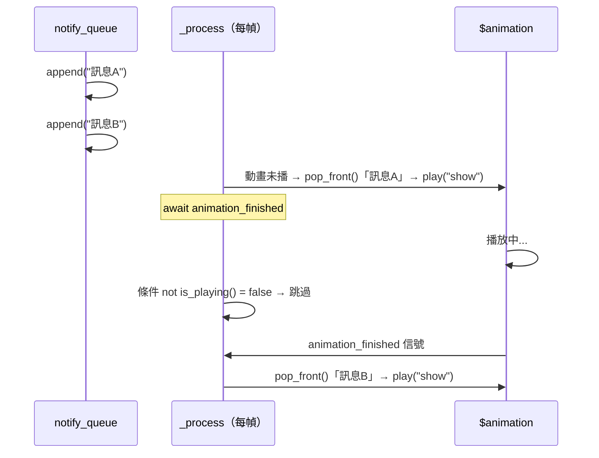

# 相機、HUD 介面與世界系統 深入分析

---

## 一、相機系統（camera.gd）

### 節點層級

```
game.tscn
└── yaw (Node3D)              ← 水平旋轉節點
    └── pitch (Node3D)        ← 垂直旋轉節點
        └── Camera3D          ← 實際相機（camera.gd 掛在此）
```

### 雙節點旋轉分離設計

```gdscript
# camera.gd:39-52
func _process(delta: float):
    yaw   = lerp(yaw,   target_yaw,   delta * 10.)   # 水平：快速跟隨
    pitch = lerp(pitch, target_pitch, delta * 5)      # 垂直：稍慢（避免暈眩感）
    yaw_node.set_rotation_degrees(Vector3(0, yaw, 0))
    pitch_node.set_rotation_degrees(Vector3(pitch, 0, 0))
    camera_zoom(delta * 10.)
```

**lerp 平滑旋轉**的優點：
- 輸入停止後鏡頭繼續慣性移動到目標
- 水平/垂直使用不同速率（10 vs 5），垂直偏慢讓俯仰更穩定

### 輸入來源整合

| 來源 | 事件類型 | 處理方式 |
|------|---------|---------|
| 滑鼠 | InputEventMouseMotion | `rotate_view(event.relative * 0.1)` |
| 觸控拖曳 | InputEventScreenDrag | `rotate_view(event.relative * 0.25)` |
| 手把右搖桿 | camera_right/left/up/down | `rotate_view(joy * 2.5/1.5)` 於 _process |
| 陀螺儀 | `Input.get_gyroscope()` | `rotate_view(gyro * Vector2(1,-1))` 於 _process |

### 縮放系統（Orbit Camera Zoom）

```gdscript
# camera.gd:93-100
func camera_zoom(delta: float):
    var camera_transform := get_global_transform()
    var diff := (camera_transform.origin - pitch_node.get_global_transform().origin).normalized() * camera_distance
    var target := pitch_node.get_global_transform().origin + diff
    camera_transform.origin = (camera_transform.origin).lerp(target, delta)
    set_global_transform(camera_transform)
```

**原理**：
- 計算相機到 pitch 節點的方向向量
- 沿此方向放置在 `camera_distance` 距離處
- Lerp 插值避免縮放時跳躍（delta*10 = 極快，幾乎即時）

縮放範圍：1.0（最近）~ 10.0（最遠），步長 0.5。

### 相機重置

```gdscript
# camera.gd:77-78
elif event.is_action_released("player_camera_reset"):
    var player_basis = global.local_player.get_transform().basis
    target_yaw = rad_to_deg(atan2(-player_basis.z.x, -player_basis.z.z))
```

計算玩家當前朝向的 Yaw 角度，使相機對齊玩家正面。

### 玩家跟隨（在 player.gd 中）

```gdscript
# player.gd:228
yaw_node.global_position = global_position + Vector3(0, camera_offset, 0)
```

玩家在 `_physics_process` 末尾更新 yaw_node 位置，相機不直接跟隨玩家節點（避免物理抖動傳播到相機）。

---

## 二、HUD 介面系統

### HUD 節點結構

```
hud.tscn (root: Control)
├── status/           ← HP/耐力/銳利度條（status.gd）
├── items/            ← 快捷物品列（items_bar.gd）
├── inventory/        ← 物品欄 Popup（hud/inventory.gd）
├── notification/     ← 通知訊息（notification.gd）
├── interact/         ← 互動按鍵提示（interact.gd）
├── names/            ← 玩家名稱（names.gd）
├── players_list/     ← 玩家列表（players_list.gd）
├── respawn/          ← 復活對話框（respawn.gd）
├── onscreen/         ← 手機虛擬按鍵（onscreen_controls.gd）
├── pause_menu/       ← 暫停選單
└── debug/            ← 除錯資訊（FPS.gd）
```

### 狀態欄（status.gd）

```gdscript
# status.gd:8-19
func _on_hp_changed(hp, hp_reg, hp_max):
    var bar_size = 300 * hp_max / 50        # 最大血量 50 → 寬度 300px，線性縮放
    $hp/bar.max_value = hp_max
    $hp/bar.value = hp                       # 綠色 HP 條
    $hp/bar/red.value = hp_reg              # 紅色「可回復」條（顯示在 HP 條後面）
    $hp/label.text = "%d/%d" % [hp, hp_max]
```

**雙色血條設計**：
- 綠色前景 = 當前 HP
- 紅色背景 = hp_regenerable（可自然回復的上限）
- 視覺上紅色部分是「受傷但可回復」的區域，類似魂系遊戲的韌性設計

### 互動提示按鈕（interact.gd）

```gdscript
# interact.gd:20-30
func _process(delta: float):
    var camera_node := get_viewport().get_camera_3d()
    var interact := global.local_player.get_nearest_interact()
    if interact != null:
        var pos := interact.get_global_transform().origin + Vector3.UP
        if camera_node.is_position_behind(pos):
            hide()   # 在相機背後不顯示
        else:
            var action_pos := camera_node.unproject_position(pos)  # 3D→2D 投影
            position = action_pos - get_size() / 2                 # 居中對齊
            show()
    else:
        hide()
```

**世界空間→螢幕空間 UI**：按鈕浮動在互動物件上方，自動追蹤 3D 位置。

### 通知佇列（notification.gd）

```gdscript
# notification.gd:22-27
func notify(text) -> void:
    notify_queue.append(text)   # 加入佇列（非阻塞）

func _process(delta: float):
    if notify_queue.size() > 0 and not $animation.is_playing():
        await play_notify(notify_queue.pop_front())   # 依序播放
```

**佇列設計**：快速連續通知時不會覆蓋，而是排隊播放。

### 物品欄 Popup（hud/inventory.gd）

```gdscript
# inventory.gd:13-21
func open_inventories(inventories) -> void:
    Input.set_mouse_mode(Input.MOUSE_MODE_VISIBLE)    # 顯示滑鼠游標
    global.local_player.pause_player()                # 凍結玩家輸入
    get_parent().get_viewport().get_camera_3d().set_process_input(false)  # 禁用相機
    for inv in inventories:
        inv.position = Vector2()
        $hbox.add_child(inv)     # 將物品欄節點加入 HBox（可並排顯示多個）
    popup()
```

**靈活設計**：`open_inventories` 接受陣列，可同時顯示多個物品欄（玩家 + 寶箱、玩家 + 商店）。

### 復活系統（respawn.gd）

```gdscript
# respawn.gd:8-15
func prompt_respawn() -> void:
    popup_centered()                                   # 顯示確認對話框
    get_parent().get_viewport().get_camera_3d().set_process_input(false)
    Input.set_mouse_mode(Input.MOUSE_MODE_VISIBLE)

func _on_respawn_confirmed() -> void:
    global.local_player.respawn()                     # 呼叫 Entity.respawn()（含 RPC）
    get_parent().get_viewport().get_camera_3d().set_process_input(true)
    Input.set_mouse_mode(Input.MOUSE_MODE_CAPTURED)
```

---

## 三、手機觸控控制（onscreen_controls.gd）

### 自動偵測顯示

```gdscript
# onscreen_controls.gd:22-29
func _ready():
    if DisplayServer.has_feature(DisplayServer.FEATURE_VIRTUAL_KEYBOARD):
        show()                            # 有虛擬鍵盤 = 觸控裝置，顯示控制項
        InputMap.erase_action("player_attack_left")   # 移除鍵盤綁定
        InputMap.add_action("player_attack_left")     # 改為空（由觸控按鈕直接注入）
        set_process_input(true)
    else:
        hide()
```

### 虛擬搖桿（Analog Stick）

```gdscript
# onscreen_controls.gd:33-51
func _input(event: InputEvent):
    if event is InputEventScreenTouch:
        if event.is_pressed() and $"analog".get_rect().has_point(event.pos):
            touch_index = event.index      # 記錄此觸控點
        elif event.index == touch_index:
            touch_index = null
            $"analog/stick".set_position(stick_rest_pos)  # 搖桿歸位
            direction = Vector2()
    elif event is InputEventScreenDrag and event.index == touch_index:
        var pos = event.pos - $"analog".get_position() - stick_rest_pos - ...
        direction = pos.normalized()
        intensity = clamp(pos.length() / 60, 0, 1)
        $"analog/stick".set_position(pos + stick_rest_pos)  # 視覺反饋
```

`direction` 被 Player._physics_process 讀取：
```gdscript
# player.gd:211-213
if onscreen.is_visible():
    var d := onscreen.direction
    direction = d.y * camera.basis.z + d.x * camera.basis.x
```

### 虛擬按鈕（A/B/X/Y）

```gdscript
func _on_A_pressed():
    Input.action_press(a_action)     # 注入到 InputMap（等同按下鍵盤按鍵）
func _on_A_released():
    Input.action_release(a_action)
```

按鈕直接操作 InputMap，不需修改遊戲邏輯，完整相容現有的 `Input.is_action_pressed()` 代碼。

---

## 四、世界系統

### 篝火（CampFire.gd）

```gdscript
extends Area3D

func _on_CampFire_body_entered(body):
    if body is Entity:
        var timer = Timer.new()
        timer.name = "burning"
        timer.wait_time = 1.0
        timer.autostart = true
        timer.timeout.connect(self._on_burning_timer_timeout.bind(body))
        body.add_child(timer)       # Timer 附加到 Entity 節點上

func _on_burning_timer_timeout(body):
    body.damage(10, 0.3, "fire")   # 每秒 10 火焰傷害 + fire 異常

func _on_CampFire_body_exited(body):
    body.get_node("burning").queue_free()  # 離開時移除 Timer
```

**動態 Timer 設計**：Timer 掛在 Entity 上而非 CampFire，確保實體離開範圍後 Timer 被清理，避免場景切換時的懸掛引用。

### 草地系統（grass_factory.gd + planter.gd）

**GrassFactory**（純工具類）：
```gdscript
static func simple_grass():
    # 手動建立三角形網格（3個頂點 = 一片草葉）
    var verts = PackedVector3Array()
    verts.push_back(Vector3(-0.5, 0.0, 0.0))
    verts.push_back(Vector3( 0.5, 0.0, 0.0))
    verts.push_back(Vector3( 0.0, 1.0, 0.0))
    var mesh = ArrayMesh.new()
    mesh.add_surface_from_arrays(Mesh.PRIMITIVE_TRIANGLES, arrays)
    mesh.custom_aabb = AABB(...)    # 手動設定包圍盒（自動AABB計算單面片會失準）
    return mesh
```

**Planter**（`@tool` 編輯器工具）：
```gdscript
@tool    # 在編輯器中實時執行
extends MultiMeshInstance3D

@export var span: float = 5.0:  set = set_span   # 每個 set 觸發 rebuild()
@export var count: int = 1000:  set = set_count

func rebuild():
    multimesh.instance_count = count
    for index in multimesh.instance_count:
        var pos = Vector3(randf_range(-span, span), 0, randf_range(-span, span))
        var basis = Basis(Vector3.UP, deg_to_rad(randf_range(0, 359)))
        multimesh.set_instance_transform(index, Transform3D(basis, pos))
        # Custom Data 通道存放草葉的個別屬性
        multimesh.set_instance_custom_data(index, Color(
            randf_range(width.x, width.y),    # R = 寬度
            randf_range(height.x, height.y),  # G = 高度
            sway_pitch,                        # B = 搖擺俯仰幅度
            sway_yaw                           # A = 搖擺偏航幅度
        ))
```

**MultiMesh 的效能意義**：
- 1000 株草葉只有 1 次 Draw Call（MultiMeshInstance3D 批次渲染）
- 每株草葉的個別屬性（寬高/搖擺）透過 Custom Data 傳入 Shader 處理
- `@tool` 讓設計師在編輯器中即時預覽草地效果

### 1812 序曲場景（1812.gd）

```gdscript
extends Area3D

# 玩家進入觸發區域 → 播放柴可夫斯基 1812 序曲
func _on_1812_body_entered(body):
    if body.is_in_group("player") and not $Tchaikovsky.is_playing():
        $Tchaikovsky.play("1812")

# 配合音樂在高潮時齊放煙火和大砲
func firework_spawn(n: int):
    for i in range(n):
        var firework: FireworkNode = FireworkScene.instantiate()
        $firework_spawn.add_child(firework)
        firework.launch()
        if i < n - 1:
            await get_tree().create_timer(randf_range(0.05, 0.2)).timeout  # 隨機延遲

func fire_all_cannons():
    for cannon in $cannons.get_children():
        var ball := CannonBall.new(1)
        cannon.fire(ball, self)   # 傳入 self 作為 spawn 節點
```

這是一個有趣的彩蛋場景：玩家走進特定區域觸發 1812 序曲，並自動控制場景中的大砲和煙火配合音樂演出。

---

## 五、互動系統完整流程

### 採集點（gathering.gd）

```gdscript
func interact(player, _node):
    if player != global.local_player:
        return   # 多人時只有本地玩家可採集（防止重複）
    
    # 加權隨機抽取道具（rarity 作為權重）
    var rand = randi() % rarity      # rarity = 所有道具的 rarity 總和
    var last = 0
    for item in obtainable:
        if last <= rand and rand < last + item.rarity:
            var remainder = player.add_item(item)
            if remainder > 0:
                $/root/hud/notification.notify("You can't carry more than %d %s")
            else:
                $/root/hud/notification.notify("You got %d %s")
            break
        last += item.rarity
    
    quantity -= 1
    if quantity <= 0:
        queue_free()   # 採集耗盡，節點消失
```

**加權隨機原理**（rarity 越高 = 越常見）：
- Potion rarity=25, Firework rarity=1（假設）
- rand % 26，rand 0-24 = Potion，rand 25 = Firework

### 大砲互動（cannon.gd）

```gdscript
func interact(player: Player, node):
    match node.name:
        "fire":
            fire_ball_from_inventory(player)     # 從玩家物品欄消耗砲彈
        "clockwise":
            tween_rotate(-15)                    # 旋轉大砲 -15°
        "anticlockwise":
            tween_rotate(15)
```

大砲有三個 Area3D 子節點（"fire", "clockwise", "anticlockwise"），玩家互動時根據接觸的是哪個 Area3D 決定行為。

```gdscript
func tween_rotate(angle, duration=0.5):
    if not $animation.is_playing() and tween == null:  # 防止重複觸發
        var final = rotation_degrees + Vector3(0, angle, 0)
        tween = create_tween()
        tween.tween_property(self, "rotation_degrees", final, duration)
        tween.tween_callback(func(): self.tween = null)  # 完成後清除 tween 引用
```

### 寶箱互動（chest.gd）

```gdscript
func open():
    $audio.play()
    animation.play("open")         # 播放開箱動畫
    player.pause_player()          # 凍結玩家
    camera.set_process_input(false)
    await animation.animation_finished
    hud_inventory.open_inventories([inventory, player.inventory])  # 並排顯示兩個物品欄
    hud_inventory.popup_hide.connect(close)

func close():
    hud_inventory.popup_hide.disconnect(close)
    animation.play("close")
    await animation.animation_finished
    player.resume_player()
    camera.set_process_input(true)
    player = null
```

寶箱本身有一個空的 Inventory（100 格），設計師可在場景中預設寶箱內容物。

---

## 深化補充

### 1. Lerp 旋轉的收斂與跨 360° 問題（camera.gd:39-63）

```gdscript
# src/camera.gd:39-44
func _process(delta: float):
    yaw = lerp(yaw, target_yaw, delta * 10.)
    pitch = lerp(pitch, target_pitch, delta * 5)
    yaw_node.set_rotation_degrees(Vector3(0, yaw, 0))
    pitch_node.set_rotation_degrees(Vector3(pitch, 0, 0))
```

**跨 360° 邊界問題與解法**：

當 `target_yaw` 超過 ±360° 時，`lerp` 會計算當前 `yaw` 到 `target_yaw` 的絕對數值差距，可能繞遠路。`rotate_view()` 明確處理了這個問題：

```gdscript
# src/camera.gd:54-62
func rotate_view(relative: Vector2):
    target_yaw -= relative.x
    if target_yaw >= 360:
        target_yaw -= 360      # 重置 target
        yaw -= 360             # 同步重置 yaw（關鍵！）
    if target_yaw <= -360:
        target_yaw += 360
        yaw += 360
```

**同步重置 `yaw` 的作用**：當 `target_yaw` 跨越 360° 邊界時，若只重置 `target_yaw` 不重置 `yaw`，`lerp` 會看到 `yaw ≈ 350, target_yaw ≈ -10`，此時差距約 360°，下一幀 `yaw` 會向左快轉一圈。同步將 `yaw` 也減去 360，兩者差距維持在小範圍，`lerp` 繼續平滑插值，**不會繞遠路**。

**Lerp 收斂特性**：

- 每幀 `yaw = lerp(yaw, target_yaw, delta * 10)`
- 以 60fps（delta ≈ 0.0167）計算，每幀縮短距離約 `0.167` 倍（即 `1 - (1-0.0167*10) = 0.167`）
- 90° 的偏移在約 0.1 秒內收斂到 1° 以內（指數衰減，永遠不精確到達，但視覺上無感）
- `pitch` 使用 `delta * 5`，收斂速度約為 yaw 的一半，俯仰感覺更「沉穩」

---

### 2. 相機縮放的穿牆問題（camera.gd:93-100）

```gdscript
# src/camera.gd:93-100
func camera_zoom(delta: float):
    var camera_transform := get_global_transform()
    var diff := (camera_transform.origin - pitch_node.get_global_transform().origin).normalized() * camera_distance
    var target := pitch_node.get_global_transform().origin + diff
    camera_transform.origin = (camera_transform.origin).lerp(target, delta)
    set_global_transform(camera_transform)
```

**無障礙物偵測**：

本函式計算邏輯為：沿「pitch 節點 → 相機」方向，將相機放置在距離 `camera_distance` 處。**整個函式不包含任何 raycast 或 `test_move()` 呼叫**，也沒有引用 `PhysicsDirectSpaceState3D`。

結論：**縮放系統完全沒有穿牆防護**。若玩家站在牆角拉遠視角，相機會穿過牆壁。這是此遊戲已知的設計缺失（屬於 Orbit Camera 不做碰撞的常見簡化）。

縮放的唯一限制來自輸入邏輯（`camera.gd:86-90`）：

```gdscript
elif event.is_action_released("camera_zoom_in"):
    if not camera_distance <= 1:
        camera_distance -= 0.5     # 最近 1.0（步長 0.5）
elif event.is_action_released("camera_zoom_out"):
    if not camera_distance >= 10:
        camera_distance += 0.5     # 最遠 10.0
```

只有距離數值的上下限，沒有幾何碰撞限制。

---

### 3. 互動 UI 的視錐外行為（interact.gd:20-30）

```gdscript
# src/interface/hud/interact.gd:20-30
func _process(delta: float):
    var camera_node := get_viewport().get_camera_3d()
    var interact := global.local_player.get_nearest_interact()
    if interact != null:
        var pos := interact.get_global_transform().origin + Vector3.UP
        if camera_node.is_position_behind(pos):
            hide()                               # 在相機後方 → 隱藏
        else:
            var action_pos := camera_node.unproject_position(pos)
            position = action_pos - get_size() / 2
            show()
    else:
        hide()
```

**`is_position_behind()` 有確實使用**：程式碼第 27 行明確呼叫 `camera_node.is_position_behind(pos)` 並在 `true` 時執行 `hide()`。文件原始描述正確。

**`is_position_behind()` vs `unproject_position()` 的行為差異**：

- `is_position_behind(pos)`：檢查點是否在相機近平面（near plane）後方，考慮 FOV，回傳布林值
- `unproject_position(pos)`：將 3D 點投影到螢幕 2D 座標，若點在相機後方時**也能回傳座標值，但該座標是錯誤的鏡像值**

因此必須先用 `is_position_behind()` 把後方情形過濾掉，再呼叫 `unproject_position()`，否則相機後方的物件會在螢幕上產生錯亂的幽靈 UI 元素。

**視錐側邊裁剪（Frustum Culling）未處理**：

`is_position_behind()` 只過濾「相機後方」，不過濾「超出左右上下視錐邊界」。若互動物件在玩家側後方但仍在近平面前方，`unproject_position()` 回傳的 2D 座標可能超出螢幕範圍，導致按鈕飛到螢幕外。這是另一個已知的輕微視覺缺陷。

---

### 4. 通知佇列的阻塞行為（notification.gd）

```gdscript
# src/interface/hud/notification.gd:8-27
var notify_queue := []

func play_notify(text: String) -> Signal:
    $text.text = text
    $animation.play("show")
    return $animation.animation_finished    # 回傳 Signal，不直接 await

func notify(text) -> void:
    notify_queue.append(text)              # 永遠只是 append，不阻塞

func _process(delta: float):
    if notify_queue.size() > 0 and not $animation.is_playing():
        await play_notify(notify_queue.pop_front())   # 在 _process 內 await
```

**佇列上限：無**。`notify_queue` 是普通 Array，沒有容量限制。極端情況（例如玩家快速採集大量道具）時佇列可以無限增長，但每條通知動畫播放時間固定，最終都會消費完。

**`_process` 中 `await` 的語義**：

在 GDScript 中，`_process` 呼叫 `await` 後，該次 `_process` 的執行會暫停並在下一幀繼續，但 Godot 引擎仍會每幀呼叫下一個 `_process` 執行實例。由於 `not $animation.is_playing()` 的條件保護，動畫播放中的幀會直接跳過，不會重複消費佇列。

**播放阻塞行為**：



**`interact_with()` 的額外保護**（`player.gd:90`）：

```gdscript
# src/entities/player.gd:89-91
func interact_with(interact: Node3D):
    if interact != null and not $/root/hud/notification/animation.is_playing():
        interact.get_parent().interact(self, interact)
```

玩家互動的觸發本身也受通知動畫播放狀態保護：通知播放中時無法再次觸發互動，間接限制了通知產生的速率。

---

### 5. 物品欄並排拖曳的所有權判定（hud/inventory.gd + inventory.gd）

**`open_inventories([shop, player])` 的結構**：

```gdscript
# src/interface/hud/inventory.gd:13-20
func open_inventories(inventories) -> void:
    ...
    for inv in inventories:
        inv.position = Vector2()
        $hbox.add_child(inv)    # shop Inventory + player Inventory 都加入同一個 HBox
    popup()
```

兩個 `Inventory` Panel 節點被平行加入同一個 `HBoxContainer`，每個 Panel 內有各自的 `Slot` 子節點群。

**跨欄拖曳的判定邏輯**：

拖放判定完全依賴 Godot 的內建 Control 拖放系統（`_get_drag_data` / `_can_drop_data` / `_drop_data`），以 Control 節點的螢幕矩形為判定範圍。

- 拖曳開始：`Slot._get_drag_data()` 從**來源 Inventory** 的 `items` 陣列 `erase_item`，設置 `inventory.dragging`
- 放下到目標格：`Slot._drop_data()` 呼叫**目標 Slot 所屬的 `inventory`**（即目標 Panel）的 `add_item()`

```gdscript
# src/inventory.gd:161-169（Slot 類別）
func _get_drag_data(_at_position: Vector2):
    if item != null:
        ...
        inventory.erase_item(item, self)        # 從來源欄移除
        inventory.dragging = {'item': ret_item, 'slot': self, 'in_flight': true}
        return inventory.dragging               # dragging 掛在來源 inventory

func _drop_data(_at_position: Vector2, data: Variant):
    data.in_flight = false
    inventory.add_item(data.item, self)          # 加入目標欄（self 的 inventory）
    inventory.dragging = null                    # 清空目標欄的 dragging
```

**跨欄拖曳時的 `dragging` 歸屬問題**：

- `data` 是來源 Inventory 的 `dragging` Dict（含 `in_flight: true`）
- 放下後 `_drop_data` 設 `data.in_flight = false`，並把 `inventory.dragging` 設為 `null`（此處 `inventory` 是目標欄，與來源欄不同）
- 來源欄的 `dragging` Dict 物件的 `in_flight` 已被設 `false`（Dict 是引用型別，同一物件）
- `inventory._input` 的 deferred callback 在任一 Inventory 上觸發，呼叫 `give_back_dragged_item()`，此時 `dragging.in_flight == false`，不執行歸還

結論：跨欄拖曳在正常放下時**正確運作**，來源欄物品消失，目標欄物品出現。但「拖曳取出後放手在非格子區域」的保護，只會由**來源 Inventory** 的 `_input` 正確觸發（因為 `dragging` 引用掛在來源欄上）；目標欄的 `_input` 的 `dragging` 在跨欄期間為 `null`，不會誤觸歸還。
