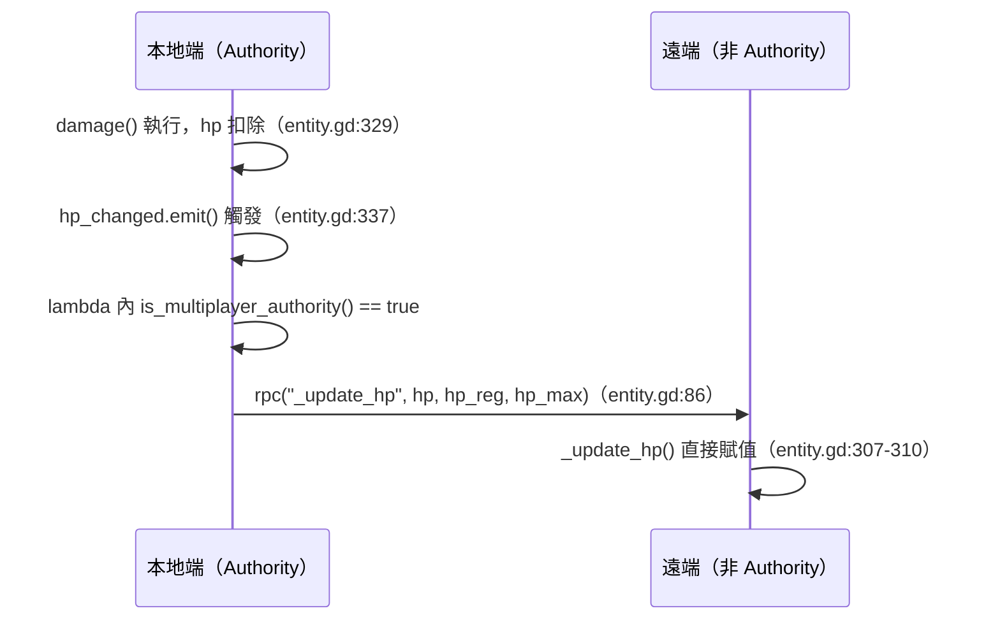

# Entity 與戰鬥系統 深入分析

## 繼承鏈

```
CharacterBody3D
└── Entity (src/entities/entity.gd)
    ├── Player (src/entities/player.gd)
    └── Monster (src/entities/monster.gd)  ← extends "entity.gd"（字串路徑，非 class_name）
```

---

## Entity 基底類別（entity.gd）

### HP 系統

```gdscript
# entity.gd:10-18
var hp: int = 100
var hp_max: int = 100
var hp_regenerable: int = 100   # 可再生上限（受傷後可回復到此值）
var hp_regeneration: int = 1    # 每次回復量
var hp_regeneration_interval: int = 5  # 回復間隔（秒）
signal hp_changed(hp, hp_reg, hp_max)
```

**雙層 HP 設計**：
- `hp`：當前血量
- `hp_regenerable`：可自然回復的上限
- 受傷公式（entity.gd:329）：`hp_regenerable = int(hp + damage_in * regenerable)`
  - `regenerable` 參數（0.0~1.0）決定這次傷害有多少比例「可以再生回來」
  - 例：受 100 傷、regenerable=0.3 → 只有 30 HP 可以慢慢回復

### 耐力系統

```gdscript
# entity.gd:21-32
var stamina: float = 100:
    set(value):
        var previous := stamina
        stamina = clamp(value, 0, stamina_max)
        if previous != stamina:
            stamina_changed.emit(stamina, stamina_max)
```

使用 GDScript setter 自動發射 signal，不需要手動調用。

### AnimationTree 狀態機

```
主狀態機 (state_machine):
    idle-loop  ←→  movement  →  attack  →  rest  →  death

移動子狀態機 (movement_state_machine)，巢狀於 movement 狀態：
    walk-loop  ←→  run-loop  ←→  dodge  ←→  jump  →  falling  →  screaming
```

**狀態驅動移動**（entity.gd:168-193）：
```gdscript
match current_state:
    "rest":     velocity *= Vector3.UP          # 只保留垂直速度（靜止）
    "attack":   velocity *= Vector3(attack_speed, 1, attack_speed)
    "movement":
        match movement_state_machine:
            "walk-loop": velocity *= walk_speed (5.0)
            "run-loop":  velocity *= run_speed  (7.5)，並消耗 stamina
            "dodge":     velocity *= dodge_speed (8.0)
    _:          velocity *= Vector3(0, 1, 0)   # 其他狀態鎖定移動
```

### 傷害計算流程

```
damage(damage_in, regenerable, element=null, weapon=null, entity=null)
    ↓
defense = get_defence()              ← 多型：Entity=0, Player=防具累加
actual_damage = damage_in - defense
    ↓
ailments[element] = timestamp        ← 記錄異常狀態觸發時間
    ↓
hp -= actual_damage
hp_regenerable = hp + damage_in * regenerable
    ↓
if hp <= 0: die()                    ← 觸發死亡
hp_changed.emit(...)
```

### 撞牆傷害

```gdscript
# entity.gd:206-208
var acceleration = (velocity - vi).length()
if acceleration > 10:
    damage(pow(acceleration / 10, 7), 0.5)
```
速度突然驟減超過 10 即觸發墜落/撞牆傷害，指數增長（7次方）使高速衝撞非常致命。

### 多人同步設計

```gdscript
# entity.gd:84-89
func _ready():
    hp_changed.connect(func(hp, hp_reg, hp_max):
        if multiplayer.has_multiplayer_peer() and is_multiplayer_authority():
            rpc("_update_hp", hp, hp_reg, hp_max))
    stamina_changed.connect(func(stam, max):
        if multiplayer.has_multiplayer_peer() and is_multiplayer_authority():
            rpc("_update_stamina", stam, max))
```

**Pattern**：signal + lambda 在 _ready 串接 RPC，只有 authority 端發送。

---

## Player 類別（player.gd）

### 輸入→方向計算（物理引擎每幀）

```gdscript
# player.gd:198-215
var camera := camera_node.get_global_transform()
var input := Vector3()
if Input.is_action_pressed("player_forward"):
    input -= camera.basis.z * strength  # 相機正面方向（-Z）
if Input.is_action_pressed("player_backward"):
    input += camera.basis.z * strength
if Input.is_action_pressed("player_left"):
    input -= camera.basis.x * strength  # 相機右方向（+X）
if Input.is_action_pressed("player_right"):
    input += camera.basis.x * strength
direction = input * Vector3(1, 0, 1)    # 清除 Y 分量
direction = direction.normalized()
```

移動方向相對於相機，而非玩家朝向，符合第三人稱 Action RPG 標準操作。

### 裝備系統

```gdscript
# player.gd:15
var equipment = {
    "weapon": null,
    "armour": {
        "head": null, "torso": null,
        "rightarm": null, "leftarm": null, "leg": null
    }
}
```

**掛載到骨架**（player.gd:31-43）：
```gdscript
func set_equipment(model, bone):
    var skel = $Armature/Skeleton3D
    for node in skel.get_children():
        if node is BoneAttachment3D and node.get_bone_name() == bone:
            node.add_child(model)   # 已有附著點，直接掛入
            return
    # 否則動態建立 BoneAttachment3D
    var ba = BoneAttachment3D.new()
    ba.set_bone_name(bone)
    ba.add_child(model)
    skel.add_child(ba)
```

### 死亡處理（多人情境）

```gdscript
# player.gd:146-153
@rpc("any_peer", "call_local") func died():
    super.died()
    set_process(false)
    set_physics_process(false)
    set_process_input(false)           # 禁用所有輸入
    if not multiplayer.has_multiplayer_peer() or is_multiplayer_authority():
        $/root/hud/respawn.prompt_respawn()  # 只有本地玩家看到復活提示
    $shape.disabled = true             # 禁用碰撞體
```

**非 authority 端**（player.gd:183-189）的死亡動畫：
```gdscript
# _process 中模擬遠端死亡玩家的移動（用於動畫插值）
if state_machine.get_current_node() == "dead" and not is_multiplayer_authority():
    direction = (previous_origin - transform.origin).normalized()
    previous_origin = transform.origin
```

### 互動偵測

```gdscript
# player.gd:77-86
func get_nearest_interact() -> Area3D:
    var areas: Array = $interact.get_overlapping_areas()
    var interacts := []
    for area in areas:
        if area.is_in_group("interact"):
            interacts.append(area)
    if interacts.size() > 0:
        interacts.sort_custom(sort_by_distance)  # 按距離排序
        return interacts[0]
    return null
```

---

## Monster AI 類別（monster.gd）

### AI 狀態流程

```
_physics_process(delta):
    direction = Vector3()              ← 每幀重置方向

    if target_player != null:
        check_target()                 ← 確認目標是否還有效

    if target_player == null:
        find_new_target()              ← 視野內找最近玩家

    if target_player != null:
        hunt_target()                  ← 追蹤模式
    else:
        scout()                        ← 巡邏模式

    nav.get_next_path_position()
    move_entity(delta)
```

### 視野偵測（FOV + Raycast）

```gdscript
# monster.gd:116-123
func line_of_sight(vector: Vector3) -> Dictionary:
    var origin := global_transform.origin
    var eyes: Vector3 = $eyes.global_transform.origin
    var direction := (vector - origin).normalized()
    var angle := global_transform.basis.z.angle_to(direction)
    if angle < field_of_view:          # field_of_view = 120°
        return cast_ray(eyes, vector)  # 視線內才 Raycast
    return {}
```

`find_new_target()`：遍歷視野內所有玩家，對每個玩家做 FOV + Raycast 雙重檢查，取距離最短者。

### 狩獵行為分層

```gdscript
# monster.gd:155-193
func hunt_target():
    var to_target := target_player.global_position - global_position
    var distance := to_target.length()

    if $AnimationTree["parameters/conditions/attacking"]:
        direction = to_target.normalized()
        check_fire_collision()         # 攻擊中持續追蹤 + 火焰傷害判定
    elif distance > 10:
        run(); follow_path()           # 遠距：全速追趕
    elif distance > 5:
        walk(); follow_path()          # 中距：緩步接近
    else:
        attack("attack")               # 近距：發動攻擊
        direction = to_target.normalized()

    # 目標移動超過 1m 才重算路徑（避免每幀重算）
    if old_target_origin.distance_to(target_player.global_position) > 1:
        set_navigation_target(target_player.global_transform.origin)
```

### 火焰攻擊傷害判定

```gdscript
# monster.gd:126-134
func check_fire_collision():
    $fire/RayCast3D.enabled = true
    var to_target := target_player.global_position - global_position
    if $AnimationTree["parameters/conditions/attacking"] and to_target.length() < 5:
        if $fire/RayCast3D.is_colliding() and $fire/RayCast3D.get_collider() == target_player:
            if Time.get_ticks_msec() - last_damage > 1000:  # 1秒冷卻
                target_player.damage(10, 0.3, "fire")
                last_damage = Time.get_ticks_msec()
```

RayCast3D 朝玩家方向射線，確認真的打到（非隔牆）才觸發傷害，同時施加 fire 異常。

### 死亡後腳本替換

```gdscript
# monster.gd:69-76
@rpc("any_peer", "call_local") func died():
    super.died()
    set_physics_process(false)
    $fire.hide()
    $interact.add_to_group("interact")   # 屍體可互動
    $view.disconnect("body_entered", _on_view_body_entered)  # 移除視野偵測
    call_deferred("set_script", preload("res://src/interact/monster drop.gd"))
```

`set_script()` 動態替換腳本，使怪物節點保留在場景樹中但行為完全改變，成為掉落物採集點。

---

## 異常狀態（Ailment）系統

```
ailments: {element_name: timestamp_msec}

Player._on_ailment_added("fire"):
    $Flames.emitting = true
    effect_over_time(
        wait_time=1.0,
        repeat=3,
        effect=damage.bind(10, 0.5),     ← 每秒 10 火焰傷害
        end=func():
            ailments.erase("fire")
            $Flames.emitting = false
    )
```

`effect_over_time`（entity.gd:94-102）使用 `await create_timer()` 異步執行，不阻塞主線程。

Monster 的 `weakness` 字典預定義元素易傷倍率，但目前 damage() 計算中尚未套用（TODO）。

---

## 設計模式總結

| 模式 | 實作位置 | 說明 |
|------|---------|------|
| Template Method | Entity → Player/Monster | `died()`、`respawn()` 由子類 `super()` 後擴展 |
| Observer (Signal) | hp_changed, stamina_changed | 解耦戰鬥數值與 UI/網路層 |
| State Machine | AnimationTree 雙層 | 動畫驅動邏輯，非獨立狀態類別 |
| Authority Pattern | `is_multiplayer_authority()` | 只有 authority 執行物理/AI/發送 RPC |
| Dynamic Script Swap | `set_script()` | Monster 死後變成 Collectible |

---

## 深化補充（實作機制層）

### 1. 傷害計算邊界條件

#### 死亡保護：`hp > 0` 守衛（entity.gd:318-339）

```gdscript
# entity.gd:318
func damage(damage_in: int, regenerable: float, element=null, weapon=null, entity=null):
    if hp > 0:          # ← 死亡後完全忽略所有傷害
        ...
    else:
        prints(get_name(), "is already dead")
```

- `hp > 0` 是嚴格大於，意即 `hp == 0` 時也視為已死亡，不會觸發 `die()` 兩次。
- 死亡後的 `damage()` 呼叫只印一行 debug 訊息，不改變任何狀態。
- 此守衛防止 `effect_over_time()` 的持續傷害在目標死亡後繼續執行（entity.gd:97 也有 `if is_dead(): break` 的額外防護）。

#### `hp_regenerable` 的負數 HP 行為（entity.gd:329-330）

```gdscript
# entity.gd:329-330
hp -= actual_damage
hp_regenerable = int(hp + damage_in * regenerable)
```

關鍵：`hp_regenerable` 使用的是**更新後（可能為負）的 `hp`** 加上 `damage_in`（原始傷害，非 `actual_damage`）乘以 `regenerable`。

數值範例（hp=10, damage_in=50, defence=5, regenerable=0.3）：
- `actual_damage = 50 - 5 = 45`
- `hp = 10 - 45 = -35`（已觸發 `die()`）
- `hp_regenerable = int(-35 + 50 * 0.3) = int(-35 + 15) = -20`

結論：**致命一擊時 `hp_regenerable` 可以是負數**。由於 `died()`（entity.gd:264）會強制將兩者都設為 0，這個負數只會短暫存在於 `hp_changed` signal 發射（entity.gd:337）之後、`died()` 實際完成之前的那幀。`hp_changed` 的接收方（HUD 等）應注意此邊界情況。

#### `get_actual_damage()` 防禦扣減與溢出（entity.gd:296-297）

```gdscript
# entity.gd:296-297
func get_actual_damage(damage_in: int) -> int:
    return damage_in - get_defence()
```

- **無 clamp**：若防禦值超過傷害值（例如穿著大量防具後被弱小怪攻擊），`actual_damage` 可以是**負數**，代入 `hp -= actual_damage` 等效於**回血**。
- 這是一個未文件化的邊界效果：超防禦 → 造成負傷害 → 實際治癒目標。
- Entity 基底的 `get_defence()` 恆回傳 0（entity.gd:292-293），只有 Player 覆寫（player.gd:138-143）；Monster 不覆寫，永遠防禦為 0。

---

### 2. 撞牆傷害公式詳解（entity.gd:206-208）

```gdscript
# entity.gd:206-208
var acceleration = (velocity - vi).length()
if acceleration > 10:
    damage(pow(acceleration / 10, 7), 0.5)
```

- `vi` 是 `move_and_slide()` 之前的速度，`velocity` 是之後的速度，兩者差值的長度即「這一幀速度的突變量」。
- **臨界值**：`acceleration > 10`，恰好等於 10 時**不**觸發（嚴格大於）。
- **公式展開**：令 `a = acceleration / 10`（歸一化加速度），傷害 = `a^7`。

| acceleration | a = a/10 | 傷害（`a^7`） |
|---|---|---|
| 10（臨界，不觸發）| 1.0 | — |
| 11 | 1.1 | ≈ 1.95 |
| 15 | 1.5 | ≈ 17.1 |
| 20 | 2.0 | 128 |
| 25 | 2.5 | ≈ 610 |
| 30 | 3.0 | 2187 |

- **7 次方的設計意圖**：在低速時（a 稍大於 1）幾乎無傷，但在高速（a ≥ 2）時急劇上升，製造「撞牆就死」的非線性懲罰，同時讓普通速度的碰撞（跑速 7.5 × delta，幾何上不可能達到 10+）不觸發傷害。
- `pow()` 回傳 float，但 `damage()` 的 `damage_in` 參數型別是 `int`——GDScript 會自動截斷（`int(1.95)=1`），低速碰撞可能因截斷而造成 0 或極少傷害但仍進入計算流程。
- `regenerable=0.5`：撞牆傷害有一半可自然回復，設計上視為「暫時性創傷」而非永久傷害。

---

### 3. 異常狀態重複觸發的時間戳覆蓋語意（entity.gd:324-327）

```gdscript
# entity.gd:324-327
if element:
    if not ailments.has(element):
        ailment_added.emit(element)
    ailments[element] = Time.get_ticks_msec()   # ← 無論是否已存在，都覆蓋
```

- **Dict 重寫語意**：`ailments[element] = timestamp` 若 key 已存在，直接覆蓋舊值，不觸發 `ailment_added` signal（因為 `ailment_added.emit()` 被包在 `if not ailments.has(element):` 內）。
- **重複觸發的實際效果**：timestamp 被刷新，但不會重新呼叫 `_on_ailment_added()` → 不會重新啟動 `effect_over_time()`。

#### `effect_over_time()` 期間再次受同元素傷害時的行為

以火焰為例（player.gd:66-68）：

```gdscript
# player.gd:66-68
effect_over_time("burning", 1.0, 3, damage.bind(10, 0.5), func():
    ailments.erase("fire")
    $Flames.emitting = false)
```

場景：火焰效果執行到第 2 次（共 3 次），玩家再次被火焰傷害：

- `ailments["fire"]` 存在 → `ailment_added` **不再** emit → `_on_ailment_added()` **不再**呼叫 → **不啟動第二條 `effect_over_time` coroutine**。
- 原有 coroutine 繼續執行剩餘次數（第 3 次），然後 `ailments.erase("fire")`。
- `ailments["fire"]` 的 timestamp 被刷新，但此值目前**沒有被任何邏輯讀取**（ailments 字典的 value 目前是純粹的記錄，無邏輯依賴）。
- **實際缺陷**：若玩家在 `effect_over_time` 執行完（ailments 已 erase）之後的**同一幀或極短時間內**再次受火焰傷害，`ailments.has("fire")` 為 false，會重新 emit signal 並啟動新的 coroutine，此時行為正確。但在 coroutine 執行中重複受傷只刷新 timestamp、不延長效果，持續時間固定 3 秒，不會被「補刀」延長。

---

### 4. 耐力恢復分層（entity.gd:353-360）

```gdscript
# entity.gd:353-360
func stamina_natural_regeneration(delta: float):
    match state_machine.get_current_node():
        "idle-loop":
            stamina += stamina_regeneration * delta
        "rest":
            stamina += stamina_regeneration * delta * 3.0
    if movement_state_machine.get_current_node() == "walk-loop":
        stamina += stamina_regeneration * delta * 0.5
```

基準值：`stamina_regeneration = 4.0`（entity.gd:33）

| 主狀態 | 移動子狀態 | 耐力變化（每秒） | 倍率 |
|---|---|---|---|
| `rest` | — | +12.0 | 3.0× |
| `idle-loop` | — | +4.0 | 1.0× |
| `movement` | `walk-loop` | +2.0 | 0.5× |
| `movement` | `run-loop` | −`run_stamina`（=5.0）| 消耗 |
| `movement` | `dodge`、`jump`、`falling` | 0（不恢復也不消耗） | — |
| `attack`、其他狀態 | — | 0 | — |

**注意事項**：
- `match` 只匹配主狀態機，而 `walk-loop` 的檢查獨立在 `if` 之外，意味著若主狀態是 `movement` 且子狀態是 `walk-loop`，**兩個加法都不執行**（`match` 沒有 `movement` 分支），只有 `if` 的 `walk-loop` 分支執行 +2.0。
- `run-loop` 狀態的耐力消耗在 `move_entity()` 的主迴圈中進行（entity.gd:183：`stamina -= run_stamina * delta`），而非在 `stamina_natural_regeneration()` 中，因此兩者不重疊。
- `stamina <= 0` 時 `move_entity()` 強制呼叫 `rest()`（entity.gd:165-166），轉換到 rest 狀態後恢復速率提升為 3×，形成快速恢復的負反饋機制。

---

### 5. 多人同步的本地/遠端不一致窗口

#### 事件時序（entity.gd:84-90, 307-310, 318-337）



- `_update_hp` 標記為 `@rpc("call_remote")`（entity.gd:307），代表只在遠端執行，本地不重複呼叫。
- **不一致窗口持續時間**：從 `hp -= actual_damage`（entity.gd:329）到 `_update_hp` 在遠端執行，等於一個完整的**網路往返延遲（RTT/2）**。在局域網典型值 < 10ms，跨網際網路可達 50-200ms。
- **補償機制分析**：此架構**無 rollback/reconciliation 機制**。遠端只是被動接收最終值（`self.hp = hp`），若封包遺失則永遠停留在舊值，直到下次 signal 觸發新的 RPC。
- **死亡同步特殊路徑**（entity.gd:250-257）：`die()` 本身是 `@rpc`，但呼叫路徑為：本地 `die()` → 若有多人端則 `rpc("died")` → 遠端執行 `died()`。`died()` 標記為 `"any_peer", "call_local"`，表示**本地和遠端都會執行**，確保死亡狀態最終一致。
