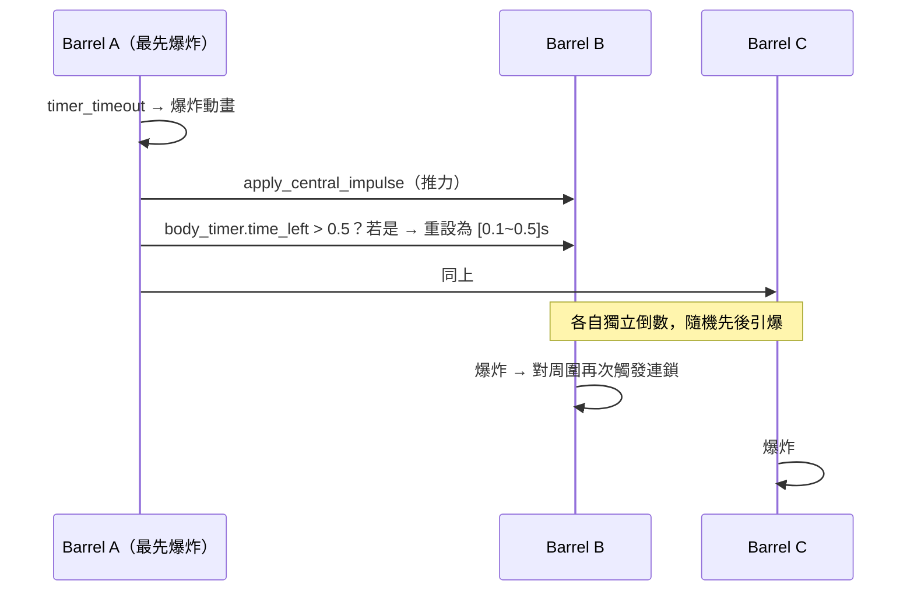

# 道具與物品欄系統 深入分析

## 類別繼承樹

```
Item (src/items/item.gd)                     ← 基底（純資料類，非 Node）
├── Consumable (src/items/consumable.gd)     ← 可使用消耗品
│   ├── Potion   (consumables/potion.gd)
│   ├── Whetstone(consumables/whetstone.gd)
│   ├── Meat     (consumables/meat.gd)
│   ├── Barrel   (consumables/barrel.gd)
│   ├── CannonBall(consumables/cannon_ball.gd)
│   └── Firework (consumables/firework.gd)
└── Collectible  (src/items/collectibles.gd) ← 收集材料（採集/掉落物）
```

**注意**：Item 系列不繼承 Node，是純 GDScript 物件（Reference 型別）。

---

## Item 基底類別（item.gd）

```gdscript
class_name Item
var name: String
var icon: Texture2D
var quantity: int
var rarity: int    # 0-99，稀有度越高數值越大

func clone() -> Item:
    return get_script().new(name, icon, quantity, rarity)
```

`clone()` 使用 `get_script().new()` 實現多型複製，子類各自覆寫傳入正確參數。

---

## Consumable 消耗品基底（consumable.gd）

```gdscript
var max_quantity: int   # 最大攜帶量（堆疊上限）

func use(player):
    if quantity > 0 and effect(player):  # effect() 回傳 false 表示無法使用
        quantity -= 1

func add(n: int) -> int:
    # 回傳溢出的數量
    var max_n := max_quantity - quantity
    quantity += min(n, max_n)
    return max(0, n - max_n)

func set_label_color(label: Label):
    # 數量滿了顯示紅色，否則白色
    if quantity >= max_quantity:
        label.add_theme_color_override("font_color", Color.RED)
```

**Template Method 設計**：`use()` 呼叫抽象方法 `effect()`，子類只需覆寫 `effect()` 實作具體效果。

---

## 各消耗品詳解

### Potion（potion.gd）
```gdscript
# _init: max_quantity=10, rarity=50
func effect(target: Player):
    if target.can_consume() and target.hp < target.hp_max:  # 滿血不消耗
        target.heal(heal)                # heal=20 HP
        target.state_machine.travel("drink")  # 播放喝藥水動畫
        return true
    return false
```
- 只在 `idle-loop` 狀態可使用（`can_consume()` 檢查）
- 觸發 drink 動畫，動畫結束後 entity.gd `_on_animation_tree_animation_finished` 自動 `stop()`

### Whetstone（whetstone.gd）
```gdscript
# _init: max_quantity=20, rarity=10
func effect(_player: Player):
    if _player.equipment.weapon != null and not _player.equipment.weapon.is_sharpened():
        _player.equipment.weapon.sharpen(sharp)   # sharp=20
        _player.consume_item_animation("whetstone")
        return true
    return false
```
- 武器已完全銳利時不消耗（`is_sharpened()` 回傳 true）

### Meat（meat.gd）
```gdscript
# _init: max_quantity=10, rarity=50
func effect(target: Player):
    if target.stamina_max < target.MAX_STAMINA and target.is_idle():
        target.stamina_max_increase(stamina)   # stamina=25，增加最大耐力上限
        target.state_machine.travel("eat")
        return true
    return false
```
- 只在 idle 且未達最大耐力上限（200）時有效
- 是唯一永久提升角色數值的消耗品

### Barrel（barrel.gd）
```gdscript
# _init: max_quantity=5, rarity=10
func effect(player):
    var barrel = scene.instantiate()    # 生成 3D 物理爆炸桶
    player.drop_item_on_floor(barrel)  # 放置在玩家前方 $drop_item 標記位置
    return true
```
爆炸桶邏輯（barrel-scene.gd）：
```gdscript
# Timer 倒數後爆炸
func _on_timer_timeout():
    $"explosion/animation".play("explode")
    for body in $"explosion".get_overlapping_bodies():
        if body is Entity:
            var d = body.global_transform.origin - global_transform.origin
            var dmg = int((r - d.length()) * 20 + 1)  # 距離越近傷害越高
            body.damage(dmg, 0.1)
        elif body.is_in_group("explosive"):
            # 連鎖爆炸：給其他爆炸物施加動量並縮短引信
            body.apply_central_impulse(momentum)
            body_timer.set_wait_time(0.5 - randf_range(0, 0.4))
```

### CannonBall（cannon_ball.gd）
```gdscript
const fire_speed = 200
const fire_angle = deg_to_rad(5)  # 略微向上仰角

func fire(from_cannon: CannonNode, spawn=null):
    var cannon_ball: CannonBallNode = CannonBallScene.instantiate()
    var position := from_cannon.ball_spawn.global_position
    spawn.add_child(cannon_ball)
    cannon_ball.global_transform.origin = position
    # 從大砲 Basis 旋轉 5° 計算發射方向
    var a: Basis = from_cannon.global_transform.basis.rotated(Vector3.RIGHT, fire_angle)
    var velocity := Vector3(-a.x.z, a.y.z, a.z.z) * fire_speed
    cannon_ball.fire(velocity)
    self.quantity -= 1
```
碰撞傷害（cannon_ball-scene.gd）：
```gdscript
func _on_CannonBall_body_entered(body):
    var momentum = velocity_last_frame.length() * mass
    if momentum > 200:       # 速度夠快才爆炸
        $AnimationPlayer.play("explode")
        if body is Entity:
            body.damage(momentum, 0.1)
```
- 使用上一幀速度計算動能（避免碰撞後速度已歸零）
- 動能門檻設計防止低速滾動觸發爆炸

### Firework（firework.gd + firework-scene.gd）
```gdscript
# 道具效果
func effect(_player):
    var firework = scene.instantiate()
    _player.drop_item_on_floor(firework)
    firework.launch()    # 立即發射
    return true

# 場景節點
func launch():
    linear_velocity = Vector3(0, 70, 0)          # 向上 70 m/s
    linear_velocity.x += randf_range(-20, 20)    # 隨機散佈
    $animation.play("launch")
    await get_tree().create_timer(randf_range(4, 5)).timeout
    $animation.play("boom")
    await $animation.animation_finished
    queue_free()
```

---

## Inventory 物品欄系統（inventory.gd）

### 資料結構

```gdscript
extends Panel           # 是 Control 節點，同時負責資料和 UI
var items := []         # Item 物件陣列
var max_slots: int      # 總格數（含空格）
var dragging            # 當前拖曳中的物件
```

### 新增物品邏輯（add_item）

```
add_item(item, slot=null):
    if slot == null:
        found = find_item_by_name(item.name)
        if found != null:            ← 同名物品：堆疊
            overflow = found.add(item.quantity)
            更新 UI slot 顯示
        else:                        ← 新物品：佔用空槽
            clone = item.clone()
            items.append(clone)
            find_free_slot().set_item(clone)
    elif slot.item != null:          ← 指定槽有物品：強制堆疊（須同名）
        overflow = slot.item.add(item.quantity)
    else:                            ← 指定槽空著：直接放入
        clone = item.clone()
        items.append(clone)
        slot.set_item(clone)
    emit_signal("modified", self)
    return overflow                  ← 超出上限的數量
```

### 拖放系統（Slot 內部類）

```gdscript
class Slot extends Panel:
    # 開始拖曳：從物品欄移除道具，加入 dragging 記錄
    func _get_drag_data(_at_position):
        if item != null:
            var preview = ItemStack.new(); preview.layout(item)
            set_drag_preview(preview)
            inventory.erase_item(item, self)
            inventory.dragging = {'item': ret_item, 'slot': self, 'in_flight': true}
            return inventory.dragging

    # 接受條件：目標格空，或同名且不超量
    func _can_drop_data(_at, data):
        return item == null or (data.item.name == item.name and
            data.item.quantity + item.quantity <= data.item.max_quantity)

    # 放下：呼叫 add_item 完成轉移
    func _drop_data(_at, data):
        data.in_flight = false
        inventory.add_item(data.item, self)
        inventory.dragging = null
```

**放手未命中槽時的保護**（inventory.gd:36-44）：
```gdscript
func _input(event):
    if event is InputEventMouseButton and not event.is_pressed() and ...:
        call_deferred("give_back_dragged_item")

func give_back_dragged_item():
    if dragging != null and dragging.in_flight:
        inventory.add_item(dragging.item, dragging.slot)  # 歸還原槽
```

### ItemStack 顯示元件

```gdscript
class ItemStack extends TextureRect:
    func layout(item):
        set_texture(item.icon)
        if item.max_quantity > 1:
            label.set_text(str(item.quantity))
            item.set_label_color(label)    # 滿格紅色，未滿白色
```

---

## 快捷物品列（items_bar.gd）

```gdscript
# 循環瀏覽：active_item 索引 0 = null_item（空選）
func get_item(i: int) -> Item:
    if i % (inventory.items.size() + 1) == 0:
        return null_item
    return inventory.get_item(i 相對偏移)

func activate_next():
    active_item = wrapi(active_item + 1, 0, inventory.items.size() + 1)
    $sound.play()
    update()
```

顯示 5 個格子（active_item 為中心，左右各 2 個）：
```gdscript
func update():
    var i = -2
    for child in $bar.get_children():     # 5 個子節點
        var item = get_item(active_item + i)
        child.get_node("icon").set_texture(item.icon)
        i += 1
```

觸控支援：水平拖曳超過 50px 切換物品（適合手機）。

---

## 商店系統（shop.gd + shop-item.gd + NPC.gd）

### 商品價格計算

```gdscript
# shop-item.gd:31
item_cost = int((100 - new_item.rarity) * cost_factor)
```
- rarity 越高（越稀有）→ (100 - rarity) 越小 → 價格越低？
- 實際上 rarity 是「掉落機率比重」，高 rarity = 常見品 = 便宜
- cost_factor（NPC.gd 傳入 10）為倍率

### 購買流程

```
NPC.interact(player, _node):
    player.pause_player()
    camera.set_process_input(false)
    hud_inventory.open_inventories([shop, player.inventory])
    
    for shop_item in shop.shop_items:
        shop_item.buy.connect(player.buy_item)     ← 連接購買 signal
    
    await hud_inventory.popup_hide                 ← 等待關閉
    
    for shop_item in shop.shop_items:
        shop_item.buy.disconnect(player.buy_item)  ← 斷開連接

# player.buy_item(item, cost):
func buy_item(item: Item, cost: int) -> bool:
    if item.quantity > 0 and money >= cost:
        money -= cost
        add_item(item)
        return true
    return false
```

### NPC 行為（NPC.gd）

NPC 平時的隨機轉頭行為：
```gdscript
func _process(delta):
    if player != null:
        slerp_look_at(player.global_transform.origin, delta * 10)  # 面向玩家
    else:
        # 隨機選一個方向，Slerp 插值轉頭，轉完後隨機等待再換方向
        global_transform.basis = global_transform.basis.slerp(random_basis, 10 * delta)
        if remaining_rotation < 5°:
            stare_time += delta
            if stare_time > stare_wait:
                new_random_stare()
```

---

## 系統設計特點

| 特點 | 說明 |
|------|------|
| 道具是純資料物件 | Item 不繼承 Node，不加入場景樹，由 Inventory Panel 管理生命週期 |
| 堆疊機制 | 同名道具自動堆疊，`add()` 回傳溢出量，UI 用 label 顯示數量 |
| Template Method 消耗 | 基類 `use()` 固定流程，子類只實作 `effect()` |
| 拖放完整保護 | 拖到非法位置時 `give_back_dragged_item()` 歸還，避免道具消失 |
| 場景物件雙重性 | CannonBall 同時有「道具類」和「3D 場景節點類」，透過 `fire()` 橋接 |

---

## 深化補充

### 1. 堆疊上限的邊界行為（consumable.gd:29-36）

實際的 `add()` 程式碼如下：

```gdscript
# src/items/consumable.gd:29-36
func add(n: int):
    var max_n := max_quantity - quantity   # 還能放入的容量
    if n <= max_n:
        quantity += n
        return 0
    quantity += max_n                      # 只增加剩餘容量（即使 quantity 已滿時 max_n=0）
    return n - max_n                       # 回傳溢出量
```

**quantity 已滿時的邊界行為**：

- 若 `quantity == max_quantity`，則 `max_n = 0`
- 執行 `quantity += 0`（數值不變）
- 回傳 `n - 0 = n`（整批 n 個全部溢出）
- 函式不會讓 `quantity` 超過 `max_quantity`，但也不會有錯誤或警告

**多次 `add(n)` 的累積問題**：

`add()` 本身是冪等安全的，每次呼叫都依據當前 `quantity` 計算。  
但 `inventory.gd:add_item()` 在「同名道具已存在」時的路徑：

```gdscript
# src/inventory.gd:66-70
var found = find_item_by_name(item.name)
if found != null:
    overflow = found.add(item.quantity)
    $vbox/items.get_node(item.name).stack.layout(found)  # 直接用 item.name 取節點
```

溢出的 `overflow` 被回傳給呼叫者，但**沒有自動尋找第二格**放置。若玩家物品欄有多個同名道具格（不可能：`find_item_by_name` 只回傳第一個），溢出就直接丟棄由呼叫者負責處理。在 `gathering.gd` 與 `player.add_item()` 中溢出會觸發「無法攜帶更多」的通知，但不會再嘗試部分放入。

---

### 2. 商品價格公式的設計意圖（shop-item.gd:31）

```gdscript
# src/interface/shop-item.gd:29-37
func set_item(new_item: Consumable, new_cost_factor: float):
    item = new_item
    item_cost = int((100 - new_item.rarity) * new_cost_factor)
```

NPC.gd 傳入的 `cost_factor = 10`（`src/interact/NPC.gd:37`）。

各商品的 `rarity` 值與對應售價：

| 道具 | rarity | 100 - rarity | cost_factor=10 | 單價 |
|------|--------|-------------|----------------|------|
| Potion（`potion.gd:_init` rarity=20） | 20 | 80 | ×10 | **800£** |
| Whetstone（rarity=20） | 20 | 80 | ×10 | **800£** |
| Barrel（rarity=10，`barrel.gd:_init`） | 10 | 90 | ×10 | **900£** |
| Firework（rarity=10，`firework.gd:_init`） | 10 | 90 | ×10 | **900£** |
| Meat（rarity=25，`meat.gd:_init`） | 25 | 75 | ×10 | **750£** |

**設計意圖分析**：

`rarity` 在 `gathering.gd` 的用途是「掉落加權比重」（rarity 越大越容易掉落）。在商店語境裡，`(100 - rarity)` 把「掉落比重」反轉為「稀有度感知」：**掉落越容易（rarity 越高）→ 商店越便宜**。

結果：Meat 和 Potion 這類較常見的消耗品售價較低，Barrel 和 Firework 這類少見道具反而較貴——符合直覺。但命名為 `rarity` 卻在兩個系統中意義不同（採集比重 vs. 商店定價），屬於語意混用。

**`_on_Buy_pressed()` 的購買單位問題（shop-item.gd:58-63）**：

```gdscript
# src/interface/shop-item.gd:58-63
func _on_Buy_pressed():
    var player_item = item.clone()
    player_item.quantity = $Quantity.value   # 玩家選定的數量
    buy.emit(player_item, item_cost)         # ← item_cost 是單件價，但購買 N 件
```

`player.buy_item(item, cost)` 中 `money -= cost`（`src/entities/player.gd:125`），此處 `cost` 接收的是 `item_cost`（單件價格）而非 `item_cost * quantity`。**這是一個已知的定價 bug**：不論購買幾件，費用都只扣一件的價格。

---

### 3. Barrel 連鎖爆炸的精確延遲與順序（barrel-scene.gd:8-26）

```gdscript
# src/items/scenes/barrel-scene.gd:18-26
elif body.is_in_group("explosive"):
    var momentum = d.normalized() * (r - d.length()) * mass
    body.apply_central_impulse(momentum)
    if not body.get_node("explosion/animation").is_playing():
        var body_timer: Timer = body.get_node("explosion/timer")
        if body_timer.time_left > 0.5:          # 條件：引信剩餘 > 0.5 秒才縮短
            body_timer.stop()
            body_timer.set_wait_time(0.5 - randf_range(0, 0.4))
            body_timer.start()
```

**延遲範圍計算**：

- `0.5 - randf_range(0, 0.4)` 的值域：`[0.5 - 0.4, 0.5 - 0.0] = [0.1, 0.5]` 秒
- 平均延遲約 **0.3 秒**
- 故連鎖爆炸的最快間隔為 0.1 秒，最慢 0.5 秒（幾乎同時 vs. 略有停頓感）

**多 Barrel 相鄰的爆炸順序**：



**防重複爆炸機制**：`if not body.get_node("explosion/animation").is_playing()` 確保已在爆炸動畫進行中的 Barrel 不會被重設引信，避免無限循環。`body_timer.time_left > 0.5` 條件則防止「快爆炸的 Barrel 被鄰近爆炸延遲縮短」後反而超時（縮短只在原本還有超過 0.5 秒時才有意義）。

---

### 4. CannonBall 場景節點所有權與消耗確認（cannon_ball.gd + cannon.gd）

**`fire()` 時的節點所有權**：

```gdscript
# src/items/consumables/cannon_ball.gd:25-39
func fire(from_cannon: CannonNode, spawn:Node3D=null) -> void:
    if spawn == null:
        spawn = from_cannon.get_parent()     # 預設父節點為砲的父層
    var cannon_ball: CannonBallNode = CannonBallScene.instantiate()
    var position := from_cannon.ball_spawn.global_position
    spawn.add_child(cannon_ball)             # 加入 spawn 節點（非砲本身）
    cannon_ball.global_transform.origin = position
    ...
    cannon_ball.fire(velocity)
    self.quantity -= 1                       # 道具類直接自減數量
```

- `CannonBallNode` 加入的是 `spawn`（通常是砲的父層或 `self`（1812.gd 場景）），而不是砲本身。這樣砲旋轉時不會帶動砲彈。
- **消耗確認機制**：道具類 `CannonBall.fire()` 在 `spawn.add_child()` 成功後立即執行 `self.quantity -= 1`，**不等待砲彈飛行結果**。

`cannon.gd` 處理物品欄消耗的完整流程：

```gdscript
# src/interact/cannon.gd:35-41
func fire_ball_from_inventory(player: Player):
    var cannon_ball := player.inventory.find_item_by_name("Cannonball")
    if cannon_ball != null:
        fire(cannon_ball)                        # cannon_ball.fire() 內部 quantity -= 1
        if cannon_ball.quantity <= 0:
            player.inventory.erase_item(cannon_ball)   # 數量歸零時才從物品欄移除
```

- `erase_item` 只在 `quantity <= 0` 才呼叫，所以多顆砲彈時道具格持續存在，只在最後一顆打出後消失。
- `CannonBall` 的 `max_quantity = 1`（`cannon_ball.gd:17`），故一個道具格最多放 1 顆，每次互動必然消耗整格。

**玩家直接使用砲彈（effect）**：

```gdscript
# src/items/consumables/cannon_ball.gd:42-45
func effect(player: Player) -> bool:
    var cannon_ball: CannonBallNode = CannonBallScene.instantiate()
    player.drop_item_on_floor(cannon_ball)   # 丟到地上，不發射
    return true
```

直接按快捷鍵使用時，砲彈以 3D 剛體形式落到玩家前方，地上的砲彈場景節點有 `interact()` 方法（`cannon_ball-scene.gd:33-37`），玩家可以撿回物品欄。

---

### 5. 快捷物品列的環繞邏輯（items_bar.gd:41-50）

```gdscript
# src/interface/items_bar.gd:8
var null_item := Consumable.new("None", preload("res://data/images/items/null.png"), 0, 0, 0)
var active_item := 0   # 0 固定代表 null_item

# src/interface/items_bar.gd:41-44
func activate_next():
    active_item = wrapi(active_item + 1, 0, inventory.items.size() + 1)
    $sound.play()
    update()
```

**`wrapi()` 的語義**：

`wrapi(value, min, max)` 回傳 `[min, max)` 範圍內的環繞整數。

假設物品欄有 3 件道具：
- 範圍：`wrapi(..., 0, 4)`（0、1、2、3，共 4 個位置）
- 位置 0 → null_item（空選）
- 位置 1 → 道具 0
- 位置 2 → 道具 1
- 位置 3 → 道具 2
- 再 +1 → 回到 0（null_item）

**`get_item()` 的索引映射**（`items_bar.gd:22-27`）：

```gdscript
func get_item(i: int) -> Item:
    if i % (inventory.items.size() + 1) == 0:
        return null_item           # 整除時（含位置 0）= 空選
    if i > 0:
        return inventory.get_item(i - 1)   # i=1 → items[0]，i=2 → items[1]
    return inventory.get_item(i)           # i<0 時（update() 的 active_item-2 情境）
```

**`null_item` 的效果定義**：

- `null_item` 的 `quantity = 0, max_quantity = 0, name = "None"`
- `use_active_item()` 判斷 `if item != null_item`（指標比較），相等時直接跳過，不呼叫 `inventory.use_item()`
- UI：`update()` 中 `if a == null_item: $bar/use/quantity.visible = false`，隱藏數量顯示

**update() 5 格顯示的環繞**：

```gdscript
# src/interface/items_bar.gd:53-58
func update():
    var i = -2
    for child in $bar.get_children():    # 5 個子節點
        var item = get_item(active_item + i)   # active_item-2 到 active_item+2
        child.get_node("icon").set_texture(item.icon)
        i += 1
```

`get_item()` 對負數 `i` 用 `inventory.get_item(i)`，而 `inventory.get_item()` 內部也使用 `wrapi(i, 0, items.size())`（`inventory.gd:89`），故左側超出邊界時自動環繞到最後幾格，視覺上形成無縫循環。

---

### 6. 拖放恢復機制：`call_deferred()` 的時間窗口（inventory.gd:35-44）

```gdscript
# src/inventory.gd:35-44
func _input(event):
    if event is InputEventMouseButton and not event.is_pressed() \
            and event.button_index == MOUSE_BUTTON_LEFT:
        call_deferred("give_back_dragged_item")

func give_back_dragged_item():
    if dragging != null:
        if dragging.in_flight:
            dragging.in_flight = false
            add_item(dragging.item, dragging.slot)
        dragging = null
```

**為何需要 `call_deferred()`**：

Godot 的拖放事件順序如下：

```mermaid
sequenceDiagram
    participant E as _input（MouseButton release）
    participant S as Slot._drop_data
    participant I as Inventory._input

    note over E,I: 同一幀，事件廣播順序不確定
    S->>S: data.in_flight = false（成功放下）
    S->>S: inventory.add_item(data.item, self)
    S->>S: inventory.dragging = null
    I->>I: call_deferred("give_back_dragged_item")
    note over I: deferred = 下一幀開始前執行
    I->>I: give_back_dragged_item()
    note over I: dragging == null（已被 _drop_data 清空）→ 直接 return
```



若用直接呼叫（非 deferred），`give_back_dragged_item()` 可能在 `_drop_data` 之前執行，導致成功放下的道具被誤判為「在飛行中」而歸還原位，造成道具消失。

`call_deferred()` 將回呼推遲到**當前幀所有輸入事件處理完畢後**才執行，確保 `_drop_data` 有機會先將 `in_flight` 設為 `false`，`give_back_dragged_item()` 才能正確判斷。

**`in_flight` 旗標的雙保護**：

- `Slot._drop_data`：放下時立即 `data.in_flight = false` + `inventory.dragging = null`
- `Inventory._input`：下一幀檢查，若 `dragging != null && in_flight` 才歸還
- 兩層保護確保「命中格」和「未命中格」的場景都正確處理
