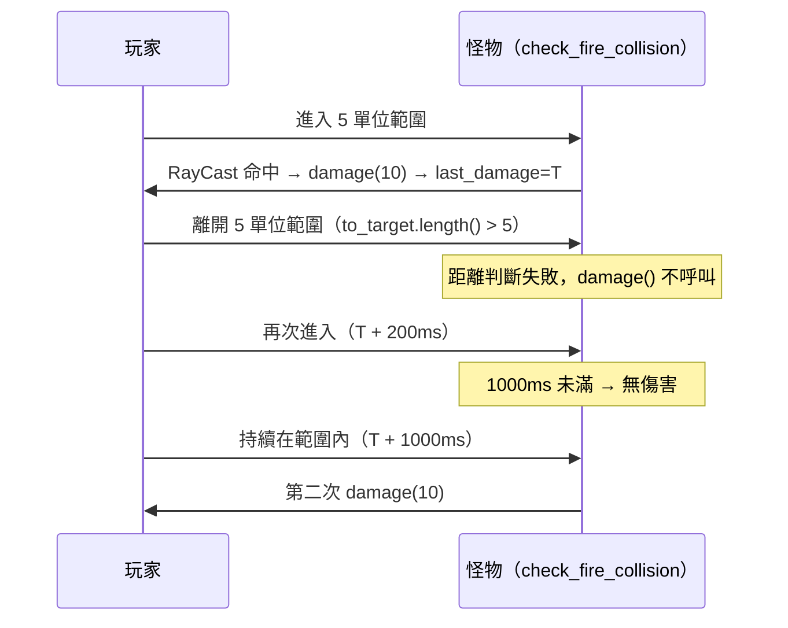
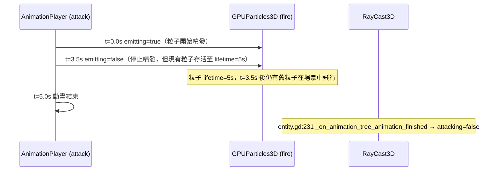

# 怪物美術、動畫與音效系統 深入分析

## 模型資訊（dragon.gltf）

| 項目 | 內容 |
|------|------|
| 格式 | GLTF（純文字 JSON，貼圖嵌入） |
| 動畫幀率 | 15 FPS（import 設定） |
| 縮放 | 0.01（場景中縮放修正，模型原始單位約為遊戲單位的 100 倍） |
| 骨架 | 動畫嵌入 GLTF，由 Godot 自動解析為 AnimationPlayer |
| 貼圖 | 嵌入 GLTF 內部（無獨立貼圖檔案，故無材質 .tres 覆蓋） |

---

## 碰撞體結構（dragon.tscn:521-648）

Dragon 使用 **33 個 ConvexPolygonShape3D** 拼湊出怪物全身的精確碰撞外殼：

```
dragon (CharacterBody3D)
├── @CollisionShape3D@29210  ← 軀幹右翼區
├── @CollisionShape3D@29209  ← 軀幹後翼區
├── head                     ← 頭部（具名，未來可用於弱點部位偵測）
├── @CollisionShape3D@29207  ← 頸部前段
├── ... (共 20 個匿名碰撞體)
├── leg_front_left           ← 左前腳（具名）
├── leg_rear_left            ← 左後腳（具名）
├── leg_front_right          ← 右前腳（具名）
├── leg_rear_right           ← 右後腳（具名）
├── tail                     ← 尾巴（具名）
└── CollisionShape3D         ← 翅膀右側
```

**設計意義**：  
- 具名部位（head, leg_*, tail）預留了未來部位破壞系統的基礎，符合 Monster Hunter 原作砍尾設計
- 全部縮放 0.01，與模型縮放一致
- ConvexPolygon 由 Godot 編輯器自動分解（Vhacd/AutoConvex），不需手工建模

---

## AnimationTree 狀態機（dragon.tscn:499-512）

### 主狀態機

```
Start → idle-loop
idle-loop → movement   [moving]
idle-loop → attack     [attacking]
idle-loop → rest       [resting]
idle-loop → death      [dead]
movement  → idle       [idle]
movement  → attack     [attacking]
movement  → rest       [resting]
attack    → idle-loop  (自動，播完)
rest      → idle-loop  [idle]
death     → End        (自動，播完)
```

### 移動子狀態機（movement 內部）

```
Start → walk-loop [walking] / run-loop [running]
walk-loop ↔ run-loop    (walking/running 條件)
run-loop → jump         [jumping]
jump → run-loop         (落地，switch_mode=2 立即切)
walk-loop → dodge       [dodging]
dodge → walk-loop       [walking]
```

---

## 動畫庫與音效綁定（dragon.tscn:372-382）

怪物的動畫架構分**兩層**：

```
AnimationPlayer（從 GLTF 載入的骨骼動畫）
    ↑ 被引用
AnimationTree（狀態機控制播放）
    ↑ 同時
AnimationPlayer（自定義層，覆蓋 fire 粒子與音效）
```

第二個 `AnimationPlayer`（龍場景內自建）的動畫庫：

| 動畫名 | 長度 | 控制內容 |
|--------|------|---------|
| `attack` | 5.0s | `fire:emitting=true`（0~3.5s），`entity_audio` 播放 `dragon.wav`（t=0.2s） |
| `death` | 2.5s | `entity_audio` 播放 `dragon-roar.wav`（t=0s），`fire:emitting=false` |
| `dodge` | - | `fire:emitting=false` |
| `idle` | - | `fire:emitting=false` |
| `jump` | - | `fire:emitting=false` |
| `rest` | - | `fire:emitting=false` |
| `run` | - | `fire:emitting=false` |
| `walk` | - | `fire:emitting=false` |

**設計要點**：
- 攻擊動畫（5秒）= 骨骼攻擊動畫 + 火焰粒子開啟 + 龍吟音效
- 死亡動畫（2.5秒）= 骨骼死亡動畫 + 龍吼音效 + 確保火焰關閉
- 其他狀態確保火焰是關閉的（防止殘留）

---

## 音效資源

| 音效檔 | 用途 | 播放時機 |
|--------|------|---------|
| `dragon.wav` | 龍吟/攻擊音效 | attack 動畫 t=0.2s（稍微延遲，避免攻擊動作開始就響） |
| `dragon-roar.wav` | 龍吼/死亡音效 | death 動畫 t=0s（立即播放） |

音效透過場景中的 `entity_audio`（AudioStreamPlayer3D）播放：
```
[node name="entity_audio" type="AudioStreamPlayer3D" parent="." index="38"]
transform = Transform3D(1, 0, 0, 0, 1, 0, 0, 0, 1, 0, 2.177, 1.289)
unit_size = 20.0   ← 3D 空間衰減，距離 20 單位聽不到
```

---

## 火焰噴射粒子系統（dragon.tscn:661-671）

```gdscript
[node name="fire" type="GPUParticles3D" parent="." index="35"]
transform = Transform3D(1, 0, 0, 0, 1, 0, 0, 0, 1, 0, 2.0775, 1.637)
emitting = false
amount = 256
lifetime = 5.0
randomness = 0.5
visibility_aabb = AABB(-16, -16, -16, 32, 32, 32)
```

**粒子材質設定（ParticleProcessMaterial）：**
```
emission_shape = sphere, radius=0.1（從嘴部小範圍噴出）
direction = (0, -1, 1)（斜向前下方，火焰噴射感）
spread = 5°（集中噴出，不散射）
flatness = 0.25（稍微壓扁，水平擴散）
initial_velocity = 1.2~1.5
gravity = (0, 0.3, 0)（輕微向上漂浮）
collision_mode = 1，bounce=0.5（粒子可與地面彈跳）
```

**顏色漸層（時間軸）：**
```
t=0.00: 黑色（alpha=1）        ← 噴出點藏在嘴裡看不到
t=0.09: 深橙紅 (0.98, 0.22, 0) ← 火焰核心
t=0.43: 橙黃 (0.97, 0.62, 0)   ← 火焰中段
t=0.68: 淡橙 (0.80, 0.58, 0.17)← 火焰外緣
t=0.84: 灰白 (0.72, 0.72, 0.72)← 煙霧
t=1.00: 黑色（消散）
```

**粒子材質（StandardMaterial3D）：**
- `billboard_mode = 3`（粒子面向相機）
- `vertex_color_use_as_albedo = true`（使用粒子顏色漸層）
- `blend_mode = 1`（Additive 加法混合，火焰發光效果）
- Texture：`flame_01.png`（kenney_particlePack 噴焰貼圖）

**RayCast3D 傷害感測器：**
```
target_position = (0, -3, 5)   ← 向前方 5 單位、略向下，覆蓋火焰噴射範圍
enabled = false（平時關閉，攻擊時在 check_fire_collision() 開啟）
```

---

## 感嘆號（exclamation）視覺效果（dragon.tscn:674-681）

```
[node name="exclamation" type="MeshInstance3D"]
visible = false
mesh = QuadMesh (0.5x0.5)   ← 顯示 warning.png 的公告板
材質：warning.png + billboard_keep_scale=true + transparency
```

動畫（5秒）：
```
t=0: visible=true, scale=(0.1, 0.1, 0.1)  ← 彈出
t=0.5: scale=(1, 1, 1)                    ← 放大
t=4.5: scale=(1, 1, 1)                    ← 維持
t=5: scale=(0.1, 0.1, 0.1), visible=false ← 縮小消失
```

當怪物進入戰鬥模式（`hunt_target()` 首次呼叫）觸發：
```gdscript
# monster.gd:156-159
if not combat:
    combat = true
    $exclamation/AnimationPlayer.play("exclamation")
```

---

## 視野偵測範圍

```
[node name="view" type="Area3D"]
└── radius (SphereShape3D) radius=20.0   ← 20 單位球形視野
```

玩家進入/離開此 Area3D → `_on_view_body_entered/exited` → 加入/移出 `players[]` 候選清單

---

## 導航設定

```
NavigationAgent3D:
    target_desired_distance = 5.0    ← 距目標 5 單位視為「到達」
    path_max_distance = 30.01        ← 偏離路徑 30 單位時重算
    simplify_path = true
    simplify_epsilon = 0.2           ← 路徑簡化精度
    debug_enabled = true             ← 開發中可視化路徑（正式版應關閉）
```

---

## 深化補充

### 1. NavigationAgent 5 單位邊界的震盪分析

`dragon.tscn:710-715` 設定 `target_desired_distance = 5.0`，`monster.gd:166-173` 的 `hunt_target()` 移動判定如下：

```gdscript
# monster.gd:163-173
if $AnimationTree["parameters/conditions/attacking"]:
    direction = to_target.normalized()
    check_fire_collision()
elif distance_from_target > 10:
    run()
    follow_path()
elif distance_from_target > 5:
    walk()
    follow_path()
else:
    attack("attack")
    direction = to_target.normalized()
```

**邊界分析**：

NavigationAgent 的 `target_desired_distance = 5.0` 決定 `nav.is_navigation_finished()` 何時回傳 `true`，但**攻擊觸發是由 GDScript 的距離判斷獨立控制**，不使用 `is_navigation_finished()`。

震盪可能發生的情境：
- 距離 = 5.01 → `walk()` + `follow_path()` → 怪物繼續走
- 怪物走一步 → 距離 < 5 → `attack("attack")` 觸發
- 攻擊中（`parameters/conditions/attacking = true`）→ 進入攻擊分支（第一個 if），`follow_path()` 停止更新路徑，`$fire/RayCast3D.enabled` 被設回 false（`monster.gd:92`）

攻擊結束後（`entity.gd:231-234` 的 `_on_animation_tree_animation_finished`）：
```gdscript
# entity.gd:231-234
if "attack" in anim_name:
    $AnimationTree["parameters/conditions/attacking"] = false
    stop()
```

`stop()` 後 `attacking` 條件清除，下一幀重新進入距離判斷。若玩家靜止，距離通常仍 < 5，**立即再次觸發 `attack()`**，因此會出現連續攻擊而非走→停→攻的震盪。真正的震盪只在玩家剛好在 4.8~5.2 單位徘徊時才可能出現，實際上此邊界寬鬆，Godot 的物理一幀移動量遠小於 0.2，概率較低。

---

### 2. 火焰攻擊的 RayCast 冷卻機制（實作層）

```gdscript
# monster.gd:126-134
func check_fire_collision():
    $fire/RayCast3D.enabled = true
    var to_target := target_player.global_position - global_position
    if $AnimationTree["parameters/conditions/attacking"] and to_target.length() < 5:
        if $fire/RayCast3D.is_colliding() and $fire/RayCast3D.get_collider() == target_player:
            if Time.get_ticks_msec() - last_damage > 1000:
                print_debug("collided with", target_player.name)
                target_player.damage(10, 0.3, "fire")
                last_damage = Time.get_ticks_msec()
```

冷卻機制為 **`last_damage` 時間戳**（毫秒）：
- `last_damage` 定義於 `monster.gd:30`，初始值 `0`
- 每次造成傷害後更新為 `Time.get_ticks_msec()`
- 下次傷害須間隔 > 1000ms（1 秒）

**玩家快速進出視野期間的行為分析**：



**關鍵限制**：`check_fire_collision()` 本身**不負責開啟 RayCast**，呼叫後 `enabled=true` 狀態會保持到下一次 `follow_path()` 呼叫（`monster.gd:92`：`$fire/RayCast3D.enabled = false`）。若在攻擊過程中玩家移出 5 單位但仍在追蹤中，RayCast 保持開啟但距離判斷使傷害不觸發。

`damage()` 調用鏈（`entity.gd:318-338`）：參數 `10, 0.3, "fire"` 對應 `(damage_in=10, regenerable=0.3, element="fire")`，即玩家最多可回復 10 × 0.3 = 3 HP。

---

### 3. 感嘆號觸發與玩家逃脫行為（實作層）

感嘆號動畫資料（`dragon.tscn:188-213`）：

```
Animation "exclamation" (length=5.0s)
  Track 0: visible（discrete）
    t=0.0 → true
    t=5.0 → false
  Track 1: scale（cubic interpolation）
    t=0.0 → (0.1, 0.1, 0.1)  ← 彈出
    t=0.5 → (1, 1, 1)        ← 放大完成
    t=4.5 → (1, 1, 1)        ← 維持
    t=5.0 → (0.1, 0.1, 0.1)  ← 縮小消失
```

觸發條件（`monster.gd:155-159`）：
```gdscript
func hunt_target():
    if not combat:
        prints(name, "exclamation")
        combat = true
        $exclamation/AnimationPlayer.play("exclamation")
```

**玩家在感嘆號期間逃脫的行為**：

`combat = true` 在感嘆號觸發時立即設定，**不會因玩家逃脫而重置**。`combat` 沒有任何地方將其設回 `false`（除了 `scout()` 中：`monster.gd:197`）。

逃脫路徑：
- `_on_view_body_exited` → `players.erase(body)` → `monster.gd:238`
- 下一幀 `check_target()`（`monster.gd:98-106`）：若 `target_player` 不在 `players[]` → `target_player = null`
- 進入 `scout()` → `combat = false`（`monster.gd:197`）

**結論**：玩家在感嘆號播放期間逃脫，如果 `target_player` 清除後進入 `scout()`，`combat` 會被設回 `false`。若玩家再次進入視野，**感嘆號會再次觸發**，感嘆號動畫本身不阻止怪物繼續追蹤（AnimationPlayer 獨立播放，不影響 `hunt_target()` 的執行）。

---

### 4. `died()` 之後的場景狀態與 `monster drop.gd` 接管流程

**entity.gd 的 `died()`（基底層）**（`entity.gd:260-268`）：
```gdscript
@rpc("any_peer", "call_local") func died():
    print("%s died" % [name])
    $AnimationTree["parameters/conditions/dead"] = true
    state_machine.travel("death")
    hp = 0
    hp_regenerable = 0
    velocity = Vector3()
    direction = Vector3()
    set_process(false)
```

**monster.gd 的 `died()` override**（`monster.gd:69-76`）：
```gdscript
@rpc("any_peer", "call_local") func died():
    super.died()              # 呼叫 entity.gd:died()
    set_physics_process(false)
    $fire.hide()              # 隱藏 GPUParticles3D（含 RayCast3D 子節點）
    $interact.add_to_group("interact")   # 讓節點可互動（觸發掉落）
    $view.disconnect("body_entered", _on_view_body_entered)
    $view.disconnect("body_exited", _on_view_body_exited)
    call_deferred("set_script", preload("res://src/interact/monster drop.gd"))
```

**各子節點狀態**：

| 子節點 | died() 後狀態 |
|--------|--------------|
| AnimationTree | `dead=true`，state_machine 播放 death 動畫（2.5s） |
| AnimationPlayer（骨骼）| 死亡骨骼動畫播放後停在最後一幀 |
| AnimationPlayer（自建）| `death` 動畫：t=0 播放龍吼、t=0 fire.emitting=false |
| GPUParticles3D (fire) | `hide()` 呼叫後整個節點隱藏（含 RayCast3D） |
| CollisionShape3D | **未做任何處理**，仍保持 enabled，屍體仍有碰撞體 |
| Area3D (view) | 訊號斷開，但 Area3D 本身仍在場景中 |

**`monster drop.gd` 接管流程**（`set_script()` 為 deferred，death 動畫播放中才切換）：

`monster drop.gd` 繼承自 `gathering.gd`（`interact/gathering.gd`），`set_script()` 後 Godot 會呼叫新腳本的 `_init()` 和 `_ready()`：

```gdscript
# monster drop.gd:13-15
func _init():
    super([barrel, firework, potion], randf_range(2,5))
```

```gdscript
# gathering.gd:12-17
func _init(items, quant):
    obtainable = items
    quantity = quant
    for item in obtainable:
        rarity += item.rarity
```

`gathering.gd` 沒有定義 `_ready()`，所以 `set_script()` 後無 `_ready()` 邏輯執行。接管後，CharacterBody3D 節點保留原有的所有子節點（動畫、碰撞體等），但腳本邏輯改為 `gathering.gd` 的 `interact()` 方法：玩家互動 → 隨機掉落道具（Barrel/Firework/Potion）→ `quantity` 歸零後 `queue_free()` 清除整個怪物節點。

`monster drop.gd:18-19` 覆寫 `die()` 為空函數，防止多人連線時重複呼叫 `die()` 造成錯誤。

---

### 5. 火焰粒子開啟時機與 loop 行為（精確時間軸）

攻擊動畫的 `fire:emitting` 軌道資料（`dragon.tscn:222-235`）：

```
Animation "attack" (length=5.0s, loop_wrap=true)
  Track 0: fire:emitting（discrete update）
    t=0.0 → true    ← 攻擊動畫開始，立即開啟粒子
    t=3.5 → false   ← 距結束還有 1.5 秒時關閉
```

**粒子時序分析**：



**loop 行為**：`attack` AnimationPlayer 動畫的 `loop_wrap = true`（`dragon.tscn:229`），但 `entity.gd:231` 在攻擊動畫結束時呼叫 `stop()` 並設 `attacking=false`，使 AnimationTree 自動從 attack 狀態退回 idle-loop，因此攻擊動畫**實際上不會 loop**，`loop_wrap` 設定在此情境下無效果。

**非攻擊狀態的 fire 保護**：所有非攻擊動畫（idle/walk/run/jump/dodge/rest）在 t=0 都設 `emitting=false`（`dragon.tscn:282-370`），確保無論 AnimationPlayer autoplay 切換到哪個動畫，火焰必定關閉。`AnimationPlayer` 的 `autoplay = "idle"` 設定（`dragon.tscn:688`）意味著場景載入後立刻播放 idle 動畫 → 確保初始狀態 fire 為關閉。
