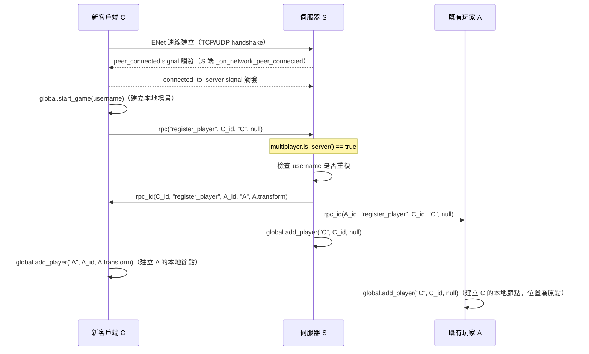

# 多人網路系統 深入分析

## 架構概覽

```
[Autoload: networking]  NetworkingAutoload (networking.gd)
    ├── ENetMultiplayerPeer            ← Godot 4 內建 UDP 多人框架
    ├── Lobby (lobby.gd)               ← HTTP 大廳伺服器（可選）
    └── players: {peer_id: Player}     ← 玩家節點字典

[Autoload: global]  GlobalAutoload (global.gd)
    ├── 場景生命週期管理
    └── 玩家/怪物實例化
```

---

## ENet 連線流程

### 伺服器端（server_start）

```gdscript
# networking.gd:25-40
func server_start(port: int, username=null, host=null) -> void:
    peer = ENetMultiplayerPeer.new()
    peer.create_server(port)
    multiplayer.multiplayer_peer = peer
    unique_id = peer.get_unique_id()            # 伺服器 ID 通常為 1
    set_process_mode(PROCESS_MODE_ALWAYS)        # 確保暫停時仍處理網路
    global.start_game(username)                 # 先啟動遊戲場景
    players[unique_id] = global.local_player   # 登記自己
    multiplayer.peer_disconnected.connect(...)
    multiplayer.peer_connected.connect(...)
```

### 客戶端（client_start）

```gdscript
# networking.gd:44-54
func client_start(ip: String, port: int, username: String) -> void:
    peer = ENetMultiplayerPeer.new()
    peer.create_client(ip, port)
    multiplayer.multiplayer_peer = peer
    unique_id = peer.get_unique_id()            # 客戶端 ID 由伺服器分配
    multiplayer.connected_to_server.connect(_connected_to_server.bind(username))
    multiplayer.connection_failed.connect(_connection_failed.bind(ip, port))
    multiplayer.server_disconnected.connect(_server_disconnected)
```

```gdscript
# 連線成功後
func _connected_to_server(username: String):
    global.start_game(username)                 # 建立本地場景
    players[unique_id] = global.local_player
    rpc("register_player", unique_id, username, null)  # 向伺服器報到
```

---

## 玩家同步協議（register_player）

這是整個多人同步的核心 RPC：

```gdscript
# networking.gd:85-102
@rpc("any_peer") func register_player(id, username, transform) -> void:
    if multiplayer.is_server():
        # 1. 驗證使用者名稱不重複
        if game.find_child("player_spawn").has_node(username):
            rpc_id(id, "_register_error", "Username is in use")
            peer.disconnect_peer(id)
            return
        
        # 2. 向新玩家廣播所有現有玩家資訊
        for peer_id in players:
            var player = players[peer_id]
            rpc_id(id, "register_player", peer_id, player.name, player.transform)
        
        # 3. 向所有現有玩家廣播新玩家
        for peer_id in players:
            rpc_id(peer_id, "register_player", id, username, transform)
        
        # 4. 在伺服器自己的場景建立新玩家節點
        players[id] = global.add_player(username, id, transform)
    else:
        # 客戶端：直接建立收到的玩家
        players[id] = global.add_player(username, id, transform)
```

**同步順序說明**：
```
新客戶端 C 連線到伺服器 S（已有玩家 A、B）

C → S: register_player(C_id, "C", null)

S → C: register_player(A_id, "A", A.transform)   ← 告知 C 關於 A
S → C: register_player(B_id, "B", B.transform)   ← 告知 C 關於 B
S → A: register_player(C_id, "C", null)           ← 告知 A 關於 C
S → B: register_player(C_id, "C", null)           ← 告知 B 關於 C
S 自己：global.add_player("C", C_id)              ← 伺服器建立 C 的節點
```

---

## RPC 裝飾器語義

| 函數 | 裝飾器 | 含義 |
|------|--------|------|
| `register_player` | `@rpc("any_peer")` | 任何 peer 都可以呼叫（客戶端→伺服器） |
| `_register_error` | `@rpc("any_peer")` | 伺服器→客戶端錯誤通知 |
| `died` | `@rpc("any_peer", "call_local")` | 任何人呼叫，且呼叫者自己也執行 |
| `respawn` | `@rpc` | 預設：authority 呼叫，所有 peer 執行 |
| `_update_hp` | `@rpc("call_remote")` | 只在遠端執行（不在呼叫者本地重複執行） |
| `_update_stamina` | `@rpc("call_remote")` | 同上 |

---

## 玩家節點的 Authority 設計

```gdscript
# global.gd:24-29
static func add_entity(entity_name, scene, spawn, id=1):
    var entity = scene.instantiate()
    entity.set_multiplayer_authority(id)   ← 設定誰是這個節點的 authority
    entity.set_name(entity_name)
    spawn.add_child(entity)
    return entity
```

**規則**：
- 每個 Player 節點的 authority = 那個玩家的 peer_id
- `is_multiplayer_authority()` → 只有本地玩家對自己的節點回傳 true
- 怪物 authority = 1（伺服器），單人模式 authority 也是 1

**基於 Authority 的行為分歧**：
```gdscript
# player.gd:171-175
func resume_player():
    var has_peer := multiplayer.has_multiplayer_peer()
    var enable := not has_peer or is_multiplayer_authority()
    set_process_input(enable)       # 只有自己的角色接收輸入
    set_physics_process(enable)     # 只有自己的角色做物理運算

# monster.gd:58-65
func setup_monster():
    var singleplayer_or_server := not multiplayer.has_multiplayer_peer() or is_multiplayer_authority()
    await NavigationServer3D.map_changed
    set_physics_process(singleplayer_or_server)   # 怪物 AI 只在伺服器跑
```

---

## 大廳（Lobby）系統

### HTTP 大廳伺服器（lobby.gd）

```gdscript
const BASE_URL = "https://elinvention.ovh"

# 玩家可在此瀏覽公開伺服器列表
func servers_list(object, method):
    http.request(BASE_URL + "/fh/cmd.php?cmd=list_servers")
    http.connect("request_completed", Callable(object, method))

# 伺服器可選擇向大廳註冊（讓其他人看到）
func register_server(host, port):
    http.request(BASE_URL + "/fh/cmd.php?cmd=register_server&hostname=%s&port=%s&max_players=10" % [host, port])
```

### 大廳 UI（lobby-ui.gd）

```gdscript
# 設定儲存至 user://multiplayer.conf（ConfigFile）
func save_config():
    config.set_value("global", "username", ...)
    config.set_value("client", "host", ...)
    config.set_value("client", "port", ...)
    config.set_value("server", "host", ...)
    config.save(CONF_FILE)

# 每 10 秒自動刷新伺服器列表
$lobby/refresh.start()   # Timer，10 秒間隔
```

大廳 UI 提供兩種連線方式：
1. **直連**：手動輸入 IP:Port
2. **大廳瀏覽**：從 HTTP 伺服器取得公開伺服器清單，點擊連線

---

## 斷線處理

```gdscript
# networking.gd:73-82
func _on_network_peer_disconnected(id) -> void:
    if id in players:
        global.remove_player(players[id].name)   # 從場景移除玩家節點
        players.erase(id)
    else:
        print("Peer ID %d disconnected" % id)    # 可能是連線中的匿名 peer

# global.gd:49-51
func remove_player(player_name):
    players_spawn.get_node(player_name).queue_free()
    player_disconnected.emit(player_name)

# 伺服器斷線
func _server_disconnected() -> void:
    stop_and_report_error("Server disconnected.")
```

`stop_and_report_error` 流程：
```gdscript
func stop_and_report_error(message) -> void:
    global.stop_game()                    # 清除遊戲場景
    await get_tree().tree_changed         # 等待場景切換完成（change_scene 是異步的）
    $"/root/main_menu/multiplayer".show()
    $"/root/main_menu/multiplayer".report_error(message)  # 顯示錯誤對話框
```

---

## 已知限制與 TODO

| 問題 | 位置 | 說明 |
|------|------|------|
| 怪物移動不同步 | entity.gd:210-219 | transform RPC 被注解掉（`#rpc("transform", tf)`） |
| 大廳註冊被注解 | networking.gd:31-34 | register_server/register_player 邏輯有 yield 殘留（Godot 3 語法） |
| 客戶端輸入無驗證 | networking.gd | 任何 peer 都可以呼叫 register_player，沒有伺服器端驗證輸入合法性 |
| 怪物 authority 固定 = 1 | global.gd:33 | 若伺服器斷線，怪物 AI 會停止（沒有 authority 轉移機制） |

---

## 深化補充

### 1. Transform RPC 被注解的原因與影響

`entity.gd:210-219` 的完整程式碼如下：

```gdscript
# entity.gd:210-219
if multiplayer.has_multiplayer_peer() and is_multiplayer_authority():
    var tf = get_transform()
    var dist = (tf.origin - ti.origin).length()
    var rotx = (tf.basis.x - ti.basis.x).length()
    var roty = (tf.basis.y - ti.basis.y).length()
    var rotz = (tf.basis.z - ti.basis.z).length()

    if dist > 0.01 or rotx > 0.001 or roty > 0.001 or rotz > 0.001:
        #rpc("transform", tf)
        pass
```

**被注解的原因（推測）**：

- `Entity` 繼承 `CharacterBody3D`，**沒有** `@rpc func transform(tf)` 的接收端定義。注解掉的呼叫方 `rpc("transform", tf)` 即使解除注解也無法找到目標函式，會在執行期報 RPC 找不到的錯誤。
- Godot 4 的 `@rpc` 裝飾器要求呼叫端與接收端都要有 `@rpc` 標記的同名函式。`transform` 是 `Node3D` 的屬性，不是 RPC 函式，所以這段程式碼在架構上根本無法運作。
- 實際上是**佔位符（placeholder）**：開發者留下變動偵測邏輯（計算 dist、rotx、roty、rotz），但尚未實作真正的同步函式。

**結果：遠端玩家的位置完全不更新**

只有以下資訊透過 RPC 同步：
- HP（`_update_hp`）
- 耐力（`_update_stamina`）
- 死亡/復活狀態（`died`、`respawn`）
- 初始 transform（`register_player` 傳入的 `transform` 參數，僅在加入時設一次）

遠端玩家加入後，其在本地的位置節點永遠停在出生點 `Transform3D()` 或 `register_player` 的初始 transform，不會隨遠端玩家的實際移動而更新。

**例外：死亡時的位置估算**

`player.gd:183-189` 有一段特殊邏輯，當遠端玩家死亡時，本地端用 `previous_origin` 推算方向：

```gdscript
# player.gd:183-189
func _process(delta: float):
    super(delta)
    if state_machine.get_current_node() == "dead" and \
            multiplayer.has_multiplayer_peer() and \
            not is_multiplayer_authority():
        direction = (previous_origin - transform.origin).normalized()
        previous_origin = transform.origin
```

這段程式碼的實際效果是 `transform.origin` 從不改變（因為 transform 沒有同步），所以 `previous_origin - transform.origin` 永遠是零向量，方向推算沒有實際意義。

---

### 2. `register_player()` 廣播流程完整追蹤

#### 正常連線流程



#### 廣播順序的問題

`networking.gd:93-100` 的兩層 for 迴圈存在一個微妙的問題：

```gdscript
# networking.gd:93-100
for peer_id in players:
    var player = players[peer_id]
    rpc_id(id, "register_player", peer_id, player.name, player.transform)  # 告知新人關於舊人
    rpc_id(peer_id, "register_player", id, username, transform)             # 告知舊人關於新人
players[id] = global.add_player(username, id, transform)                    # 伺服器自己建立新人
```

這個迴圈**同一層**同時做了兩件事：向新玩家廣播舊玩家、向舊玩家廣播新玩家。伺服器本地端建立新玩家節點是在迴圈**結束後**，因此：

- 若伺服器在廣播期間恰好有另一個新玩家同時加入，可能在 `players` 字典迭代中途出現競態狀況（GDScript 是單執行緒，但 ENet 事件可能在下一幀插入）。
- 實際上 GDScript 是協作式（cooperative），同一幀內迭代不會被中斷，風險低但值得注意。

#### 斷線行為

```gdscript
# networking.gd:76-82
func _on_network_peer_disconnected(id) -> void:
    if id in players:
        print("Player %s (peer ID %d) disconnected" % [players[id].name, id])
        global.remove_player(players[id].name)  # 移除節點
        players.erase(id)                        # 從字典移除
    else:
        print("Peer ID %d disconnected" % id)    # 匿名 peer（ENet handshake 中途斷線）
```

斷線通知**只在本地處理**，沒有向其他客戶端廣播「某玩家離線」的 RPC。這意味著：

- 伺服器端：正確移除節點，`players` 字典乾淨
- 其他客戶端：斷線玩家的節點繼續留存在場景中（因為 `peer_disconnected` 只在斷線 peer 的直接連接方觸發，其他客戶端不會收到通知）

**Godot 4 ENet 的實際行為**：`peer_disconnected` 訊號在多人模式下，所有連接的 peer 都會收到，因此其他客戶端的 `_on_network_peer_disconnected` 也會觸發，節點可以被移除。這是 ENet 多人框架的廣播行為，非 RPC，所以此處邏輯實際可正常運作。

---

### 3. Authority 邊界：武器傷害與怪物同步

#### 武器傷害：`_on_body_entered()` 無 Authority 檢查

`weapon.gd:97-101` 的完整實作：

```gdscript
# weapon.gd:97-101（src/equipment/weapon.gd）
func _on_body_entered(body):
    if body != player and body is Entity and not body.is_dead():
        body.damage(get_weapon_damage(body, null), 0.0, null, self, player)
        $audio.play()
        blunt(1)
```

此函式沒有任何 `is_multiplayer_authority()` 或 `multiplayer.is_server()` 的判斷。

**遠端玩家也會觸發碰撞的機制分析**：

武器掛載在玩家模型的 `BoneAttachment3D`（`weapon_L`，bone_idx=41）下。玩家節點透過 `resume_player()` 控制誰執行 physics_process：

```gdscript
# player.gd:171-175
func resume_player():
    var has_peer := multiplayer.has_multiplayer_peer()
    var enable := not has_peer or is_multiplayer_authority()
    set_process_input(enable)
    set_physics_process(enable)  # 遠端玩家：physics_process 停用
```

遠端玩家的 `CharacterBody3D`（玩家本身）不執行物理，但其**子節點**（包括武器的 `Area3D` 或 `CollisionShape3D`）仍然存在於場景的物理世界中。由於武器的碰撞體是靜態的（武器跟著骨骼走，而遠端玩家位置不更新），武器實際上永遠停在原點，不會隨遠端玩家動畫移動，因此 `_on_body_entered` 在遠端玩家上幾乎不會誤觸發。

**然而**，若 transform 同步功能被啟用（修復了 RPC 注解問題），遠端玩家的武器碰撞體將跟隨位置更新，`_on_body_entered` 就會在**每個客戶端**觸發，導致：

- 每個客戶端各自對目標呼叫 `body.damage()`
- `damage()` 本地執行後再透過 `hp_changed` signal 呼叫 `rpc("_update_hp", ...)` 廣播 HP
- 結果：傷害被重複計算（玩家數量 × 傷害值）

**安全隱患**：目前因為 transform 不同步，問題被「偶然」規避。修復位置同步前，必須先在 `_on_body_entered` 加入 authority 檢查。

#### 怪物 AI：客戶端看到的怪物在哪裡

```gdscript
# monster.gd:58-65
func setup_monster():
    var singleplayer_or_server := not multiplayer.has_multiplayer_peer() or is_multiplayer_authority()
    await NavigationServer3D.map_changed
    set_physics_process(singleplayer_or_server)   # 只有伺服器跑 AI + 物理
    if multiplayer.has_multiplayer_peer() and is_multiplayer_authority():
        set_process_mode(Node.PROCESS_MODE_ALWAYS)  # 伺服器暫停時也繼續
    if singleplayer_or_server:
        call_deferred("new_random_target")
```

怪物的 authority = 1（伺服器），所以：

- 伺服器：執行 AI（導航、追蹤、攻擊），執行物理（`move_and_slide`），怪物實際移動
- 客戶端：`set_physics_process(false)`，怪物節點存在於場景但**永遠停在出生點不動**

由於 transform RPC 也被注解，客戶端看到的怪物位置與伺服器完全不一致。怪物傷害（`check_fire_collision`）是在伺服器端的怪物 AI 裡計算，呼叫 `target_player.damage()`，而玩家的 `damage()` 會透過 `rpc("_update_hp")` 同步 HP——所以玩家 HP 會正確扣血，但客戶端看不到怪物移動和攻擊動畫，只能看到 HP 突然下降。

---

### 4. 大廳 HTTP 邏輯的 Godot 4 相容性

被注解的程式碼位於 `networking.gd:31-37`：

```gdscript
# networking.gd:31-37（已注解）
#if host != null:
#	print("Announcing server")
#	lobby.register_server(host, port)
#	yield(lobby.http, "request_completed")
#	if username != null:
#		print("Announcing player")
#		lobby.register_player(username)
```

**Godot 3 殘留語法確認**：`yield(lobby.http, "request_completed")` 是 Godot 3 語法。在 Godot 4 中，`yield` 已被移除，等價寫法是 `await lobby.http.request_completed`。

**然而 `lobby.gd` 本身已完成 Godot 4 移植**：

```gdscript
# lobby.gd（現有程式碼，已用 Godot 4 語法）
func register_server(host, port):
    http.request(BASE_URL + "/fh/cmd.php?cmd=register_server&...")
    http.connect("request_completed", Callable(self, "_on_register_server_completed"))

func _on_register_server_completed(result, response_code, headers, body):
    http.disconnect("request_completed", Callable(self, "_on_register_server_completed"))
    ...
```

`lobby.gd` 已改用 callback（`Callable`）模式，無 `yield` 殘留。被注解的是 `networking.gd` 中的**呼叫端**，它原本用 `yield` 等待 HTTP 完成後再呼叫 `register_player`，但 `lobby.gd` 的回調架構並不支援這種順序等待（`register_server` 啟動 HTTP 請求後立刻返回）。

**解封需要的修改**：
- 移除 `yield` 殘留
- 改為在 `_on_register_server_completed` 成功後呼叫 `register_player`，或在 `lobby.gd` 提供 callback 參數

---

### 5. 客戶端輸入驗證的安全隱患

`register_player` 的接收端邏輯（`networking.gd:85-102`）：

```gdscript
# networking.gd:85-102
@rpc("any_peer") func register_player(id, username, transform) -> void:
    if multiplayer.is_server():
        # 唯一的驗證：使用者名稱重複檢查
        if global.game.find_child("player_spawn").has_node(username):
            rpc_id(id, "_register_error", "Username is in use")
            peer.disconnect_peer(id)
            return
        ...
        players[id] = global.add_player(username, id, transform)
    else:
        # 客戶端：完全不驗證，直接信任接收到的所有資料
        players[id] = global.add_player(username, id, transform)
```

**具體安全問題**：

1. **ID 偽造（伺服器端）**：任何 peer 都可以傳入任意 `id` 值（包括其他玩家的 peer_id 或伺服器的 id=1）。伺服器端沒有驗證 `id == multiplayer.get_remote_sender_id()`，惡意客戶端可以傳 `register_player(1, "evil", ...)` 覆蓋伺服器玩家的節點（`players[1]`）。

2. **Username 注入**：`has_node(username)` 用 `username` 做節點路徑查詢，Godot 的節點名稱有特殊字元限制，但若傳入包含 `/` 或 `..` 的字串，`find_child` 可能表現異常（`has_node` 支援路徑語法）。

3. **Transform 偽造（伺服器端）**：傳入的 `transform` 直接套用至玩家節點（`global.add_player` → `player.transform = transform`），客戶端可以指定任意出生位置，實作出傳送攻擊（teleport hack）。

4. **客戶端無驗證**：客戶端收到 `register_player` 時完全信任，惡意伺服器可傳入任意 `id`/`username`/`transform`（但此威脅模型較低，因為伺服器本來就有控制權）。

**修正方向**：
- 伺服器端驗證 `id == multiplayer.get_remote_sender_id()`
- 對 `username` 進行白名單字元過濾（僅允許字母數字）
- 對 `transform` 做合理範圍檢查（確保出生點在地圖範圍內）
