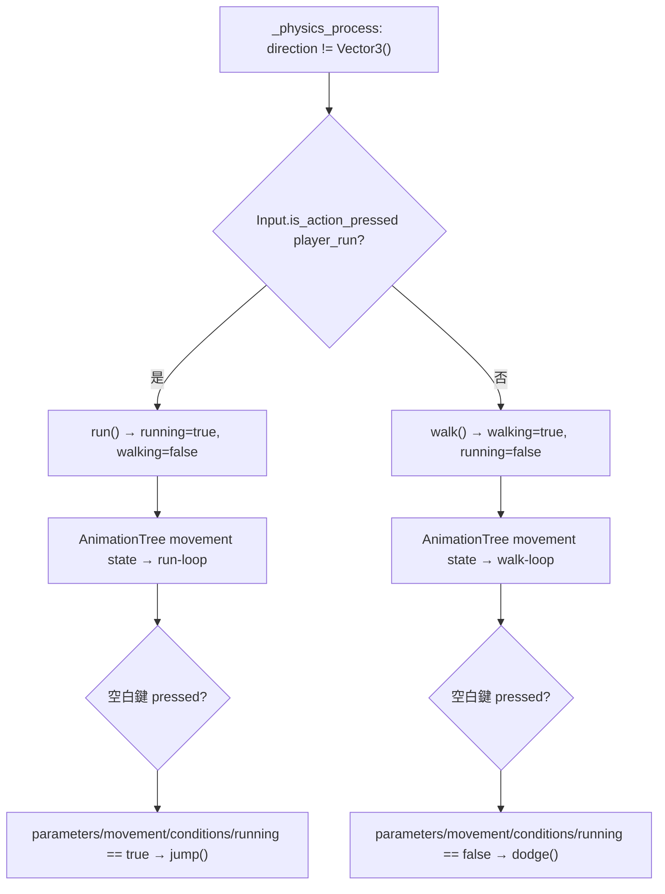
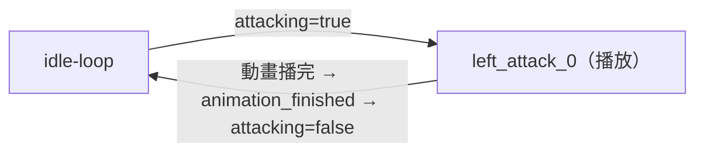

# 玩家美術、動畫、音效與操控系統 深入分析

## 模型資訊（male.glb）

| 項目 | 內容 |
|------|------|
| 格式 | GLB（Binary GLTF，所有資料打包成單一二進制檔） |
| 動畫幀率 | 15 FPS（import 設定） |
| 骨骼數量 | 70 根骨骼（bones/0 ~ bones/69，從 Skeleton3D 的初始姿勢可見） |
| 附著點 | head (bone_idx=19)、weapon_L (bone_idx=41)、weapon_R (bone_idx=61) |

### 重要骨骼附著點

```
Armature/Skeleton3D
├── head (BoneAttachment3D, bone_idx=19)
│   └── audio (AudioStreamPlayer3D)   ← 玩家語音/音效來源
├── weapon_L (BoneAttachment3D, bone_idx=41)
│   └── audio (AudioStreamPlayer3D)   ← 武器音效（磨刀聲等）
└── weapon_R (BoneAttachment3D, bone_idx=61)
    └── audio (AudioStreamPlayer3D)   ← 右手武器音效（未使用）
```

---

## 動畫庫完整清單（AnimationLibrary_vhmvp）

玩家動畫架構採「**雙層 AnimationPlayer**」設計：

```
male.glb 內嵌的 AnimationPlayer（骨骼動畫）
    ↑ 被包裝
AnimationsWithSounds（自建 AnimationPlayer）
    每個動畫 = 骨骼動畫 track + 音效 audio track
    ↑ 被驅動
AnimationTree（狀態機，控制哪個動畫播放）
```

| 動畫名 | 長度 | 骨骼動畫 | 音效 | 音效節點 | 音效時機 |
|--------|------|---------|------|---------|---------|
| `death` | 1.4s | death | `death.wav` | head/audio | t=0.1s |
| `dodge` | 1.5s | dodge | `dodge.wav` | head/audio | t=0.2s |
| `drink` | 2.0s | drink | `potion_drink.wav` | head/audio | t=0.35s（舉起瓶子時） |
| `eat` | - | - | `eat.wav` | head/audio | t=0 |
| `fall` | 2.0s | - | `male_fall_death_02.wav` | head/audio | t=0（開始尖叫） |
| `idle` | 1.5s | idle | - | - | - |
| `jump` | - | - | `jump.wav` | head/audio | t=0 |
| `left_attack_0` | - | left_attack_0 | - | - | - |
| `rest` | 5.0s | rest | - | - | - |
| `run` | - | run | - | - | - |
| `walk` | 1.5s | walk | - | - | - |
| `whetstone` | 1.7s | whetstone | `whetstone.wav` | weapon_L/audio | t=0.2s（開始磨刀時） |

**音效延遲設計的意義**：
- `drink`: 延遲 0.35s = 配合「拿起藥瓶→喝下」的動畫幀，聲音在喝藥時響起
- `dodge`: 延遲 0.2s = 配合身體開始移動的時機
- `death`: 延遲 0.1s = 微小延遲讓死亡音效不會在第一幀就爆出

---

## AnimationTree 狀態機（male.tscn:225-244）

### 主狀態機（31）

```
Start → idle-loop

idle-loop → movement     [moving, xfade=0.2s]
idle-loop → drink        [drinking]
idle-loop → eat          [eating]
idle-loop → whetstone    [whetstone]
idle-loop → rest         [resting]
idle-loop → left_attack_0[attacking]
idle-loop → death        [dead, xfade=0.2s]

movement → idle-loop     [idle, xfade=0.2s]
movement → left_attack_0 [attacking]
movement → rest          [resting]

left_attack_0 → idle-loop[idle（自動播完）]
left_attack_0 → movement [moving]

drink/eat/whetstone/rest → idle-loop（自動播完）
death → idle-loop [idle]（復活用）
```

**xfade_time=0.2~0.5s**：主狀態切換有過渡混合，避免動畫突變。

### 移動子狀態機（50）

```
Start → walk-loop [walking] / run-loop [running]

walk-loop ↔ run-loop    (xfade=0.5s)
run-loop  → jump        [jumping]
jump      → run-loop    [running AND is_on_floor()]   ← 需同時落地
jump      → walk-loop   [walking AND is_on_floor()]
jump      → falling     [jumping AND velocity.y < -10] ← 快速下落進入 screaming
falling   → screaming   [jumping AND velocity.y < -10]
falling   → run-loop    [running AND is_on_floor()]
falling   → walk-loop   [walking AND is_on_floor()]
screaming → End         (自動)
walk-loop → dodge       [dodging]
dodge     → walk-loop   (自動播完)
```

**advance_expression 特性**：
```gdscript
# 這些 transition 用 GDScript 表達式作為觸發條件
# 例如 jump→run-loop 的條件：
advance_condition = "running"
advance_expression = "get_parent().is_on_floor()"  # 須同時滿足
```

`falling` 狀態（動畫 = `run`）→ `screaming`（動畫 = `fall`）：  
當玩家下落速度超過 10 m/s，播放「fall」動畫（即恐懼聲音），模擬高空墜落的驚嚇反應。

---

## 玩家節點結構（male.tscn）

```
player (CharacterBody3D, floor_max_angle=40°)
├── Armature (GLB 模型)
│   └── Skeleton3D (70 bones)
│       ├── head BoneAttachment (bone 19)
│       │   └── audio AudioStreamPlayer3D
│       ├── weapon_L BoneAttachment (bone 41)
│       │   └── audio AudioStreamPlayer3D
│       └── weapon_R BoneAttachment (bone 61)
│           └── audio AudioStreamPlayer3D
├── shape CollisionShape3D (BoxShape 0.5×1.8×0.2)   ← 站立碰撞
│   （center at y=0.9）
├── drop_item Marker3D (0, 1, 2)                     ← 物品丟出位置（身前2m）
├── interact Area3D                                  ← 互動偵測
│   └── shape BoxShape 1.5×2×0.4 (center y=1)       ← 正面扇形範圍
├── name Marker3D (y=2.25)                           ← 玩家名稱標籤位置
├── AnimationTree                                    ← 狀態機
│   └── anim_player = AnimationsWithSounds
├── AnimationsWithSounds AnimationPlayer             ← 雙層包裝
└── Flames GPUParticles3D                            ← 燃燒異常效果
```

---

## 燃燒粒子效果（Flames）

```
GPUParticles3D:
    emitting = false（預設關閉）
    amount = 32
    lifetime = 1.6s

ParticleProcessMaterial:
    emission_sphere_radius = 0.3（從身體範圍噴出）
    angle_max = 360°（四面八方）
    direction = (0, -1, 0)（向下，但有浮力）
    spread = 5°
    gravity = (0, 0, 0)（無重力，自行上漂）
    radial_accel_max = 0.5（向外輻散）
    lifetime_randomness = 0.42（壽命不一，自然感）

顏色漸層：
    t=0.00: 黃色 (1, 0.986, 0.16)   ← 新生火星
    t=0.12: 橙色 (0.95, 0.57, 0)    ← 火焰
    t=0.43: 深橙 (1, 0.337, 0.03)   ← 熱核心
    t=1.00: 紅色 (1, 0, 0)          ← 消散
```

觸發條件（player.gd:63-67）：
```gdscript
func _on_ailment_added(ailment):
    match ailment:
        "fire":
            $Flames.emitting = true
            effect_over_time("burning", 1.0, 3, damage.bind(10, 0.5), func():
                ailments.erase("fire")
                $Flames.emitting = false)
```

---

## 玩家碰撞體設計

```
BoxShape3D: size = Vector3(0.5, 1.8, 0.2)
Transform: y+0.9（底部對齊地面）
```

**薄平板碰撞體的權衡**：
- 寬=0.5, 深=0.2（非常薄），比標準 CapsuleShape 更容易穿越門縫
- 可能導致側面碰撞不精確（怪物爪子從側面穿過）
- 優點：進入狹窄空間（門廊、峽谷）不易卡住

---

## 互動偵測區域（interact）

```
Area3D → interact
    BoxShape3D: size = Vector3(1.5, 2.0, 0.4)
    Transform: y=1（中心在腰部）
```

**0.4 深度的設計意義**：
- 只偵測正前方很窄的範圍
- 避免背後的互動物件誤觸發
- 配合 Player.get_nearest_interact() 的距離排序，確保互動的是玩家正在面對的物件

---

## 操控輸入完整流程

### 每幀更新（_physics_process）

```
1. 讀取移動輸入（鍵盤 WASD / 觸控搖桿）
   → 轉換為相機相對的 direction 向量
   → 移除 Y 分量（純水平移動）
   → 正規化

2. 判斷動畫狀態
   if direction != Vector3():
       if idle: walk()
       if run key: run()
   else:
       stop()

3. 呼叫 Entity.move_entity(delta)
   → AnimationTree 狀態決定速度倍率
   → 加重力
   → move_and_slide()

4. 相機 yaw_node 跟隨玩家位置
```

### 事件輸入（_input）

| 按鍵 | 動作 | 條件 |
|------|------|------|
| 左鍵 | `attack("left_attack_0")` | 無 |
| 右鍵 | `attack("right_attack_0")` | 無（注：right_attack 動畫未在狀態機中，TODO） |
| 空白（跑中） | `jump()` | 正在 running 狀態 |
| 空白（非跑） | `dodge()` | 非 running |
| Shift 按下 | `run()` | 無 |
| Shift 放開 | `walk()` | 無 |
| E | `interact_with_nearest()` | 無 |
| I（放開） | `open_player_inventory()` | 無 |

### 跑步→跳躍 vs 靜止→閃避

```gdscript
# player.gd:103-109
elif event.is_action_pressed("player_dodge"):
    if $AnimationTree["parameters/movement/conditions/running"]:
        jump()     ← 跑步時按空白 = 跳躍
    else:
        dodge()    ← 靜止/走路時按空白 = 閃避
```

這個設計使空白鍵具備「語境感知」行為，符合 Monster Hunter 原作（跑步起跳/靜止閃避）。

---

## 右攻擊缺失問題

```gdscript
# player.gd:100
elif event.is_action_pressed("player_attack_right"):
    attack("right_attack_0")
```

`attack("right_attack_0")` 呼叫 Entity.attack()：
```gdscript
# entity.gd:342
func attack(_attack_name):
    $AnimationTree["parameters/conditions/attacking"] = true
```

**問題**：`attack()` 完全忽略傳入的 `_attack_name` 參數，狀態機只有 `left_attack_0` 節點，右攻擊按鍵實際上也播放左攻擊動畫。

---

## 音效資源總表

| 檔案 | 用途 |
|------|------|
| `whetstone.wav` | 磨刀音效（via weapon_L/audio，動畫 t=0.2s） |
| `dodge.wav` | 閃避音效（via head/audio，動畫 t=0.2s） |
| `jump.wav` | 跳躍音效（via head/audio，動畫 t=0s） |
| `potion_drink.wav` | 喝藥水音效（via head/audio，動畫 t=0.35s） |
| `death.wav` | 死亡音效（via head/audio，動畫 t=0.1s） |
| `eat.wav` | 吃肉音效（via head/audio，動畫 t=0s） |
| `345434__artmasterrich__male_fall_death_02.wav` | 高空墜落驚叫（via head/audio） |
| `laser.wav` | 雷射劍命中音效（via weapon.gd `$audio.play()`） |
| `switch.ogg` | 切換快捷物品欄音效 |
| `beatbox.wav` | （用途未確認，可能是背景音或測試音） |

---

## AnimationsWithSounds 設計模式分析

```
標準做法：
    GDScript 中在 play_animation() 後手動 play_sound()

本專案做法：
    AnimationPlayer 的 audio track 直接在特定時間點觸發音效

優點：
    1. 音效與動畫幀精確同步（不受程式碼執行時機影響）
    2. 調整音效時機只需在編輯器移動 audio key，不改程式碼
    3. 不同聲音來源（頭部/武器）可在同一動畫軌道管理

缺點：
    1. AnimationPlayer 不能在執行時期動態替換音效（需改場景）
    2. 無法依情境（HP 低、環境）選擇不同音效
```

---

## 深化補充

### 1. 右攻擊動畫缺失的完整影響

#### `attack()` 函式的實作細節

`entity.gd:342-343` 的完整實作：

```gdscript
# entity.gd:342-343
func attack(_attack_name):
    $AnimationTree["parameters/conditions/attacking"] = true
```

`_attack_name` 參數有底線前綴（GDScript 慣例：未使用的參數），函式**完全不使用傳入的名稱**，只設定 `attacking` 條件為 true。

#### AnimationTree 如何消費 `attacking` 條件

從 `male.tscn:236-244` 的狀態機定義可知：

```
# 只有一個以 attacking 為條件的狀態節點
states/left_attack_0/node = SubResource("38")

# 主狀態機的 transition 列表中
"idle-loop", "left_attack_0", SubResource("58")   ← idle→left_attack_0，條件：attacking
"movement", "left_attack_0", SubResource("AnimationNodeStateMachineTransition_h8q53")  ← movement→left_attack_0
```

狀態機只有 `left_attack_0` 節點，沒有 `right_attack_0`。當 `attacking = true` 時，無論是左鍵還是右鍵觸發，狀態機都轉移到 `left_attack_0`，播放左攻擊動畫。

**動畫不存在時 AnimationTree 的行為**：AnimationTree 轉移到的是節點名稱（`left_attack_0`），不是動畫名稱。由於節點本來就叫 `left_attack_0`，永遠不會嘗試播放不存在的 `right_attack_0`。`_attack_name` 參數從未進入 AnimationTree，所以不存在「動畫不存在→報錯」的問題——只是右鍵按下後也播放左攻擊動畫，**靜默地執行錯誤行為**，不報錯。

#### 動畫結束後的狀態清除

`entity.gd:230-233`：

```gdscript
# entity.gd:230-233
func _on_animation_tree_animation_finished(anim_name: String):
    if "attack" in anim_name:
        $AnimationTree["parameters/conditions/attacking"] = false
        stop()
```

`"attack" in anim_name` 對 `"left_attack_0"` 成立，`attacking` 會被清除，狀態機回到 `idle-loop`。若有 `right_attack_0` 狀態，這個清除邏輯也會正確處理（因為字串包含 `"attack"`）。

#### 修正建議

選項一（移除右攻擊輸入）：
- 從 `player.gd:101-102` 移除 `elif event.is_action_pressed("player_attack_right"): attack("right_attack_0")` 這兩行
- 從 `project.godot` 的 input map 移除 `player_attack_right` 動作（若存在）

選項二（補足右攻擊完整實作）：
- 在 AnimationTree 中新增 `right_attack_0` 節點，繫結 `right_attack_0` 動畫
- 新增 `parameters/conditions/attacking_right` 條件，或修改 `attack()` 函式以接受名稱並設定對應的 AnimationTree 參數
- 為 `male.glb` 補製右攻擊動畫（或重用左攻擊鏡像）

---

### 2. 空白鍵語境感知的狀態機流程

#### `movement/conditions/running` 的判斷路徑

空白鍵的行為分歧點位於 `player.gd:103-107`：

```gdscript
# player.gd:103-107
elif event.is_action_pressed("player_dodge"):
    if $AnimationTree["parameters/movement/conditions/running"]:
        jump()
    else:
        dodge()
```

`parameters/movement/conditions/running` 是 AnimationTree 的 bool 參數，由以下函式設定：

- `entity.gd:119-124`（`run()` 函式）：設為 `true`，同時 `walking = false`
- `entity.gd:127-132`（`walk()` 函式）：設為 `false`，同時 `walking = true`
- `entity.gd:134-139`（`stop()` 函式）：設為 `false`

#### 觸發條件完整鏈



**重要細節**：`running` 條件的判斷在 `_input()` 中直接讀取 `AnimationTree` 參數，而非讀取物理狀態（`velocity`）或輸入狀態（`Input.is_action_pressed("player_run")`）。這表示即使玩家正在按住 Shift 但尚未觸發 `run()`（例如方向鍵還沒按），`running` 仍為 false，空白鍵仍觸發閃避。`running` 的真值完全依賴 AnimationTree 條件參數的最後一次設定。

**`stop()` 的競態**：`entity.gd:134-139` 的 `stop()` 在方向為零時被呼叫，會清除 `running`。若玩家在鬆開方向鍵的同一幀按下空白鍵，`stop()` 先執行（在 `_physics_process`），`running` 變 false，之後 `_input` 事件處理時拿到的是已清除的值，觸發閃避而非跳躍。

---

### 3. AnimationsWithSounds 模型替換問題

若替換玩家模型（例如換為女性角色模型或自訂模型），音效軌設定面臨以下問題：

**音效軌綁定的是節點路徑**，`AnimationsWithSounds` 中每條 audio track 的路徑（如 `Armature/Skeleton3D/head/audio`）是硬編碼在 `.tscn` 場景中。若新模型的骨骼附著節點路徑不同（例如 `Armature/Skeleton3D/Head_Bone/audio`），所有 audio track 將找不到節點，Godot 會拋出路徑錯誤並跳過音效播放。

**手動重設步驟**：
- 在 `AnimationsWithSounds`（AnimationPlayer）中，逐一展開含有 audio track 的動畫
- 將每個 `AudioStreamPlayer3D` track 的節點路徑更新為新模型對應的音效節點
- 若新模型無對應的骨骼音效節點，需先在新骨架的適當 `BoneAttachment3D` 下新增 `AudioStreamPlayer3D`

**骨骼 ID 的問題**：`male.tscn` 中 `head`（bone_idx=19）、`weapon_L`（bone_idx=41）、`weapon_R`（bone_idx=61）是對應 `male.glb` 的特定骨骼 ID。若新模型骨骼數不同，`BoneAttachment3D` 需重新設定 bone_name 或 bone_idx。

---

### 4. 動畫條件同時觸發的卡頓分析

#### AnimationTree 狀態機的評估機制

`male.tscn` 的狀態機使用 `advance_condition` 和 `advance_expression` 組合：

```
# male.tscn 的部分 transition 定義
advance_condition = &"running"
advance_expression = "get_parent().is_on_floor()"
```

`advance_condition` 是 AnimationTree 的 bool 參數（即時讀取），`advance_expression` 是每幀評估的 GDScript 表達式。狀態轉移的觸發條件是**兩者同時為 true**。

**條件評估時機**：Godot 4 的 AnimationTree 在每次 `_process`（或 `_physics_process`，取決於 process_callback）時評估所有 transition 條件。這是**即時評估**，不是事件驅動，因此不存在「條件被錯過」的問題。

#### 連按攻擊的行為



攻擊狀態機是線性的：進入 `left_attack_0` → 播完 → 清除 `attacking` → 回 `idle-loop`。

若玩家**動畫播放中再次按左鍵**，`attack()` 再次設定 `attacking = true`。此時狀態機仍在 `left_attack_0` 節點，而 `idle-loop → left_attack_0` 和 `movement → left_attack_0` 的 transition 只在「目前在 idle-loop 或 movement 時」才評估。`left_attack_0` 節點本身沒有自環（self-loop），所以這次設定**被忽略**，`attacking = true` 會一直保持到動畫自然結束，然後清除。

**結果**：連按攻擊不會重置或疊加動畫，動畫一定播完整個 `left_attack_0` 才能觸發下一次攻擊。沒有取消（cancel）或打斷（interrupt）機制，會有明顯的攻擊鎖定感（attack lock）。

**BlendSpace 分析**：此專案的移動子狀態機（50）使用獨立節點（`walk-loop`、`run-loop`），不使用 `BlendSpace1D` 或 `BlendSpace2D`。切換走/跑是透過直接 transition（xfade_time=0.5s），因此快速反覆切換走/跑時，0.5s 的混合過渡會堆疊，可能出現速度視覺上短暫不一致的情況，但不至於卡死。

---

### 5. 碰撞體形狀 `(0.5×1.8×0.2)` 的設計分析

`male.tscn` 的碰撞體定義：

```
shape CollisionShape3D (BoxShape 0.5×1.8×0.2)
Transform: center at y=0.9（底部貼地）
```

#### 尺寸選擇的理由

人體正視圖大約 0.5m 寬、1.8m 高，這兩個數值與人體比例吻合。**深度 0.2m** 遠小於人體厚度（約 0.25-0.3m），是刻意壓薄的。

**為何用 BoxShape 而非 CapsuleShape**：

- `CapsuleShape3D` 是標準人形碰撞體首選，底部和頂部的半球形能讓角色爬上台階、滑過斜坡而不卡住
- `BoxShape3D` 的底部是尖角，在 Godot 4 的 `CharacterBody3D.move_and_slide()` 中，尖角碰到地形邊緣可能導致角色彈起或卡頓
- 選擇 BoxShape 可能是為了讓武器碰撞偵測（`weapon.gd:_on_body_entered`）更可預測，或是早期開發的臨時決定

#### 極薄 Z 軸（0.2m）的側向碰撞問題

Z 軸（深度）0.2m 帶來的實際問題：

- **側向碰撞不精確**：怪物或武器從側面（玩家的 ±X 方向）攻擊時，碰撞邊界在 ±0.25m（寬度）處。但從前後（±Z 方向）攻擊，碰撞邊界僅在 ±0.1m 處，比實際視覺上的玩家厚度窄得多，導致從背後接近的碰撞「穿模」距離更大。
- **互動偵測體的補償**：`interact` Area3D（BoxShape 1.5×2.0×0.4）在 Z 軸用 0.4m，是碰撞體的兩倍，這補償了碰撞體過薄的問題，讓互動偵測更接近玩家實際視覺輪廓。
- **狹窄通道通過性**：0.2m 深度讓玩家可以通過比 CapsuleShape（直徑約 0.5m）更窄的縫隙，這是刻意的設計取捨，適合有門廊、狹道的關卡設計。
- **Godot 的 `floor_max_angle=40°`**：`male.tscn` 設定 `floor_max_angle=40°`，允許角色在較陡的斜面上行走。BoxShape 的尖角在這個設定下仍可能在斜面接縫處抖動，需要地形設計配合（避免尖銳地形接縫）。
