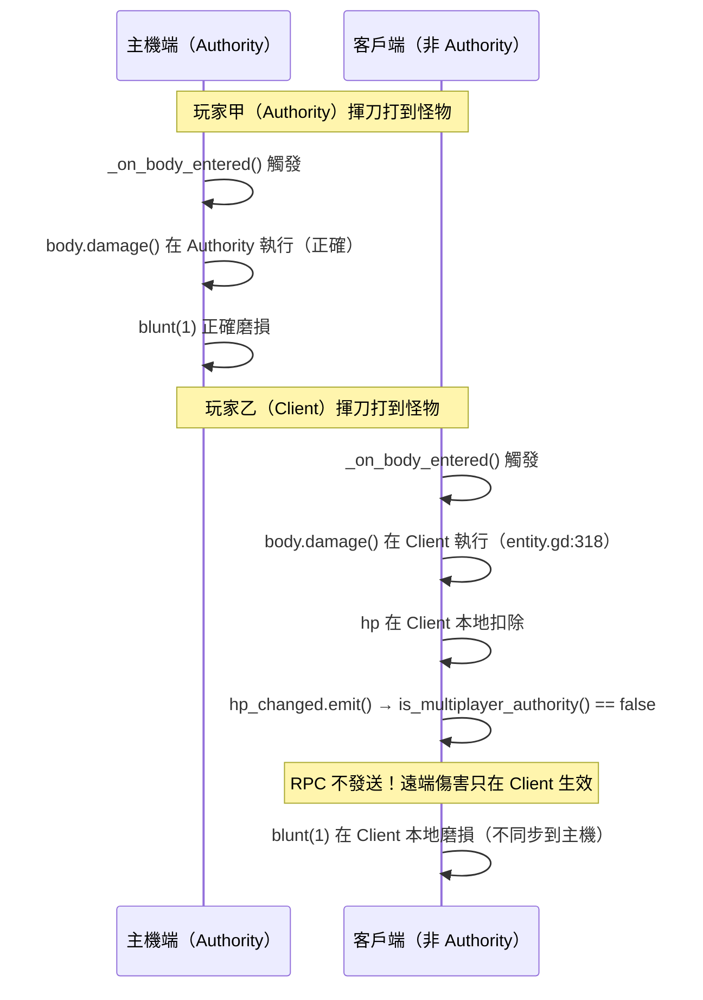

# 武器裝備系統 深入分析

## 繼承結構

```
Area3D
└── Equipment (src/equipment/equipment.gd)   ← 可偵測碰撞的裝備基底
    ├── Weapon  (src/equipment/weapon.gd)    ← 武器，含銳利度系統
    └── Armour  (src/equipment/armour.gd)    ← 防具，含技能/寶石槽（待開發）
```

**為何繼承 Area3D？**  
武器需要偵測揮砍時是否碰到敵人（`_on_body_entered`），Area3D 提供重疊偵測而不產生物理阻擋。

---

## Equipment 基底（equipment.gd）

```gdscript
extends Area3D

@export_range(-100, 100) var strength  = 0    # 物理攻擊力 / 防禦力
@export_range(-100, 100) var fire      = 0    # 各元素屬性值
@export_range(-100, 100) var water     = 0
@export_range(-100, 100) var ice       = 0
@export_range(-100, 100) var thunder   = 0
@export_range(-100, 100) var dragon    = 0
@export_range(-100, 100) var poison    = 0
@export_range(-100, 100) var paralysis = 0

var elements = {}   # 在 _init 時從上方 export 變數建立字典
```

`@export_range` 使裝備屬性可在 Godot 編輯器 Inspector 面板直接設定，方便關卡設計師調整。

---

## Weapon 武器類別（weapon.gd）

### 銳利度（Sharpness）資料結構

```gdscript
class Sharp:
    var type    # 顏色名稱字串（"purple", "white", ...）
    var value   # 當前剩餘銳利度值
    var max_val # 這個等級的最大值

@onready var sharpness = [
    Sharp.new("purple", purple_sharpness),   # 最高等級（最快傷害加乘）
    Sharp.new("white",  white_sharpness),
    Sharp.new("blue",   blue_sharpness),
    Sharp.new("green",  green_sharpness),
    Sharp.new("yellow", yellow_sharpness),
    Sharp.new("orange", orange_sharpness),
    Sharp.new("red",    red_sharpness)       # 最低等級（負傷害加乘，彈刀）
]
```

7 個等級對應 Monster Hunter 系列原作的銳利度顏色系統，從 export 變數設定各等級初始值，允許不同武器有不同的銳利度分佈。

### 磨損（blunt）流程

```gdscript
func blunt(amount):
    for s in sharpness:              # 從最高等級開始
        if s.value > 0:
            var diff = amount - s.value
            s.value -= amount
            amount = diff            # 剩餘量繼續往下扣
            if s.value < 0:
                s.value = 0
            if amount <= 0:
                break
    update_animation()
```

**範例**：武器有 blue=5, green=10，blunt(7)：
- blue: 5→0（剩餘 amount=2）
- green: 10→8（amount=0，停止）

### 回復（sharpen）流程

```gdscript
func sharpen(amount):
    for s in sharpness:              # 從最高等級開始
        if s.value < s.max_val:
            s.value = s.max_val      # 直接補滿這個等級
            amount -= s.max_val
            if amount <= 0:
                s.value += amount    # 可能補過頭，修正
                break
    update_animation()
    return amount                    # 回傳剩餘量（全滿時 > 0）
```

### HUD 銳利度顯示

```gdscript
func update_animation():
    var anim = sharpness_node.get_current_animation()
    for s in sharpness:
        if s.value > 0:          # 找到第一個有值的等級
            if anim != s.type:
                sharpness_node.play(s.type)  # 播放對應顏色動畫
            return
    if anim != "red":
        sharpness_node.play("red")   # 全部磨完也顯示 red
```

`sharpness_node` 是 `$/root/hud/status/sharpness/fading` 的 AnimationPlayer，每個顏色都有對應動畫。

### 傷害觸發（碰撞偵測）

```gdscript
# weapon.gd:97-101
func _on_body_entered(body):
    if body != player and body is Entity and not body.is_dead():
        body.damage(get_weapon_damage(body, null), 0.0, self, player)
        $audio.play()
        blunt(1)   # 每次命中磨損 1

func get_weapon_damage(body, impact):
    # TODO: 傷害修飾計算（銳利度加成、弱點加成等）
    return strength
```

目前 `get_weapon_damage` 只回傳基礎 strength，銳利度的傷害加乘尚未實作（TODO）。

### 與玩家的關係取得

```gdscript
@onready var player = $"../../../.."   # 武器 → BoneAttachment → Skeleton → Armature → Player
```

依賴固定的節點層級路徑，如果骨架結構改變會斷掉。

---

## Armour 防具類別（armour.gd）

```gdscript
extends "equipment.gd"

var skills = []   # 防具技能（待開發）
var gems = []     # 寶石槽（待開發）

func _ready():
    pass           # 目前無實作
```

防禦值計算在 Player 側：
```gdscript
# player.gd:138-143
func get_defence() -> int:
    var defence := 0
    for piece in equipment.armour.values():   # 5 個部位
        if piece != null:
            defence += piece.strength          # 累加所有防具的 strength
    return defence
```

---

## 裝備插槽分配

```gdscript
# player.gd:15
var equipment = {
    "weapon": null,
    "armour": {
        "head":     null,
        "torso":    null,
        "rightarm": null,
        "leftarm":  null,
        "leg":      null
    }
}
```

| 插槽 | 骨骼名稱 | 說明 |
|------|---------|------|
| weapon | "weapon_L" | 左手武器（目前硬編碼 laser_sword） |
| head | - | 頭部防具（未掛載實作） |
| torso | - | 軀幹防具 |
| rightarm | - | 右臂 |
| leftarm | - | 左臂 |
| leg | - | 腿部 |

目前只有武器有完整實作，防具雖有資料結構但尚未有場景內的裝備流程。

---

## 動態骨架掛載機制

```gdscript
# player.gd:31-43
func set_equipment(model, bone):
    var skel = $Armature/Skeleton3D
    for node in skel.get_children():
        if node is BoneAttachment3D:
            if node.get_bone_name() == bone:
                node.add_child(model)     # 已有此骨骼的附著點，直接加入
                node.set_name(bone)
                return
    # 沒有的話動態建立
    var ba = BoneAttachment3D.new()
    ba.set_name(bone)
    ba.set_bone_name(bone)
    ba.add_child(model)
    skel.add_child(ba)
```

`BoneAttachment3D` 是 Godot 的骨骼追蹤節點，其子節點會跟隨指定骨骼位置/旋轉移動，用於將武器/防具模型「綁定」到角色動畫骨架上。

---

## 系統設計分析

### 優點
1. **Editor 友善**：`@export_range` 讓武器屬性可視化調整
2. **多態繼承**：Equipment 提供統一的元素屬性，子類各自擴展
3. **銳利度陣列設計**：磨損/回復只需遍歷陣列，邏輯簡單清晰

### 待完成（TODO）
| 功能 | 位置 |
|------|------|
| 銳利度傷害加乘 | weapon.gd `get_weapon_damage()` |
| 防具技能系統 | armour.gd `skills []` |
| 寶石槽系統 | armour.gd `gems []` |
| 元素武器傷害計算 | 需與 monster.gd `weakness` 對接 |
| 裝備替換 UI | 無完整的裝備介面，只能透過程式碼 |

---

## 深化補充（實作機制層）

### 1. `blunt()` 磨損溢出邏輯精確分析（weapon.gd:60-70）

```gdscript
# weapon.gd:60-70
func blunt(amount):
    for s in sharpness:              # 從 purple 開始（最高等級）
        if s.value > 0:
            var diff = amount - s.value   # 計算溢出量
            s.value -= amount             # 先直接扣除（可能變負）
            amount = diff                 # 把溢出量作為下一層的 amount
            if s.value < 0:
                s.value = 0               # 再修正為 0
            if amount <= 0:
                break                     # 沒有溢出，結束
    update_animation()
```

#### 邊界案例逐步追蹤（amount=7, blue=5, green=10）

| 步驟 | 等級 | 操作 | s.value 結果 | amount 結果 |
|---|---|---|---|---|
| 1 | blue | `diff = 7-5 = 2`；`s.value = 5-7 = -2`；clamp→0 | 0 | 2（正數，繼續） |
| 2 | green | `diff = 2-10 = -8`；`s.value = 10-2 = 8` | 8 | -8（≤0，break） |

結果：blue 清空為 0，green 從 10 降至 8。

#### 邏輯缺陷：`s.value < 0` 保護的充分性分析

`if s.value < 0: s.value = 0` 確保**顯示值**不為負，但順序問題值得注意：

```gdscript
s.value -= amount     # ① 先扣（可能為負）
amount = diff         # ② 更新 amount（此時 diff = amount - s.value_before）
if s.value < 0:
    s.value = 0       # ③ 再保護
```

若 `s.value` 本身**已經是 0**（例如上一層剛好清零），`if s.value > 0` 的守衛會跳過該層，不做任何操作，`amount` 也不變（不傳遞到下一層）。這意味著：

- **已清空的等級不會被「穿透」**：迴圈遇到 `s.value == 0` 就跳過，只處理第一個有剩餘銳利度的等級。
- **潛在邏輯缺陷**：若銳利度陣列中間有 `value=0` 的等級（例如 blue=0, green=10），`for s in sharpness` 會跳過 blue，直接對 green 扣除——**效果正確**，因為 `if s.value > 0` 確保只處理有值的等級。
- **結論**：`s.value < 0` 的保護已足夠，不存在二次下溢問題。但若 `amount` 過大（例如 amount=100，而所有等級總和只有 30），迴圈結束後 `amount` 仍為正數，但不做任何處理——磨損量**靜默吸收**，武器卡在全空狀態（`update_animation()` 會顯示 "red"）。

---

### 2. `sharpen()` 從上往下填充邏輯（weapon.gd:73-82）

```gdscript
# weapon.gd:73-82
func sharpen(amount):
    for s in sharpness:              # 從 purple（最高）到 red（最低）
        if s.value < s.max_val:      # 找第一個未滿的等級
            s.value = s.max_val      # 直接補滿
            amount -= s.max_val      # 扣除消耗量
            if amount <= 0:
                s.value += amount    # amount 可能是負數（過量填充修正）
                break
    update_animation()
    return amount                    # 回傳剩餘量（若全滿則 > 0）
```

#### 迭代方向：從最高等級（purple）開始

`sharpness` 陣列宣告順序（weapon.gd:31-39）：`purple → white → blue → green → yellow → orange → red`。`for s in sharpness` 即從 purple 往下遍歷，**優先填滿最高等級**。

#### 設計意圖核對

Monster Hunter 系列的磨刀行為通常是「把最高等級填滿」，此實作符合原作直覺：用磨刀石優先恢復頂層銳利度，而非從底部填起。

#### 邊界案例：過量填充修正

範例：purple_max=10，purple_value=6，amount=8：

- `s.value = 10`（補滿），`amount = 8 - 10 = -2`
- `amount <= 0`（-2 ≤ 0），進入修正：`s.value += -2` → `s.value = 8`
- `break`

結果：purple 從 6 升至 8（而非補滿到 10），模擬磨刀石容量不足。

#### 潛在問題：跳過已滿等級時的 `amount` 不遞減

若 purple 已滿（`s.value == s.max_val`），`if s.value < s.max_val` 為 false，**直接跳到下一層，不扣除 amount**。這表示 `amount` 的計量基準是「第一個未滿等級的 max_val」，而非所有未滿等級的累計。若只有最低等級（red）未滿，`amount` 對比的是 `red_max_val`，其他等級的已滿容量不影響計算——實際上等同於「用磨刀石把最高未滿的那一級填充」，多餘的量才往下流。

---

### 3. 武器 Authority 問題（多人情境）（weapon.gd:97-101）

```gdscript
# weapon.gd:97-101
func _on_body_entered(body):
    if body != player and body is Entity and not body.is_dead():
        body.damage(get_weapon_damage(body, null), 0.0, null, self, player)
        $audio.play()
        blunt(1)
```

#### 缺少 `is_multiplayer_authority()` 檢查

此回呼連接於 Area3D 的 `body_entered` signal，**在所有端（本地與遠端）都會觸發**，只要武器的 CollisionShape 進入另一個 Entity 的碰撞體即觸發。

#### 多人情境下的執行位置分析



**具體問題**：
- 非 authority 玩家的武器命中傷害**只在自己端生效**，不通知主機。
- `hp_changed` 的 lambda（entity.gd:84-86）需要 `is_multiplayer_authority()` 為 true 才發 RPC；非 authority 端扣血不觸發 RPC，傷害**靜默丟失**。
- `blunt()` 無 RPC，也是本地執行，非 authority 的武器磨損不同步。

**根本原因**：`body.damage()` 應改由 authority 端執行，或使用 `body.rpc("damage", ...)` 從 client 送到 server，讓 server 執行後再廣播結果。

---

### 4. `get_weapon_damage()` 的 TODO 補充：銳利度加乘應如何實作（weapon.gd:92-94）

```gdscript
# weapon.gd:92-94
func get_weapon_damage(body, impact):
    # TODO: damage modifiers
    return strength
```

#### 當前回傳值

僅回傳 `strength`（Equipment 的 export 變數），完全忽略銳利度。

#### 若要加入銳利度加乘，程式碼應如何修改（僅分析）

Monster Hunter 系列的銳利度倍率對應關係（原作參考值）：

| 等級 | 倍率 |
|---|---|
| purple | 1.39 |
| white | 1.32 |
| blue | 1.20 |
| green | 1.05 |
| yellow | 1.00 |
| orange | 0.75 |
| red | 0.50 |

實作思路：

```gdscript
# 建議修改（不修改原始碼，僅分析）
func get_sharpness_multiplier() -> float:
    var multipliers = {
        "purple": 1.39, "white": 1.32, "blue": 1.20,
        "green": 1.05, "yellow": 1.00, "orange": 0.75, "red": 0.50
    }
    for s in sharpness:
        if s.value > 0:
            return multipliers.get(s.type, 1.0)
    return multipliers["red"]   # 全空時視為 red 等級

func get_weapon_damage(body, impact):
    return int(strength * get_sharpness_multiplier())
```

- `get_sharpness_multiplier()` 與 `update_animation()` 使用相同的「找第一個有值等級」邏輯（weapon.gd:49-57），保持一致。
- `int()` 截斷與 `damage_in: int` 型別吻合。
- 此修改**不影響 `blunt()` 或 `sharpen()` 的邏輯**，只在讀取時查詢當前最高等級的倍率。

若還要加入 **元素弱點加乘**，需對接 monster.gd 的 `weakness` 字典：

```gdscript
# 元素傷害計算思路（僅分析）
func get_weapon_damage(body, impact):
    var base = int(strength * get_sharpness_multiplier())
    if body is Monster:
        for element in elements:          # equipment.gd 的 elements 字典
            if elements[element] > 0:
                var weakness_factor = body.weakness.get(element, 1.0)
                # weakness 是正值代表弱點倍率，需設計具體計算公式
                base += int(elements[element] * weakness_factor)
    return base
```

注意：`monster.gd` 的 `weakness` 字典（monster.gd:41-49）的 value 目前直接來自 export 變數（`fire`, `water` 等），其語意是「弱點加成值」而非「倍率」，需要額外設計公式（加算或乘算）才能正確套用。

---

### 5. `set_equipment()` 效能問題：BoneAttachment 線性搜尋（player.gd:31-44）

```gdscript
# player.gd:31-44
func set_equipment(model, bone):
    var skel = $Armature/Skeleton3D
    for node in skel.get_children():         # ① 遍歷所有子節點
        if node is BoneAttachment3D:         # ② 型別判斷
            if node.get_bone_name() == bone: # ③ 字串比較
                node.add_child(model)
                node.set_name(bone)
                return
    # 未找到 → 動態建立
    var ba = BoneAttachment3D.new()
    ba.set_name(bone)
    ba.set_bone_name(bone)
    ba.add_child(model)
    skel.add_child(ba)
```

#### 效能分析

- `skel.get_children()` 回傳**所有**子節點的 Array，包含非 BoneAttachment3D 的節點（MeshInstance3D、CollisionShape3D 等）。
- 每次呼叫 `set_equipment()` 都做一次線性搜尋（O(n)，n = Skeleton3D 的子節點數）。
- 骨架通常有數十個子節點，且字串比較（`get_bone_name() == bone`）較整數比較慢。

#### 實際影響

目前 `set_equipment()` 只在 `_ready()`（player.gd:51-52）呼叫一次（裝備 laser_sword），因此此效能問題**在當前實作中無實際影響**。但若未來實作動態換裝（在戰鬥中切換武器），每次換裝都觸發搜尋，節點數量多時可能造成小幅卡頓。

#### 改善建議（僅分析）

可在 `_ready()` 中預先建立一個 `Dictionary` 快取：`{bone_name: BoneAttachment3D}`，後續查找 O(1)。或在場景設計時直接在 Skeleton3D 下預置所有需要的 BoneAttachment3D 節點，避免動態建立。
