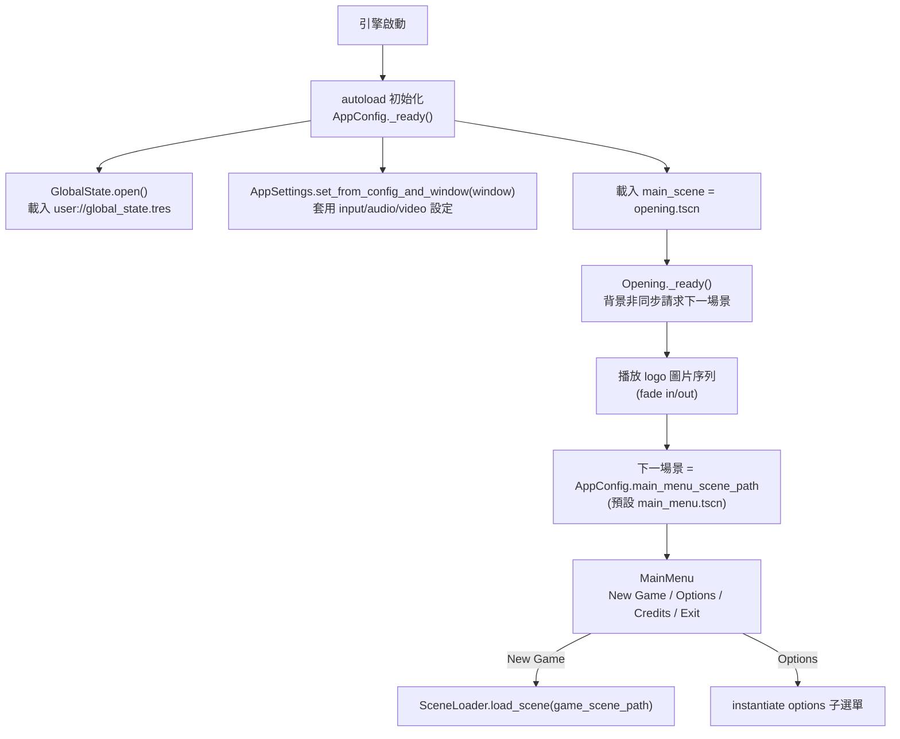

# Godot Game Template — Level 1 初始探索：技術棧與整體架構概覽

> 本文件分析的是 **Maaack's Godot Game Template**（`projects/Godot-Game-Template/`），一個專注於「選單與無障礙功能」的遊戲模板。
> 與工作區內名稱相似的 `Godot-GameTemplate`（俯視角射擊框架）**完全不同**，請勿混淆。

## 專案基本資訊

| 項目 | 內容 |
|---|---|
| 名稱 | Maaack's Godot Game Template |
| 類型 | 遊戲 UI / 選單框架模板（2D & 3D 通用，game-agnostic） |
| 語言 | GDScript（純 GDScript，無 C#／GDExtension） |
| 引擎版本 | Godot **4.6**（README 宣稱向下相容 4.3+；`project.godot:15` `config/features=PackedStringArray("4.6")`） |
| 渲染器 | **Compatibility（OpenGL）** — `project.godot` `renderer/rendering_method="gl_compatibility"`（桌面與行動皆是），以求最大相容與低階硬體支援 |
| 作者 | Marek Belski（Maaack）與 Godot Wild Jam 社群（`plugin.cfg`） |
| 插件版本 | `1.4.6`（`addons/maaacks_game_template/plugin.cfg`） |
| 核心定位 | 「約 15 分鐘建好主選單、選項選單、暫停選單、製作名單、場景載入器與無障礙功能」 |
| 授權 | MIT（`LICENSE.txt`） |
| 預設視窗 | 1280x720（`project.godot` `[display]`），支援 640x360 至 4K |

### 設計目標（README:27-31）
- 可作為**新專案起點**，也可**外掛到既有專案**（兼具 template 與 plugin 兩種發行形式）。
- game-agnostic：不假設 2D 或 3D，不綁定任何玩法。
- 涵蓋 game jam 的典型需求，同時可擴展到商業遊戲規模。

---

## 頂層目錄結構

```
Godot-Game-Template/
├── project.godot              # 專案設定（autoload、InputMap、locale、renderer）
├── override.cfg               # 匯出後可覆寫的設定
├── default_bus_layout.tres    # 預設音訊匯流排佈局（Master/Music/SFX…）
├── default_env.tres           # 預設環境
├── icon.png
├── assets/                    # 範例用美術資源（Godot logo、git logo…）
├── resources/themes/          # 6 套可選 UI 主題（.tres）
├── scenes/                    # ★ 由安裝精靈從 addons/ 複製出來的「可編輯範例場景」
│   ├── opening/               #   主入口場景 opening.tscn
│   ├── menus/                 #   main_menu / options_menu / level_select_menu
│   ├── game_scene/            #   範例遊戲場景、3 個 level、3 個 tutorial
│   ├── loading_screen/        #   載入畫面
│   ├── windows/               #   pause_menu、win/lose window…
│   ├── credits/ end_credits/  #   製作名單
├── scripts/                   # 專案層級腳本（GameState / LevelState / 兩者整合）
└── addons/maaacks_game_template/   # ★★ 模板本體（所有核心邏輯都在這裡）
```

### `scenes/` vs `addons/` 的關係（關鍵心智模型）
這是本模板**最重要的架構觀念**：

- `addons/maaacks_game_template/` 是模板**本體**，內含 `base/`（核心）、`extras/`（擴充）、`examples/`（範例）。
- 安裝精靈（Setup Wizard）會把 `addons/.../examples/` 內的場景**複製**到專案根的 `scenes/`，且複製出來的場景是「**繼承場景**（inherited scene）」——它們 `instance` 自 `addons/` 內的 base/example 場景，使用者只覆寫需要客製的屬性。
- 因此：**升級 addon 不會覆蓋使用者改過的 `scenes/`**；使用者改 `scenes/`，核心邏輯仍由 `addons/base/` 提供。這是「呈現層（scenes）與邏輯層（addons/base）分離」的設計。

詳見官方文件 `addons/maaacks_game_template/docs/HowPartsWork.md`、`MovingFiles.md`。

---

## addon 內部三層結構

| 層 | 路徑 | 職責 | 是否依賴上層 |
|---|---|---|---|
| **base** | `addons/maaacks_game_template/base/` | 選單應用核心：autoload、設定持久化、選單、選項、輸入重綁定、載入畫面、覆蓋窗 | 不依賴 extras/examples |
| **extras** | `addons/maaacks_game_template/extras/` | 擴充元件：關卡載入器、關卡管理、輸贏管理、捕捉滑鼠、場景列舉器 | 依賴 base |
| **examples** | `addons/maaacks_game_template/examples/` | 用「繼承場景」示範如何組裝 base + extras 成一個完整可玩專案 | 依賴 base + extras |
| **installer** | `addons/maaacks_game_template/installer/` | 編輯器內的 Setup Wizard、複製檔案、主題選擇、版本更新 | 僅編輯期使用 |
| **utilities** | `addons/maaacks_game_template/utilities/` | API client、下載解壓（用於自動更新檢查） | 僅編輯期使用 |

### `base/nodes/` 主要子目錄

```
base/nodes/
├── autoloads/          # 4 個全域單例（見下方 autoload 表）
│   ├── app_config/         AppConfig
│   ├── scene_loader/       SceneLoader
│   ├── music_controller/   ProjectMusicController
│   └── ui_sound_controller/ ProjectUISoundController
├── config/             # 設定持久化核心：app_settings.gd / player_config.gd
├── state/              # 全域存檔：global_state.gd / global_state_data.gd
├── menus/
│   ├── main_menu/          主選單
│   └── options_menu/       選項框架（audio/video/input/option_control/分頁容器）
├── loading_screen/     # 載入畫面（進度、卡住偵測）
├── opening/            # 開場 logo 播放
├── windows/            # 覆蓋式視窗（overlaid_window / confirmation / container）
├── utilities/          # pause_menu_controller / input_helper / capture_focus / file_lister
└── labels/             # 顯示版本號、製作名單等資訊性標籤
```

---

## Autoload 全域單例清單（`project.godot` `[autoload]`）

| 單例名稱 | 場景／腳本路徑（相對 addon base） | 職責 |
|---|---|---|
| `AppConfig` | `autoloads/app_config/app_config.tscn` → `app_config.gd` | 啟動時載入全域存檔、把設定套用到視窗（呼叫 `GlobalState.open()` 與 `AppSettings.set_from_config_and_window()`）；持有三個關鍵場景路徑（主選單／遊戲／結尾） |
| `SceneLoader` | `autoloads/scene_loader/scene_loader.tscn` → `scene_loader.gd` | 以 `ResourceLoader` 執行緒化載入場景，可選顯示載入畫面 |
| `ProjectMusicController` | `autoloads/music_controller/project_music_controller.tscn` → `music_controller.gd` | 跨場景持續播放／淡入淡出混音背景音樂，自動接管符合 bus 的 `AudioStreamPlayer` |
| `ProjectUISoundController` | `autoloads/ui_sound_controller/project_ui_sound_controller.tscn` → `ui_sound_controller.gd` | 自動為場景樹中所有 Button/Slider/Tab/LineEdit/Tree 接上 hover/focus/click 音效 |

> 注意：`AppSettings`、`PlayerConfig`、`GlobalState`、`GameState` 等不是 autoload，而是用 `class_name` 宣告的**靜態類別**（static-only），透過 `ClassName.method()` 全域呼叫，避免佔用 autoload slot。

---

## 入口場景與啟動流程

主場景：`project.godot` `run/main_scene="res://scenes/opening/opening.tscn"`

啟動序列：



關鍵程式碼位置：
- `base/nodes/autoloads/app_config/app_config.gd:8` — `_ready()` 載入存檔並套用設定。
- `base/nodes/opening/opening.gd:117` — `_ready()` 先 `SceneLoader.load_scene(..., true)`（背景載入）再播圖序列。
- `base/nodes/opening/opening.gd:27` — `get_next_scene_path()` 為空時讀 `AppConfig.main_menu_scene_path`。
- `base/nodes/menus/main_menu/main_menu.gd:39` — `load_game_scene()` 進遊戲。

---

## 輸入動作（`project.godot` `[input]`）

模板預設定義的自訂動作（供輸入重綁定示範）：

| 動作 | 預設鍵盤 | 預設手把 |
|---|---|---|
| `move_up` / `move_down` / `move_left` / `move_right` | W / S / A / D | 左搖桿 |
| `interact` | E | 手把 A |

外加 Godot 內建 `ui_*`（`ui_accept`、`ui_cancel`、`ui_page_up/down` 等），同時支援鍵鼠與手把。

---

## 在地化（`project.godot` `[internationalization]`）

內建英文與法文翻譯：
- `base/translations/menus_translations.en.translation`
- `base/translations/menus_translations.fr.translation`

選單字串透過 `tr()` 包裝（例：`input_actions_list.gd:90` `tr(_get_action_readable_name(...))`），可直接擴充其他語系。

---

## 構建與執行方式

本專案為純 GDScript Godot 專案，**無外部建構工具或套件管理器**。

| 任務 | 方式 |
|---|---|
| 開啟編輯 | 用 Godot 4.6 編輯器開啟 `project.godot` |
| 執行 | 編輯器按 F5，從 `scenes/opening/opening.tscn` 開始 |
| 安裝精靈 | 編輯器選單 `Project > Tools > Run Maaack's Game Template Setup...`（`installer/setup_wizard.gd`），把 examples 複製到 `scenes/` |
| 外掛到既有專案 | 把 `addons/maaacks_game_template/` 整個資料夾複製進目標專案的 `addons/`，於 `Project Settings > Plugins` 啟用（首次啟用會跑 Setup Wizard） |
| 匯出發行 | Godot 內建 Export；`extras/` 另含 itch.io + butler 的 CI/CD 腳本（見 `docs/BuildAndPublish.md`） |
| 自動更新檢查 | `installer/check_plugin_version.gd` + `utilities/api_client.gd` 連 GitHub releases 比對版本 |

> 模板設定 `[maaacks_game_template]` 區段含 `disable_install_wizard=true`（此複本已完成安裝），以及 `disable_install_audio_busses=true` 等旗標。

---

## 一句話架構摘要

> 一個**邏輯層（`addons/.../base`）與呈現層（`scenes/` 繼承場景）分離**的 Godot 選單框架：4 個 autoload 提供場景載入、設定持久化、音樂與 UI 音效；所有可調設定（輸入重綁定、音量、解析度）統一經由靜態類別 `AppSettings` 寫入單一 `user://player_config.cfg`，並在啟動時自動回套。

---

## 後續分析路徑

- **Level 2**（`level2_core_modules.md`）：各核心模組職責、設定資料流、耦合點。
- **Level 3**（採 SOP 模板 A 遊戲類，但重點調整為 UI/選單框架的特色子系統）：
  - `level3_settings_persistence.md`：設定儲存/載入機制（PlayerConfig + AppSettings + OptionControl 三層）。
  - `level3_input_remapping.md`：輸入重綁定系統（List/Tree 雙模式 + 監聽窗 + 衝突偵測）。
  - `level3_scene_loading.md`：場景載入與轉場（SceneLoader + LoadingScreen + LevelLoader）。
