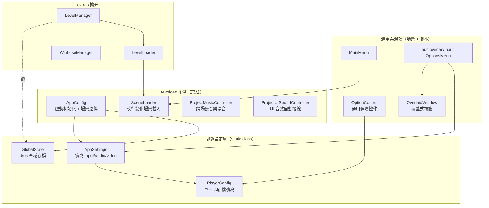
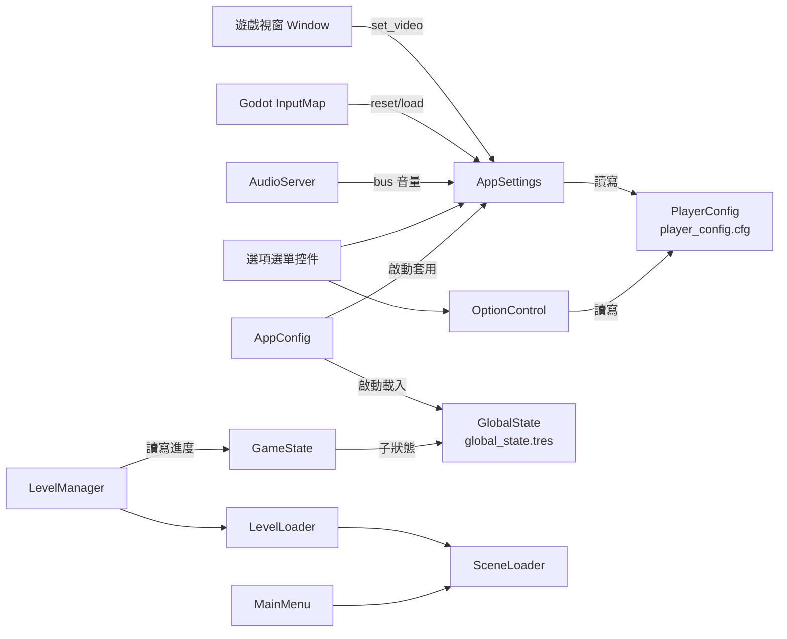

# Godot Game Template — Level 2 核心模組職責深度分析

> 路徑慣例：以下相對路徑皆相對於 `projects/Godot-Game-Template/`。base 核心位於 `addons/maaacks_game_template/base/nodes/`，為節省篇幅本文以 `base/...` 簡寫之。

---

## 模組總覽與權責劃分



核心耦合主線：**所有設定最終都落到 `PlayerConfig` 這個單一 `.cfg` 檔**；所有場景切換都走 `SceneLoader`；存檔狀態走 `GlobalState` 的單一 `.tres`。三條線各自獨立，交會點在 autoload `AppConfig`。

---

## 1. AppConfig（啟動協調者）

**腳本**：`base/nodes/autoloads/app_config/app_config.gd`

職責極小但關鍵——作為唯一的 autoload Node 入口，在 `_ready()` 完成兩件事：

```gdscript
# app_config.gd:8
func _ready() -> void:
    GlobalState.open()                              # 載入 user://global_state.tres
    AppSettings.set_from_config_and_window(get_window())  # 套用所有持久化設定
```

並以 `@export_file` 持有三個跨模組共用的場景路徑（`app_config.gd:4-6`）：
- `main_menu_scene_path`、`game_scene_path`、`ending_scene_path`。

許多選單/管理器（`MainMenu.get_game_scene_path()`、`LevelManager.get_main_menu_scene_path()`）在自身路徑為空時，**fallback 讀 AppConfig**，達成「集中設定一次、各處共用」。

---

## 2. 設定持久化三層（本模板最核心的資料流）

設定系統採三層分工，職責清晰：

| 層 | 類別 | 職責 | 不負責 |
|---|---|---|---|
| 底層 | `PlayerConfig` | 純檔案 I/O：包裝 `ConfigFile`，讀寫 `user://player_config.cfg`，每次 set 都即時 save | 不懂 input/audio/video 語意 |
| 中層 | `AppSettings` | 語意層：把「全螢幕、解析度、音量、輸入綁定」翻譯成對 `PlayerConfig` 的 section/key 與對引擎 API（`AudioServer`/`DisplayServer`/`InputMap`/`Window`）的呼叫 | 不直接碰 UI 控件 |
| 上層 | `OptionControl` 及各 OptionsMenu | UI 層：把控件數值雙向綁定到 PlayerConfig / AppSettings | 不關心底層存哪 |

### 2.1 PlayerConfig（`base/nodes/config/player_config.gd`）
- `extends Object`，全 static。儲存路徑 `CONFIG_FILE_LOCATION = "user://player_config.cfg"`（`player_config.gd:6`）。
- `set_config(section, key, value)`（`:25`）→ 寫入並**立即 `_save_config_file()`**（即時持久化，不需手動 save）。
- `get_config(section, key, default)`（`:30`）→ 讀取，缺值回傳 default。
- 額外提供 `erase_section` / `erase_section_key` / `get_section_keys`。

### 2.2 AppSettings（`base/nodes/config/app_settings.gd`）
- 定義 section 常數（`app_settings.gd:6-10`）：`InputSettings`、`AudioSettings`、`VideoSettings`、`GameSettings`、`ApplicationSettings`、`CustomSettings`。
- **Input**：`set_default_inputs()` 先把 InputMap 現況快取進 static `default_action_events`（供 reset 用）；`set_inputs_from_config()` 把 config 中已客製的綁定套回 InputMap（`:79-82`）。
- **Audio**：`set_audio_from_config()` 逐一走訪所有音訊匯流排，以 bus 名稱（PascalCase）為 key 讀回音量，並記錄 `initial_bus_volumes` 做為相對基準（`:110-122`）。
- **Video**：全螢幕、解析度、V-Sync 三項；解析度在 web 平台或全螢幕時跳過（`:171-177`）。並監聽 `window.size_changed` 自動回寫解析度（`:143-144`）。
- 總入口 `set_from_config_and_window(window)`（`:186`）：input → audio → video 依序套用。

> 此模組的詳細機制見 `level3_settings_persistence.md`。

### 2.3 OptionControl（`base/nodes/menus/options_menu/option_control/option_control.gd`）
通用「一個選項 = 一個控件」的橋接器，是選項選單**零程式碼擴充**的關鍵：

- `@tool` 腳本；Inspector 設定 `option_name`（自動轉成 PascalCase 的 `key`）與 `option_section`（對應 `AppSettings` 的 section）。
- `_ready()`（`:115`）讀取既有設定填入控件，並把子控件（Button/Range/LineEdit/TextEdit）的變更訊號接到 `_on_setting_changed`（`:66`）→ 自動 `PlayerConfig.set_config(section, key, value)`。
- `set_value(value)`（`:91`）依控件型別反向填值。

→ **新增一個選項只需在場景拖一個 `OptionControl` + 一個控件，填 name/section，不寫一行程式**。詳見 `tutorial/howto_add_custom_option_page.md`。

---

## 3. SceneLoader（場景載入器）

**腳本**：`base/nodes/autoloads/scene_loader/scene_loader.gd`（`class_name SceneLoaderClass`）

職責：以 Godot 的執行緒化 `ResourceLoader` 非阻塞載入場景，並可選擇切到載入畫面顯示進度。

| 函數 | 行為 |
|---|---|
| `load_scene(path, in_background=false)`（`:94`） | 若已快取則直接切換；否則 `ResourceLoader.load_threaded_request()` 後啟動 `_process` 輪詢；非背景模式則先切到載入畫面 |
| `_process(delta)`（`:118`） | 輪詢 `get_status()`，`THREAD_LOAD_LOADED` 時 emit `scene_loaded` 並（非背景時）`change_scene_to_resource()` |
| `get_progress()`（`:37`） | 回傳 0~1 載入進度，供載入畫面顯示 |
| `signal scene_loaded` | 載入完成通知（`Opening`、`LevelLoader` 都用它做後續處理） |

特色：含 `@export_group("Debug")` 可鎖定狀態/進度以測試載入畫面（`:11-16`）；`background` 模式讓 `Opening` 可在播 logo 的同時預載主選單。

> 詳見 `level3_scene_loading.md`。

---

## 4. ProjectMusicController（跨場景音樂混音）

**腳本**：`base/nodes/autoloads/music_controller/music_controller.gd`（`class_name MusicController`）

設計巧妙——它**監聽整棵場景樹的 `node_added` 訊號**，自動接管音樂：

- `_enter_tree()`（`:171`）：動態 `AudioServer.add_bus()` 建立一條 `_BlendMusic` 混音匯流排，並連接 `get_tree().node_added`。
- `_node_matches_checks(node)`（`:154`）：判定加入的節點是否為 `AudioStreamPlayer` 且 `autoplay==true` 且 `bus=="Music"`。
- 命中時 `play_stream_player()`（`:117`）：若與當前音樂同曲則無縫接續播放位置（`_blend_and_remove_stream_player`），否則淡出舊曲、淡入新曲（`_blend_and_connect_stream_player`）。
- 當持有的 player 離樹（`_on_removed_music_player`，`:157`）會 reparent 或 clone，確保音樂**不因場景切換而中斷**。

→ 使用者只要在「想播某音樂的場景」放一個 autoplay 的 `AudioStreamPlayer`（bus=Music），切換場景時音樂就會自動 blend，無需任何呼叫。

---

## 5. ProjectUISoundController（UI 音效自動接線）

**腳本**：`base/nodes/autoloads/ui_sound_controller/ui_sound_controller.gd`（`class_name UISoundController`）

職責：集中管理一個場景下所有 UI 控件的互動音效（hover/focus/press/tab/slider/line/list/tree）。

- 大量 `@export var X : AudioStream`（`:20-50`）讓使用者指定每種事件的音效。
- `connect_ui_sounds(node)`（`:165`）依 node 型別（Button/TabBar/Slider/LineEdit/ItemList/Tree）連接對應訊號到內部預建的 `AudioStreamPlayer`。
- `persistent=true` 時監聽 `node_added`，連**動態生成**的控件也自動接上（`:80-89`）；`_ready()` 另對既有樹做一次遞迴接線（`_recursive_connect_ui_sounds`，`:193`）。

→ 與 MusicController 同樣是「自動偵測場景樹節點」的 autoload 模式，無侵入式接音效。

---

## 6. 選單系統

### 6.1 MainMenu（`base/nodes/menus/main_menu/main_menu.gd`，`class_name MainMenu`）
- 四顆按鈕：New Game / Options / Credits / Exit；對應路徑/場景為空時自動隱藏按鈕（`_hide_*_if_unset`，`:96-106`）。
- `_open_sub_menu(menu: PackedScene)`（`:63`）：實例化選項/製作名單子選單，藏起主選單容器，並用 `CONNECT_ONE_SHOT` 監聽其 `hidden`/`tree_exiting` 以還原。
- web 平台隱藏 Exit（`:92`）；退出可選確認對話框或發 `game_exited` 訊號交由外部處理（`signal_game_exit`，`:22`）。

### 6.2 OverlaidWindow（覆蓋式視窗，`base/nodes/windows/overlaid_window.gd`）
這是**暫停選單與選項視窗的共用底盤**，處理「彈出視窗時的焦點、暫停、滑鼠、互斥遮罩」：

- `pauses_game`（`:5`）為真時設 `PROCESS_MODE_ALWAYS` 並在開啟時 `_scene_tree.paused=true`。
- `_overlaid_window_setup()`（`:48`）：記錄並暫存原本的暫停狀態、滑鼠模式、焦點控件；`exclusive=true` 時把背後所有 Control 的 `focus_mode` 設為 NONE（`_set_focus_none`，`:23`）並蓋一層 `ColorRect` 遮罩，防止點到底層。
- `close()`（`:37`）：還原暫停/滑鼠/焦點，移除遮罩。

### 6.3 PauseMenuController（`base/nodes/utilities/pause_menu_controller.gd`）
- 極輕量 Node：`_ready()`（`:28`）實例化 `pause_menu_packed` 並掛到 `current_scene`。
- `_unhandled_input` 偵測 `ui_cancel` → `pause()` 顯示暫停選單，並在關閉後還原原焦點控件（`:10-21`）。

### 6.4 各 OptionsMenu
- `video_options_menu.gd`：把 Fullscreen/Resolution/V-Sync 控件接到 `AppSettings`；全螢幕或 web 時鎖定解析度選項（`_update_resolution_options_enabled`，`:6`）。
- `audio_options_menu.gd` / `mini_options_menu.gd`：在 `_ready()` 動態為每條音訊匯流排生成一個 `OptionControl`（`_add_audio_control`，`:13`），略過系統 bus（前綴 `_`）與被 `hide_busses` 隱藏者。
- `input_options_menu.gd`：輸入重綁定主控，協調 `InputActionsList`/`InputActionsTree` 與 `KeyAssignmentWindow`（見 Level 3）。

---

## 7. 全域存檔與遊戲狀態（GlobalState / GameState）

這是與「設定持久化」**分開**的另一條持久化線，存的是「玩家進度」而非「偏好設定」。

### 7.1 GlobalState（`base/nodes/state/global_state.gd`）
- static class，存檔到 `user://global_state.tres`（`:4`）。
- `current : GlobalStateData`（`:7`）為根資源，含 `states: Dictionary`（`global_state_data.gd:7`）——以字串 key 存放任意子狀態資源。
- `open()`（`:29`）：載入存檔、記錄開啟時間與版本（首版/最近版）、立即 save。
- `get_or_create_state(key, type_path)`（`:43`）：取得或建立指定型別的子狀態；型別不符時重建（`global_state_data.gd:9-21`）。

### 7.2 GameState（`scripts/game_state.gd`，專案層級）
- `extends Resource`，作為 GlobalState 的一個子狀態（`STATE_NAME="GameState"`，`game_state.gd:4`）。
- 存放 `level_states`（各關卡狀態字典）、`current_level_path`、`checkpoint_level_path`、`total_games_played`、`play_time` 等（`:7-12`）。
- 全部用 static 函數操作，內部都呼叫 `GlobalState.get_or_create_state()` 再 `GlobalState.save()`（如 `set_checkpoint_level_path`，`:51`）。

> 這示範了模板「基本存檔/讀檔」如何**最小侵入地**疊在 GlobalState 上：使用者自訂的 GameState 資源被序列化進同一個 `.tres`。

---

## 8. extras：關卡載入與輸贏流程

### 8.1 LevelLoader（`extras/scripts/level_loader.gd`）
- 把關卡場景載入到指定 `level_container`（而非整個 change_scene），支援切換時釋放舊關卡。
- `load_level(path)`（`:26`）：釋放舊關卡 → `SceneLoader.load_scene(path, true)` 背景載入 → `await scene_loaded` → 實例化掛到容器 → emit `level_loaded`/`level_ready`。
- 可選 `level_loading_screen` 在載入期間顯示。

### 8.2 LevelManager（`extras/scripts/level_manager.gd`）
- 管理「關卡序列」與「輸贏後流程」。可用 `scene_lister`（線性關卡列表）或 `starting_level_path`（單一起點，開放世界式）兩種模式（`:14-18`）。
- 監聽當前關卡發出的 `level_won` / `level_lost` / `level_changed` 訊號（`_connect_level_signals`，`:155`）：
  - `level_won` → 有下一關則設 checkpoint 並載入，否則顯示勝利畫面或結尾（`_on_level_won`，`:142`）。
  - `level_lost` → 顯示失敗畫面（重試/回主選單）或直接重載（`_on_level_lost`，`:95`）。
- 勝利/失敗畫面以可選 `@export PackedScene` 注入，並用 `_try_connecting_signal_to_node` 連接其 continue/restart/main_menu 訊號（鬆耦合）。

### 8.3 LevelAndStateManager（`scripts/level_and_state_manager.gd`，專案層級）
- `extends LevelManager`，覆寫 setter 在更新關卡路徑時**同步寫入 GameState**（`set_current_level_path` 等，`:3-9`），把「關卡進度」橋接到「全域存檔」。
- `get_checkpoint_level_path()` 優先讀 GameState 的存檔 checkpoint（`:11-15`），實現「繼續遊戲」。

---

## 模組互動關係小結



兩條獨立持久化線：
1. **偏好設定**：UI → AppSettings/OptionControl → PlayerConfig → `user://player_config.cfg`
2. **遊戲進度**：LevelManager → GameState → GlobalState → `user://global_state.tres`
