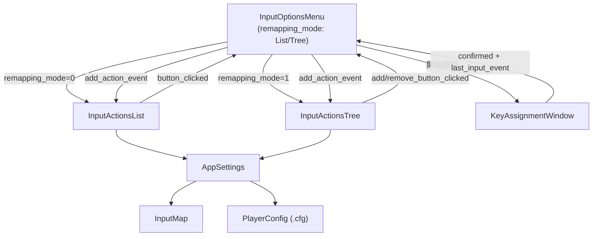
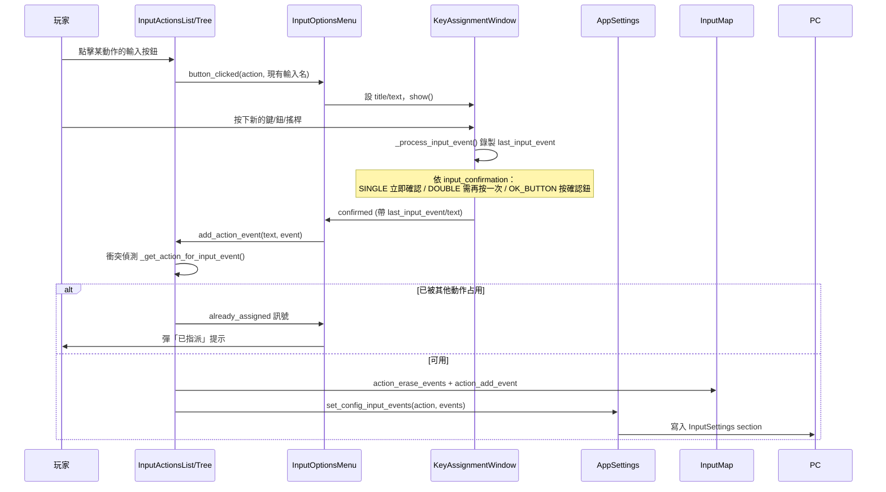

# Level 3 — 輸入重綁定（Input Remapping）系統深入

> 前置：`level2_core_modules.md`（第 6 節選單）、`level3_settings_persistence.md`（輸入存檔走 `InputSettings` section）。
> 路徑相對 `projects/Godot-Game-Template/`，base 簡寫見前。涉及檔案集中於 `base/nodes/menus/options_menu/input/` 與 `base/nodes/utilities/input_helper.gd`。

## 一句話

> 玩家在選項選單點某動作的按鈕 → 彈出監聽窗錄製新輸入 → 經衝突偵測後寫入 `InputMap` 與 `PlayerConfig`，支援 **List（每動作固定欄位）** 與 **Tree（不限數量增刪）** 兩種 UI 模式，並能把按鍵文字換成手把/鍵鼠圖示。

---

## 元件組成

| 元件 | 檔案 | 角色 |
|---|---|---|
| `InputOptionsMenu` | `input/input_options_menu.gd` | 協調者：切換 List/Tree、開監聽窗、處理衝突/最小值彈窗 |
| `InputActionsList` | `input/input_actions_list.gd`（`@tool`, extends Container） | List 模式：每個動作固定 N 欄（`action_groups`）按鈕網格 |
| `InputActionsTree` | `input/input_actions_tree.gd`（`@tool`, extends Tree） | Tree 模式：每動作可動態 add/remove 任意數量輸入 |
| `KeyAssignmentWindow` | `input/key_assignment_window.gd` | 監聽窗：錄製玩家按下的輸入，支援單/雙重確認 |
| `InputEventHelper` | `utilities/input_helper.gd`（`class_name InputEventHelper`） | 靜態工具：把 InputEvent 轉成可讀文字、辨識裝置類型 |
| `InputIconMapper` | `input/input_icon_mapper.gd` | 把 InputEvent 對應到圖示 Texture（選用） |
| 存檔 | `AppSettings`（`config/app_settings.gd`） | `set_config_input_events` / `reset_to_default_inputs` 等 |

---

## 完整重綁定時序

---

## KeyAssignmentWindow：監聽與確認（`key_assignment_window.gd`）

繼承 `ConfirmationOverlaidWindow`（覆蓋窗，會暫停背景互動）。核心狀態機：

- `_on_input_text_edit_focus_entered`（`:50`）→ `_start_listening()`（`:40`）：把焦點落在一個 `TextEdit` 上開始監聽，並啟動 `DelayTimer` 防止剛開窗的殘留輸入被誤錄。
- `_is_recordable_input(event)`（`:31`）：只接受 Key / MouseButton / JoypadButton / 軸值 > 0.5 的 JoypadMotion，且 `is_pressed()`。
- 三種確認模式（`InputConfirmation`，`:10-16`）：
  - `SINGLE`：錄到即確認（`:94`）。
  - `DOUBLE`：需再次按同一輸入確認（`_input_confirms_choice`，`:70`）。
  - `OK_BUTTON`：聚焦到確認鈕由玩家點擊。
- 監聽透過把輸入導入隱藏 `TextEdit` 的 `gui_input`（`_on_input_text_edit_gui_input`，`:101`）實現，每次先清空文字避免顯示亂碼。

> 巧思：用「TextEdit 取得焦點 = 開始監聽」，符合無障礙/手把導航的焦點流，且離開焦點即停止監聽（`:53`）。

---

## List 模式（`InputActionsList`，extends Container）

特性：每個動作呈現**固定數量**的可編輯欄位（`action_groups`，1~5，預設 2，`:21`），像「主鍵 / 副鍵」兩欄。

- `_build_ui_list()`（`:257`）：清空 → 加表頭 → 對每個動作 `_add_action_options()` 建立一排按鈕。
- 動作來源 `_get_all_action_names()`（`:228`）：合併「明確列出的 `input_action_names`」+「可選的內建 `ui_*`」+「`show_all_actions` 時 InputMap 中所有非 `ui_`/`spatial_editor` 的動作」（`app_settings.gd:55-58`）。
- 寫入 `_assign_input_event_to_action_group()`（`:271`）：把新事件放到指定欄位 index，重建該動作的事件陣列（去除 null），同步 `InputMap` 與 `AppSettings.set_config_input_events`。
- 衝突偵測：維護 `assigned_input_events: { 可讀輸入名 → 動作名 }`（`:269`），`add_action_event()`（`:300`）先查此表，命中就 emit `already_assigned` 不寫入。

---

## Tree 模式（`InputActionsTree`，extends Tree）

特性：每動作為一個樹節點，底下可**動態 add / remove 任意數量**輸入（更靈活）。

- `_build_ui_tree()`（`:127`）：根節點下每動作一個 `TreeItem`（帶 Add 按鈕），其子項為各輸入（帶 Remove 按鈕）。
- 新增 `_assign_input_event_to_action()`（`:140`）：`InputMap.action_add_event` → 寫 config → 在樹上 `_add_input_event_as_tree_item`。
- 移除 `remove_action_event(item)`（`:181`）：先檢查 `_can_remove_input_event`（至少保留 1 個，否則 emit `minimum_reached`，`:147`）→ `AppSettings.remove_action_input_event`（同時改 InputMap 與 config）→ 從樹移除節點。

兩模式由 `InputOptionsMenu.remapping_mode`（`@export_enum("List","Tree")`，`input_options_menu.gd:8`）切換顯示，且把兩者的 `already_assigned`/`minimum_reached`/按鈕點擊訊號都接到同一組彈窗處理（`input_options_menu.gd:56-92`）。

---

## InputEventHelper：跨裝置可讀化（`utilities/input_helper.gd`）

純常數 + 靜態函數，把 InputEvent 變成玩家看得懂的文字，並辨識手把品牌：

- `get_text(event)`（`:121`）：
  - JoypadButton → 查 `JOY_BUTTON_NAMES`（`:40`）。
  - JoypadMotion → 依軸與正負組出「Left Stick Right」等（`:127-147`）。
  - Key → 在桌面平台用 `DisplayServer.keyboard_get_keycode_from_physical()` 把實體鍵碼轉成當前鍵盤佈局字串（`:148-156`，解決 AZERTY/QWERTY 差異）。
- `get_device_name_by_id(id)`（`:101`）：用 `Input.get_joy_name()` 比對 `SDL_DEVICE_NAMES`（`:30`）關鍵字，判定 Xbox/PlayStation/Switch/Steamdeck，再選對應的按鈕命名表（`JOYPAD_BUTTON_NAME_MAP`，`:22`），讓「手把 A 鍵」依品牌顯示為 A / Cross / B 等。

→ 這是模板「跨平台手把支援」的關鍵；圖示版則由 `InputIconMapper` 把 event 對應到 Kenney 風格圖示（安裝精靈可選裝，`installer/kenney_input_prompts_installer.gd`）。

---

## 與其他系統的耦合點

- **存檔**：所有寫入最終經 `AppSettings.set_config_input_events`（`app_settings.gd:26`）落到 `InputSettings` section；啟動時 `AppSettings.set_inputs_from_config` 回套。
- **覆蓋窗**：KeyAssignmentWindow 繼承覆蓋窗體系，自動處理彈窗時的焦點/暫停（見 Level 2 第 6.2 節）。
- **在地化**：動作可讀名與彈窗文字都經 `tr()`（`input_actions_list.gd:90`、`input_options_menu.gd:51` 等）。

---

## 設計評價

| 優點 | 說明 |
|---|---|
| 雙 UI 模式 | List 適合固定鍵位的休閒遊戲，Tree 適合硬核可自由增刪 |
| 物理鍵碼轉換 | 用 physical keycode + 佈局轉換，國際鍵盤友善 |
| 品牌感知 | 自動依手把品牌顯示正確按鈕名/圖示 |
| 衝突保護 + 最小值保護 | 防止重複指派與「把動作刪到沒有任何輸入」 |

| 風險/注意 | 說明 |
|---|---|
| 可讀名作為衝突鍵 | 衝突偵測用 `get_text()` 字串比對，極端情況下不同 event 產生相同文字可能誤判 |
| `@tool` 副作用 | List/Tree 為 `@tool`，多數邏輯以 `Engine.is_editor_hint()` 早退（`:343`/`:226`），編輯期需小心 |
