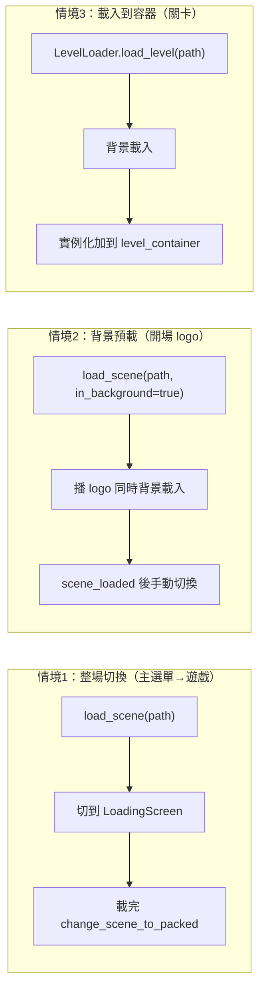
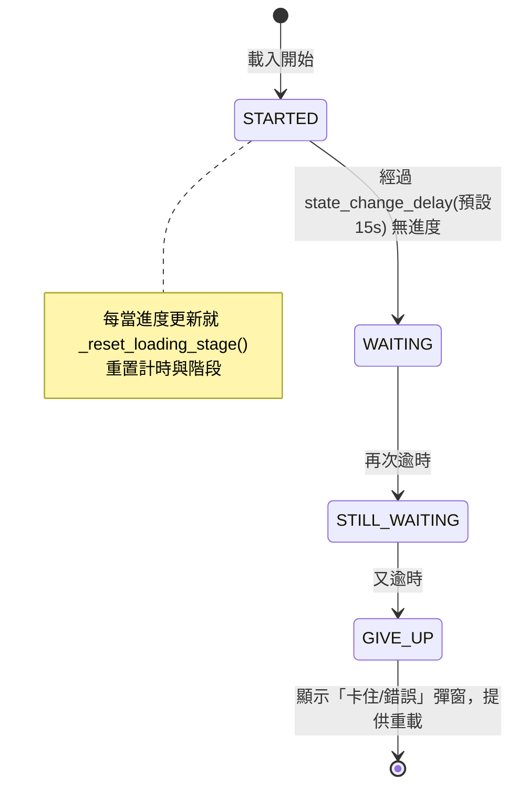

# Level 3 — 場景載入與轉場（Scene Loading）子系統深入

> 前置：`level2_core_modules.md`（第 3 節 SceneLoader、第 8 節 extras 關卡）。
> 路徑相對 `projects/Godot-Game-Template/`，base 簡寫見前。

## 一句話

> `SceneLoader`（autoload）以 Godot 執行緒化 `ResourceLoader` 非阻塞載入場景，可選擇「整場切換」或「載入到容器」兩種策略；搭配 `LoadingScreen` 顯示進度與卡住偵測，`Opening` 利用背景載入在播 logo 期間預載主選單。

---

## 元件與三種載入情境

| 元件 | 檔案 | 用途 |
|---|---|---|
| `SceneLoader`（autoload） | `autoloads/scene_loader/scene_loader.gd` | 底層執行緒化載入引擎 |
| `LoadingScreen` | `loading_screen/loading_screen.gd` | 全螢幕進度畫面 + 卡住/錯誤提示 |
| `Opening` | `opening/opening.gd` | 開場 logo，背景預載下一場景 |
| `LevelLoader`（extras） | `extras/scripts/level_loader.gd` | 把關卡載入到容器（不整場切換） |

三種情境：



---

## SceneLoader 核心（`scene_loader.gd`）

```gdscript
# scene_loader.gd:94
func load_scene(scene_path : String, in_background : bool = false) -> void:
    _scene_path = scene_path
    _background_loading = in_background
    if ResourceLoader.has_cached(_scene_path):          # 已快取：直接走
        call_deferred("emit_signal", "scene_loaded")
        if not _background_loading:
            change_scene_to_resource()
        return
    ResourceLoader.load_threaded_request(_scene_path)   # 啟動執行緒載入
    set_process(true)                                    # 開啟輪詢
    if _check_loading_screen() and not _background_loading:
        change_scene_to_loading_screen()                 # 非背景則切到載入畫面
```

`_process` 輪詢狀態（`:118`）：
- `THREAD_LOAD_LOADED` → emit `scene_loaded`、停輪詢、非背景模式 `change_scene_to_resource()`（`:60`，內部 `change_scene_to_packed`）。
- `THREAD_LOAD_FAILED/INVALID` → 停輪詢。

進度查詢 `get_progress()`（`:37`）/ 狀態 `get_status()`（`:30`），供 LoadingScreen 顯示。

> Debug 群組（`:11-16`）：`debug_enabled` + `debug_lock_status`/`debug_lock_progress` 可在編輯期「假裝」載入卡在某進度，方便調載入畫面 UI——對 UI 模板很實用的測試設計。

彩蛋：`_unhandled_key_input`（`:110`）偵測剪貼簿 hash 等於特定值時 `quit()`（開發者退出後門）。

---

## LoadingScreen：進度與「卡住偵測」（`loading_screen.gd`）

繼承 `CanvasLayer`。不只顯示進度條，還有**多階段卡住提示**狀態機（避免玩家以為當機）：

`StallStage` 列舉（`:7`）：`STARTED → WAITING → STILL_WAITING → GIVE_UP`



- `_process`（`:121`）依 `SceneLoader.get_status()` 更新進度與訊息：
  - 進行中 → `_update_scene_loading_progress()`（只增不減，`:55`）。
  - 完成 → `_set_scene_loading_complete()`。
  - 失敗/無效 → 顯示錯誤彈窗或關閉自身。
- 進度一變動就 `_reset_loading_stage()`（`:45`）重啟 15 秒計時；若長時間無進度則逐級升到 GIVE_UP，顯示「Stalled at X%」彈窗（`_show_loading_stalled_error_message`，`:68`），web 平台另附專屬提示（`STALLED_ON_WEB`，`:5`）。
- 文字全部可在 Inspector 客製並走在地化（`@export var _in_progress` 等，`:14-25`）。
- `GIVE_UP` 後玩家可選擇重載主場景（`_reload_main_scene_or_quit`，`:150`）。

---

## Opening：背景預載 + logo 播放（`opening.gd`）

模板把「開場動畫」與「主選單預載」重疊以縮短等待：

```gdscript
# opening.gd:117
func _ready() -> void:
    SceneLoader.load_scene(get_next_scene_path(), true)  # ★ 背景載入下一場景
    _add_textures_to_container(images)
    _transition_in()                                     # 開始播 logo 圖序列
```

- 圖片以 fade in / 停留 / fade out 串播（`_show_next_image`，`:99`）；玩家可按 `ui_accept` 跳下一張、`ui_cancel` 跳過整段（`_unhandled_input`，`:62`）。
- 全部播完後 `_load_next_scene()`（`:35`）：
  - 若背景場景已 `THREAD_LOAD_LOADED` → 立即 `change_scene_to_resource()`。
  - 否則可選顯示載入畫面，或連 `scene_loaded`（`CONNECT_ONE_SHOT`）等載完再切。
- 下一場景路徑為空時 fallback 讀 `AppConfig.main_menu_scene_path`（`:27`）。

---

## LevelLoader：載入到容器（`extras/scripts/level_loader.gd`）

與「整場切換」不同——它把關卡實例**加到一個容器節點**底下，讓 HUD/暫停選單等外層 UI 維持不變：

```gdscript
# level_loader.gd:26
func load_level(level_path : String):
    if is_loading : return
    if is_instance_valid(current_level):
        current_level.queue_free()
        await current_level.tree_exited      # 等舊關卡完全離樹
    is_loading = true
    SceneLoader.load_scene(level_path, true) # 背景載入
    if level_loading_screen: level_loading_screen.reset()
    level_load_started.emit()
    await SceneLoader.scene_loaded           # 等載完
    is_loading = false
    current_level = _attach_level(SceneLoader.get_resource())  # 實例化 + add_child 到容器
    if level_loading_screen: level_loading_screen.close()
    level_loaded.emit()
    await current_level.ready
    level_ready.emit()
```

- 三段訊號 `level_load_started` / `level_loaded` / `level_ready` 供 `LevelManager` 接續（連接關卡的輸贏訊號，見 Level 2 第 8 節）。
- 此處的 `level_loading_screen` 可用獨立的 `level_loading_screen.tscn`（不全螢幕黑屏，僅關卡區），UX 更平滑。

---

## 三條載入路徑對照

| | 整場切換 | 背景預載 | 載入到容器 |
|---|---|---|---|
| 觸發者 | MainMenu / LevelManager `_load_main_menu` | Opening | LevelLoader |
| API | `load_scene(path)` | `load_scene(path, true)` | `load_level(path)` |
| 切換方式 | `change_scene_to_packed` | 手動 + scene_loaded | `add_child` 到容器 |
| 外層 UI | 整個換掉 | 整個換掉 | 保留（HUD/暫停） |
| 載入畫面 | 全螢幕 LoadingScreen | 可選 | 可選局部 |

---

## 設計評價

| 優點 | 說明 |
|---|---|
| 非阻塞 | 一律 threaded load，UI 不凍結，可顯示進度 |
| 重疊等待 | Opening 邊播 logo 邊預載主選單，感知更快 |
| 卡住可恢復 | LoadingScreen 多階段提示 + 重載出口，避免「黑屏當機」誤解 |
| 容器載入 | LevelLoader 讓關卡切換不破壞外層 HUD/暫停選單 |
| 可測試 | SceneLoader 的 debug 鎖定狀態便於調載入畫面 |

| 注意 | 說明 |
|---|---|
| 快取分支 | `has_cached` 時走 `call_deferred emit`，呼叫端若依賴同步順序需注意時序 |
| 單一 `_scene_path` | SceneLoader 同時只追蹤一個載入請求；並發載入多場景需自行排隊 |
