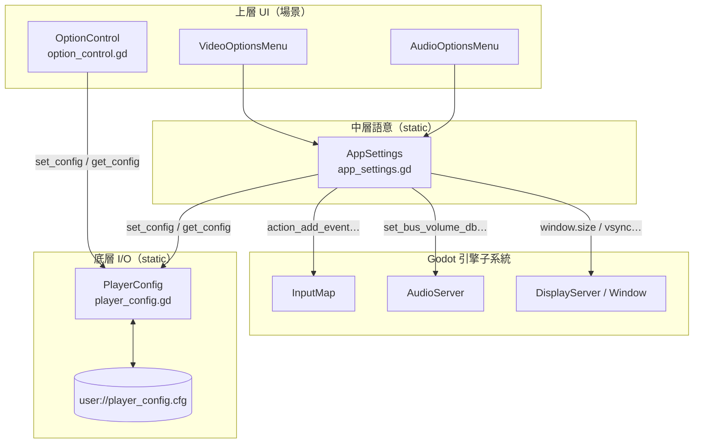
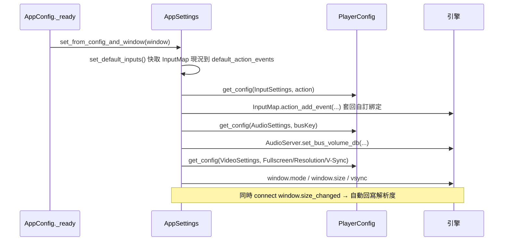

# Level 3 — 設定儲存／載入機制深入

> 採 SOP 模板 A（遊戲類），但本模板的「特色子系統」非戰鬥/地圖生成，而是 **UI/選單框架的設定持久化**，故以此為 L3 主題之一。
> 前置：請先讀 `level2_core_modules.md` 第 2 節。路徑相對 `projects/Godot-Game-Template/`，base 簡寫見前。

## 一句話

> 所有使用者偏好（輸入綁定、音量、靜音、全螢幕、解析度、V-Sync、以及任意自訂選項）都被映射到單一 `user://player_config.cfg` 的不同 section，啟動時由 `AppSettings.set_from_config_and_window()` 一次回套到引擎各子系統。

---

## 三層責任鏈（回顧 + 細節）



關鍵分工原則：
- **OptionControl 走捷徑**：通用控件直接 `PlayerConfig.set_config`，不經 AppSettings（因為它不需要語意處理，存什麼讀什麼）。
- **AppSettings 才碰引擎**：凡是「設定值改變後需要對引擎做事」（換綁定、改音量、切全螢幕），都由 AppSettings 處理 config↔引擎雙向同步。

---

## 啟動時的回套流程（load）

入口：`app_config.gd:8` → `AppSettings.set_from_config_and_window(window)`（`app_settings.gd:186`）



程式碼錨點：
- 輸入：`set_default_inputs()`（`app_settings.gd:74`）+ `set_inputs_from_config()`（`:79`）+ `set_input_from_config()`（`:39`）。
- 音訊：`set_audio_from_config()`（`:110`），逐 bus 以 `get_audio_bus_name().to_pascal_case()` 為 key。
- 視訊：`set_video_from_config(window)`（`:171`），含 `_set_fullscreen_from_config`/`set_resolution`/`_set_v_sync_from_config`。

### 音量的「相對基準」設計（易踩雷點）
音量並非直接存 dB，而是存「相對於匯流排初始音量的線性比例」：
- `set_audio_from_config()` 第一次走訪時，把每條 bus 的當前線性音量記入 static `initial_bus_volumes`（`:114`）作為 1.0 基準。
- `get_bus_volume(bus_index)`（`:86`）回傳 `當前線性 / 初始線性`；`set_bus_volume`（`:94`）則乘回基準再轉 dB。
- 好處：使用者在 default_bus_layout 裡先把某 bus 調低當「混音設計」，玩家滑桿仍以「相對 0~1」操作，互不干擾。

---

## 變更時的寫入流程（save）

寫入是**即時**的——`PlayerConfig.set_config` 每次都立刻 `save()`（`player_config.gd:25-28`），無需手動存檔。

兩種變更來源：

### A. 經由 OptionControl 的通用控件
```gdscript
# option_control.gd:66
func _on_setting_changed(value) -> void:
    if Engine.is_editor_hint(): return
    PlayerConfig.set_config(section, key, value)   # 直接落檔
    setting_changed.emit(value)
```
- 控件變更訊號在 `_connect_option_inputs`（`:74`）依型別自動接好：`OptionButton.item_selected` / `ColorPickerButton.color_changed` / 一般 Button `toggled` / `Range.value_changed` / `LineEdit/TextEdit.text_changed`。

### B. 經由 OptionsMenu → AppSettings（需引擎副作用）
例如改解析度：
```gdscript
# video_options_menu.gd:33
func _on_resolution_control_setting_changed(value) -> void:
    AppSettings.set_resolution(value, get_window(), false)  # 套到 window + 寫 config
```
- `AppSettings.set_resolution`（`app_settings.gd:129`）先 `window.size = value`，再 `PlayerConfig.set_config(VideoSettings, ScreenResolution, value)`。
- 音量同理：`audio_options_menu.gd:10` `_on_bus_changed` → `AppSettings.set_bus_volume`，而音量值寫檔則由其上的 OptionControl 觸發（雙重路徑，故 `_on_bus_changed` 只負責即時聽感、寫檔由 OptionControl 完成）。

---

## .cfg 檔的實際長相

`user://player_config.cfg`（位置見 Godot data_paths 文件；Windows 在 `%APPDATA%\Godot\app_userdata\<專案名>\`）：

```ini
[InputSettings]
move_up=[InputEventKey, ...]      ; 僅在被客製後出現
interact=[...]

[AudioSettings]
Master=0.8
Music=1.05
SFX=0.7
Mute=false

[VideoSettings]
Fullscreen=true
ScreenResolution=Vector2i(1920, 1080)
V-Sync=1
```

> 重要：未被使用者改過的設定**不會**寫進檔案（例如 `set_input_from_config` 在 config==現況時直接 return，`app_settings.gd:42-43`）。這讓 .cfg 只存「差異」，預設值仍由 project.godot / 場景提供。

---

## 重置機制

- **輸入重置**：`AppSettings.reset_to_default_inputs()`（`app_settings.gd:66`）先 `erase_section(InputSettings)` 清掉 config，再用 `default_action_events`（啟動時快取的原始綁定）回填 InputMap。由 `InputActionsList.reset()` / `InputActionsTree.reset()` 觸發。
- **遊戲狀態重置**（不同層）：`GlobalState.reset()`（`global_state.gd:47`）清 `states`；`GameState.reset()`（`scripts/game_state.gd:72`）清關卡進度。範例提供 `reset_game_control.gd` 做 UI。

---

## 自訂 section 的擴充點

`AppSettings` 預留 `GAME_SECTION`、`CUSTOM_SECTION`（`app_settings.gd:8-10`），`OptionControl.OptionSections` 也對應列舉（`option_control.gd:8-26`）。新增自訂選項時把 `option_section` 設為 `GAME` 或 `CUSTOM`，遊戲程式即可用：
```gdscript
PlayerConfig.get_config(AppSettings.CUSTOM_SECTION, "MyKey", 預設值)
```
讀回該值（官方 `docs/AddingCustomOptions.md`）。實作教學見 `tutorial/howto_add_custom_option_page.md`。

---

## 設計評價（耦合/可維護性）

| 優點 | 說明 |
|---|---|
| 單一真相 | 所有偏好集中於一個 .cfg，除錯/備份/雲端同步容易 |
| 零程式擴充 | OptionControl 讓「加一個選項」不需寫程式 |
| 引擎解耦 | 通用選項不知道引擎；只有需要副作用的才經 AppSettings |
| 即時持久化 | 不需 save 按鈕，降低「忘了存」的 bug |

| 潛在風險 | 說明 |
|---|---|
| static 全域狀態 | `AppSettings.initial_bus_volumes` / `default_action_events` 為 static，跨場景重載若再次 append 可能重複（`set_audio_from_config` 每呼叫都 append，`:114`）——正常流程只在啟動呼叫一次，但若手動重呼需注意 |
| key 命名依賴 | bus key 用 `to_pascal_case()`，bus 改名會讓舊存值對不上 |
| 即時寫檔 | 高頻拖動滑桿時每次都寫檔（I/O），大量控件下可留意效能 |
