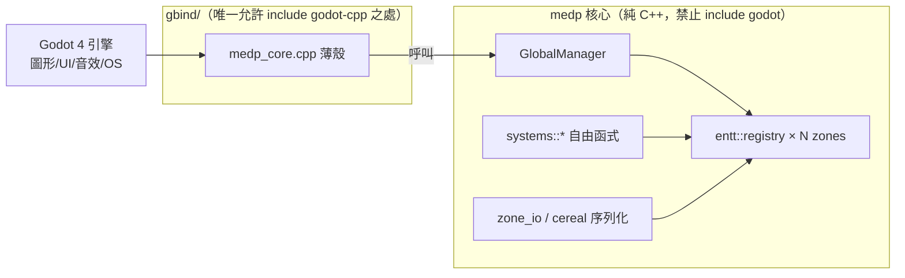

# 05 - 來自 medps 的實戰印證：C++ 沒有反射，到底怎麼做？

> 撰於 2026-06-01。本文不是憑空推測，而是拿一個**已經跑起來的真實 C++20 ECS 後端**——`C:/code/mine/medps`（`medp` 函式庫，`medp_test` 25/25 綠燈）——來對照 OpenNefia C++ 重寫計畫前面幾篇提出的三大「沒有反射怎麼辦」難題。
>
> medps 與 OpenNefia 的技術底座高度重疊（**EnTT 作 ECS、cereal 作序列化**），但 medps 是使用者親手在寫、且已驗證可行的專案。因此 `cpp_plan.html` 標示為「根本挑戰」的三件事，medps 都已經給出**具體、可編譯、有測試**的答案。本文把這些答案抽出來，回頭釘進 OpenNefia 的重寫計畫。

---

## 0. 兩個專案的定位差異（先講清楚，免得混淆）

| 面向 | OpenNefia (C#) | medps (C++20) |
|---|---|---|
| 性質 | Elona 的完整重製引擎 | 奇幻 4X（太閣 × 騎砍 × 上古卷軸 × 三國志）的**純模擬核心** |
| ECS | 自製 `EntityManager` + `Component` + `EntitySystem` | 直接用 **EnTT** `entt::registry`，不再包一層 |
| 序列化 | `[DataField]` 反射自動讀寫 | **EnTT snapshot + cereal**，type_list 當單一來源 |
| 系統 | `EntitySystem` 子類 + Assembly 掃描自動發現 | **自由函式** `void(entt::registry&)`，明確註冊 |
| 前端 | Love2D（`Love2dCS`），IoC 注入 `HeadlessGraphics` 可替換 | **Godot 4 GDExtension**，`gbind/` 薄殼，核心完全不碰 godot |
| 世界 | `MapManager` 管多張 Map | **多 registry / zone streaming**（1 zone = 1 registry，ES 式滾動視窗） |

> 關鍵體悟：OpenNefia C++ 計畫前幾篇（`02_ecs.md` 等）多半還停在「我們**可能**需要包一層 / **可能**用靜態註冊」的推測語氣。medps 已經走完那段路，而且**選擇了更少抽象**的做法。下面逐項對照。

---

## 1. 挑戰② 序列化：`[DataField]` 反射 → `type_list` 折疊展開【已驗證】

### OpenNefia C# 的做法（靠反射）

C# 端 `SerializationManager` 掃描每個 component 上的 `[DataField]` attribute，用反射逐欄位讀寫 YAML。這正是 `cpp_plan.html` 列為「挑戰②」、並在舊計畫 `03_prototypes.md` 含糊帶過「需手寫 `Deserialize()` 或用宏 / 程式碼生成」的部分。

### medps 的答案：把「所有 component 型別」收成一張清單，再用 fold expression 展開

medps 不用反射，也不用宏魔法，而是用 C++17 的**參數包折疊（fold expression）**搭配 EnTT 的 `snapshot`：

```cpp
// medps/src/gcore/serialize/all_components.h:13
// 單一真實來源：新增 component 型別只改這裡，存檔/讀檔同步擴張。
using AllComponents = entt::type_list<
    ZoneMeta, ChildZoneSummary, CrossZoneRef,
    Position, Velocity, AreaTerrain, Blocking
>;
```

```cpp
// medps/src/gcore/serialize/zone_io.h:14
template<typename... Cs>
void save_impl(entt::registry& reg, output_archive& out, entt::type_list<Cs...>) {
    auto snap = entt::snapshot{reg};
    snap.get<entt::entity>(out);
    (snap.get<Cs>(out), ...);          // ← fold：對清單裡每個型別各存一次
}
```

讀檔對稱（`zone_io.h:20`），用 `entt::snapshot_loader` + 同一張 `AllComponents{}`，最後 `loader.orphans()` 清掉無 component 的孤兒實體。

**這就是 C# 反射序列化在 C++ 的對應物**：反射在執行期遍歷型別欄位，medps 改成**編譯期遍歷型別清單**。差別只是「型別清單要人工維護一行」，換來零反射、零 RTTI、可攜二進位。

### 單一 component 怎麼定義它的欄位？cereal 的兩種約定

medps 的 component 是 POD aggregate，序列化靠 cereal 的成員函式，**完全不需要基底類別或註冊宏**：

```cpp
// medps/src/gcore/components/position.h:6  —— 對稱型別用單一 serialize()
struct Position {
    int x{}, y{};
    template<class Archive> void serialize(Archive& ar) { ar(x, y); }
};
```

```cpp
// medps/src/gcore/components/cross_zone_ref.h:9  —— 存讀不對稱時拆成 save()/load()
struct CrossZoneRef {
    ZoneKey zone{ZONE_ROOT};
    entt::entity local_entity{entt::null};
    template<class Archive> void save(Archive& ar) const { /* entt::entity 轉底層整數 */ }
    template<class Archive> void load(Archive& ar)       { /* 再轉回來 */ }
};
```

而 EnTT 的 `entt::entity`（強型別 enum）無法直接餵給 cereal，medps 寫了一個極薄的 **archive adapter** 在中間轉換：

```cpp
// medps/src/gcore/serialize/entt_cereal_archive.h:8
struct output_archive {
    cereal::PortableBinaryOutputArchive& ar;
    void operator()(entt::entity e)             { ar(static_cast<entt_id_t>(e)); }
    template<typename T>
    void operator()(entt::entity e, const T& c) { ar(static_cast<entt_id_t>(e), c); }
    // ...
};
```

### 回寫 OpenNefia C++ 計畫

- 舊 `03_prototypes.md` 說「需手寫 `Deserialize()` 或用宏 / 程式碼生成減少樣板」——**medps 證明第三條路最划算**：`entt::type_list` 當單一來源 + fold expression。OpenNefia 的存讀檔（`11_save_load_system.md`）整張地圖快照需求，正好對上 EnTT snapshot 的「整 registry 快照」能力。
- **建議在 `03_prototypes.md` / 存讀檔計畫補一節**：直接採 medps 的 `all_components.h` + `zone_io.h` + `entt_cereal_archive.h` 三件套，不要再走「每個 component 手寫 Deserialize」的老路。

---

## 2. 挑戰③ 系統註冊：Assembly 掃描 → 自由函式明確註冊【已驗證】

### OpenNefia C# 的做法（靠反射掃描）

```csharp
// OpenNefia.Core/GameObjects/EntitySystemManager.cs:133
foreach (var type in _reflectionManager.GetAllChildren<IEntitySystem>() ...)
```

C# 啟動時用 `IReflectionManager` 掃整個 Assembly，找出所有 `IEntitySystem` 子類，自動 `new` 出來、建依賴圖、排序、`Initialize()`。`cpp_plan.html` 把這列為「挑戰③」，舊 `02_ecs.md` 推測「手動注冊或靜態自註冊樣板（self-registration）」。

### medps 的答案：系統根本不是類別，是自由函式

medps 沒有 `EntitySystem` 基底類別、沒有繼承、沒有自動發現。一個系統就是一個**簽名固定的自由函式**：

```cpp
// medps/src/gcore/systems/movement.h:11
namespace systems {
inline void movement(entt::registry& reg) {
    reg.view<Position, Velocity>().each([](Position& p, Velocity& v) {
        p.x += v.dx;  p.y += v.dy;
    });
}}
```

`GlobalManager` 用 `std::function` 收一串這種函式，`tick()` 時對每個載入的 zone 依**註冊順序**跑：

```cpp
// medps/src/gcore/global_manager.h:69
using ZoneSystem = std::function<void(entt::registry&)>;
void add_zone_system(ZoneSystem sys);   // 明確註冊，順序即執行序
void tick();                            // 對每個載入 zone 跑全部已註冊系統
```

**沒有反射、沒有自註冊宏、沒有依賴圖排序**——順序由「呼叫 `add_zone_system` 的順序」直接決定。對 OpenNefia 那種系統間有依賴的情況，可在註冊端用拓樸順序手動排，或保留 OpenNefia 的依賴宣告但改成編譯期/啟動期明確建圖。

### 對 OpenNefia 計畫的張力與取捨

OpenNefia 的 `EntitySystem` 是**有狀態的類別**（透過 IoC 持有對其他 manager 的參照），medps 的自由函式是**無狀態的**（只吃 `registry&`）。兩者不完全等價：

- 若 OpenNefia C++ 想保留「系統持有依賴、能互相呼叫」，就需要 `EntitySystem` 類別 + ServiceLocator 注入（見第 4 節），系統清單仍是**手動註冊一個 vector**，而非 Assembly 掃描。
- 若能把多數系統重構成 `void(registry&, ServiceLocator&)` 風格，就能享受 medps 那種「零繼承、零反射」的輕量。

> **計畫回寫建議**：`02_ecs.md` 的「靜態自註冊樣板」推測，可降級為次選；**首選 medps 已驗證的「明確註冊 vector」**。明確註冊雖然要多寫一行 `add_system(...)`，但完全可預測、可斷點、無啟動期反射開銷——這正是 C++ 該有的取捨。

---

## 3. 「要不要包一層 EntityManager？」medps 說：多半不用

舊 `02_ecs.md` 提議封裝一個 `EntityManager` 包住 `entt::registry`，提供 `AddComponent<T>` / `GetComponent<T>`。medps 的實作給了反向意見：

- medps **直接用 `entt::registry`**，連 wrapper 都省了（`global_manager.h:24` `entt::registry root;`）。
- 「查詢」不需要自製 API——`registry.view<Position, Velocity>()` **本身就是查詢/lister**（見 `movement.h:12`）。medps 設計文件特別點明這點對應 Rimworld 的「別掃全圖、用 lister」（`medps/work/design/zone_layers.md:139`）。

OpenNefia C# 之所以要 `EntityManager`，是因為它要**塞自己的生命週期狀態機**（`ComponentLifeStage` / `EntityLifeStage`，見 `implements/.../GameObjects/`）與事件掛勾。若 C++ 版能接受 EnTT 原生的 `on_construct` / `on_destroy` signal 取代那套手寫狀態機，就能像 medps 一樣**不包 wrapper**，少一層維護負擔。

> **取捨**：要不要 wrapper，取決於「保留 OpenNefia 原生命週期語意」對重寫有多重要。medps 證明「不保留、改用 EnTT 原生」是可行且更輕的路線。

---

## 4. 挑戰① 依賴注入：medps 目前還沒踩到這題

`cpp_plan.html` 的「挑戰①依賴注入」（C# `DependencyCollection` 用 `Reflection.Emit` 動態產生注入器），**medps 目前還沒處理**——因為它的系統是無狀態自由函式，不需要 DI。

這反而是個有用的訊號：

- **若系統都無狀態（吃 `registry&`）→ 根本不需要 DI 容器**。medps 就是這樣繞過挑戰①的。
- OpenNefia 既有的 `ServiceLocator.hpp`（`implements/include/core/ioc/ServiceLocator.hpp`）仍是必要的——但它服務的對象是 `GameController` / `Graphics` / `UIManager` 這些**真正的全域單例服務**，而非每個小系統。把「服務定位器」的職責縮小到單例服務，可大幅降低 DI 複雜度。

> **計畫回寫建議**：在 `01_foundation.md` 區分兩種東西——(a) 少數全域**服務**（Graphics/Audio/Config/Logger）走 ServiceLocator；(b) ECS **系統**盡量無狀態、吃 `registry&`，不進 DI。medps 印證了 (b) 的可行性。

---

## 5. 前端策略：raylib 全包 vs Godot GDExtension 薄殼【重要分歧】

OpenNefia C++ 計畫選 **raylib**（圖形/音訊/輸入一把抓，`07_rendering_pipeline.md` / `04_graphics_ui.md`）。medps 走的是**完全不同**的路，而且使用者已明言「**這東西只是核心，未來會接上 godot 作為前端圖形、UI、音效、作業系統等等**」。

medps 的核心/前端分離（值得 OpenNefia 借鏡的架構紀律）：



- **核心 godot-free**：`CMakeLists.txt` 用 `GLOB_RECURSE` 蒐集 src 時**明確排除 `/gbind/`**，核心目標 `medp` / `medp_static` 不連 godot；只有 `gbind/medp_core.cpp` 這層薄殼能 `#include` godot-cpp（`medps/src/gbind/`）。
- 這跟 OpenNefia 的「IoC 注入 `HeadlessGraphics` 以解耦圖形」目的相同（都讓核心可獨立測試），但 medps 用**編譯目標邊界 + 目錄約定**強制，比執行期介面注入更硬、更難違反。

### 對 OpenNefia C++ 重寫的啟示

OpenNefia 重寫**不一定要綁死 raylib**。若使用者的最終藍圖是「Godot 當前端」（如 medps），那 OpenNefia C++ 核心也該採同樣的**核心/facade 分離**：

| 方案 | 圖形/UI/音效來源 | 核心相依 | 適用情境 |
|---|---|---|---|
| **A. raylib（現計畫）** | raylib 一把抓 | 核心直接連 raylib | 想要單一執行檔、自繪 UI（沿用 Wisp） |
| **B. Godot GDExtension（medps 路線）** | Godot 引擎 | 核心 godot-free，`gbind/` 薄殼 | 想要 Godot 的場景/UI/音效/跨平台，核心可獨立測試 |

> **計畫回寫建議**：在 `cpp_plan.html` / `04_graphics_ui.md` 補一段「前端後端二選一」，把 medps 的 Godot GDExtension 薄殼列為**對等備選方案**，而非只有 raylib 一條路。OpenNefia 第 14 篇分析的 XAML/Wisp 自繪 UI 在方案 A 下可移植；在方案 B 下則可考慮直接用 Godot 的 Control 節點取代。

---

## 6. 額外紅利：medps 的世界結構，可餵回 OpenNefia 的地圖系統

OpenNefia 的 `MapManager`（`05_map_area_system.md`）管多張 Map。medps 把「多地圖」推到更大規模並給出一套成熟機制，OpenNefia C++ 版若想支援大世界可直接參考：

- **1 zone = 1 `entt::registry`**，用 64-bit `ZoneKey`（`ZoneType:16 | x:16 | y:16 | z:16`）定址（`medps/src/gcore/zone_key.h:42`）。
- **絕不全載**：上古卷軸式滾動視窗 `stream_around(center, radius)` + chunk 預取（`global_manager.h:53,60`）；對應 OpenNefia「離開的地圖要不要保留」問題。
- **整地圖快照 = 便宜安全**：因為自己造了 snapshot API（`zone_io`），medps 設計文件直接點名「Rimworld 不敢用的精準還原路線，對我們便宜」（`work/design/zone_layers.md:113`）。OpenNefia 存讀檔（`11_save_load_system.md`）同理——EnTT snapshot 讓「整張地圖序列化/還原」變廉價。
- **稠密地格不要一格一 entity**：medps 的 `AreaTerrain { tdarray<Tile> }` 是掛在單例 entity 上的 component（`work/design/zone_layers.md:137`）。OpenNefia 的 Tile 系統若移植到 EnTT，應採同樣做法，別把每個 tile 變 entity。

---

## 7. 小結：三大挑戰的 medps 對照表

| cpp_plan 標示的挑戰 | C# 反射做法 | medps 已驗證的 C++ 答案 | 對 OpenNefia 計畫的動作 |
|---|---|---|---|
| **① 依賴注入** | `Reflection.Emit` 動態注入 `[Dependency]` | 系統無狀態 → **不需要 DI**；ServiceLocator 只服務全域單例 | 縮小 DI 範圍至單例服務 |
| **② 序列化** | `[DataField]` 反射讀寫 | `entt::type_list` 單一來源 + **fold expression** + cereal adapter | 採 `all_components.h`+`zone_io.h` 三件套，棄手寫 Deserialize |
| **③ 系統註冊** | `GetAllChildren<IEntitySystem>()` 掃 Assembly | 自由函式 `void(registry&)` + **明確註冊 vector** | 首選明確註冊，self-registration 降為次選 |
| （前端策略） | Love2D + IoC HeadlessGraphics | **核心 godot-free + `gbind/` 薄殼**（編譯邊界強制） | raylib 與 Godot GDExtension 並列為對等方案 |

**一句話總結**：OpenNefia C++ 計畫把「沒有反射」當成需要克服的障礙；medps 證明——只要接受「型別清單人工維護一行、系統寫成自由函式」這點小代價，沒有反射的 C++ 反而換來**零 RTTI、可預測、可斷點、編譯期檢查**的更乾淨架構。重寫不該是「想辦法在 C++ 模擬 C# 反射」，而是「順著 C++ 的紋理，用 type_list 與自由函式重新表達同樣的意圖」。

---

## 參考來源

- medps 核心：`C:/code/mine/medps/src/gcore/`
  - `serialize/all_components.h`、`serialize/zone_io.h`、`serialize/entt_cereal_archive.h`
  - `systems/movement.h`、`global_manager.h`
  - `components/position.h`、`components/cross_zone_ref.h`、`zone_key.h`
- medps 設計：`C:/code/mine/medps/work/design/zone_layers.md`、`work/session_log.md`
- medps 前端：`C:/code/mine/medps/src/gbind/`、`CMakeLists.txt`
- OpenNefia C# 對照：`EntitySystemManager.cs:133`、`IoC/DependencyCollection.cs`、`GameObjects/EntityEventBus.Directed.cs`
- 本計畫其他篇：`02_ecs.md`、`03_prototypes.md`、`04_graphics_ui.md`、`README.md`

---

## 8. 後記（2026-06-01）：opennefia-cpp 核心階段全部完成

> 本節為實作完成後補記。上述 2–5 節的「計畫回寫建議」已全數落地於 `derived/opennefia-cpp/`。

### 驗證結果

| 難題 | 本文建議的 C++ 解法 | opennefia-cpp 實作 | 狀態 |
|---|---|---|---|
| ② 序列化 | `AllComponents type_list` + fold expression + cereal adapter | `core/serialize/all_components.h` + `entt_cereal_archive.h` + `save_load.h` | ✅ 36 cases 全綠 |
| ③ 系統登錄 | `add_system()` 顯式 vector，不用 self-registration | `entity_manager.h` `add_system(SystemFn)` | ✅ |
| ① 依賴注入 | 縮到全域單例服務；系統無狀態 | `SystemCtx` 顯式傳遞；`ServiceContext` 單例 spdlog | ✅ |
| 前端分離 | 核心 godot-free，`gbind/` 薄殼（方案 B） | `OPENNEFIA_BUILD_GDEXTENSION OFF` 編譯邊界；前端暫緩 | ✅ 邊界驗證 |

### 補充坑點（建立過程新增，本文第 2–5 節未覆蓋）

**YAML::Clone 必要性（`prototype_manager.cpp`）**：`YAML::Node` map 複製只複製 handle，底層 `detail::node` 共享。子原型繼承父原型的 component node 後，一旦對其賦值（`proto.components["X"] = new_node`），`AssignNode → set_ref` 會靜默污染所有繼承同一父原型的子類。修正：繼承 merge 時對每個 node 呼叫 `YAML::Clone()`。

**`entt::entity == entt::null_t` 在 doctest CHECK() 歧義**：doctest 的 `Expression_lhs<entt::entity>` 的 template `operator==<T>` 與 EnTT 的 `operator==(entity, null_t)` 同等匹配，MSVC 報 C2593。修正：`bool b = (e == entt::null); CHECK(b);`。

**cereal 的 container include 必要**：`std::string` 需 `<cereal/types/string.hpp>`；`std::vector` 需 `<cereal/types/vector.hpp>`。缺少時 cereal static_assert「找不到序列化函式」，錯誤訊息不直觀。

### 實作成果

Phase 0–4 全部完成（2026-06-01），36 test cases / 139 assertions 全綠，`PROJECT.md §5` 完成定義五點達成。分析文件見 `analysis/opennefia-cpp/`（含 HTML 導覽層）。
</content>
</invoke>
