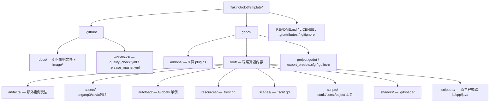
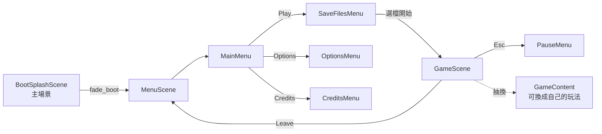

# TakinGodotTemplate — Level 1 初始探索：技術棧與整體架構概覽

> 路徑標註慣例：本檔所有 `路徑:行號` 均相對於 `projects/TakinGodotTemplate/`。Godot 專案本體位於 `godot/` 子目錄，引擎內以 `res://root/...` 對應 `godot/root/...`。

## 專案基本資訊

| 項目 | 內容 |
|---|---|
| 類型 | Godot 遊戲**起手模板**（Game Template / Starter Kit），非完整遊戲 |
| 語言 | GDScript（純 GDScript，無 C#） |
| 引擎版本 | **Godot 4.4**（`project.godot:30` → `config/features=("4.4", "GL Compatibility")`） |
| 渲染器 | GL Compatibility（相容性渲染器，便於 web/低階裝置） |
| 版本 | v0.7.2（`README.md:5` 標 v0.7；`godot/project.godot:27` → `config/version="0.7.2"`） |
| 作者 | TinyTakinTeller |
| 靈感來源 | Maaack's Godot Game Template（`README.md:7`） |
| 授權 | MIT（`LICENSE`；各原始碼檔尾標 `MIT License Copyright (c) 2024 TinyTakinTeller`） |
| 線上展示 | itch.io web 版（`.github/docs/PREVIEW.md:9`） |

**定位**：本專案不是要分析的「遊戲」，而是一個提供「精選 plugins + 必要功能 + 最佳實踐」的可複用模板，讓開發者按 GitHub「Use this template」後即有完整的選單、選項、存檔、本地化、CI/CD 骨架。

---

## 頂層目錄結構

> 結構文件對應 `.github/docs/STRUCTURE.md`。專案有意把所有實體內容收進 `godot/root/`，並用 `project.godot:82-95` 的 `folder_colors` 給每個分類上色，是其視覺化組織習慣的一部分。

---

## `.github/docs/` 文件導覽（README 的延伸）

README（`README.md`）本身極短，真正內容拆成 9 份互相連結（上一頁/下一頁）的文件：

| 文件 | 內容摘要 |
|---|---|
| `PREVIEW.md` | 截圖與 itch.io web 版連結 |
| `STRUCTURE.md` | 檔案結構 + 命名慣例（snake_case 檔案/變數、PascalCase 類別/節點、typed） |
| `FEATURES.md` | 功能清單：Game Modules（Scene/Audio/Config/Save/i18n…）+ Development Modules（SignalBus/Builder/Utils…）|
| `PLUGINS.md` | 採用的 plugins 與用途 |
| `CODE.md` | **程式碼地圖**：Globals / Scenes（Component/Node/Scene 三層）/ Scripts / Snippets 的命名與職責 |
| `CICD.md` | itch.io 部署 + gdlint 品質檢查 |
| `HACKS.md` | Godot 已知 issue 的 workaround 清單（見 Level 3） |
| `GET_STARTED.md` | 安裝、擴充 Options 的步驟、FAQ、editor layout |
| `EXAMPLES.md` | 參考連結（其他模板、Godot demo） |

---

## 技術棧與採用的 Plugins

`godot/project.godot:80` 啟用的 editor plugins 共 8 個，可分為「引擎執行期相依」與「純編輯器工具」兩類：

| Plugin | 版本 | 類型 | 職責 |
|---|---|---|---|
| **scene_manager**（maktoobgar） | 3.10.0 | 執行期 | 場景轉場（shader 遮罩動畫）與載入畫面 |
| **resonate**（hugemenace） | 2.4.0 | 執行期 | 音樂（MusicManager）與音效（SoundManager）管理 |
| **logger / Log**（albinaask，仿 Log4J） | 1.2.1 | 執行期 | 分級/分群組日誌 |
| **debug_menu** | 1.2.0 | 執行期（F3 切換） | FPS、效能、硬體資訊 overlay |
| **script-ide**（Maran23） | 1.4.6 | 編輯器 | GDScript 編輯體驗強化（Ctrl+U/O） |
| **resources_spreadsheet_view**（don-tnowe） | 2.7 | 編輯器 | 把同資料夾 .tres 用表格編輯 |
| **format_on_save** | 1.2.0 | 編輯器 | 存檔自動 `gdformat` |
| **gdLinter** | 2.1.0 | 編輯器 | 存檔自動 `gdlint`（需 Python 套件 gdtoolkit） |

> 注意：scene_manager 註冊了兩個 autoload（`SceneManager` + `Scenes`），resonate 註冊兩個（`SoundManager` + `MusicManager`），logger 註冊 `Log`，debug_menu 註冊 `DebugMenu`。本模板的特色是「**再包一層 Wrapper**」而非直接呼叫這些 plugin（見 Level 2）。

---

## Autoload 全域單例清單（`godot/project.godot:44-61`）

共 16 個 autoload，分三類（plugin 原生、Wrapper、本專案 Globals）：

| 順序 | 單例名稱 | 腳本路徑（res://） | 分類 | 職責 |
|---|---|---|---|---|
| 1 | `DebugMenu` | `addons/debug_menu/debug_menu.tscn` | plugin | F3 效能 overlay |
| 2 | `Log` | `addons/logger/logger.gd` | plugin | 底層日誌 |
| 3 | `LogWrapper` | `root/autoload/wrapper/log_wrapper/...` | Wrapper | 加上 log group 設定 |
| 4 | `TranslationServerWrapper` | `root/autoload/wrapper/translation_server_wrapper/...` | Wrapper | i18n（支援 @tool/編輯器） |
| 5 | `SceneManager` | `addons/scene_manager/scene_manager.tscn` | plugin | 場景轉場核心 |
| 6 | `Scenes` | `addons/scene_manager/scenes.gd` | plugin | 場景清單（plugin 自動產生）|
| 7 | `SceneManagerWrapper` | `root/autoload/wrapper/scene_manager_wrapper/...` | Wrapper | 用 enum + Resource 包裝轉場 |
| 8 | `AudioManagerWrapper` | `root/autoload/wrapper/audio_manager_wrapper/...` | Wrapper | 用 enum 包裝音訊播放 |
| 9 | `SoundManager` | `addons/resonate/sound_manager/...` | plugin | 音效池 |
| 10 | `MusicManager` | `addons/resonate/music_manager/...` | plugin | 音樂軌 |
| 11 | `SignalBus` | `root/autoload/signal_bus/...` | Global | 全域訊號匯流排（Observer） |
| 12 | `Data` | `root/autoload/data/...` | Global | 存檔系統（JSON） |
| 13 | `Overlay` | `root/autoload/overlay/...` | Global | 全域 overlay 容器（FPS 計數） |
| 14 | `Configuration` | `root/autoload/configuration/...` | Global | 設定系統（INI） |
| 15 | `AssetReference` | `root/autoload/reference/asset_reference/...` | Global | 預載資產（preload const） |
| 16 | `ResourceReference` | `root/autoload/reference/resource_reference/...` | Global | 自動預載 `resources/preload/` 下所有 .tres |

> autoload **載入順序很重要**：`Log` 必須在 `LogWrapper` 之前；plugin autoload 必須在對應 Wrapper 之前；`AssetReference` 在 `AudioManagerWrapper` 用到它（`AudioBanks` 引用 `AssetReference.MENU_DOODLE_2_LOOP`）前。

---

## 入口場景與場景流

- **主場景（Main Scene）**：`godot/project.godot:28` →
  `res://root/scenes/scene/boot_splash_scene/boot_splash_scene.tscn`
- BootSplash 在 `_ready()` 顯示啟動圖後，呼叫 `SceneManagerWrapper.change_scene(MENU_SCENE, "fade_boot")` 平滑轉場到主選單
  （`root/scenes/scene/boot_splash_scene/boot_splash_scene.gd:21-27`）。

整體場景流：

- MenuScene 是「子選單容器」：把 MainMenu/OptionsMenu/CreditsMenu/SaveFilesMenu 都當子節點，用 `visible` 切換（`root/scenes/scene/menu_scene/menu_scene.gd:43-56`）。
- GameScene 啟動時依設定動態載入 GameContent 子場景（`root/scenes/scene/game_scene/game_scene.gd:68-76`，見 Level 3）。

---

## 輸入映射（`godot/project.godot:101-167`）

預設輸入動作：`game_pause`（Esc / 手把按鈕）、移動 `move_forward/backwards/left/right`、`jump`、右搖桿 `look_*`、`cycle_debug_menu`（F3）。移動/look 系列是為了 `artifacts/` 內的 3D 第一人稱範例準備的。

---

## 本地化（i18n）

- `godot/project.godot:171` 列出 **29 個語系** translation 檔（含 zh / zhZH 繁簡、ar/he 等 RTL、description 軌）。
- 來源：Polyglot Template（600+ 遊戲常用詞）+ Google Noto Sans 字型 glyph（涵蓋阿拉伯/希伯來/中日韓/泰文）。
- 透過 `TranslationServerWrapper`（`root/autoload/wrapper/translation_server_wrapper/...`）存取，特色是用 `|` 分隔符支援字串拼接翻譯，並能在 @tool/編輯器腳本中運作。

---

## CI/CD 概覽（`.github/workflows/`）

| Workflow | 觸發 | 行為 |
|---|---|---|
| `quality_check.yml` | push / PR | 安裝 `gdtoolkit==4.*`，對 `godot/` 下所有 `.gd`（排除 `addons/`）跑 `gdlint`，問題數 > `PROBLEMS_THRESHOLD=0` 即失敗 |
| `release_master.yml` | push 到 `master` | 用 `barichello/godot-ci:4.4` 容器匯出 **web + windows**（linux/mac 已註解），上傳 artifact，再用 butler 部署到 **itch.io**（需 `BUTLER_API_KEY`/`ITCHIO_GAME`/`ITCHIO_USERNAME` secrets） |

`gdlintrc`（`godot/gdlintrc`）自訂了 class 成員定義順序、命名 regex、`max-line-length=100`、`max-file-lines=1000` 等規則，與 `format_on_save` plugin 搭配形成「存檔即格式化、push 即檢查」的閉環。

---

## 構建與執行方式

1. **取得**：GitHub「Use this template」或 clone（`.github/docs/GET_STARTED.md:14`）。
2. **前置**：安裝 Python 套件 GDScript Toolkit（給 formatter/linter 用）。
3. **首次開啟**：用 Godot 4.4 編輯器 Import 專案 → 啟用全部 plugins → `Project > Reload Current Project`。
4. **執行**：編輯器 F5（主場景 boot_splash）。
5. **匯出**：`export_presets.cfg` 已配置 Web / Windows Desktop 等預設；CI 用 `godot --headless --export-release "Web"/"Windows Desktop"`。

> 注意：根資料夾 `root` 改名會牽動 i18n 重匯入、字型 fallback、`path_consts.gd` 的 `ROOT` 常數、scene_manager 重存（`.github/docs/HACKS.md:37-41`）。

---

## 命名與編碼慣例（`.github/docs/STRUCTURE.md:37-46`）

- 檔案/資料夾/變數/函式 → **snake_case**；節點/類別/enum/型別 → **PascalCase**。
- 一律使用 **typed** 變數與函式（`project.godot:67` 還開了 `untyped_declaration=1` 警告）。
- 函式定義順序：override → public → private → static。
- 「基底用」腳本以 `_` 前綴（如 `_save_data.gd`、`_configuration_controller.gd`、`_options_container.gd`）。

---

## 專案類型判定（給 Level 3 選模板用）

本專案橫跨兩類：
- **模板 D（前端/桌面應用）**：絕大部分內容是 UI（選單、選項、存檔列表）、元件樹、狀態（Configuration/SaveData）管理、事件系統（SignalBus）。
- **模板 A（遊戲）**：含 GameScene 與可抽換的玩法（2D clicker / 3D FP）。

因本質是「**UI/框架骨架模板**」，Level 3 將以模板 D 為基底，並補入此專案最具特色的子系統：① 設定與存檔雙持久化、② 場景流與 Builder 元件注入、③ HACKS（尤其 web 整合）。
