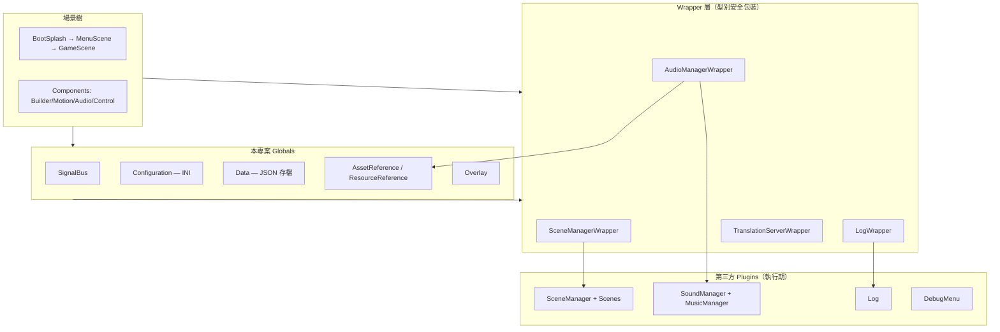
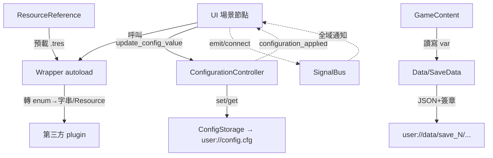

# TakinGodotTemplate — Level 2 核心模組職責深度分析

> 路徑相對於 `projects/TakinGodotTemplate/`（引擎 `res://root/...` = `godot/root/...`）。

本層回答：採用了哪些 plugins、各自負責什麼、autoload/manager 的權責劃分、場景如何管理、資料流與耦合點，以及相對於 Maaack 模板的差異與擴充。

---

## 0. 一句話總結

> 以 **16 個 autoload 單例** 為骨幹，把第三方 plugin 全部「**Wrapper 化**」成 enum/Resource 驅動的型別安全介面，再用 **SignalBus 觀察者模式** 解耦全域通訊；UI 採 **Component-Driven Design**（Builder 自動注入 + 設定/存檔分別走 INI/JSON 雙持久化）。

---

## 1. 模組分層全貌

---

## 2. 採用的 Plugins 與其職責

| Plugin | 模組職責 | 在本專案中如何被使用 |
|---|---|---|
| **scene_manager**（maktoobgar） | 場景之間的轉場（fade 等 shader pattern）、載入畫面、回上一頁堆疊 | 不直接呼叫，一律經 `SceneManagerWrapper` |
| **resonate** | 音樂軌（含 stem）與音效池播放 | 不直接呼叫，一律經 `AudioManagerWrapper` + `AudioBanks` |
| **logger / Log** | Log4J 風格分級日誌 | 不直接呼叫，一律經 `LogWrapper`（加 log group） |
| **debug_menu** | F3 切換效能/硬體 overlay | 直接作為 autoload；輸入動作 `cycle_debug_menu`（F3） |
| **script-ide / resources_spreadsheet_view / format_on_save / gdLinter** | 純編輯器體驗（無執行期影響） | 編輯器內生效，不進入遊戲執行 |

**設計信念**：第三方 plugin 的 API 用「字串名稱」當參數（易拼錯、無自動補全）。本模板的核心做法是替每個 plugin 寫一層 Wrapper，用 **enum + 預載 Resource** 取代裸字串（見 §3）。

---

## 3. Wrapper 層（本模板最具辨識度的設計）

四個 Wrapper 都是 autoload，職責是「**讓 plugin 變得型別安全、可預載、可在編輯器運作**」。

### 3.1 SceneManagerWrapper
`root/autoload/wrapper/scene_manager_wrapper/scene_manager_wrapper.gd`

- 對外提供 `change_scene(scene: SceneManagerEnum.Scene, options_id: String)`。
- 把 enum 轉成 plugin 要的字串 scene id（`SceneManagerEnum.scene_name()`，`...scene_manager_enum.gd:42-43`）。
- 轉場參數不寫死，而是用 `ResourceReference.get_scene_manager_options(options_id)` 取出預載的 `SceneManagerOptions` Resource（`...scene_manager_wrapper.gd:18-26`），再產生 plugin 的 fade-out/in/general options。
- `SceneManagerEnum.Scene` 同時含特殊值 `BACK/RELOAD/RESTART/EXIT/QUIT` 與專案場景 `MENU_SCENE/GAME_SCENE`（`...scene_manager_enum.gd:13`）。

### 3.2 AudioManagerWrapper
`root/autoload/wrapper/audio_manager_wrapper/audio_manager_wrapper.gd`

- `play_music(music: AudioEnum.Music, crossfade, unique)` / `play_sfx(sfx: AudioEnum.Sfx)`。
- 用 `_already_playing: Dictionary` 追蹤已播放音樂，`unique=true` 時避免重複播放 loop 音樂（`...audio_manager_wrapper.gd:21,32-40`）。
- 音軌定義集中在 `AudioBanks`（`.../audio_banks/audio_banks.gd`）：在 `_init_resonate_audio_banks()` 把 `AssetReference` 的 preload 音檔組成 resonate 的 `MusicTrackResource`/`SoundEventResource`，並以 `AudioEnum` 的名稱當 key。**新增音效 = 在 AudioEnum 加值 + 在 AudioBanks 註冊**。

### 3.3 LogWrapper
`root/autoload/wrapper/log_wrapper/log_wrapper.gd`

- 包裝 `Log` 的 debug/info/warn/error，第一參數可傳 `self`（自動取 `.name`）或字串作為「log source」。
- 核心是 **log group 階層**：`_is_log_group_active()`（`...log_wrapper.gd:73-91`）用 `.` 分隔的 source 名稱往上回溯查 `log_groups` 設定，支援把某群組設成 `DISABLED`，達成細緻的除錯輸出開關。

### 3.4 TranslationServerWrapper
`root/autoload/wrapper/translation_server_wrapper/translation_server_wrapper.gd`（`@tool`）

- 解兩個痛點：① 用 `|`（`LOCALE_LIST_SEPARATOR`）拼接多段翻譯；② 讓 `translate()` 在 **編輯器/@tool 腳本** 也能運作（編輯器內直接抓 `en` translation object，繞過 runtime-only 的 `tr()`）。
- 修正 Godot issue #46271。

---

## 4. SignalBus（全域通訊解耦）
`root/autoload/signal_bus/signal_bus.gd`

- 極簡：只宣告 signal，不含邏輯（目前 `language_changed`、`number_format_changed`、`clicks_per_second_updated`）。
- **使用守則**（檔頭註解）：父子之間用一般 signal，跨越層級/全域才用 SignalBus。
- 範例耦合：`MainMenu._connect_signals()` 連 `SignalBus.language_changed`，語系切換時刷新標題/版本標籤（`root/scenes/scene/menu_scene/main_menu/main_menu.gd:31,40-41`）。

---

## 5. Configuration（設定系統，持久化於 INI）

完整深入見 `level3_configuration_save_system.md`，此處給權責摘要。

- **Configuration**（autoload，`root/autoload/configuration/configuration.gd`）：設定總管，持有 `ConfigurationControllerLoader`。
- **ConfigurationController**（基類，`.../_configuration_controller/_configuration_controller.gd`）：每個可調設定一個節點，負責 save/load/apply。底層用 **ConfigStorage**（`scripts/object/config_storage/config_storage.gd`）存到 `user://config.cfg`（INI）。
- 四種控制器型別：List / Slider / Toggle / Tree（對應 `ConfigurationEnum`，`configuration_enum.gd`）。
- 設定分群：`OTHER/AUDIO/VIDEO/CONTROLS/GAME`，對應 OptionsMenu 的分頁。
- **資料流**：UI 節點（`MenuDropdownNode` 等）← 包裝 → UI 元件（`MenuDropdownUI`），透過 `update_config_value_index()` 通知對應 controller，controller `apply` 並 `save` 到 INI，再 emit `configuration_applied` 讓其他 UI 同步。

---

## 6. Data（存檔系統，持久化於 JSON）
`root/autoload/data/data.gd`

完整深入見 `level3_configuration_save_system.md`。權責摘要：

- **Data**（autoload）：存檔總管。子節點為 `SaveData` 型別，每個子節點代表存檔的一個「分區（category）」。
- 預設兩個分區：`GameSaveData`（遊戲資料，如 coins）與 `MetaSaveData`（統計資料，如 playtime、save 名稱，**先於選檔載入**用於存檔列表顯示）。
- 檔案結構：`user://data/save_{index}/save_{index}_{category}.data`，內容是 JSON + `§§§` 簽章（用於偵測 OS 寫入殘留的損毀）。
- 支援 **自動存檔**（`AutosaveTimer`，預設每 5 秒）、**加密**（INI 設定可選 password / base64 cipher）、匯入/匯出（base64）、改名/刪除。
- **反射式序列化**：`SaveData._init_export_vars()`（`.../_save_data.gd:84-99`）用 `get_script_property_list()` 掃描非底線開頭的腳本變數，自動納入存檔，無需手寫序列化。

---

## 7. Reference 系統（預載資產與資源）

| Autoload | 機制 | 用途 |
|---|---|---|
| `AssetReference`（`.../asset_reference.gd`） | 手動 `const X = preload(...)` | 顯式預載音檔等資產，供 `AudioBanks` 等引用 |
| `ResourceReference`（`.../resource_reference.gd`） | **自動掃描** `res://root/resources/preload/` 下所有 `.tres` 並以「型別-檔名」當 key | 供 `SceneManagerWrapper` 取 `SceneManagerOptions`、取 `ParticleProcessMaterial` 等 |

`ResourceReference._get_key()`（`...resource_reference.gd:73-81`）以資源的 `class_name`/`get_class()` 當 key 前綴，避免不同型別同名資源衝突。

---

## 8. 場景管理（Scene 三層分類）

`.github/docs/CODE.md:36-84` 把 `scenes/` 明確分三層，這是本模板組織 UI 的核心心法：

| 層級 | 定義 | 例子 |
|---|---|---|
| **Component** | 擴充「父節點」功能的附掛元件 | ButtonAudio、ControlGrabFocus、TwistMotion、UiBuilder、ParticleEmitter |
| **Node** | 可獨立重用的功能單元 | MenuButton、MenuConfiguration（dropdown/slider/toggle/tree） |
| **Scene** | 大型專門化集合 | BootSplashScene、MenuScene、GameScene、PauseMenu |

- **MenuScene**（`root/scenes/scene/menu_scene/menu_scene.gd`）：子選單以 `visible` 切換（`_toggle()`），Esc 回主選單；進場播放選單音樂。
- **GameScene**（`root/scenes/scene/game_scene/game_scene.gd`）：`_ready()` 動態載入 `GameContent`（`_load_game_content_scene()`，依 `Configuration.get_game_mode_content_scene()`），管理 pause/options 切換與 `get_tree().paused`。離開時 `Data.exit_save_file()` 存檔再轉場（`game_scene.gd:120-130`）。
- GameScene 用 `_after_pause/_after_unpause/_after_leave` 三個鉤子 + 鴨子型別檢查（`"player" in game_content`）來相容不同玩法（2D clicker 無 player，3D FP 有 player 需擷取滑鼠），是抽換玩法的關鍵接縫（見 Level 3）。

---

## 9. Builder（Component 注入機制）
`root/scenes/component/builder/builder.gd` + `ui_builder.gd`

- **Builder** 是通用的「遞迴掃描父節點下所有子節點，對符合條件者注入元件」工具，相當於 Godot 未來 Traits 的替代品（`.github/docs/FEATURES.md:49`）。
- 條件：`condition_properties`（須有某屬性且值匹配）、`not_condition_properties`、類別/名稱例外清單。
- **UiBuilder**（`ui_builder.gd`）：對所有 `focus_mode != FOCUS_NONE` 的 `Control` 注入 `TwistMotion`（hover 動畫）與 `ControlFocusOnHover`（滑鼠移入抓焦點），排除 `Tree`/`GameButton`，並對大型節點（SaveFileButton 等）自訂動畫幅度。MenuScene 與 GameScene 都呼叫 `ui_builder.build()`。

**效果**：開發者放任何按鈕進選單，自動就有「hover 動畫 + 控制器焦點」的一致 UX，無需逐一掛載。

---

## 10. Scripts（純工具層）

`scripts/` 不進場景樹，分三類（`.github/docs/CODE.md:85-104`）：

- **const**：`path_consts`（`res://root/` 等路徑前綴）、`int_consts`、`charset_consts`、`input_event_consts`。
- **object**：`ActionHandler`（輕量 command pattern，用 map 取代 if/switch，`scripts/object/action_handler/action_handler.gd`）、`ConfigStorage`（INI 持久化靜態類）、`LinkedMap`（保序字典）。
- **util**：11 個工具腳本（Datetime/Dictionary/Enum/FileSystem/Marshalls/Math/Node/Number/Random/String/Theme）。其中 `MarshallsUtils` 提供存檔的 JSON 轉換 + 可選加密；`EnumUtils.to_name()` 是 Wrapper 層 enum→字串的關鍵。

---

## 11. 資料流與耦合點總結

**主要耦合點**：
1. **Wrapper → Plugin**：唯一允許碰 plugin API 的地方；換 plugin 只需改 Wrapper 內部。
2. **UI → ConfigurationController**：透過 enum（`ConfigurationEnum.ListCfg` 等）尋址，新增設定需同步改 enum、新增 `_cfg` 場景、掛 UI 節點（`.github/docs/GET_STARTED.md:24-27`）。
3. **GameScene ↔ GameContent**：用鴨子型別（`"player" in game_content`）而非硬性介面，弱耦合以容納任意玩法。
4. **SignalBus**：全域通訊唯一管道，避免到處 `get_node()` 直連。

---

## 12. 相對於 Maaack 模板的差異與擴充

本模板自承靈感來自 Maaack's Godot Game Template（`README.md:7`）。可觀察到的差異化擴充：

| 面向 | 本模板的擴充/差異 |
|---|---|
| **Plugin 抽象** | 引入系統化的 **Wrapper 層**（enum + Resource 取代裸字串），Maaack 多直接使用節點/場景 |
| **設定/存檔分離** | 設定走 **INI（ConfigStorage）**、存檔走 **JSON + 簽章 + 可選加密**，兩套獨立持久化機制 |
| **反射式存檔** | SaveData 用 `get_script_property_list()` 自動序列化非底線變數，新增欄位免改序列化碼 |
| **Builder/元件注入** | 以 Builder 模擬 Traits，自動替 UI 注入動畫與焦點元件 |
| **i18n 規模** | 29 語系 + Polyglot 600+ 詞 + Noto Sans glyph，並修正編輯器/@tool 翻譯問題 |
| **HACKS 文件化** | 明確列出針對 Godot issue 的 workaround（web 剪貼簿、custom theme、GPU particle 等，見 Level 3） |
| **CI/CD** | gdlint 品質門檻（threshold=0）+ 自動匯出 web/windows 並部署 itch.io |
| **多玩法範例** | `artifacts/` 內建 2D clicker（預設）與 3D FP controller，可在 GameOptions 切換 |

> 共同點（沿襲 Maaack 精神）：完整的選單系統（主選單/選項/credits/存檔）、控制器/鍵盤焦點支援、選項持久化、CC0 placeholder 資產、CREDITS.md 遊戲內渲染。
