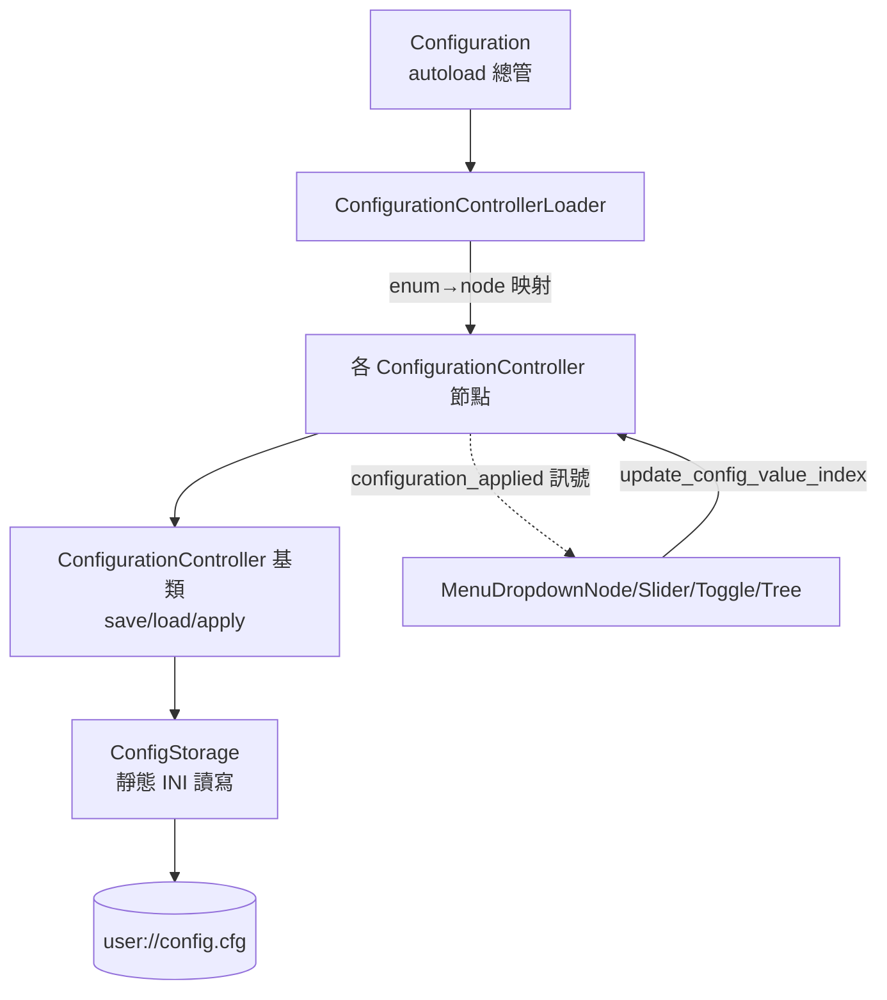
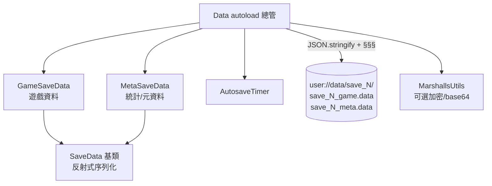
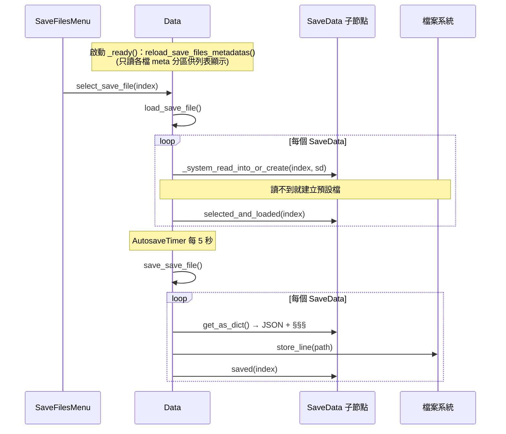

# TakinGodotTemplate — Level 3：設定（INI）與存檔（JSON）雙持久化子系統

> 前置：先讀 `level1_overview.md`、`level2_core_modules.md` §5–§6。路徑相對於 `projects/TakinGodotTemplate/`。

本模板有意把「**應用設定**」與「**遊戲存檔**」分成兩套獨立持久化機制：

| 子系統 | Autoload | 落地檔 | 格式 | 主要 API |
|---|---|---|---|---|
| 設定 Configuration | `Configuration` | `user://config.cfg` | INI | `ConfigStorage` 靜態類 |
| 存檔 Data | `Data` | `user://data/save_N/save_N_{cat}.data` | JSON + 簽章 | `Data` autoload |

---

## A. 設定子系統（Configuration / INI）

### A.1 角色分工



### A.2 ConfigurationController 生命週期
`root/autoload/configuration/configuration_controller/_configuration_controller/_configuration_controller.gd`

基類定義了完整的設定生命週期（這是「模板方法」模式，子類只覆寫 `apply`/`get_default`/`get_config_value`）：

| 方法 | 行為 | 行號 |
|---|---|---|
| `_ready()` | 啟動即 `load_config_value()`（讀 INI → apply） | :17-18 |
| `get_saved_config_value()` | `ConfigStorage.get_config(group, id, default)` | :56-57 |
| `load_config_value()` | 讀存值 → `apply_config_value()` | :60-62 |
| `update_config_value(v)` | `apply` + `save`（玩家改設定時呼叫） | :65-67 |
| `save_config_value(v)` | `ConfigStorage.set_config(...)` | :70-71 |
| `apply_config_value(v)` | **子類實作**（真正改 ProjectSettings/Window/Audio…） | :74-75 |
| `reset_config_value()` | apply+save 預設值 | :78-79 |

四種子型別（`ConfigurationEnum`，`configuration_enum.gd`）：`ListCfg`、`SliderCfg`、`ToggleCfg`、`TreeCfg`，各有對應的中間基類（`_list_configuration_controller.gd` 等）。

### A.3 ListConfigurationController 與 LinkedMap
`.../_list_configuration_controller.gd`

- 下拉選單型設定需要「**有序的（標題→值）清單**」，故用內部類別 `CfgOptions`（含 `LinkedMap`、`disabled_options`、`hide_disabled`）。
- 用 `LinkedMap`（`scripts/object/linked_map/linked_map.gd`，保序字典）保證選項顯示順序。
- 提供「以 index 操作」的便利方法：`update_config_value_index(i)`（:33-35）、`get_config_value_index()`（:48-50），讓 UI 只需傳下拉的選擇索引。
- `option_disabled` 訊號（:18）：某些平台不支援某選項（如 web 不支援改視窗解析度），controller 可在 `_process` 偵測 apply 失敗後 `disable_cfg_option()`，UI 收到訊號灰掉該選項。

### A.4 約定式自動註冊（最巧妙的一環）
`.../configuration_controller_loader/configuration_controller_loader.gd`

Loader 不用手寫對照表，而是靠 **節點命名約定** 自動把 enum 映射到節點：

```
節點名 = <ConfigurationEnum 列舉名（去底線）> + <型別後綴 List/Slider/Toggle/TreeCfg>
例：GameModeListCfg → ConfigurationEnum.ListCfg.GAME_MODE
```

- `_init_cfg_map_on_child()`（:62-73）依節點實際型別判斷它屬於哪個 enum 與 map。
- `_init_cfg_map_entry()`（:76-89）`node.name.split(suffix)[0]` 取前綴 → `EnumUtils.from_name()` 轉 enum 值 → 存入對應 map，同時把節點加入 `config_group` 分群（給 OptionsMenu 分頁與「重設此分頁」用）。

> 設計效益：**新增一個設定只要建立並掛上一個命名正確的 `_cfg` 場景，Loader 會自動發現**，無需改 Loader 程式碼（呼應 `GET_STARTED.md:22-27` 的擴充步驟）。

### A.5 具體範例：GameModeListCfg
`.../configuration_controller/game/game_mode_list_cfg/game_mode_list_cfg.gd`

- `@export var game_content_scenes: Array[PackedScene]`：在編輯器掛上「玩法場景」陣列（0=空、1=2D clicker 預設、2=3D FP）。
- `get_config_resource()` 回傳 `game_content_scenes[game_mode]`——這個 PackedScene 正是 GameScene 啟動時要實例化的玩法（見 `level3_scene_flow_and_builder.md`）。
- `apply_config_value()` 只設 `game_mode` 並 emit `configuration_applied`（:30-33）。
- 用 `get_config_resource()` 而非 `get_config_value()` 的理由：存檔只存「索引整數」，不把整個 PackedScene 序列化進 INI（基類註解 `_configuration_controller.gd:50-52`）。

### A.6 ConfigStorage（INI 落地）
`scripts/object/config_storage/config_storage.gd`（靜態 Object）

- 包裝 Godot `ConfigFile`，存到 `user://config.cfg`。提供 `get/set/has/erase/increment_config`。
- `static var config_file` 快取，懶載入（`_load_config_file()`，:80-87）。
- 衍生用法 `ConfigStorageAppLog`（`...config_storage_app_log.gd`）：在 `Configuration._ready()`（`configuration.gd:17`）呼叫 `app_opened()`，記錄「開啟次數 / 首次版本 / 最後版本」到 `[AppLog]` section。

---

## B. 存檔子系統（Data / JSON）

### B.1 角色分工
`root/autoload/data/data.gd`



### B.2 SaveData 基類：反射式序列化
`root/autoload/data/save_data/_save_data.gd`

- 每個 `SaveData` 子節點代表存檔的一個 **category（分區）**，`get_category()` 預設用節點名。
- `metadata` 旗標（`is_metadata()`）：metadata 分區「**在選檔之前就載入**」，用於存檔列表顯示（名稱、遊玩時間…）。
- **核心反射機制** `_init_export_vars()`（:84-99）：用 `get_script().get_script_property_list()` 掃描所有 `PROPERTY_USAGE_SCRIPT_VARIABLE` 且非 `_` 開頭的變數，自動視為「要存的欄位」。
- `get_as_dict()`/`set_from_dict()`（:62-79）依此清單做字典互轉。**新增存檔欄位 = 在子類加一個 typed 變數即可，無需手寫序列化碼。**
- 三個可覆寫鉤子：`saved()`、`selected_and_loaded()`、`clear()`（子類定義預設值）。

### B.3 兩個內建分區

**GameSaveData**（`.../game_save_data/...`）：示範用遊戲資料。
- `coins`、`max_clicks_per_second`，皆用 setter 在賦值時 emit 訊號（`coins_set` 等），讓 UI 自動更新。
- `clear()` 把兩者歸零。

**MetaSaveData**（`.../meta_save_data/...`）：存檔統計（`metadata=true`）。
- 欄位：`save_file_name`、`playtime_seconds`、`file_open_count`、`modified/created_at_datetime/timezone/version`。
- `saved()`：自動計算 playtime（用 `modified_at` 與當前時間差，`DatetimeUtils.difference_seconds`），補首次建立時間/版本。
- `selected_and_loaded()`：載入時更新 `modified_at` 並 `file_open_count += 1`，用於正確計算下次存檔的遊玩時長。
- `clear(index)`：未命名時預設 `"Save {index}"`。

### B.4 存檔流程



### B.5 健壯性設計
- **檔案結構**：`user://data/save_{index}/save_{index}_{category}.data`（`_system_get_save_file_path`，`data.gd:294-302`）。
- **簽章 `§§§`**（`data.gd:32`）：寫入時附在結尾，讀取時 `_system_verify_signature()`（:368-378）偵測並截除 OS 寫入殘留的損毀尾段。
- **目錄自建**：寫入若開檔失敗，`make_dir_recursive_absolute` 後重試（:315-318）。
- **加密**：`use_security`（INI 設定）開啟後支援 `open_encrypted_with_pass`（檔案層）與匯出 base64 cipher（`MarshallsUtils`）。檔頭警告：對 Cheat Engine 等記憶體修改無效，且會拖慢讀寫（`data.gd:44-55`）。
- **匯入/匯出**：`export_save_file_index()`→base64 字串、`import_save_file_index()` 反向（供 SaveFilesMenu 的 Import/Export 按鈕），便於 web 版分享存檔（搭配 web 剪貼簿 hack，見 `level3_hacks_and_web.md`）。
- **自動存檔**：`_on_autosave_timer_timeout()`（:391-393）僅在已選檔且 `autosave_enabled` 時存。autosave 開關本身又是一個 `ToggleCfg` 設定（`AutosaveToggleCfg`），體現兩子系統的協作。

---

## C. 兩子系統對照與設計取捨

| 面向 | Configuration（設定） | Data（存檔） |
|---|---|---|
| 落地格式 | INI（人類可讀、單檔） | JSON + 簽章（多檔、可加密） |
| 數量 | 全域單一 | 多存檔槽（預設 3，`save_file_count`） |
| 何時持久化 | 玩家改值即存 | 選檔後自動存（Timer）+ 離開時存 |
| 新增方式 | 加 enum + `_cfg` 場景（Loader 自動發現） | 在 SaveData 子類加 typed 變數（反射自動序列化） |
| 典型內容 | 音量、解析度、語系、鍵位、玩法模式 | coins、playtime、玩家進度 |

> 共同設計哲學：**約定優於設定 + 反射/命名自動化**，把「新增一項」的成本壓到最低，正是「模板」要提供的價值。
