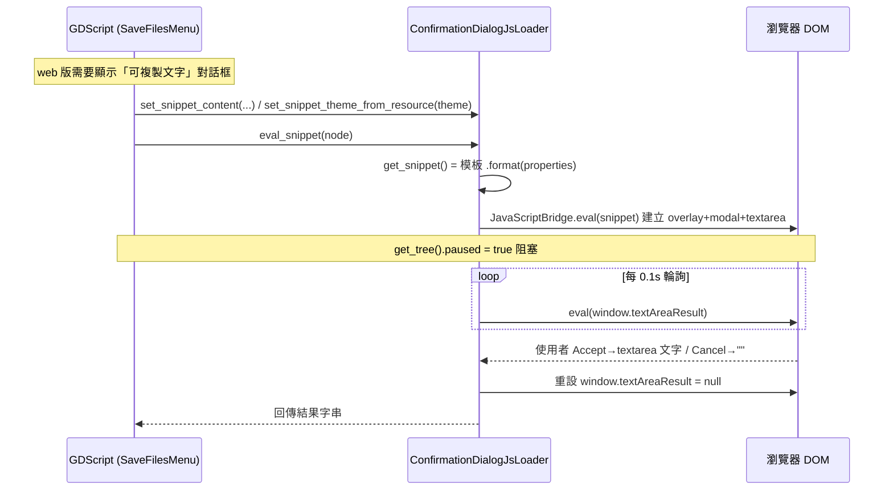

# TakinGodotTemplate — Level 3：HACKS（Godot 已知問題的 Workaround）與 Web 整合

> 前置：先讀 `level1_overview.md`。本層對應 `.github/docs/HACKS.md` 與 `snippets/`。路徑相對於 `projects/TakinGodotTemplate/`。

「HACKS」是本模板的特色文件之一：明確列出針對 Godot 引擎 **未解 issue** 的 workaround，並標記已解 `[x]` / 待辦 `[ ]`。這對模板使用者極有價值——把踩坑經驗變成可繼承的解法。

---

## 1. HACKS 清單總覽（`.github/docs/HACKS.md`）

### 已解決 `[x]`

| 範疇 | Godot Issue | 問題 | 本模板解法 |
|---|---|---|---|
| General | #96023 | custom theme 啟動未套用 | startup script 處理 |
| General | #66014 | 後綴 .tres 檔名問題 | 名稱 sanitization |
| General | #65390 | GPU particles 缺陷 | interpolate 開關切換 |
| General | #35836 | font size tween 造成卡頓 | 改用 **scale tween**（即 `TwistMotion`/`ScaleMotion` 用縮放而非改字級） |
| Web | #81252 | **web 無法存取剪貼簿** | **原生 JavaScript dialog**（本層重點，見 §2） |
| Web | #96874 | web boot splash | Head Include 內的 CSS |
| Web | #100696 | `play_stream` bus 指定失效 | 明確傳入函式參數（呼應 `AudioManagerWrapper` 顯式指定 bus） |

### 待辦 `[ ]`（記錄但未解）
- General：#89712 `"hicon" is null`、#75369/#71182/#61929 large scene lag。
- Desktop：#3145/#6247 boot window mode（待 cfg override）、#76167/#91543 Boot Splash「leak」。
- Web：#43138 web user focus（待「click to continue」開機畫面）。

> 設計價值：把「為什麼這段程式長這樣」的引擎 bug 背景留檔，避免後人誤以為是過度設計而移除 workaround。

---

## 2. 重點剖析：Web 剪貼簿 JS 注入

### 2.1 問題
Godot 的 web 匯出無法讀寫瀏覽器剪貼簿（issue #81252），而本模板的存檔系統需要「匯出/匯入存檔字串（base64）」讓玩家複製分享——這在 web 版就卡住了。

### 2.2 解法：用 JavaScriptBridge 注入原生 HTML/CSS/JS dialog
`root/snippets/js/confirmation_dialog/confirmation_dialog_js_loader.gd`（`ConfirmationDialogJsLoader`，靜態類）

### 2.3 關鍵實作點
- **模板字串 + 屬性表**：`confirmation_dialog.js` 用 `{modal_width}`、`{modal_bg_color}`… 佔位符（`confirmation_dialog.js:14-39`），`get_snippet()` 以 `_snippet_properties` 字典 `.format()` 填值（`...js_loader.gd:108-110`）。
- **主題同步到 CSS**：`set_snippet_theme_from_resource(theme)`（`...js_loader.gd:120-160`）把 Godot `Theme` 的 Button/TextEdit/Label/AcceptDialog stylebox 顏色抽出，轉成 `#RRGGBB` 灌進 JS dialog 的 CSS——讓原生 HTML dialog 外觀與遊戲主題一致。這是本 hack 最細膩的一環：跨 GDScript↔CSS 的主題橋接。
- **同步阻塞等待**：`eval_snippet()`（`...js_loader.gd:67-80`）`get_tree().paused = true` 後，用 `await create_timer(0.1)` 迴圈輪詢 `window.textAreaResult`，直到使用者按下 Accept/Cancel；Accept 回傳 textarea 文字、Cancel 回傳 `""`，最後重設輸出容器並恢復 `paused`。
- **靜態類保護**：`_init()` 直接 `push_error`（`...js_loader.gd:62-63`），防止被誤實例化（與 `ConfigStorage`、`ActionHandler` 同樣慣例）。

### 2.4 為何放在 `snippets/`
`.github/docs/CODE.md:105-114` 定義 `snippets/` 專收「原生程式碼」（web 的 js、android 的 java 等），與 GDScript 分離。`path_consts.gd` 雖未定義 snippets 前綴，loader 內以 `PathConsts.RES + "/snippets/js/"` 組路徑（`...js_loader.gd:14-16`）。

---

## 3. 其他值得注意的整合細節

- **font tween → scale tween（#35836）**：本模板所有 UI「果汁感」動畫（`TwistMotion`/`ScaleMotion`）刻意用 **縮放** 而非改字級，正是為了規避字級 tween 的卡頓 bug。這解釋了為何 hover 動畫是「整體放大」而非「字變大」。
- **play_stream bus（#100696）**：`AudioManagerWrapper`/`AudioBanks` 對每個 music/sound 顯式指定 `bus`（`audio_banks.gd` 的 `_create_music_track`/`_create_sound_event`），即此 issue 的 workaround。
- **TranslationServerWrapper 修正 #46271**：讓 `@tool` 腳本/編輯器也能翻譯（見 `level2_core_modules.md` §3.4）。
- **GPU particle interpolate（#65390）**：粒子相關元件（ParticleEmitter/ParticleQueue）需切換 interpolate 以避免缺陷。

---

## 4. 平台測試現況（`.github/docs/HACKS.md:30-34`）

模板目前主要驗證 Windows + Web；**Linux / macOS / iOS / Android 標為 TODO 未測試**。CI 的 `release_master.yml` 也只啟用 web + windows 匯出（linux/mac 段已註解）。使用者若要這些平台需自行補測與補匯出設定。

---

## 5. 對使用本模板者的提醒

- **改根資料夾名（`root/`）** 會連鎖影響：i18n 重匯入、字型 fallback 重設、`path_consts.gd::ROOT` 常數、scene_manager 重存（`.github/docs/HACKS.md:37-41`）。
- 首次開啟若有 invalid UID 警告：重存對應 .tscn，必要時刪 `.godot/editor/filesystem_cache`（`GET_STARTED.md:36-38`）。
- 這些 workaround 隨 Godot 版本演進可能變為多餘；HACKS.md 的 issue 連結是判斷「能否移除」的依據。
