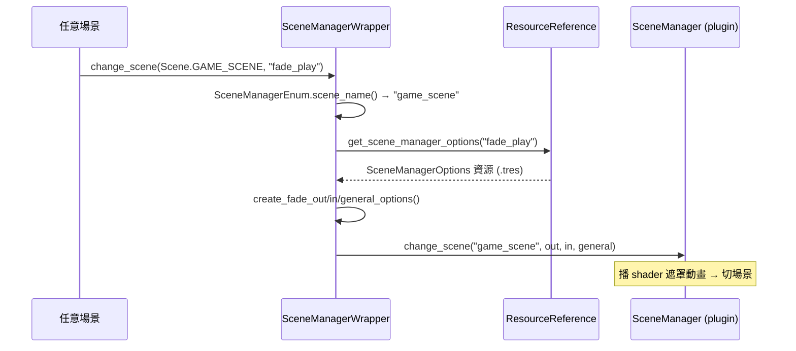
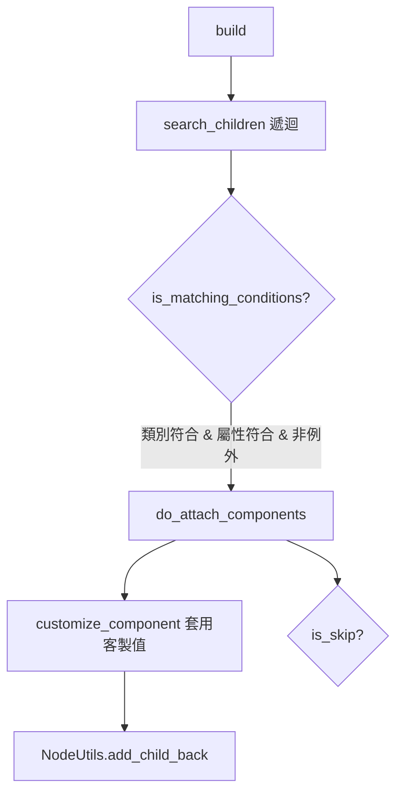

# TakinGodotTemplate — Level 3：場景流、玩法抽換與 Builder 元件注入

> 前置：先讀 `level1_overview.md`、`level2_core_modules.md` §3/§8/§9。路徑相對於 `projects/TakinGodotTemplate/`。

本層深入三件事：① 用 Wrapper + Resource 驅動的場景轉場、② GameScene 如何「抽換玩法」而保持框架不動、③ Builder 如何自動替 UI 注入行為元件。

---

## 1. 場景轉場：Wrapper + 預載 Options Resource

### 1.1 轉場呼叫鏈



- 入口 `SceneManagerWrapper.change_scene()`（`root/autoload/wrapper/scene_manager_wrapper/scene_manager_wrapper.gd:14-29`）。
- 場景以 **enum**（`SceneManagerEnum.Scene`）尋址，不寫裸字串；轉場參數以 **Resource id**（如 `"fade_boot"`/`"fade_play"`）從 `ResourceReference` 取出預載的 `SceneManagerOptions`。
- `SceneManagerOptions`（`resources/preload/scene_manager_options/scene_manager_options.gd`）把 fade-out/in 的速度、shader pattern（FADE/CIRCLE/CURTAINS… 共 13 種，`scene_manager_enum.gd:23-37`）、smoothness、顏色、是否可點擊、是否加入返回堆疊等打包成可重用 .tres。

> 效益：轉場風格集中在 `.tres`，美術/設計可在編輯器調整而不碰程式；程式端只記得「`fade_boot`」這類語意 id。

### 1.2 啟動轉場
BootSplashScene（主場景）`_ready()` 設好啟動圖後立即轉場到 MENU_SCENE（`root/scenes/scene/boot_splash_scene/boot_splash_scene.gd:18-23`）。`@export var scene`/`scene_manager_options_id` 讓「下一個場景」可在編輯器配置。

---

## 2. MenuScene：子選單以 visible 切換
`root/scenes/scene/menu_scene/menu_scene.gd`

- 把 MainMenu/OptionsMenu/CreditsMenu/SaveFilesMenu 全作為子節點，`_toggle(menu)` 只切 `visible`（:43-49），而非載入/卸載場景——選單間切換零延遲、零 GC。
- `_input()` 監聽 `game_pause`（Esc），不在主選單時返回主選單（:21-24）。
- 進場 `ui_builder.build()` + 播放選單音樂（:27-35）。

OptionsMenu（`.../options_menu/options_menu.gd`）同理用分頁切換 Audio/Video/Controls/Game，並能呼叫 `Configuration.reset_options(group)` 重設當前分頁（:75-77）。

---

## 3. GameScene：玩法抽換的接縫
`root/scenes/scene/game_scene/game_scene.gd`

### 3.1 動態載入 GameContent
`_load_game_content_scene()`（:68-76）：

```gdscript
game_content.queue_free()                                   # 移除編輯器佔位的 GameContent
var pck := Configuration.get_game_mode_content_scene()      # 依 GameOptions 的 GameModeListCfg
var instance := pck.instantiate()
NodeUtils.add_child_front(instance, self)                   # 放到子節點最前
game_content = instance
```

- 玩法場景來源是 `GameModeListCfg.game_content_scenes[game_mode]`（見 `level3_configuration_save_system.md` §A.5）。預設選項：0=空、1=2D Incremental Clicker（預設）、2=3D First Person Controller（`artifacts/example_3d_fp_controller/...`）。
- 切換玩法 = 在 GameOptions 改「Game Mode」下拉，無需改任何程式。

### 3.2 鴨子型別的弱耦合鉤子
GameScene 不要求 GameContent 實作特定介面，而是用 `"屬性名" in game_content` 檢查：

| 鉤子 | 行為 | 行號 |
|---|---|---|
| `_after_pause()` | 若 content 有 `player: Player` → `player.release_mouse()` | :47-50 |
| `_after_unpause()` | 抓回 `ControlGrabFocus` 焦點 + `player.capture_mouse()` | :53-60 |
| `_after_leave()` | 預留（預設空） | :63-64 |
| `_connect_signals()` | 若 content 有 `pause_menu_button` → 連到暫停 | :133-141 |

- **2D clicker** 的 GameContent（`scenes/scene/game_scene/game_content/game_content.gd`）是 `Control`，有 `pause_menu_button`、無 `player`。
- **3D FP** 的 GameContent（`artifacts/example_3d_fp_controller/scenes/game_content/game_content.gd`）是 `Node3D`，有 `%Player`，故會觸發滑鼠擷取/釋放邏輯。

> 同一份 GameScene 框架（暫停/選項/離開/存檔）同時相容 2D 與 3D 玩法，靠的就是這種鴨子型別接縫。`game_scene.gd:1-9` 的註解也明示「把 GameContent 子場景換成你自己的」。

### 3.3 暫停/離開的狀態管理
- 暫停：`get_tree().paused = true` + 切 pause_menu 可見（`_action_game_pause_menu_button`，:80-86）。
- 離開：先 `process_mode = DISABLED`，`Data.exit_save_file()` 存檔，再 `SceneManagerWrapper.change_scene(MENU_SCENE, "fade_play")`（`_action_leave_menu_button`，:120-130）。
- 退出遊戲：`Data.save_save_file()` 後 `get_tree().quit()`（:133-135）。

---

## 4. Builder：Component-Driven 的元件自動注入
`root/scenes/component/builder/builder.gd`

### 4.1 機制
Builder 是「遞迴掃描父節點下所有子孫，對符合條件者注入指定元件」的通用工具（被定位為 Godot 未來 Traits 的替代品）：



- 條件：`condition_properties`（須有屬性且值匹配）、`not_condition_properties`、`_condition_class`（限定型別）、`no_condition_classes`/`no_condition_names`（例外）。
- `customize`：對特定節點名套用元件屬性覆寫；`skip`：對特定節點名略過某元件。

### 4.2 UiBuilder 的實際配置
`root/scenes/component/builder/ui_builder/ui_builder.gd`

在 `_ready()` 以程式設定（為了清楚）：
- 目標：`_condition_class = Control` 且 `focus_mode != FOCUS_NONE`（即可被聚焦的控制項）。
- 注入元件：`TwistMotion`（滑鼠 hover/聚焦時的縮放+旋轉「果汁感」動畫）與 `ControlFocusOnHover`（滑鼠移入即抓焦點，讓鍵盤/手把與滑鼠焦點一致）。
- 例外：`Tree`、`GameButton`（自有互動）。
- 客製：`SaveFileButton`、`CodeTextEdit` 因尺寸大，調小動畫幅度（`max_motion_factor`/`max_rotation_degrees`）。

MenuScene 與 GameScene 都在 `_ready()` 呼叫 `ui_builder.build()`（`menu_scene.gd:27`、`game_scene.gd:38`）。

> 效益：任何放進選單的可聚焦控制項，自動獲得一致的 hover 動畫與控制器焦點 UX，無需逐一掛載元件——這正是 `FEATURES.md` 所稱「Controller Support：Grab UI focus」與「Juice：UI twist animation」的實作來源。

### 4.3 其他 Component 家族（`.github/docs/CODE.md:43-64`）
- **Audio**：ButtonAudio/SliderAudio/TreeAudio——監聽 UI 訊號觸發音效（focus/click/release）。
- **Control**：ControlExpandStylebox（填滿父容器）、ControlFocusOnHover、ControlGrabFocus（控制器支援）。
- **Motion**：ScaleMotion（數字標籤跳動）、TwistMotion（UI）。
- **Emitter/Tween**：ParticleEmitter（用 SubViewport 把任意場景轉成粒子）、ParticleTween（用 tween 模擬粒子）。

---

## 5. 本層關鍵接縫總結

| 接縫 | 解耦手段 | 換掉它要動什麼 |
|---|---|---|
| 場景 ↔ 轉場 plugin | Wrapper + enum + Options Resource | 只改 SceneManagerWrapper / 編輯 .tres |
| GameScene ↔ 玩法 | 鴨子型別鉤子 + GameModeListCfg PackedScene 陣列 | 做一個 GameContent 子場景並加進下拉 |
| UI 控制項 ↔ 行為（動畫/焦點/音效） | Builder 條件式元件注入 | 改 UiBuilder 的條件或注入清單 |

這三個接縫共同構成本模板「**換模組不改框架**」的可擴充性，與 Level 3 設定/存檔文件的「約定+反射自動化」相互呼應。
