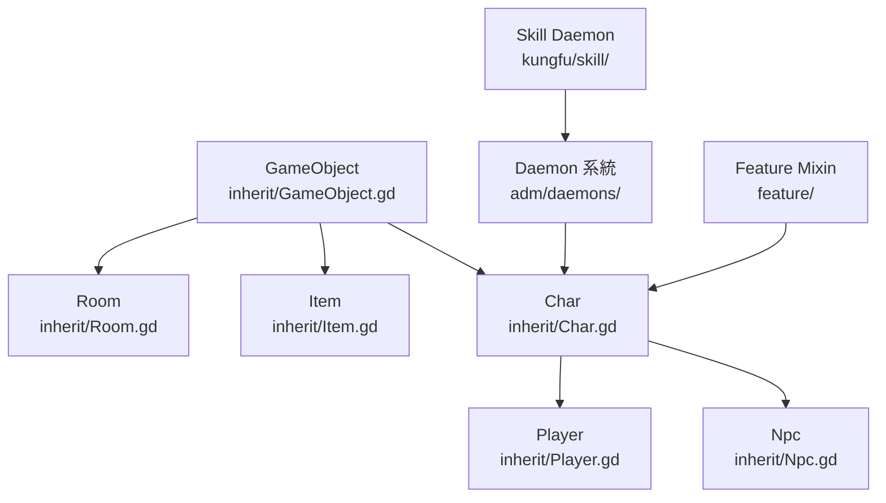
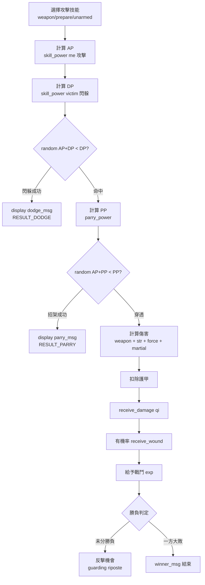
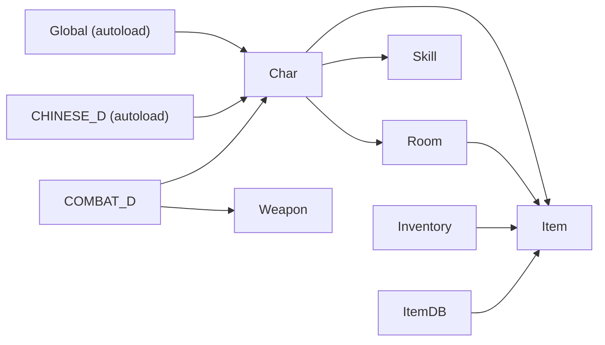

# Level 2：核心模組職責 — WuXiaAndJiangHu_Godot

> 核對於 2026-06-01，Claude Code (Sonnet 4.6)

## 整體架構：LPC MUD 移植模式

此專案的架構直接對映 LPC MUD 的三大設計支柱：



## 類別繼承層級

### `inherit/Base.gd` — 根基類
```
extends RefCounted
class_name Base
```
- 定義基礎 signal：`on_set_name`, `on_set_dec`, `on_set_tab`, `on_trigger`
- 持有 `att:=Att.new()`（屬性物件）
- 定義 `TYPE` enum：`CREATURE/MACICK/HERO/TSK`

### `inherit/GameObject.gd` — 核心物件基類
```
class_name GameObject
```
- **dbase 系統**：`dbase` dict（持久屬性） + `tmp_dbase` dict（揮發屬性）
  - `set(key, value)` / `query(key)` / `add(key, value)` — 持久讀寫
  - `set_temp(key, value)` / `query_temp(key)` / `delete_temp(key)` — 揮發讀寫
- **BBCode 顏色常數**：`HIR/HIG/HIY/RED/GRN` 等（對映 LPC ANSI 色碼，用於 RichTextLabel）
- **移動系統**：`weight`/`encumb`/`max_encumb`，`move(dest)` 物件容器轉移
- **LPC 相容層**：`mapp()`/`arrayp()`/`stringp()`/`intp()`/`undefinedp()`/`objectp()` 等型別判斷函式

### `inherit/Char.gd` — 生物角色基類
```
extends GameObject
class_name Char
```
- **F_ACTION**：忙碌狀態機（`busy`/`interrupt`/`start_busy()`/`continue_action()`）
- **F_APPRENTICE**：師徒系統（`create_family()`/`recruit_apprentice()`）
- **F_ATTACK**：戰鬥對象清單（`enemy[]`/`killer[]`/`is_fighting()`）
- **F_SKILL**：技能字典（`skills`/`learned`/`skill_map`/`skill_prepare`）
- **F_NAME**：名字系統（`set_name()`/`name()`/`short()`/`long()`）
- **heart_beat()**：心跳驅動（tick 減計數）— 大量內容仍為 TODO
- **carry_object(path)**：持有物件

### `inherit/Room.gd` — 房間基類
```
extends GameObject
class_name Room
```
- `query_max_encumbrance()` = 100,000,000,000（房間無重量上限）
- `make_inventory(file)` — 在房間中生成物件
- `reset()` — 重置房間物件（部分 TODO）
- `doors` 字典 — 出口定義

### `inherit/Item.gd`、`Weapon.gd`、`Armor.gd`、`Food.gd` 等
- 各類物品繼承 `GameObject`
- 定義 `weight`/`value`/`skill_type` 等屬性

---

## Daemon 系統（`adm/daemons/`）

LPC MUD 中 daemon 是全域服務單例，此專案以 Godot autoload 或純 `.gd` 類別實作。

| Daemon | 文件 | 職責 |
|---|---|---|
| **COMBAT_D** | `adm/daemons/COMBAT_D.gd` | 戰鬥核心：`fight()`、`do_attack()`、傷害計算、戰鬥獎懲 |
| **CHINESE_D** | `adm/daemons/CHINESE_D.gd` | 中文處理（autoload） |
| **CHAR_D** | `adm/daemons/CHAR_D.gdt` | 角色管理、屍體生成 |
| **COLOR_D** | `adm/daemons/COLOR_D.gd` | 顏色/BBCode 工具 |
| **MONEY_D** | `adm/daemons/MONEY_D.gd` | 貨幣系統（金/銀/銅錢） |
| **NAME_D** | `adm/daemons/NAME_D.gd` | 名字/稱號管理 |
| **mapd** | `adm/daemons/mapd.gd` | 地圖 daemon |
| **rankd** | `adm/daemons/rankd.gd` | 排行榜 |
| **inquiryd** | `adm/daemons/inquiryd.gd` | 詢問系統 |
| event/ | `adm/daemons/event/` | 各門派事件腳本（emei、hspb、qiantang 等） |

其餘 `.c` 文件（`autosaved.c`/`combatd.c`/`channeld.c` 等）為原始 LPC MUD daemon，保留為設計參考，尚未翻譯。

---

## Feature Mixin 系統（`feature/`）

LPC 的 `inherit F_XXX` 機制在 GDScript 中改以「直接在 `Char.gd` 內展開」或「獨立 .gd 文件」實作。

| Feature | 文件 | 職責 |
|---|---|---|
| F_ACTION | `feature/action.c` + `Char.gd` 內 | 忙碌/行動佇列 |
| F_ATTACK | `feature/attack.gd` | 敵對清單管理 |
| F_ATTRIBUTE | `feature/attribute.c` | 六圍屬性（str/int/con/dex/sta/spi/kar/per/cps/cor） |
| F_CONDITION | `feature/condition.gd` | 狀態異常（中毒/昏迷等） |
| F_DAMAGE | `feature/damage.gd` | 受傷/治療計算 |
| F_FINANCE | `feature/finance.gd` | 金錢收支 |
| F_MOVE | `feature/move.gd` | 移動/房間轉移 |
| F_TEAM | `feature/team.gd` | 隊伍系統 |
| F_VENDOR | `feature/vendor.gd` | 商販/交易 |

---

## 武學系統（`kungfu/skill/`）

每個技能都有 `.c`（原始 LPC）與 `.gd`（GDScript 翻譯）對：

| 技能 ID | 類型 | 說明 |
|---|---|---|
| blade | 兵器 | 刀法 |
| claw | 拳腳 | 爪法 |
| club | 兵器 | 棍棒 |
| cuff | 拳腳 | 鐵拳 |
| dodge | 輕功 | 閃躲 |
| finger | 內功 | 指法 |
| force | 內功 | 內力修煉 |
| hand | 拳腳 | 掌法 |
| hook | 兵器 | 鉤法 |
| parry | 防禦 | 招架 |
| staff | 兵器 | 劍法 |
| stick | 兵器 | 棍法 |
| strike | 拳腳 | 拳打 |

技能 API：
- `query_skill(skill, raw)` — 取得技能值（加 apply/temp 修正）
- `set_skill(skill, val)` — 設定技能
- `map_skill(skill, mapped_to)` — 技能映射（練了 A 自動受益於 B）
- `prepare_skill(skill, mapped_to)` — 技能預備（組合招式）
- `improve_skill(skill, amount)` — 技能成長

---

## 屬性系統（dbase 核心欄位）

### 角色基礎屬性

| 欄位 | 說明 |
|---|---|
| `str` | 膂力（影響傷害） |
| `int` | 悟性（影響學習速度） |
| `con` | 根骨（影響氣血恢復） |
| `dex` | 身法（影響躲避） |
| `sta` | 耐力（影響內力恢復） |
| `spi` | 靈性（影響武功上限） |
| `kar` | 福緣（機緣） |
| `per` | 容貌 |
| `cps` | 定力（出招破綻少） |
| `cor` | 膽識（出手成功率） |

### 戰鬥資源

| 欄位 | 說明 |
|---|---|
| `jing` / `max_jing` / `eff_jing` | 精力（目前/上限/有效上限） |
| `qi` / `max_qi` / `eff_qi` | 氣血（目前/上限/有效上限） |
| `neili` / `max_neili` | 內力 |
| `jingli` / `max_jingli` | 精氣 |
| `tili` / `max_tili` | 體力 |
| `combat_exp` | 實戰經驗 |
| `potential` | 潛能 |
| `shen` | 聲望 |

---

## 戰鬥系統（COMBAT_D 核心流程）

`adm/daemons/COMBAT_D.gd::do_attack(me, victim, weapon, attack_type, msg)`



### AP/DP/PP 計算公式
```
power = (skill_level / 6) * level * level
AP = (power + combat_exp) / 80 * (str + base_str)
DP = (power + combat_exp) / 80 * (dex + base_dex)
```

---

## 背包系統（`inventory/`）

- `Inventory.gd` / `Inventory.tscn` — 背包 UI 主體
- `GridBackpack.gd` — 格狀背包邏輯
- `EquipmentSlots.gd` — 裝備欄
- `ItemDB.gd` / `ItemDB.tscn` — 物品資料庫
- `ItemBase.tscn` — 物品基礎場景

---

## 資料持久化（`data/`）

- `data/user/` — 玩家存檔（JSON + `.gd`）
- `data/shop/` — 各城市商店資料（`.o` = LPC 序列化）
- `data/zhangmen/` — 各門派掌門資料（`.o`/`.json`）
- `data/login/` — 登入相關
- `data/npc/boss/` — Boss NPC 存檔

`Global.gd::save_game()` 以 `get_nodes_in_group("Persist")` 遍歷場景樹中所有標記為 Persist 的節點，逐一呼叫其 `save()` 函式並以 JSON 寫入 `user://savegame.save`。

---

## 模組耦合圖



**耦合點**：
1. `Char.gd` 透過 `query/set` dict 介面存取所有屬性 — 低耦合但無型別安全
2. `COMBAT_D` 直接呼叫 `me.query_skill()`/`victim.receive_damage()` — 雙向依賴
3. `Global` 是純工具 autoload（無狀態依賴）
4. 技能 daemon 模式：`SKILL_D(skill_name)` 以路徑字串動態載入（LPC 風格，GDScript 中尚未完全實作）
