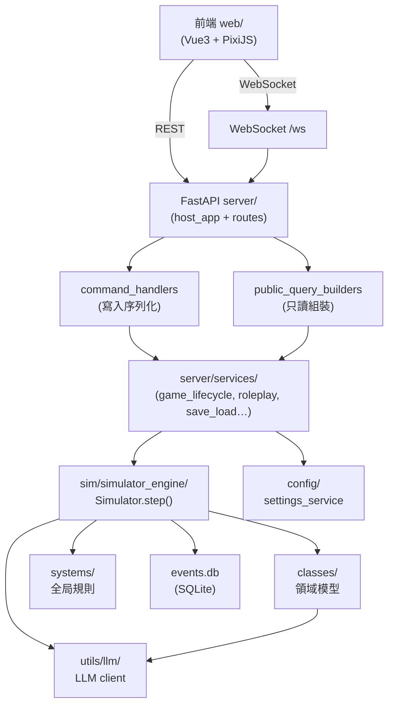
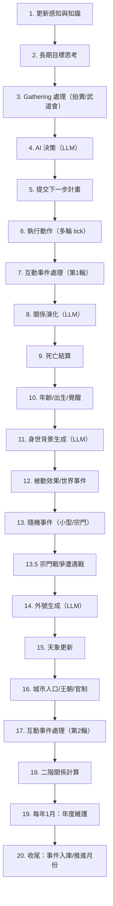
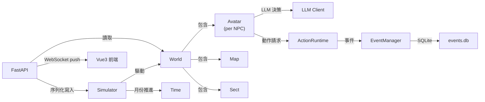

# Level 2：核心模組職責 — cultivation-world-simulator

> 核對於 2026-06-01，對應版本 v3.4.0

---

## 一、整體分層架構

---

## 二、各模組職責

### 2.1 `src/server/` — 應用層（16 + 19 檔案）

| 子模組 | 職責 |
|---|---|
| `main.py` | 唯一入口：組裝所有依賴、掛載路由、啟動 Uvicorn |
| `host_app.py` | FastAPI 應用工廠、lifespan 建立、路由掛載 |
| `command_handlers.py` | 所有寫入指令的協調器（序列化入口） |
| `public_query_builders.py` | 查詢回應組裝器（只讀，無副作用） |
| `loop_runtime.py` | 遊戲循環驅動（`run_game_loop_forever`）、WebSocket tick 推送 |
| `init_flow.py` + `init_runtime.py` | 新遊戲初始化流程（分相位、帶進度更新） |
| `services/game_lifecycle.py` | `start_game` / `reinit_game` 生命週期管理 |
| `services/game_queries.py` | 讀取 runtime 狀態的查詢函數 |
| `services/roleplay_service.py` | 角色扮演模式的 runtime 接管（不進存檔） |
| `services/save_load_control.py` | 存讀檔控制（JSON + SQLite 事件庫） |
| `services/avatar_control.py` | 動態新增/刪除/調整角色 |
| `api/public_v1/` | RESTful query/command 路由定義（v1 穩定命名空間） |
| `runtime/session.py` | `GameSessionRuntime`：包裝 game_instance dict |
| `assemblers/` | 宗門/朝代/凡人詳情頁 DTO 組裝 |
| `auto_save.py` | 定時自動存檔觸發 |

**關鍵設計**：`game_instance` 是一個普通 Python `dict`，作為全局共享狀態容器；所有寫入必須透過 `command_handlers` 序列化，禁止在路由層直接操作。

---

### 2.2 `src/sim/` — 模擬引擎（16 + 4 檔案）

| 子模組 | 職責 |
|---|---|
| `simulator_engine/simulator.py` | `Simulator.step()`：一個月的 20 相位推進 |
| `simulator_engine/context.py` | `SimulationStepContext`：步驟共享狀態（events 列表、living_avatars） |
| `simulator_engine/finalizer.py` | 步驟收尾：事件入庫、推進月份 |
| `simulator_engine/phases/` | 各相位實作（actions, annual, lifecycle, sect_war, social, world） |
| `managers/avatar_manager.py` | 角色集合 CRUD、可觀察範圍查詢 |
| `managers/sect_manager.py` | 宗門勢力快照計算 |
| `managers/event_manager.py` | 事件 in-memory 快取 + SQLite 持久化 |
| `managers/mortal_manager.py` | 凡人（非修士）管理 |
| `managers/deceased_manager.py` | 已故角色檔案（不受 cleanup 影響） |
| `save/` + `load/` | 存/讀檔 mixin（JSON 序列化、跨對象引用只存 ID） |

#### 模擬迴圈 20 相位（每回合 = 1 個遊戲月）

---

### 2.3 `src/classes/` — 領域模型（~180 檔案）

#### 核心實體

| 模組 | 關鍵類別 | 說明 |
|---|---|---|
| `core/world.py` | `World` | 世界狀態容器：Map + 時間 + 各 Manager + 宗門外交 |
| `core/avatar/core.py` | `Avatar` | 角色核心：境界、靈根、性格、記憶、關係、動作、效果 |
| `core/sect.py` | `Sect` | 宗門：設定/功法/成員/經濟/地盤 |
| `core/dynasty.py` | `Dynasty` | 凡人王朝：皇帝/官制/朝廷體系 |
| `core/orthodoxy.py` | `Orthodoxy` | 正統/道統 |

#### 動作系統（`action/` 43 檔案）

每個動作均需實作：
- `ACTION_NAME_ID / DESC_ID / REQUIREMENTS_ID / EMOJI / PARAMS`
- `can_possibly_start(avatar, world)` 前置條件
- `execute(avatar, world)` 執行邏輯
- 用 `@register` 裝飾器註冊，`__init__.py` 必須導入

常見動作類型：`meditate`（修煉）、`attack`（攻擊）、`move_to_region`（移動）、`buy/sell`（交易）、`retreat`（閉關）、`refine`（煉丹）、`hunt/harvest/mine/plant`（生活技能）

#### 互動動作（`mutual_action/` 14 檔案）

需要目標對象的動作：`conversation`（對話）、`spar`（切磋）、`confess`（告白）、`dual_cultivation`（雙修）、`swear_brotherhood`（結拜）、`gift`（贈禮）、`impart`（傳功）、`attack`（攻擊）

#### 效果系統（`effect/`）

角色加成/減益效果（增益/減益 buff），包含：
- `effect/consts.py`：效果 ID 常量
- `effect/mixin.py`：角色效果 mixin
- `effect/process.py`：效果觸發/結算

#### 社交系統（`relation/`）

- `relation.py`：雙向關係實體（friendliness -100~100）
- `relation_resolver.py`：LLM 解析互動影響 → friendliness delta
- `relation_delta_service.py`：固定值 delta（告白/結拜/攻擊）

---

### 2.4 `src/systems/` — 全局規則（16 + 7 檔案）

| 模組 | 職責 |
|---|---|
| `cultivation.py` | 修為境界定義（`REALM_ORDER`、`Realm` enum）、突破規則 |
| `battle.py` | 勝率計算（靈根克制、境界差、武器加成） |
| `tribulation.py` | 天劫系統 |
| `time.py` | 年月制時間（`Year`、`Month`、`MonthStamp`） |
| `dynasty_generator.py` | 王朝/皇帝生成 |
| `fortune.py` | 奇遇/天災系統 |
| `sect_relations.py` | 宗門關係計算（加成/外交/戰爭） |
| `sect_decision_context.py` | 宗門年度決策上下文 |
| `sect_random_event.py` | 宗門隨機事件（LLM 生成） |
| `random_minor_event*.py` | 小型隨機事件（抽取 + LLM 展開） |
| `single_choice/` | 有限選擇框架（roleplay 決策點、一次性選擇） |

---

### 2.5 `src/utils/llm/` — LLM 客戶端（6 檔案）

| 模組 | 職責 |
|---|---|
| `client.py` | 核心入口：`call_llm` / `call_llm_json` / `call_llm_with_template` / `call_llm_with_task_name` |
| `config.py` | `LLMMode`（NORMAL / FAST）、`LLMConfig`、`get_task_mode` |
| `prompt.py` | 模板載入 + `build_prompt(template, infos)` |
| `parser.py` | JSON 解析（`parse_json`，處理 LLM 非標準輸出） |
| `exceptions.py` | `LLMError`、`ParseError` |

**關鍵設計**：
- 使用 `asyncio.Semaphore` 控制並發數（由 `settings.max_concurrent_requests` 決定）
- LLM 呼叫以 `asyncio.to_thread` 包裝同步 urllib 成異步
- 按任務名稱自動選擇 NORMAL/FAST 模式（`static/config.yml llm.default_modes`）
- 支援 OpenAI 相容接口 + Anthropic 原生接口，無第三方 SDK 依賴
- 錯誤分類（`LLMFailureKind`）：CONFIG_REQUIRED / RATE_LIMITED / TEMP_NETWORK / PROVIDER_UNAVAILABLE / PARSE_ERROR

---

### 2.6 `src/config/` — 設定服務（4 檔案）

| 模組 | 職責 |
|---|---|
| `settings_service.py` | 讀寫 `settings.json` + `secrets.json`，提供 settings view / LLM config |
| `settings_schema.py` | Pydantic 設定 schema（SettingsView、LLMProfile） |
| `data_paths.py` | 數據根目錄管理（`$CWS_DATA_DIR` 或預設路徑） |

---

### 2.7 `src/i18n/` — 國際化（3 檔案）

- `locale_registry.py`：語言清單管理（讀取 `registry.json`）
- `template_resolver.py`：i18n 模板解析（Python 側 prompt 多語言）
- 前端走 Vue-i18n，後端走 gettext `.mo`

---

## 三、耦合點與資料流

**主要耦合點**：
1. `Simulator.step()` 是唯一合法的世界狀態推進者，所有外部寫入需在 step 間隙序列化
2. LLM 呼叫分散在多個 Phase（AI 決策、關係演化、外號生成、隨機事件），皆透過 `utils/llm/client.py` 統一管控
3. 事件系統是各模組的解耦介面：動作/宗門/社交結果均以 `Event` 物件傳遞，由 `EventManager` 統一入庫
4. `game_instance`（dict）是 server 層的全局共享狀態，`world` / `sim` / `run_config` 等關鍵引用都掛在其上

---

## 四、小結

| 層級 | 模組 | 核心角色 |
|---|---|---|
| 呈現層 | `web/` | Vue3 + PixiJS，後端驅動架構 |
| API 層 | `server/api/` | RESTful query/command + WebSocket |
| 服務層 | `server/services/` | 生命週期、roleplay、存讀檔協調 |
| 領域層 | `classes/` | Avatar、Sect、World、Action、Item 等業務邏輯 |
| 引擎層 | `sim/simulator_engine/` | 月份推進、20 相位編排 |
| 規則層 | `systems/` | 修為、戰鬥、時間、宗門、事件等全局規則 |
| 基礎設施 | `utils/llm/`、`config/`、`i18n/` | LLM 客戶端、設定管理、國際化 |
