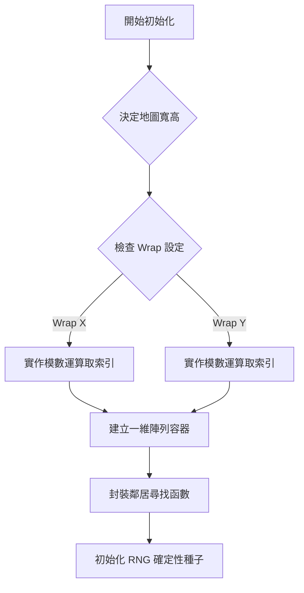

# 復刻階段 1：基礎設施與拓樸學 (Infrastructure & Topology)

在復刻地圖生成之前，必須先建立一個能理解「世界形狀」的網格系統。Freeciv 的強大之處在於它支持圓柱體（左右繞回）與環面（上下左右繞回）的地圖。

## 1. 核心流程圖 (Mermaid)



## 2. 原始碼參考點
- `common/map.h`: 定義了座標轉換與索引巨集。
- `server/generator/mapgen_topology.c`: 初始化地圖維度與包裹屬性。

## 3. 詳細偽代碼實作

### 2D 座標與一維索引的轉換
為了記憶體效能，我們始終使用一維陣列儲存數據。

```python
# 參考原始碼中的 native_pos_to_tile
def get_index(x, y, width, height, wrap_x, wrap_y):
    # 處理繞回 (如圓柱形地圖)
    if wrap_x:
        x = x % width
    if wrap_y:
        y = y % height
        
    # 如果不繞回且超出邊界，則回傳非法標記
    if x < 0 or x >= width or y < 0 or y >= height:
        return -1 
        
    return y * width + x
```

### 鄰居走訪器 (Iterator)
這是地圖生成中被呼叫最多次的函數。

```python
# 參考原始碼中的 adjc_iterate 巨集邏輯
def get_neighbors(index, grid_config):
    x, y = get_xy(index)
    neighbors = []
    
    # 包含對角線的 8 個方向
    for dx in [-1, 0, 1]:
        for dy in [-1, 0, 1]:
            if dx == 0 and dy == 0: continue
            
            neighbor_idx = get_index(x + dx, y + dy, 
                                     grid_config.width, 
                                     grid_config.height,
                                     grid_config.wrap_x,
                                     grid_config.wrap_y)
            if neighbor_idx != -1:
                neighbors.append(neighbor_idx)
    return neighbors
```

## 4. 工程精華
- **確定性隨機 (RNG)**: 必須使用具備 `seed` 功能的生成器。Freeciv 在 `map_fractal_generate` 第一步就是 `fc_srand(seed)`。
- **展平記憶體**: 使用一維陣列（如 `int height_map[width * height]`）能最大化 CPU 快取利用率，這在需要頻繁走訪鄰居的地圖生成中效能差異巨大。
