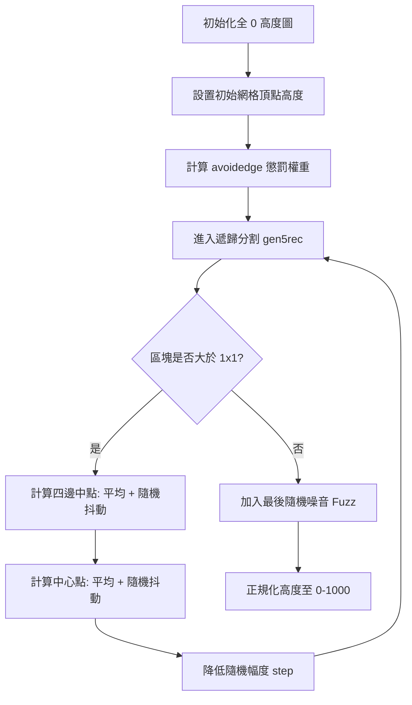

# 復刻階段 2：高度圖生成 (Heightmap Generation)

高度圖是世界的「骨架」。Freeciv 使用了一種改良的遞歸中點位移演算法。

## 1. 核心流程圖 (Mermaid)



## 2. 原始碼參考點
- `server/generator/height_map.c`: `make_pseudofractal1_hmap` 與 `gen5rec`。

## 3. 詳細偽代碼實作

### 遞歸核心：中點抖動 (`gen5rec`)

```python
# 參考原始碼中的 gen5rec 函數
def recursive_subdivide(x_left, y_top, x_right, y_bottom, current_jitter):
    # 終止條件：矩形太小
    if (x_right - x_left <= 1) and (y_bottom - y_top <= 1):
        return

    # 1. 取得四個角落的高度
    tl = get_height(x_left, y_top)
    tr = get_height(x_right, y_top)
    bl = get_height(x_left, y_bottom)
    br = get_height(x_right, y_bottom)

    # 2. 計算中點坐標
    mid_x = (x_left + x_right) // 2
    mid_y = (y_top + y_bottom) // 2

    # 3. 設定四邊中點高度 (平均值 + 隨機位移)
    # 偏移公式：rand(jitter) - jitter/2
    set_height(mid_x, y_top,    (tl + tr) / 2 + random_jitter(current_jitter))
    set_height(mid_x, y_bottom, (bl + br) / 2 + random_jitter(current_jitter))
    set_height(x_left, mid_y,   (tl + bl) / 2 + random_jitter(current_jitter))
    set_height(x_right, mid_y,  (tr + br) / 2 + random_jitter(current_jitter))

    # 4. 設定中心點高度
    set_height(mid_x, mid_y, (tl+tr+bl+br)/4 + random_jitter(current_jitter))

    # 5. 遞歸细分，隨機幅度衰減為 2/3 (這是 Freeciv 的精確整數除法實作)
    next_jitter = 2 * current_jitter // 3
    recursive_subdivide(x_left, y_top, mid_x, mid_y, next_jitter)
    recursive_subdivide(mid_x, y_top, x_right, mid_y, next_jitter)
    recursive_subdivide(x_left, mid_y, mid_x, y_bottom, next_jitter)
    recursive_subdivide(mid_x, mid_y, x_right, y_bottom, next_jitter)
```

## 4. 極致細節剖析
- **邊緣懲罰 (`avoidedge`)**: 在初始網格點設定時，如果 `near_singularity(ptile)` (靠近不可包裹的邊界)，高度會被減去 `avoidedge`。這導致邊界必然是深海，確保了大陸塊會集中在中心。
- **極地扁平化 (`flatpoles`)**: 實作中會檢查 `map_colatitude(ptile)`，若在極地區域，高度會被乘以 `(100 - flatpoles) / 100`，這能防止生成橫跨南北極的超級大陸。
- **噪音疊加**: 在遞歸結束後，Freeciv 執行了 `8 * hmap(ptile) + rand(4) - 2`，這能為原本平滑的分形增加微小的細節紋理。
