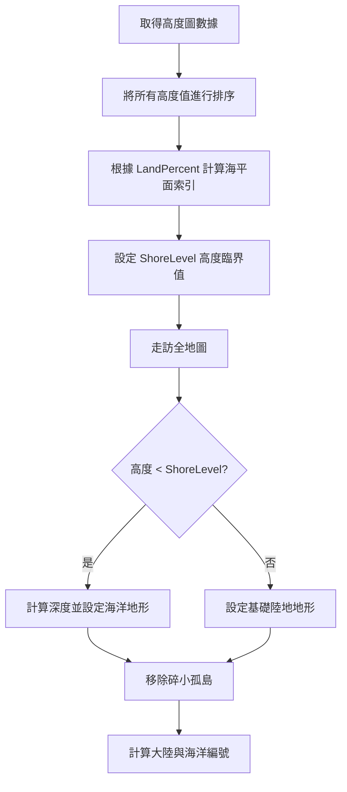

# 復刻階段 3：海平面與陸地劃分 (Shoreline & Landmass)

有了高度圖後，下一步是定義哪裡是水，哪裡是土。Freeciv 使用「分位數」的概念來精確控制陸地比例。

## 1. 核心流程圖 (Mermaid)



## 2. 原始碼參考點
- `server/generator/mapgen.c`: `make_land()`。
- `common/maphand.c`: `assign_continent_numbers()`。

## 3. 詳細偽代碼實作

### 精確的海平面計算
為了讓玩家設定的「30% 陸地」是精準的，我們不能用機率，而是要用排序。

```python
# 參考原始碼中的 hmap_shore_level 計算邏輯
def calculate_shore_level(height_map, land_percent):
    # 1. 複製高度圖並排序
    sorted_data = sorted(height_map)
    
    # 2. 找到分界點 (例如：如果 70% 是海，就取索引 70% 處的高度)
    shore_index = int(len(sorted_data) * (100 - land_percent) / 100)
    return sorted_data[shore_index]
```

### 陸地與海洋的初步分配

```python
def distribute_land_and_sea(grid, shore_level):
    for i in range(grid.size):
        h = grid.height_map[i]
        
        if h < shore_level:
            # 海洋：根據高度差決定深度 (深海 vs 淺灘)
            depth_ratio = (shore_level - h) / shore_level
            if depth_ratio > 0.5:
                grid.terrain_map[i] = "DEEP_OCEAN"
            else:
                grid.terrain_map[i] = "SHALLOW_OCEAN"
        else:
            # 陸地：暫時統一設定為陸地佔位符
            grid.terrain_map[i] = "LAND_BASE"
```

## 4. 極致細節剖析
- **海洋深度修正**: Freeciv 在設定海洋地形時，會檢查周遭鄰居的高度。如果周遭全是海洋，會進一步增加深度值，這使得生成的海洋具有明顯的「大陸棚」到「深海盆地」的過渡。
- **碎島過濾 (`remove_tiny_islands`)**: 系統會搜尋只有 $1 \times 1$ 大小的陸地，並將其強行轉化為海洋。這對於優化 AI 尋路和防止地圖過於細碎至關重要。
- **大陸編號 (`MAP_NCONT`)**: 這是 Freeciv 的重要特性。透過洪氾填充 (Flood Fill) 演算法，系統會為每個獨立的大陸塊分配編號。這為後續的「公平起始點分配」提供了基礎。
