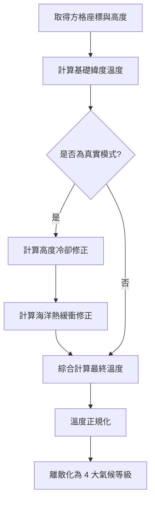

# 復刻階段 4：氣候與溫度模擬 (Climate & Temperature)

Freeciv 的氣候系統基於緯度、高度與海洋的熱緩衝效應。

## 1. 核心流程圖 (Mermaid)



## 2. 原始碼參考點
- `server/generator/temperature_map.c`: `create_tmap()`。

## 3. 詳細偽代碼實作

### 真實溫度模擬演算法

```python
# 參考原始碼中的 create_tmap(TRUE)
def simulate_temperature(grid, shore_level):
    for i in range(grid.size):
        x, y = get_xy(i)
        
        # 1. 基礎緯度 (0 = 北極, 90 = 赤道, 180 = 南極)
        # map_colatitude 回傳與赤道的夾角
        t_lat = get_colatitude(y, grid.height)
        
        # 2. 海拔降溫修正 (高度越高越冷)
        # 高度每增加，溫度最多下降 30%
        height_diff = max(0, grid.height_map[i] - shore_level)
        height_cooling = -0.3 * (height_diff / (1000 - shore_level))
        
        # 3. 海洋調節修正 (沿海地區溫度向「全域設定溫度」趨近)
        # 原始碼精確公式：
        # temperate = 0.15 * (avg_temp_setting - current_lat_temp) * (ocean_influence)
        avg_temp_ratio = grid.avg_temp_setting / 100.0 # 預設 0.5 (50%)
        lat_temp_ratio = t_lat / MAX_COLATITUDE
        
        # ocean_influence: 鄰近海洋格數越多，影響越大，最高 50 格 (MIN(50, tcn))
        # 影響倍率 = 2 * min(50, ocean_count) / 100
        influence = (2 * min(50, ocean_count)) / 100.0
        ocean_buffering = 0.15 * (avg_temp_ratio - lat_temp_ratio) * influence
        
        # 4. 最終合成 (相乘而非相加)
        grid.temp_map[i] = t_lat * (1.0 + ocean_buffering) * (1.0 + height_cooling)

    # 5. 正規化並映射到氣候帶
    # Frozen < Cold < Temperate < Tropical
    for i in range(grid.size):
        temp = grid.temp_map[i]
        if temp < 15: grid.climate[i] = "FROZEN"
        elif temp < 40: grid.climate[i] = "COLD"
        elif temp < 75: grid.climate[i] = "TEMPERATE"
        else: grid.climate[i] = "TROPICAL"
```

## 4. 極致細節剖析
- **海洋熱緩衝 (Ocean Buffering)**: 這是 Freeciv 氣候自然的關鍵。它不只是簡單的加減，而是根據當前溫度與中位溫度的差值進行插值。這防止了海邊出現極端的高溫或低溫。
- **緯度補角 (`map_colatitude`)**: 系統考慮了地圖是否為球型映射。如果是，兩極的方格代表的實際面積較小，溫度變化曲線會更陡峭。
- **雙階段生成**: 注意原始碼中會呼叫兩次 `create_tmap`。第一次是 `real=FALSE`，僅基於緯度，用於輔助初步地形分配；第二次是 `real=TRUE`，這時陸地已定型，才能計算準確的高度與海洋修正。
