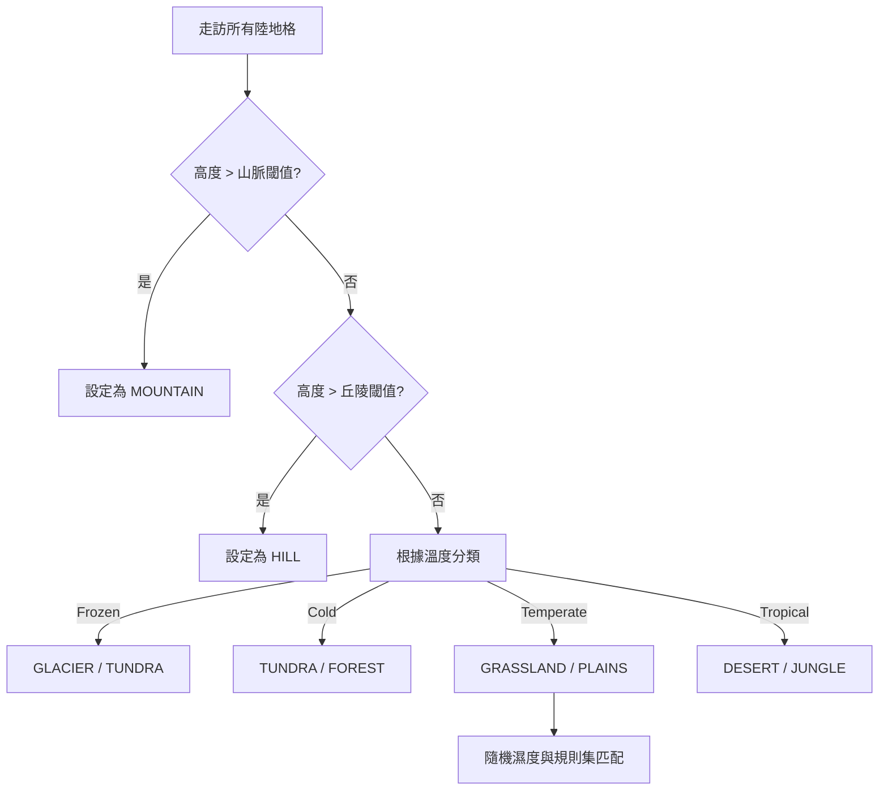

# 復刻階段 5：地形映射 (Terrain Classification)

這一步將抽象的高度與氣候數據轉化為具體的遊戲地形板塊。

## 1. 核心流程圖 (Mermaid)



## 2. 原始碼參考點
- `server/generator/mapgen.c`: `make_relief()` 與 `make_terrains()`。

## 3. 詳細偽代碼實作

### 地形決策引擎

```python
# 參考原始碼中的 make_terrains 邏輯
def classify_terrain(grid, ruleset):
    for i in range(grid.size):
        if not is_land(grid, i): continue
        
        h = grid.height_map[i]
        t = grid.climate[i] # FROZEN, COLD, TEMPERATE, TROPICAL
        w = grid.rng.random(0, 100) # 隨機濕度
        
        # 1. 垂直地貌 (優先權最高)
        if h > 850:
            grid.terrain[i] = "MOUNTAIN"
            continue
        if h > 700:
            grid.terrain[i] = "HILL"
            continue
            
        # 2. 氣候地貌 (水平分佈)
        if t == "FROZEN":
            grid.terrain[i] = "GLACIER"
        elif t == "COLD":
            grid.terrain[i] = "TUNDRA"
        elif t == "TEMPERATE":
            if w > 80: grid.terrain[i] = "SWAMP"
            elif w > 40: grid.terrain[i] = "GRASSLAND"
            else: grid.terrain[i] = "PLAINS"
        elif t == "TROPICAL":
            if w > 60: grid.terrain[i] = "JUNGLE"
            elif w > 20: grid.terrain[i] = "FOREST"
            else: grid.terrain[i] = "DESERT"
```

## 4. 極致細節剖析
- **地形起伏修正 (`make_relief`)**: Freeciv 會檢查過於平坦的區域。如果一個 $3 \times 3$ 區域內沒有任何山脈，系統會以一定機率強制將中心點提升為丘陵，這增加了戰略多樣性。
- **規則集引導 (Ruleset Driven)**: 在原始碼中，具體的地形類型並非寫死的字串，而是透過 `terrain_type_iterate` 遍歷 ruleset 檔案。這意味著你可以透過修改 `terrain.ruleset` 來新增「外星地形」而不需要修改生成器代碼。
- **森林的分佈**: 注意森林在 `COLD` 與 `TEMPERATE` 帶都有分佈。Freeciv 透過 `forest_pct` 參數來控制森林在全球的總覆蓋率，並優先將其放置在「非極端」溫度的地區。
