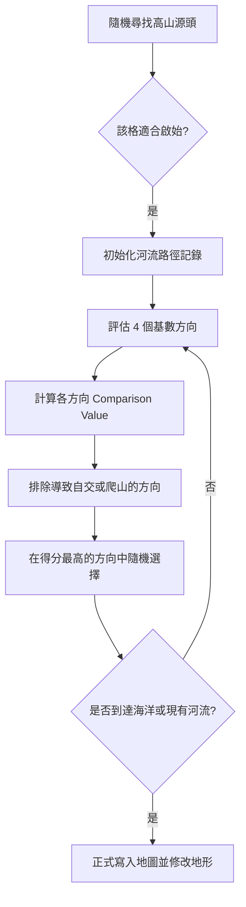

# 復刻階段 6：河流系統 (River Systems)

河流生成是 Freeciv 地圖生成中最具智慧的部分，它模擬了水流的物理傾向。

## 1. 核心流程圖 (Mermaid)



## 2. 原始碼參考點
- `server/generator/mapgen.c`: `make_rivers()` 與 `make_river()`。

## 3. 詳細偽代碼實作

### 河流方向評估引擎

```python
# 參考原始碼中的 river_test_... 系列函數
def evaluate_river_direction(current_tile, next_tile, river_path):
    # 原始碼中使用 "越低越好" 的 Comparison Value 邏輯
    
    # 1. 阻擋與死路測試 (Fatal)
    # 如果該格已在路徑中，或是所有 cardinal 鄰居都已被佔用 (即進去後無路可走)，則判定為阻擋
    if is_blocked(next_tile) or next_tile in river_path:
        return float('inf')
        
    if all_cardinal_neighbors_blocked(next_tile):
        return float('inf') # 死路預判 (參考 river_test_blocked 實作)
        
    # 2. 河流格測試 (避免 2x2 網格)
    if count_river_neighbors(next_tile) > 1:
        return 1 # 稍微不利
    
    # 3. 高山/高度測試
    # 如果是山脈則返回 1 (不利)，否則返回 0 (有利)
    score_highland = get_terrain_property(next_tile, "MOUNTAINOUS")
    
    # 4. 海洋與現有河流吸引力 (100 - 鄰近數量)
    # 鄰近數量越多，score 越小 (越有利)
    score_ocean = 100 - count_ocean_neighbors_near_tile(next_tile)
    score_river = 100 - count_river_neighbors_near_tile(next_tile)
    
    # 5. 高度圖直接映射 (河流傾向流向低處)
    score_height = get_hmap_value(next_tile) # 直接回傳高度圖值 (0-1000)
    
    # 注意：原始碼會依序執行 9 個測試函數，
    # 每個函數都會篩選出當前得分最低的方向進入下一輪測試。
    return {
        "highland": score_highland,
        "ocean": score_ocean,
        "river": score_river,
        "height": score_height
    }
```

## 4. 極致細節剖析
- **水源篩選**: 系統不會隨便找個地方就開始畫河。它會避開極地 (`TT_NFROZEN`) 與低地 (`MC_NLOW`)，優先從山脈或丘陵發源。
- **地形連動修改**: 當河流確定路徑後，如果經過的地形不支援河流 (例如沙漠)，Freeciv 會呼叫 `pick_terrain_by_flag(TER_CAN_HAVE_RIVER)` 將該格強行轉化為草原。這保證了河流在視覺與邏輯上的一致性。
- **河道寬度與密度**: `desirable_riverlength` 公式是 `river_pct * 總格數 * 陸地% / 5325`。這是一個經驗公式，確保不論地圖大小，河流的視覺密度都保持舒適。
- **4-river-grid 避免**: 為了美觀，演算法會盡量避免出現 $2 \times 2$ 的河流方塊，這在評估方向時會有一項 `river_test_rivergrid` 進行扣分。
