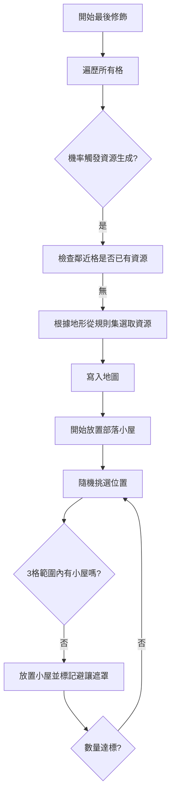

# 復刻階段 7：資源與實體分佈 (Resources & Entities)

最後階段是放置戰略資源（馬、煤、油）與玩家探索的小屋。

## 1. 核心流程圖 (Mermaid)



## 2. 原始碼參考點
- `server/generator/mapgen.c`: `add_resources()` 與 `make_huts()`。

## 3. 詳細偽代碼實作

### 泊松圓盤採樣實作 (避讓機制)

```python
# 參考原始碼中的 set_placed_near_pos
def place_entities_with_spacing(grid, count, min_distance):
    placed_mask = [False] * grid.size
    entities = []
    
    attempts = 0
    while len(entities) < count and attempts < 1000:
        idx = grid.rng.random(0, grid.size - 1)
        
        # 檢查該位置是否已被標記為「避讓區」
        if not placed_mask[idx] and is_land(grid, idx):
            place_entity(grid, idx)
            entities.append(idx)
            
            # 將周圍半徑內的方格全部標記為「不可放置」
            mark_exclusion_zone(grid, placed_mask, idx, min_distance)
        
        attempts += 1
```

## 4. 極致細節剖析
- **資源與地形的聯動**: 資源不是隨機放的。`pick_resource(pterrain)` 會查詢地形定義，例如「魚」只能放在海洋，「石油」可能放在沙漠或海洋。這由 `terrain.ruleset` 中的 `resource_...` 列表決定。
- **海洋資源的安全性 (`ocean_resources`)**: 預設情況下，Freeciv 會避免在玩家初期無法到達的「深海中央」放置過多資源。它會檢查 `near_safe_tiles(ptile)`，優先在海岸線 1 格內放置魚類。
- **部落小屋的延遲結算**: 注意在原始碼中，`make_huts` 只是在地圖上放了一個標籤。具體的「小屋裡面有什麼」並不在地圖生成階段決定，而是在玩家單位進入該格時，由 `server/unittools.c` 動態計算。這是一個優秀的設計，減少了地圖存檔的大小。
- **資源密度調節 (`riches`)**: `riches` 參數是千分比。如果 `riches` 是 100，則每格有 10% 機率嘗試生成資源，這讓遊戲節奏可以從「貧瘠」調整到「極度富饒」。
