# godot-demo-projects — Level 1 初始探索：定位、版本與整體結構

## 專案基本資訊

| 項目 | 內容 |
|---|---|
| 類型 | Godot **官方範例專案集合**（非單一應用程式） |
| 原始倉庫 | `github.com/godotengine/godot-demo-projects`（純文字記錄，未以 submodule 嵌入） |
| 授權 | MIT（見 `LICENSE.md`） |
| 主流引擎版本 | **Godot 4.6**（少數 demo 標記 4.5 或 4.7，見下方版本統計） |
| demo 總數 | **137 個** `project.godot`（其中 136 個各自獨立的 demo，加上 `plugins/` 1 個彙整多個 addon 的專案），分布於 13 個頂層分類 |
| 線上預覽 | 多數 demo 已匯出至 GitHub Pages（瀏覽器可玩） |

> 與單一專案不同：這個 repo **沒有單一架構**。它是「分類編目 + 各自獨立可執行」的教學素材庫。本分析的策略是「分類全貌（Level 2 目錄）+ 少數代表 demo 深入（details/）」，而非描述單一系統。

---

## 核心觀念：每個資料夾就是一個獨立專案

`README.md:3-5` 明確說明：**任何含有 `project.godot` 檔案的資料夾都是一個獨立的 demo 專案**，需用 Godot 引擎個別開啟。

因此 repo 的結構是兩層：

- 第一層：**分類資料夾**（`2d/`、`3d/`、`audio/`…），本身不是專案。
- 第二層：**各 demo 資料夾**（`2d/platformer/`、`compute/texture/`…），每個都有自己的 `project.godot`、`icon`、`README.md`、`screenshots/`。

唯一例外是 `plugins/`：它本身就是**一個**專案（`plugins/project.godot`），底下用 `addons/` 收納多個編輯器插件 demo，方便集中展示。

---

## 頂層分類結構（13 類）

```mermaid
graph TD
    ROOT[godot-demo-projects]
    ROOT --> A["2d/ — 26 demo<br/>2D 玩法、渲染、導航、TileMap"]
    ROOT --> B["3d/ — 32 demo<br/>3D 渲染、物理、光影、GI、LOD"]
    ROOT --> C["audio/ — 9 demo<br/>音效、頻譜、MIDI、語音"]
    ROOT --> D["compute/ — 3 demo<br/>Compute Shader / Compositor"]
    ROOT --> E["gui/ — 14 demo<br/>Control、主題、i18n、文字"]
    ROOT --> F["loading/ — 6 demo<br/>場景切換、執行緒、存讀檔"]
    ROOT --> G["misc/ — 12 demo<br/>視窗、輸入、座標、雜項"]
    ROOT --> H["mobile/ — 4 demo<br/>觸控、感測器、IAP"]
    ROOT --> I["mono/ — 6 demo<br/>C# 版範例"]
    ROOT --> J["networking/ — 7 demo<br/>WebSocket、WebRTC、Multiplayer"]
    ROOT --> K["plugins/ — 1 專案<br/>多個編輯器插件 addon"]
    ROOT --> L["viewport/ — 7 demo<br/>SubViewport、分割畫面"]
    ROOT --> M["xr/ — 10 demo<br/>OpenXR / WebXR / Mobile VR"]
```

各分類 demo 數量與「想學 X 看哪個 demo」的完整查表，見 **`architecture/level2_catalog.md`**（核心交付物）。

---

## Godot 版本統計（依 `project.godot` 的 `config/features`）

| 版本 / 特性標記 | demo 數 | 備註 |
|---|---|---|
| `4.6` | 111 | 主流 |
| `4.6` + `GL Compatibility` | 13 | 相容渲染器（行動裝置 / 老硬體） |
| `4.6` + `C#` | 4 | mono 分類為主 |
| `4.7` | 2 | 較新範例 |
| `4.6` + `Forward Plus` | 2 | 高階桌面渲染器 |
| `4.6` + `Mobile` / `C#`+`Mobile` / `C#`+`Forward Plus` | 各 1 | |
| `4.5`（含 `GL Compatibility` / `Mobile`） | 2 | 尚未升版的少數 demo |

結論：**以 Godot 4.6 為基準**即可開啟絕大多數 demo；`mono/` 分類需安裝 .NET 版 Godot。

> 查詢方式（任一 demo 的版本）：開啟該 demo 的 `project.godot`，看 `config/features=PackedStringArray(...)` 第一個字串即引擎主版本。

---

## 如何執行單一 demo

因每個 demo 是獨立專案，有兩種開啟方式：

**方式 A — 個別開啟單一 demo**
1. 啟動 Godot 4.6（C# demo 需 .NET 版）。
2. 在 Project Manager 點 **Import**，選擇某 demo 資料夾內的 `project.godot`（例 `2d/platformer/project.godot`）。
3. 開啟後按 F5（或編輯器右上 ▶）執行其主場景。

**方式 B — 一次匯入全部 demo**（`README.md:17-24`）
1. 在 Project Manager 點右側 **Scan** 按鈕。
2. 選擇 repo 根資料夾（含全部分類的那層）。
3. Godot 會遞迴掃描所有 `project.godot`，把 132 個 demo 全部列入清單。

**方式 C — 瀏覽器試玩**（`README.md:27-32`）
多數 demo 已匯出至 `godotengine.github.io/godot-demo-projects/`，可直接在瀏覽器體驗（效能低於原生）。

---

## 主場景的判定

每個 demo 的進入場景定義在其 `project.godot` 的 `[application]` → `run/main_scene`。
分析或除錯某 demo 時，先讀該 demo 的 `project.godot` 確認主場景與 Autoload，再看主場景掛載的腳本。

---

## 專案類型判定（對應 SOP 模板）

依 `analysis_workflow.md` 階段三，本 repo 整體屬於 **模板 A（遊戲原始碼分析）** 為主，但因涵蓋面極廣，個別 demo 會橫跨：

- A（遊戲／渲染／物理）：`2d/`、`3d/`、`viewport/`、`compute/` 多數
- C / D（前端 GUI、網路服務）：`gui/`、`networking/`
- E（函式庫 / API 示範）：`loading/`、`misc/`、`plugins/`

因此後續 Level/details 不套單一模板，而是**每個被深入的 demo 各自標註其關注點**。
