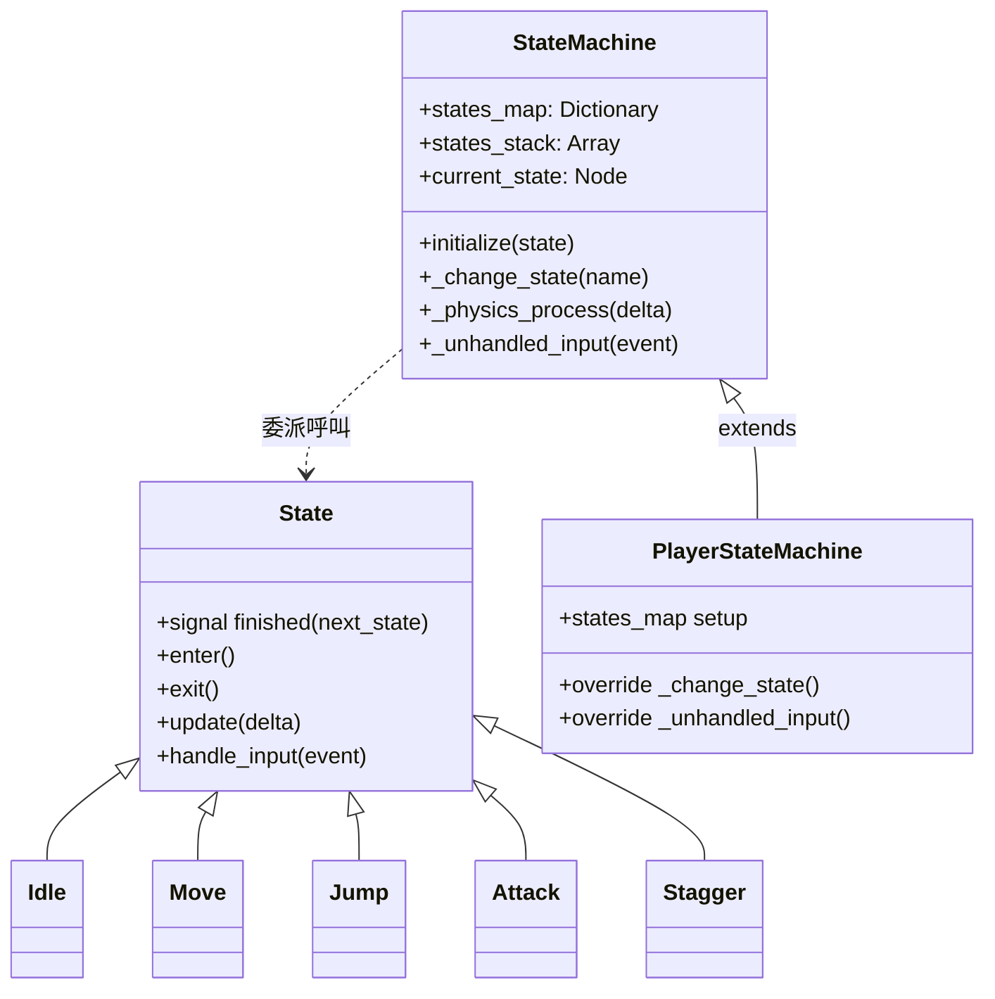

# 深入剖析：`2d/finite_state_machine`（有限狀態機設計模式）

## 為何選它
這個 demo 把「狀態機」抽象成**可重用的基礎類別**，再用繼承實作具體玩家狀態，是學習 Godot 中組織複雜角色行為的標準模式。值得對照 `2d/platformer` 的「用 if/else 選動畫」輕量做法，理解何時該升級成正式 FSM。

## 兩層設計：通用基類 + 玩家特化

## 關鍵腳本剖析

### 1. 通用狀態基類 `state_machine/state.gd`
`state.gd:1` 繼承 `Node`，定義所有狀態的**介面契約**：`enter()`、`exit()`、`handle_input()`、`update()`、`_on_animation_finished()`（`state.gd:10-28`）。本身都是空實作（`pass`），子類覆寫需要的部分。

狀態切換靠訊號：`signal finished(next_state_name: StringName)`（`state.gd:6-7`）。狀態內想轉移時 emit 這個訊號，**由狀態機決定下一步**，狀態之間不直接互相引用——這是低耦合的關鍵。

### 2. 通用狀態機 `state_machine/state_machine.gd`
`state_machine.gd:1` 繼承 `Node`，負責調度。核心機制：

- **初始化**（`state_machine.gd:24-44`）：在 `_enter_tree()` 把所有子狀態的 `finished` 訊號連到 `_change_state`（`state_machine.gd:33-36`），並決定起始狀態（`start_state` 為空就取第一個子節點，`state_machine.gd:26-32`）。
- **委派處理迴圈**：`_physics_process` 把 `update(delta)` 丟給當前狀態（`state_machine.gd:59-61`）；`_unhandled_input` 把事件丟給當前狀態（`state_machine.gd:55-57`）。狀態機自己不寫玩法邏輯，只轉發。
- **狀態堆疊（state stack）**：用 `states_stack` 支援「push 暫時狀態 → 結束後 pop 回上一個」。`_change_state` 收到 `"previous"` 就 `pop_front()` 回堆疊上一層，否則替換堆疊頂端（`state_machine.gd:70-84`）。這讓「攻擊／跳躍結束後回到原本的移動狀態」變得自然。
- **啟用開關**：`_active` 為 false 時清空堆疊並關閉 process/input（`state_machine.gd:18-22, 47-52`），用於暫停或角色死亡。

### 3. 玩家特化 `player/player_state_machine.gd`
`player_state_machine.gd:1` 直接 `extends "res://state_machine/state_machine.gd"`，示範如何擴充通用基類：

- `_ready()` 建立 `states_map`：把狀態名（StringName）對應到實際節點（`player_state_machine.gd:11-18`）。
- **覆寫 `_change_state`**（`player_state_machine.gd:21-30`）：對 `stagger/jump/attack` 這類「暫時性」狀態改用 `push_front`（壓入堆疊而非替換），結束後能 pop 回原狀態；其餘交給 `super._change_state()`。`jump` 由 `move` 進入時還會把當前速度傳給 jump 狀態（`player_state_machine.gd:27-28`），保留慣性。
- **覆寫 `_unhandled_input`**（`player_state_machine.gd:33-43`）：把「攻擊」當成可打斷任何狀態的全域輸入，在這裡攔截；其餘輸入仍委派給當前狀態。

### 4. 狀態名稱常數 `player/player_state.gd`
`player_state.gd:3-13` 用一個 `Dictionary[StringName, StringName]` 集中定義所有狀態名（idle/move/jump/attack/stagger/die…），避免散落的魔術字串、利於重構。

## 可遷移的設計重點
1. **訊號驅動轉移**：狀態 emit `finished`，由狀態機切換——狀態彼此不耦合。
2. **狀態堆疊**：暫時狀態用 push/pop，永久狀態用替換；`"previous"` 是回上一狀態的關鍵字。
3. **基類 + 特化繼承**：通用機制寫一次，遊戲特化只覆寫 `_change_state` / `_unhandled_input`。
4. **可打斷輸入上提**：把能中斷任何狀態的輸入（攻擊）放在狀態機層攔截，而非每個狀態各寫一份。

## 對照學習
- 不需正式 FSM 的輕量做法：`2d/platformer` 的 `get_new_animation()`（見 `details/demo_2d_platformer.md`）。
