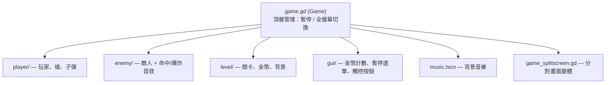

# 深入剖析：`2d/platformer`（完整 2D 平台遊戲）

## 為何選它
這是 repo 中最完整、最具教學價值的 2D 玩法 demo：包含玩家控制、跳躍手感（含二段跳、提前放開縮短跳躍）、射擊、敵人、金幣、暫停選單、背景音樂與**單人/分割畫面**兩種模式。是學「一個小遊戲怎麼組起來」的範本。

## 專案結構（功能模組化分資料夾）

主場景由 `game_singleplayer.tscn` / `game_splitscreen.tscn` 提供，掛載 `game.gd`。

## 關鍵腳本剖析

### 1. 頂層管理 `game.gd`
`game.gd:1-26` 只負責**全域輸入**：F 鍵切全螢幕、Esc 切暫停。

- 暫停用 `get_tree().paused = ...`（`game.gd:20`），並開關暫停選單；這對應 `misc/pause` demo 的核心機制。
- 用 `get_tree().root.set_input_as_handled()`（`game.gd:16,25`）避免事件被下層重複處理。

### 2. 玩家控制 `player/player.gd`（最值得讀）
`player.gd:1` 繼承 `CharacterBody2D`，是運動學角色控制器的標準範例。

移動與重力（`player.gd:28-49`）：
- 重力從專案設定讀取：`var gravity := ProjectSettings.get(&"physics/2d/default_gravity")`（`player.gd:17`）。
- 落下速度有上限：`velocity.y = minf(TERMINAL_VELOCITY, velocity.y + gravity * delta)`（`player.gd:37`）。
- 水平移動用 `move_toward(...)` 做加速度緩衝，而非瞬間到頂速（`player.gd:39-40`），手感更佳。
- 最後呼叫 `move_and_slide()`（`player.gd:49`）讓引擎處理碰撞滑移。

跳躍手感技巧（`player.gd:31-35, 79-89`）——這是本 demo 最值得學的部分：
- **提前放開縮短跳躍**：放開跳鍵且還在上升時 `velocity.y *= 0.6`（`player.gd:33-35`），按越短跳越低。
- **二段跳**：落地時把 `_double_jump_charged` 設 true（`player.gd:30`）；空中再按一次，扣掉充能、水平速度 ×2.5、音效升 pitch（`player.gd:82-85`）。

動畫狀態選擇（`player.gd:62-76`）：以 `is_on_floor()` 與 `velocity` 決定 idle/run/jumping/falling，射擊時加 `_weapon` 後綴。這是不引入完整 FSM 時的輕量做法（對比 `2d/finite_state_machine`）。

**分割畫面的多玩家輸入**：用 `action_suffix`（`player.gd:15`）讓同一腳本監聽不同 input action（如 `jump`、`jump_p2`），達成單腳本支援雙玩家（`player.gd:31,39,52`）。

### 3. 射擊與子彈生成 `player/gun.gd`
`gun.gd:1` 繼承 `Marker2D`，封裝武器邏輯。

- 用 Timer 做射速冷卻：`if not timer.is_stopped(): return false`（`gun.gd:15-16`）。
- 子彈場景 `preload` 後 `instantiate()`（`gun.gd:7,17`）。
- 關鍵技巧 `bullet.set_as_top_level(true)`（`gun.gd:21`）：讓子彈脫離槍的座標系，發射後不跟著玩家移動／旋轉。

## 可遷移的設計重點
1. **重力讀專案設定**而非寫死，方便全域調參。
2. **跳躍手感三件套**：終端速度上限、提前放開縮短、二段跳。
3. **`action_suffix` 模式**：用一個字串後綴讓同一控制腳本支援多玩家。
4. **`set_as_top_level`** 解耦投射物與發射者座標。

## 對照學習
- 物理驅動版（RigidBody2D 而非 CharacterBody2D）：`2d/physics_platformer`。
- 更正式的狀態管理：`2d/finite_state_machine`（見 `details/demo_2d_finite_state_machine.md`）。
- 3D 對應：`3d/platformer`。
