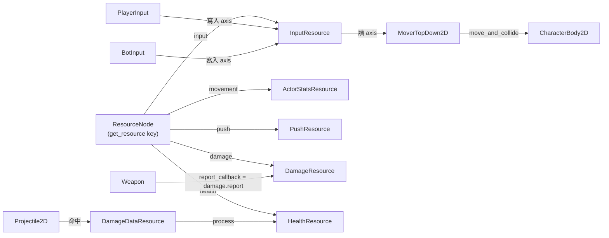

# Level 2 Analysis: 核心模組職責與架構模式

> 核對於 2026-05-25（Claude Code, Opus 4.7）：ResourceNode 模式、Mover、戰鬥鏈、啟動流程皆與源碼一致；本次修正了 `get_resource` 的鍵名與 Projectile 信號名，並補上腳本路徑與行號。

## 1. 架構核心概念：解耦與組合
Godot Game Template 採用了高度解耦的架構，核心在於**功能組件化**。

### 1.1 ResourceNode (資源依賴中介)
這是專案中最關鍵的模式。每個 Actor 或複雜組件都包含一個 `ResourceNode`，它充當「服務定位器」(Service Locator) 或「依賴注入」(DI) 的角色（`addons/great_games_library/nodes/ResourceNode/ResourceNode.gd`）。
- **組件 (Mover, Weapon, States)** 不直接互連。
- 他們透過 `resource_node.get_resource("name")` 獲取所需的數據源（`ResourceNode.gd:51`）。
- **實際使用的鍵名**（核對自源碼）：`"input"`、`"movement"`、`"push"`、`"damage"`、`"health"` 等（例：`MoverTopDown2D.gd:43,46,49`；`DamageDataResource.gd:74,82,93`）。
- **make_unique 機制**：`ResourceNodeItem.make_unique` 為真時，於 `_ready()` 以 `duplicate_deep(DEEP_DUPLICATE_ALL)` 產生每實例獨立副本，否則共享同一資源參考（`ResourceNode.gd:20-24`）。這是「同一份資源定義可被多角色實例化而互不干擾」的關鍵。

## 2. 關鍵模組剖析

### 2.1 MoverTopDown2D (移動核心)
- **檔案路徑**: `addons/top_down/scripts/actor/MoverTopDown2D.gd`
- **職責**: 
    1. 接收輸入軸 (`input_resource.axis`)，於 `_ready()` 透過 `resource_node.get_resource("input")` / `"movement"`（ActorStatsResource）/ `"push"` 取得依賴（`MoverTopDown2D.gd:43-51`）。
    2. 計算帶有加速度（無顯式摩擦力，靠 `get_impulse` 收斂至目標速度）的速度（`MoverTopDown2D.gd:84-91`）。
    3. **2.5D 模擬**: 透過 `axis_multiplier_resource`（Vector2Resource）對 velocity 做縮放再反補償（`MoverTopDown2D.gd:74,76`），並以 `axis_compensation = Vector2.ONE / value`（`:61`）還原。
    4. **碰撞處理**: 繼承自 `ShapeCast2D`，**自行覆寫** `move_and_slide(delta)`（`MoverTopDown2D.gd:127-139`，非引擎內建 CharacterBody2D 版本），並用 `_remove_overlap()` 處理節點間重疊回復（`:93-117`）。`character:CharacterBody2D` 才是實際被移動、被他人碰撞的節點。

> GDExtension 觀察：`get_impulse()`、`_remove_overlap()`、`move_and_slide()` 為每幀對所有 Actor 執行的純向量數值運算，無引擎節點樹依賴（僅最後呼叫 `character.move_and_collide`），是最適合下沉至 C++ 的熱點（呼應 `tutorial/02_gdextension_migration.md`）。

### 2.2 CharacterStates (狀態管理)
- **檔案路徑**: `addons/top_down/scripts/actor/CharacterState.gd`
- **職責**: 
    1. 根據輸入強度決定當前動畫狀態 (`IDLE`, `WALK`)。
    2. 操作 `AnimationPlayer` 進行視覺回饋。
    3. 與移動邏輯完全解耦。

### 2.3 戰鬥與傷害鏈
- **Weapon (`addons/top_down/scripts/weapon_system/Weapon.gd`)**: 負責定義傷害數據 (`damage_data_resource:DamageDataResource`)；於 `_ready()` 將 `damage_data_resource.report_callback` 指向 `resource_node.get_resource("damage").report`，串起傷害回報鏈（`Weapon.gd:23-25`）。發射邏輯則拆分至 `WeaponTrigger`、`ProjectileSpawner` 等同層組件。
- **Projectile (`addons/top_down/scripts/weapon_system/projectile/Projectile2D.gd`)**: 
    - 支援對象池化（`pool_node:PoolNode`，`Projectile2D.gd:29,42`）。
    - 透過 `prepare_exit_event` 信號 + `prepare_exit()` 函式優化生命週期管理（`Projectile2D.gd:4,34-42`）；池化時 `remove()` 呼叫 `pool_node.pool_return()` 回收而非 `queue_free()`。
- **Damage Transmission**: 傷害並非直接調用函數，而是透過 `DamageDataResource.report_callback` 回傳給發射者或中央系統（`DamageDataResource.gd:27,115-116`）。

## 3. 啟動流程 (Bootstrapping)
- **BootPreloader**: 入口場景 `addons/top_down/scenes/ui/screens/boot_load.tscn`，腳本 `addons/top_down/scripts/ui/boot_screen/BootPreloader.gd`。
- `start()` 並行完成兩條工作，雙旗標 (`saveable_resources_done` / `preload_resource_done`) 都完成才 `preload_finished.emit()`（`BootPreloader.gd:25-43`）：
    1. **材質／場景預載**: 委派 `PreloadResource.start(material_holder_node)`（`scripts/game/PreloadResource.gd`）。對 ParticleProcessMaterial / Shader / Canvas Material 各建立一個隱形節點，渲染一幀以觸發 GPU 端編譯，避免遊戲中首次出現特效時卡頓（`PreloadResource.gd:82-124`）。註：純 Shader 預編譯仍標為 TODO（`PreloadResource.gd:45-47,80`）。
    2. **數據加載**: 走訪 `PersistentData.saveable_list`，對每個 `SaveableResource` 呼叫 `load_resource()` 恢復存檔與配置（`BootPreloader.gd:41-42`）。

## 4. 資源依賴流向（核心關係）

> 重點：玩家與 AI 都只是「寫入同一個 `InputResource.axis`」的不同來源，下游移動邏輯完全共用，這是本框架解耦設計的核心（詳見 Level 3）。
