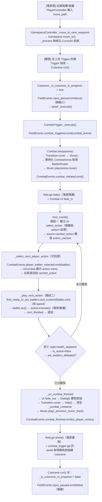

# Level 2 — 核心模組職責（Core Modules & Responsibilities）

> 目標：逐一展開三大支柱（`field`, `combat`, `common`）的入口檔案、類別責任與彼此關係；並追蹤一條完整的「觸發戰鬥」事件流。
> 分析日期：2026-04-18
> 核對於 2026-05-25（已對照當前源碼修正 Gameboard 行號標註、事件流圖改 Mermaid、補上 `interaction_selected` 的正確發送方等）

---

## 1. 全域事件匯流排 (Signal Buses)

整個專案的「控制反轉」核心是兩個 autoload 事件匯流排。任何子系統都只 emit/connect 這些 signal，彼此不互相持有引用。

### 1.1 `FieldEvents` — `src/field/field_events.gd`

| Signal | 用途 |
| :--- | :--- |
| `cell_highlighted(cell)` | 游標移動到某格 |
| `cell_selected(cell)` | 玩家點擊某格 |
| `interaction_selected(interaction)` | 玩家選中一個 Interaction（如 NPC）|
| `combat_triggered(arena)` | 【關鍵】場景態 → 戰鬥態的唯一管道 |
| `cutscene_began` / `cutscene_ended` | 過場動畫開始 / 結束 |
| `input_paused(is_paused)` | 暫停/恢復整個 field 狀態的輸入（由戰鬥、對話、過場觸發） |

> `field_events.gd:6` 設 `PROCESS_PRIORITY = 99999999`，確保此 manager 的 `_process` 在所有 Gamepieces/Controllers 之後執行，避免一幀內狀態錯亂。

### 1.2 `CombatEvents` — `src/combat/combat_events.gd`

| Signal | 用途 |
| :--- | :--- |
| `combat_initiated(arena)` | 戰鬥視覺就緒（螢幕已全黑） |
| `combat_finished(is_player_victory)` | 戰鬥結束（螢幕已黑，結果已知） |
| `player_battler_selected(battler)` | 輪到某位玩家 Battler 選擇行動 |

---

## 2. `src/field/` — 場景 / 探索狀態

### 2.1 入口：`field.gd`

見 `src/field/field.gd`。`Field` 是 **Node2D**，不是 autoload。它是主場景的根節點，負責：

1. 動態掛載 `PlayerController` 到當前玩家 Gamepiece（`field.gd:19-35`）。
2. 監聽 `Player.gamepiece_changed`，切換相機與控制器（`field.gd:19-21`）。
3. 監聽 `CombatEvents.combat_initiated/finished` 來 `hide()` / `show()` 自身，實現場景切換（`field.gd:42-43`）。
4. 啟動 `opening_cutscene`（若有指派，`field.gd:49-50`）。

### 2.2 Gameboard 子系統 — `src/field/gameboard/`

| 檔案 | 職責 |
| :--- | :--- |
| `gameboard.gd`（Autoload） | 格↔像素座標互轉（`cell_to_pixel`/`pixel_to_cell`, `gameboard.gd:39-49`）、格↔索引（`cell_to_index`/`index_to_cell`, `gameboard.gd:59-80`）、鄰格查詢（`get_adjacent_cell(s)`, `gameboard.gd:84-99`）；接收 `GameboardLayer` 並把格子加入/移除 `Pathfinder`（`_add_cells_to_pathfinder` `gameboard.gd:127-144`、`_remove_cells_from_pathfinder` `gameboard.gd:151-160`） |
| `gameboard_properties.gd` | 格子尺寸、地圖邊界（`Rect2i`） |
| `gameboard_layer.gd` | `class_name GameboardLayer extends TileMapLayer`（`gameboard_layer.gd:9`）；透過 `BLOCKED_CELL_DATA_LAYER`（`:28` `"IsCellBlocked"`）自訂資料標記阻擋格；加入 `GameboardLayer.GROUP`（`:20` `"GameboardTileMapLayers"`）後會被 `Gameboard._is_cell_clear()`（`gameboard.gd:183-195`）掃描 |
| `pathfinder.gd` | `class_name Pathfinder extends AStar2D`（`pathfinder.gd:4-5`），供 AI / 玩家移動查路（`get_path_to_cell` `pathfinder.gd:55-91`） |
| `debug/*.gd` | 可視化 debug 工具（邊界、pathfinder 節點） |

**運作流程**：地圖的 `TileMapLayer`（繼承為 `GameboardLayer`）於 `_ready` 自動呼叫 `Gameboard.register_gameboard_layer(self)`（`gameboard_layer.gd:37` → `gameboard.gd:105-121`），並在格子變化時透過 `cells_changed` signal 自動更新 `Pathfinder`，無需手動呼叫。

### 2.3 Gamepiece 子系統 — `src/field/gamepieces/`

核心三件套：

| 類別 | 檔案 | 職責 |
| :--- | :--- | :--- |
| `Gamepiece` | `gamepiece.gd` | **場景中可被格子吸附、可沿路徑平滑移動的物件**。`@tool class_name Gamepiece extends Path2D`（`gamepiece.gd:13`），透過 `$PathFollow2D`（`gamepiece.gd:103`）讓動畫與實際位置解耦，移動推進在 `_process`（`gamepiece.gd:125-151`）。 |
| `GamepieceController` | `controllers/gamepiece_controller.gd` | **控制器基底**：走 `move_path` 路徑。玩家與 AI 皆繼承此類。 |
| `GamepieceAnimation` | `animation/gamepiece_animation.gd` | Sprite 動畫播放（方向 / idle / run）。 |

派生控制器：

- `player_controller.gd` — 玩家輸入（鍵盤 + 滑鼠點擊目標格）。
- `path_loop_ai_controller.gd` — 沿預設巡邏路徑走動（NPC）。
- `cursor/field_cursor.gd` — 玩家滑鼠游標的格子吸附。

**關鍵解耦**：`Gamepiece` 本身是「笨物件」（`gamepiece.gd:6-7` 的註解寫明 *"'dumb' objects that do nothing but occupy and move about the gameboard"*），所有「主動行為」都由其子節點（controller）提供，實踐**組合優於繼承**。

#### 位置註冊

`GamepieceRegistry`（autoload）維護 `_gamepieces: Dictionary[Vector2i, Gamepiece]`（`gamepiece_registry.gd:15`）的全域位置表，signal 為 `gamepiece_moved`/`gamepiece_freed`（`gamepiece_registry.gd:11-12`）。
`Gamepiece._ready()` 中呼叫 `GamepieceRegistry.register(self, cell)` 完成註冊（`gamepiece.gd:121`；註冊前先 `await Gameboard.properties_set`，`gamepiece.gd:112-113`）。

### 2.4 Cutscene 系統 — `src/field/cutscenes/`

| 類別 | 用途 |
| :--- | :--- |
| `Cutscene` (`cutscene.gd`) | 基底類別。`run()` 時切到 `_is_cutscene_in_progress = true`，自動 emit `FieldEvents.input_paused(true)`；`_execute()` 供子類覆寫 |
| `Interaction` (`interaction.gd`) | 玩家主動互動觸發（按鍵） |
| `Trigger` (`trigger.gd`) | 玩家走上某格自動觸發 |
| `templates/` 子目錄 | 內建範本：寶箱 / 門 / 區域切換 / 戰鬥觸發 / 對話 / 拾取物 |

> **戰鬥的觸發源頭**：`templates/combat/combat_trigger.gd` 覆寫 `_execute()`，呼叫 `FieldEvents.combat_triggered.emit(combat_arena)`（`combat_trigger.gd:7-9`），並 `await CombatEvents.combat_finished` 取得勝負後跑 `_run_victory_cutscene()`/`_run_loss_cutscene()`（`combat_trigger.gd:11-25`）。`roaming_combat_trigger.gd` 則**繼承** `CombatTrigger`（`roaming_combat_trigger.gd:2`），沿用其 `_execute()`，只覆寫勝利後的 `_run_victory_cutscene()`（勝利即 `queue_free()` 移除該遭遇，`roaming_combat_trigger.gd:6-7`）。

### 2.5 UI — `src/field/ui/`

- `dialogue_window.gd` — 包裝 Dialogic 的對話視窗。
- `inventory/ui_inventory.gd` + `ui_inventory_item.gd` — 物品欄 UI。
- `popups/ui_popup.gd` — 通用彈窗。

---

## 3. `src/combat/` — 戰鬥狀態

### 3.1 入口：`combat.gd`

`Combat extends CanvasLayer`（見 `src/combat/combat.gd:26`）。頂層容器，負責整輪戰鬥流程。

**完整戰鬥回合邏輯**（`combat.gd:42-188`）：

```
setup(arena) ←─ 監聽 FieldEvents.combat_triggered（combat.gd:43-44）
  ├─ Transition.cover(0.2) // 遮黑畫面
  ├─ 實例化 CombatArena → 取得 BattlerRoster
  ├─ 播放競技場配樂
  ├─ emit CombatEvents.combat_initiated
  ├─ Transition.clear(0.2) // 淡入
  ├─ UI fade_in
  └─ next_round()

next_round()  // combat.gd:90-101
  ├─ round_count += 1
  ├─ 所有 AI 敵方 Battler 選擇 action  (battler.ai.select_action)
  └─ _select_next_player_action() // 玩家逐一選擇，可前後切換

_select_next_player_action()  // combat.gd:111-150
  ├─ 找「尚未 cached_action」的玩家 Battler
  │    空 → _play_next_action()
  │    非空 → 前推該 Battler，等待 action_cached signal
  └─ 玩家按「back」時清除 cached_action 回到上一位

_play_next_action()  // combat.gd:155-186
  ├─ 檢查敗北條件（雙方倖存）
  ├─ 找最快且仍擁有 cached_action 的 Battler
  │    空 → next_round()
  └─ 呼叫 battler.act() → turn_finished → 遞迴呼叫 _play_next_action

_on_combat_finished(is_player_victory)  // combat.gd:189-213
  ├─ UI fade_out
  ├─ 顯示 Dialogic 對話框（_display_combat_results_dialog）
  ├─ Transition.cover(0.2) → hide()
  ├─ 清空 _combat_container
  ├─ 還原先前音樂
  └─ emit CombatEvents.combat_finished(is_player_victory)
```

此流程正是 **「兩階段回合制」** 的教科書寫法：階段一選擇所有 action，階段二依 speed 排序執行。

### 3.2 `CombatArena` — 戰鬥場地容器

見 `src/combat/combat_arena.gd`。極簡：一個 `Control`，帶 `music`（AudioStream）export，並提供 `get_battler_roster()` 取得 `$Battlers` 子節點。

> 設計師只需在編輯器拖拉 Battler 節點到 `$Battlers` 下、拖個 AudioStream 進 `music`，即可定義一個新戰鬥。**無需寫任何程式**。

### 3.3 `Battler` — 戰鬥參與者 ★ 核心類別

見 `src/combat/battlers/battler.gd:9`，`Battler extends Node2D`。

**職責**：統整一個戰鬥參與者的**狀態**（stats）、**行動清單**（actions）、**動畫**（anim）與**AI**（ai）。

**關鍵設計**：

1. **Resource 原型 + 執行期複製**（`battler.gd:155-174`）
   `stats` 與 `actions` 是 `@export` 的 Resource。由於 Godot 的 Resource 實例是共享的，`_ready()` 會 `duplicate()` 它們，避免多個 Battler 共用同一份 BattlerStats。
2. **Packed Scene 驅動子節點**（`battler.gd:40-92`）
   `battler_anim_scene` 與 `ai_scene` 都是 `@export var PackedScene`。Setter 會在執行期（以及編輯器 `@tool` 階段）實例化並加到 children。**型別錯誤（不是 BattlerAnim / CombatAI）會印 warning 並自動清除**，提供強烈的設計時保護。
3. **signal 驅動的回合控制**
   `action_cached`（選好 action）、`turn_finished`（action 執行完）、`health_depleted`（死亡）、`hit_received` / `hit_missed`（受擊回饋）。
4. **靜態排序函式**（`battler.gd:143-144`）
   `Battler.sort` 依 `stats.speed` 降序排序，供 `Combat._get_next_actor()` 使用。

### 3.4 `BattlerStats` — Resource 形式的屬性 + 修飾器系統

見 `src/combat/battlers/battler_stats.gd`。`BattlerStats extends Resource`。

- **基礎屬性**：`max_health`, `max_energy`, `attack`, `defense`, `speed`, `hit_chance`, `evasion`（`battler_stats.gd:22-51`）。
- **Modifiers / Multipliers 系統**（`battler_stats.gd:68-162`）
  - 每個屬性都有兩個 dict：加算的 `_modifiers` 與乘算的 `_multipliers`。
  - 新增 `add_modifier()` / `add_multiplier()` 回傳唯一 id，可用於之後 `remove_*`（例如裝備移除）。
  - 重新計算公式：`value = max(0, round(base_value * (1 + ΣΣ multipliers) + Σ modifiers))`。
- **元素親和性**：`affinity: Elements.Types`（見 `src/combat/elements.gd`），供 `BattlerHit` 計算傷害加成。

### 3.5 `BattlerAction` — Resource 形式的戰技

目錄 `src/combat/actions/`：

| 類別 | 用途 |
| :--- | :--- |
| `battler_action.gd` | 基底 Resource，定義 `source`, `battler_roster`, `cached_targets`, `energy_cost`, `get_possible_targets()`, `execute()` |
| `battler_action_attack.gd` | 一般攻擊 |
| `battler_action_heal.gd` | 治療 |
| `battler_action_projectile.gd` | 發射物（有動畫） |
| `battler_action_modify_stats.gd` | 增益/減益 |
| `battler_hit.gd` | 單次攻擊的「打擊封包」（傷害、命中） |

Action 是 Resource 代表可當 `.tres` 檔儲存並在編輯器掛到 Battler 的 `actions` array，完全**資料驅動**。

### 3.6 `CombatAI` — 策略物件

見 `src/combat/combat_ai_random.gd`。`CombatAI extends Node` 作為基底類別，`select_action(source)` 是覆寫點。內建實作隨機選 action + 隨機挑目標（最多嘗試 `ITERATION_MAX = 60` 次）。

> Battler 透過 `ai_scene: PackedScene` 指派 AI 節點（見 `battler.gd:74-92`），**要替換 AI 策略只需製作新場景並拖拉**，不需修改 Battler。

### 3.7 `BattlerRoster` — 戰鬥名冊

見 `src/combat/battlers/battler_roster.gd`。為 `Node`，是 `CombatArena` 下的 `$Battlers` 子節點。
提供篩選 API：`get_player_battlers()`、`get_enemy_battlers()`、`find_live_battlers()`、`find_battlers_needing_actions()`、`find_ready_to_act_battlers()`、`are_battlers_defeated()`。

此設計讓 `Combat` 腳本以**宣告式**方式查詢狀態，避免散落各處的 `for battler in ...` 判斷。

### 3.8 戰鬥 UI — `src/combat/ui/`

- `ui_combat.gd` — 戰鬥主介面（綁定 roster、管理 action menu、轉場動畫）。
- `action_menu/` — 動作選擇選單。
- `battler_entry/` — 每位 Battler 的血條/能量條顯示。
- `cursors/` — 目標選擇游標。
- `effect_labels/` — 傷害數字飄字。

---

## 4. `src/common/` — 跨狀態共用服務

| 檔案 | 職責 |
| :--- | :--- |
| `player.gd`（Autoload） | 玩家全域狀態；持有 `gamepiece` 屬性，setter emit `gamepiece_changed`（`player.gd:16-20`）；另宣告 `player_path_set(gamepiece, destination_cell)` signal（`player.gd:13`，由 `PlayerController.move_along_path` emit，`player_controller.gd:99`） |
| `inventory.gd` | 物品欄邏輯（`class_name Inventory extends Resource`，`inventory.gd:3`），供 field UI 使用，並負責唯一的存檔 `user://inventory.tres` |
| `directions.gd` | `class_name Directions extends RefCounted`；四向枚舉 `Directions.Points { NORTH, EAST, SOUTH, WEST }`（`directions.gd:6`）+ `MAPPINGS`（`directions.gd:9-14`）+ `angle_to_direction()`（`directions.gd:18`） |
| `collision_finder.gd` | `class_name CollisionFinder extends RefCounted`；包裝 **`PhysicsShapeQueryParameters2D`**（以 `CircleShape2D` 半徑搜尋，`collision_finder.gd:22-33`），`search()` 呼叫 `intersect_shape` 找指定半徑內的 collider（`collision_finder.gd:39-45`） |
| `screen_transitions/screen_transition.gd`（Autoload） | `class_name ScreenTransition extends CanvasLayer`；畫面遮黑 / 淡入；`cover()`（`:65`）, `clear()`（`:47`）, `finished` signal（`:13`） |
| `music/music_player.gd`（Autoload `Music`，掛在 `.tscn` 上） | `class_name MusicPlayer extends Node`；背景音樂播放、淡入淡出（`play()` `:7`、`stop()` `:34`、`get_playing_track()` `:50`）；保存/恢復上一曲的邏輯實際在 `Combat`（`combat.gd:69-70, 207`）以 `_previous_music_track` 處理 |

`common` 下的東西都是**引擎層級的工具**，不耦合 field / combat。

---

## 5. 案例：從「踩到觸發器」到「戰鬥結束」的完整事件流

以下追蹤一次完整的狀態切換，展示整個架構如何協作。流程圖：



行號對照（相對 `projects/godot-open-rpg/`）：

| 階段 | 關鍵呼叫 | 位置 |
| :--- | :--- | :--- |
| 移動 | `PlayerController._on_cell_selected` 設 `move_path` | `player_controller.gd:128-148` |
| 移動 | `GamepieceController._move_to_next_waypoint` → `Gamepiece.move_to()` | `gamepiece_controller.gd:73-87`（`move_to` 呼叫於 `:83`） |
| 移動 | `Gamepiece._process` 沿 `Curve2D` 前進 | `gamepiece.gd:125-151` |
| 觸發 | `Cutscene.run()` → 設旗標 emit `input_paused(true)` | `cutscene.gd:45-52` → setter `cutscene.gd:30-35` |
| 觸發 | `CombatTrigger._execute()` emit `combat_triggered` | `combat_trigger.gd:7-9` |
| 切換 | `Combat` 連線 + `setup(arena)` | `combat.gd:44` + `combat.gd:50-86` |
| 切換 | `CombatEvents.combat_initiated.emit()` | `combat.gd:72` |
| 切換 | `field.gd` `hide()` 訂閱 | `field.gd:42` |
| 階段一 | 敵方 AI `select_action` | `combat.gd:94-96` + `combat_ai_random.gd:14-47` |
| 階段一 | `_select_next_player_action`（可回溯） | `combat.gd:111-150` |
| 階段一 | 玩家 `cached_action` setter emit `action_cached` | `battler.gd:137-140` |
| 階段二 | `_play_next_action` + `_get_next_actor` 依 `Battler.sort` | `combat.gd:155-176` + `combat.gd:179-186` + `battler.gd:143-144` |
| 結束 | `_on_combat_finished` emit `combat_finished` | `combat.gd:189-213`（emit 於 `:213`） |
| 結束 | `field.gd` `show()` 訂閱 | `field.gd:43` |
| 結束 | `Cutscene.run()` 末解鎖 `input_paused(false)` | `cutscene.gd:52` → setter `cutscene.gd:30-35` |

這條完整流程中，**沒有任何一個類別 hold 另一個類別的引用**（除了 Combat 對 arena 實例化後的短暫 hold）。所有跨模組通訊都走兩條 signal bus：`FieldEvents` 與 `CombatEvents`。

---

## 6. Level 2 小結與觀察

### 設計哲學三柱

1. **Signal Bus**：跨模組只透過 autoload 事件匯流排，禁止互相 `get_node()`。
2. **Composition over Inheritance**：`Battler` 的動畫與 AI 透過 `PackedScene export` 動態掛接；`Gamepiece` 的行為由多種 Controller 子節點提供。
3. **Resource-as-Template**：`BattlerStats` / `BattlerAction` 是 `.tres` 檔，設計階段可編輯、執行期 `duplicate()` 成實例，**邏輯與數據完全分離**。

### 擴展性評估

| 需求 | 擴充方式 | 需改動程式嗎？ |
| :--- | :--- | :--- |
| 新戰鬥場地 | 新 `CombatArena` 場景 + `$Battlers` 下擺 Battler | ❌ |
| 新戰技 | 繼承 `BattlerAction` 或新 `.tres` 檔 | 多半 ❌ |
| 新 AI 策略 | 繼承 `CombatAI` 做新 scene | ✔ 但隔離 |
| 新地圖 | 新 `Map` 場景，TileMapLayer 使用 `GameboardLayer` | ❌ |
| 新 Cutscene 類型 | 繼承 `Cutscene` 覆寫 `_execute()` | ✔ 局部 |

### 下一步（Level 3 建議）

- **Level 3**：Battler 生命週期與 BattlerAction execute 細節（含 BattlerHit 命中/傷害計算公式）。
- **Level 4**：Gameboard + Pathfinder 的實作細節（格子圖層、Dijkstra、阻擋計算）。
- **Level 5**：Dialogic 整合方式、Inventory 的 Resource 結構、UI 訂閱事件匯流排的模式。
- **Level 6**：實戰教學（如何新增一個新職業 / 新元素類型 / 新地圖 / 新過場動畫）。
