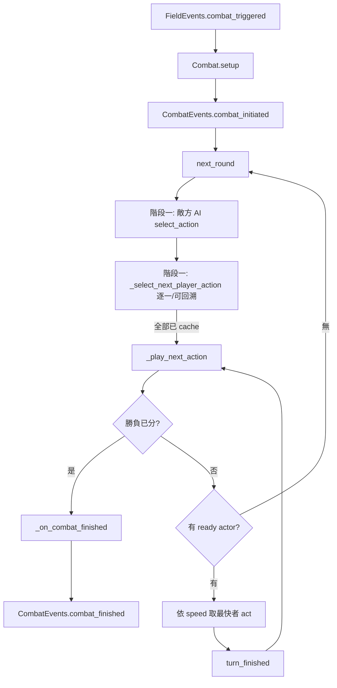

# Level 3 — 回合制戰鬥系統深度剖析（Turn-Based Combat Deep Dive）

> 模板 A（遊戲原始碼分析）／L4：戰鬥機制。
> 目標：拆解 godot-open-rpg 的「兩階段回合制」如何由 `Combat` 排程、`Battler` 執行、`BattlerAction` 結算傷害，並標註可移往 C++ GDExtension 的純邏輯點。
> 分析對象：`projects/godot-open-rpg/src/combat/`
> 分析日期：2026-05-25
> 核對於 2026-05-25（已逐行對照源碼，所有檔名/行號/公式確認正確，無需修正）

---

## 1. 戰鬥場景的物件組成

一場戰鬥由四層節點構成，職責由外而內遞減：

| 層 | 類別 | 檔案 | 角色 |
| :--- | :--- | :--- | :--- |
| 流程控制 | `Combat` (`CanvasLayer`) | `src/combat/combat.gd:26` | 整輪排程的大腦，常駐於主場景 |
| 場地容器 | `CombatArena` (`Control`) | `src/combat/combat_arena.gd:3` | 編輯器配置的競技場（背景、音樂、`$Battlers`） |
| 名冊 | `BattlerRoster` (`Node`) | `src/combat/battlers/battler_roster.gd:9` | 提供「以宣告式查詢戰鬥者」的篩選 API |
| 戰鬥者 | `Battler` (`Node2D`) | `src/combat/battlers/battler.gd:9` | 持有 stats / actions / anim / ai 的參與者 |

> **資料 vs 邏輯分離**：一個 `CombatArena.tscn` 只要在編輯器把若干 `Battler` 節點掛到 `$Battlers`（即 `BattlerRoster`）下、拖一個 `AudioStream` 進 `music`（`combat_arena.gd:6`），就完成一場新戰鬥的「資料」，無需寫任何程式碼。`Combat` 透過 `combat_arena.get_battler_roster()`（`combat_arena.gd:10-11`）拿到名冊後即接管「邏輯」。

---

## 2. 兩階段回合制的排程核心（`Combat`）

`combat.gd:1-25` 的 docstring 已寫明這是早期 JRPG 的教科書模型：**每一回合分兩階段**。

### 2.1 進入戰鬥：`setup()`

`combat.gd:50-86`，由 `FieldEvents.combat_triggered` 觸發（連線於 `combat.gd:44`）：

1. `await Transition.cover(0.2)` 遮黑畫面後 `show()` 自身。
2. `arena.instantiate()` → 加入 `_combat_container`，取得 `_battler_roster`。
3. `_ui.setup(_battler_roster)`，播放競技場配樂並保存上一首（`combat.gd:69-70`）。
4. `emit CombatEvents.combat_initiated`（`combat.gd:72`）→ field 端 `hide()`。
5. `Transition.clear.call_deferred(0.2)` 淡入、UI 播 `fade_in`。
6. `round_count = 0` 後 `next_round.call_deferred()` 交棒給回合迴圈。

### 2.2 階段一：行動選擇（Action Selection）

`next_round()`（`combat.gd:90-101`）：

- **先讓敵方 AI 選**：對每個存活敵方 `Battler` 呼叫 `battler.ai.select_action(battler)`（`combat.gd:94-96`）。
- **再讓玩家逐一選**：呼叫 `_select_next_player_action()`。

`_select_next_player_action()`（`combat.gd:111-150`）是一個**可回溯的選擇器**：

- 用 `_battler_roster.find_battlers_needing_actions(player_battlers)` 找「尚未 cache action」的玩家戰鬥者（`combat.gd:114`）。
- 若清單為空 → `emit player_battler_selected(null)` 後 `_play_next_action.call_deferred()` 進入階段二（`combat.gd:118-122`）。
- 否則取清單第一個，連上 `action_cached`（`CONNECT_DEFERRED | CONNECT_ONE_SHOT`，`combat.gd:130-145`），並 `await anim.move_forward(0.15)` 後 `emit player_battler_selected(battler)`，由 `UICombat` 接手彈出選單。
- **回溯機制**：玩家按「back」時，`UICombat` 把該 Battler 的 `cached_action` 設成 `null`（`ui_combat.gd:76`），於是 callback 偵測到 `cached_action == null`，把**前一位** Battler 的 cache 也清掉（`combat.gd:135-140`），達成「往前一位重選」。

### 2.3 階段二：行動執行（Action Execution）

`_play_next_action()`（`combat.gd:155-176`）以遞迴方式逐一執行：

1. 先檢查勝負：任一方 `are_battlers_defeated()` 成立 → `_on_combat_finished(...)`（`combat.gd:157-162`）。
2. `_get_next_actor()`（`combat.gd:179-186`）：把 `find_ready_to_act_battlers()` 的結果用 `Battler.sort` 依 `speed` **降序**排序，取最快者。
3. 若無人可行動 → `next_round()`（`combat.gd:167-169`）。
4. 否則連上 `next_actor.turn_finished`（`ONE_SHOT`）後呼叫 `next_actor.act()`；該 signal 觸發時再 `call_deferred` 回到 `_play_next_action`，形成「依速度排序、逐一行動」的串列（`combat.gd:171-176`）。

### 2.4 結束戰鬥：`_on_combat_finished()`

`combat.gd:189-213`：UI `fade_out` → Dialogic 顯示勝負對話（`_display_combat_results_dialog`, `combat.gd:217-229`）→ `Transition.cover` → `hide()` → 清空 `_combat_container` → 還原音樂 → `emit CombatEvents.combat_finished(is_player_victory)`。最後一個 signal 同時喚醒 field 端 `show()`（`field.gd:43`）與觸發器內 `await CombatEvents.combat_finished`（`combat_trigger.gd:11`）。

### 2.5 回合流程圖



---

## 3. Battler — 戰鬥者生命週期

`battler.gd:9`，`@tool class_name Battler extends Node2D`。

### 3.1 `_ready()` 的原型複製（`battler.gd:147-174`）

- `assert(stats)` 後 `add_to_group(GROUP)`。
- **關鍵**：`stats = stats.duplicate()` + `stats.initialize()`（`battler.gd:155-156`）。因為 Godot 的 Resource 實例預設共享，若不複製，多個 Battler 會共用同一份 `BattlerStats`，互相污染血量。
- 連 `stats.health_depleted` → 設 `is_active = false` / `is_selectable = false` 並轉發 `health_depleted`（`battler.gd:157-161`）。
- 對 `actions` 陣列逐一 `duplicate()`，並把 `source = self`、`battler_roster` 指好（`battler.gd:168-174`），讓每個 action 知道自己的施法者與名冊。

### 3.2 組合驅動的子節點（Composition over Inheritance）

- `battler_anim_scene`（`PackedScene`，`battler.gd:40-69`）：setter 在執行期與編輯器階段 `instantiate()`，型別檢查必須是 `BattlerAnim`，否則 `push_warning` 並自清。
- `ai_scene`（`PackedScene`，`battler.gd:74-92`）：同理，編輯器階段檢查必須是 `CombatAI`，執行期才實例化並 `add_child(ai)`。**換 AI 策略 = 換一個場景，不改 Battler。**

### 3.3 回合中的執行：`act()`（`battler.gd:178-188`）

```gdscript
func act() -> void:
    if cached_action:
        stats.energy -= cached_action.energy_cost
        await cached_action.execute()     # 幾乎一定是 coroutine（含動畫）
    cached_action = null                  # 清 cache 代表已行動
    turn_finished.emit.call_deferred()    # 通知 Combat 排下一個
```

### 3.4 受擊：`take_hit()`（`battler.gd:191-197`）

```gdscript
func take_hit(hit: BattlerHit) -> void:
    if hit.is_successful():
        hit_received.emit(hit.damage)     # UI 飄字
        stats.health -= hit.damage        # 負傷害 = 治療
    else:
        hit_missed.emit()
```

> 命中判定（`hit.is_successful()`）與傷害數值都封裝在 `BattlerHit` 內，Battler 只負責「套用」。

### 3.5 signal 介面總表

| signal | 觸發時機 | 訂閱者 |
| :--- | :--- | :--- |
| `action_cached` | `cached_action` setter 被設值（`battler.gd:137-140`） | `Combat` 的回溯選擇器 |
| `turn_finished` | `act()` 完成（`battler.gd:188`） | `Combat._play_next_action` |
| `health_depleted` | 轉發自 `stats.health_depleted` | UI / Roster 判敗 |
| `hit_received(value)` / `hit_missed` | `take_hit()` | `UIEffectLabelBuilder` 飄傷害字 |
| `selection_toggled(value)` | `is_selected` setter | 玩家 UI 高亮 |

---

## 4. BattlerStats — Resource 形式的屬性與修飾器系統

`battler_stats.gd:2`，`extends Resource`。

- **基礎屬性**（`battler_stats.gd:22-43`）：`base_max_health / base_max_energy / base_attack / base_defense / base_speed / base_hit_chance / base_evasion`，每個都有 setter 觸發 `_recalculate_and_update`。
- **修飾器雙字典**（`battler_stats.gd:71-72`）：`_modifiers`（加算）與 `_multipliers`（乘算），key 為屬性名，value 為 `{uid: value}`。
- **新增/移除**（`battler_stats.gd:86-123`）：`add_modifier()` / `add_multiplier()` 回傳唯一 id，供裝備卸下時 `remove_*` 用。
- **重算公式**（`battler_stats.gd:128-161`）：

  ```
  final = round( max(0, base * (1 + Σmultipliers) + Σmodifiers) )
  ```

  其中 `Σmultipliers` 加總後若 < 0 會被夾到 0（`battler_stats.gd:143-144`）。
- **血量/能量**（`battler_stats.gd:53-67`）：`health` setter `clampi(0, max_health)`，歸零時 `emit health_depleted`；`energy` setter `clampi(0, max_energy)`。

> `.tres` 範例 `combat/battlers/bear/bear_stats.tres:5-14`：只存 `base_*` 數值，`script_class="BattlerStats"`，編輯器可視化編輯。

---

## 5. BattlerAction — 資料驅動的戰技

`battler_action.gd:7`，`@abstract class_name BattlerAction extends Resource`。

### 5.1 基底契約

- **targeting**（`battler_action.gd:9, 23-29`）：`TargetScope { SELF, SINGLE, ALL }` + `targets_friendlies` / `targets_enemies` 旗標。
- `get_possible_targets()`（`battler_action.gd:85-109`）依 `source.is_player` 與旗標決定可選目標，再用 `find_live_battlers()` 過濾。
- `can_execute()`（`battler_action.gd:55-61`）檢查血量、能量、是否有目標。
- `execute()`（`battler_action.gd:78-79`）為 `@abstract`，子類覆寫，幾乎都是 coroutine。
- `energy_cost`（`battler_action.gd:37`）、`readiness_saved`（`battler_action.gd:39-41`，**見 §8 註記**）。

### 5.2 內建子類

| 類別 | 檔案 | 行為摘要 |
| :--- | :--- | :--- |
| `AttackBattlerAction` | `battler_action_attack.gd` | 近戰：tween 衝到目標前方 → 結算傷害 → 退回 |
| `RangedBattlerAction` | `battler_action_projectile.gd` | 遠程：衝刺後對固定 `hit_chance` 結算 |
| `HealBattlerAction` | `battler_action_heal.gd` | 跳躍動畫 → `BattlerHit.new(-heal_amount, 100)`（負傷害即治療） |
| `StatsBattlerAction` | `battler_action_modify_stats.gd` | 對目標 `stats.add_modifier("attack" / "hit_chance", added_value)` 增益 |

### 5.3 傷害公式（核心數值邏輯）

近戰 `AttackBattlerAction.execute()`（`battler_action_attack.gd:31-44`）：

```gdscript
var modified_damage := base_damage + source.stats.attack          # 攻擊力加成
var damage_dealt = modified_damage + (randf()-0.5)*0.2 * modified_damage   # ±10% 隨機浮動
var to_hit := hit_chance * (source.stats.hit_chance / 100.0)       # 施法者命中率調整
var hit := BattlerHit.new(damage_dealt, to_hit)
target.take_hit(hit)
```

命中結算在 `battler_hit.gd:14-15`：`randf() * 100.0 < hit_chance`。

> **觀察**：目前傷害公式**未納入 `target.stats.defense` 與 `evasion`**——`defense`/`evasion` 雖在 stats 定義（`battler_stats.gd:28-43`），但 attack action 沒有減算防禦、命中也沒減去目標 evasion。這是教學專案留給學習者擴充的空白（與 README 描述「角色成長」相符）。元素相剋表 `elements.gd:10-15`（`ADVANTAGES`）也尚未接進傷害計算。

---

## 6. CombatAI — 策略物件

`combat_ai_random.gd:5`，`class_name CombatAI extends Node`，基底僅一個覆寫點 `select_action(source)`。

內建隨機實作（`combat_ai_random.gd:14-47`）：

1. 最多嘗試 `ITERATION_MAX = 60` 次（`combat_ai_random.gd:9`），避免「無合法 action」時無限迴圈。
2. 隨機挑一個 action，`duplicate()` 並補回 `battler_roster` / `source`。
3. 隨機（或 `targets_all` 則全取）挑目標，成功就 `source.cached_action = action`（觸發 `action_cached`）並 return。

---

## 7. BattlerRoster — 宣告式查詢

`battler_roster.gd:9`，`extends Node`，是 `$Battlers` 節點。提供（`battler_roster.gd:13-64`）：

- `get_battlers()` / `get_player_battlers()` / `get_enemy_battlers()`（以 `is_player` 過濾）。
- `find_live_battlers()`（`health > 0`）。
- `find_battlers_needing_actions()`（active 且 `cached_action == null`）。
- `find_ready_to_act_battlers()`（active 且 `cached_action != null`）。
- `are_battlers_defeated()`（全員 inactive 即判敗）。

> 讓 `Combat` 以查詢取代散落各處的 `for battler in ...`，邏輯集中、可讀。

---

## 8. ★ 重要發現：readiness/ATB 是「未實裝的設計遺跡」

- `combat.gd:1` docstring 寫「carries out actions as its `readiness` charges」，`battler_action.gd:39-41` 有 `readiness_saved`，UI docstring（`ui_combat.gd:5`）提到 `ActiveTurnQueue`。
- 但**現行 `combat.gd` 完全沒有 readiness 充能機制**：沒有 `Battler.readiness` 變數、沒有按時間累積、沒有 ATB 計時器。實際排程是**純回合制**——每回合所有人各行動一次，順序僅由 `speed` 降序決定（`combat.gd:185` + `battler.gd:143-144`）。
- 結論：這些是 GDQuest 早期 ATB 版本遺留的命名/欄位，現版已簡化為 round-based。**任何後續擴充或 C++ 遷移應以「兩階段回合佇列」為準，不要被 readiness 字眼誤導。**

---

## 9. GDExtension 遷移點（C++ 後端化建議）

使用者哲學：**Godot 只作表現層，戰鬥核心邏輯移往 C++ GDExtension**。本系統的純邏輯／純表現切割如下：

| 適合移往 C++（純邏輯、可單元測試） | 留在 Godot（表現／I-O） |
| :--- | :--- |
| **回合排程器**：`next_round` / `_select_next_player_action` 的回溯選擇、`_play_next_action` 的依速度串列（`combat.gd:90-186`） | `Transition.cover/clear`、UI fade、Dialogic 對話 |
| **行動佇列與排序**：`Battler.sort` 依 speed（`battler.gd:143-144`）、`find_ready_to_act_battlers` | `anim.move_forward/move_to_rest` 等 tween |
| **傷害/命中公式**：`battler_action_attack.gd:35-42`、`battler_hit.gd:14-15`（建議補上 defense/evasion/element） | `AttackBattlerAction.execute()` 內的 tween 位移動畫 |
| **屬性與修飾器系統**：`BattlerStats` 全部（`_recalculate_and_update`、modifier/multiplier 字典） | `BattlerStats` 的 `health_changed` 等 signal 仍由 C++ 發出供 UI 訂閱 |
| **AI 決策**：`CombatAI.select_action`（`combat_ai_random.gd:14-47`） | AI 選定後僅回傳「行動 + 目標 id」給前端演出 |
| **勝負判定**：`are_battlers_defeated`（`battler_roster.gd:59-64`） | 勝負結果以事件送前端播放對話 |

### 遷移後的接口形狀（與 `target/` 衍生計畫一致）

- C++ 後端持有權威戰鬥狀態（battler 數值、佇列、回合數）。
- 前端每幀 `tick()` 拉取「視覺提示事件」（如 `BATTLER_ACT(id, action_key, target_ids)`、`HIT(target_id, damage, is_hit)`、`COMBAT_END(victory)`）。
- 前端 `submit_action(PlayerAction)` 送玩家選擇的 action + 目標 id；C++ 把它塞進佇列。
- **關鍵切點**：把 `BattlerAction.execute()` 拆成兩半——「數值結算」（C++，立即算完傷害並產生 HIT 事件）與「演出」（GDScript，收到事件後播 tween 與飄字）。如此 `await create_timer(0.1)` 那串純表現延遲完全留在前端，後端可同步、可測試、可重播。

詳細的三方法契約與 GameEvent 表見 `analysis/godot-open-rpg/target/00_master_guide.md` §3-§5 與 `answers/gdextension_backend_architecture.md`。
