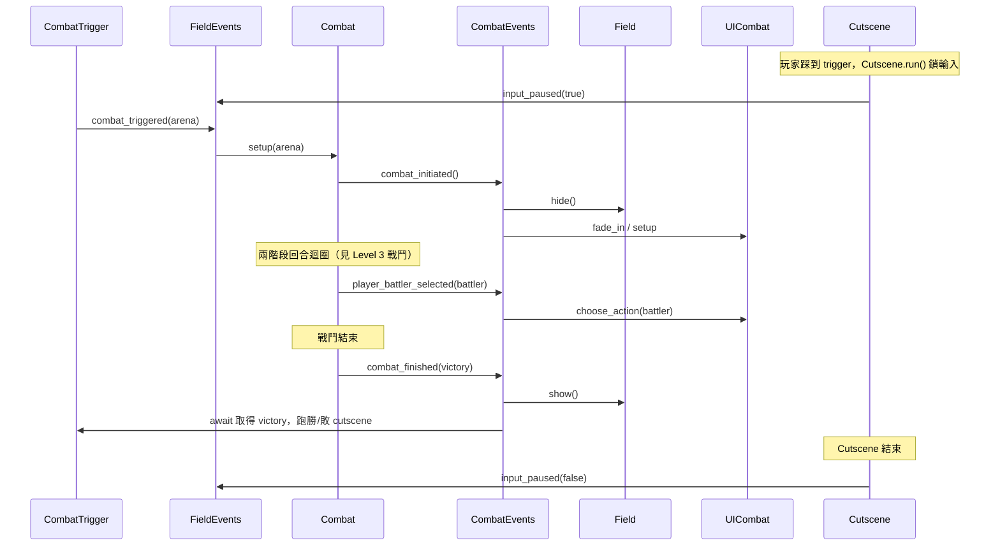

# Level 3 — Signal Bus 與事件系統（Event-Driven Decoupling）

> 模板 A／跨切面：事件驅動架構。
> 目標：完整剖析 GDQuest 慣用的「全域事件匯流排」模式——誰 emit、誰 connect、如何讓 field 與 combat 兩大狀態零相互引用地切換。
> 分析對象：`projects/godot-open-rpg/src/field/field_events.gd`、`src/combat/combat_events.gd`
> 分析日期：2026-05-25
> 核對於 2026-05-25（修正 `interaction_selected` 的發送方：實際由 `Interaction` 發出，非 `FieldCursor`）

---

## 1. 為什麼用 Signal Bus

godot-open-rpg 的最高設計原則是：**任何子系統都不持有其他子系統的節點引用，也不 `get_node()` 去「找」對方。** 取而代之，所有跨模組通訊都經由兩個 autoload 事件匯流排：

- `FieldEvents`（`src/field/field_events.gd`）— 探索狀態專屬。
- `CombatEvents`（`src/combat/combat_events.gd`）— 戰鬥狀態專屬。

兩者都是空殼 `extends Node`，**只宣告 signal、不含邏輯**。發送方 `XxxEvents.some_signal.emit(...)`，接收方 `XxxEvents.some_signal.connect(...)`，雙方互不認識。這就是「控制反轉」：模組依賴抽象的事件，而非具體的對象。

---

## 2. FieldEvents — 探索狀態事件匯流排

`field_events.gd:1-42`。

| Signal | 簽章 | 發送方 | 接收方 |
| :--- | :--- | :--- | :--- |
| `cell_highlighted` | `(cell: Vector2i)` | `FieldCursor.set_focus`（游標移動，`field_cursor.gd:56`） | UI 高亮 / debug |
| `cell_selected` | `(cell: Vector2i)` | `FieldCursor._unhandled_input`（點擊格子，`field_cursor.gd:35`） | `PlayerController._on_cell_selected`（連線於 `player_controller.gd:68`） |
| `interaction_selected` | `(interaction: Interaction)` | `Interaction`（玩家點到其隱藏 Button，`interaction.gd:63-66`） | `PlayerController._on_interaction_selected`（連線於 `player_controller.gd:69`） |
| `combat_triggered` | `(arena: PackedScene)` | `CombatTrigger._execute`（`combat_trigger.gd:9`） | `Combat.setup`（`combat.gd:44`） |
| `cutscene_began` / `cutscene_ended` | — | （保留，目前主要走 `input_paused`） | — |
| `input_paused` | `(is_paused: bool)` | `Cutscene._is_cutscene_in_progress` setter（`cutscene.gd:30-35`） | 各 `GamepieceController`、`FieldCursor` |

### 2.1 `combat_triggered` 是唯一的狀態切換管道

整個專案中「探索 → 戰鬥」的轉換**只有一條路**：`FieldEvents.combat_triggered.emit(arena)`。它由戰鬥觸發器（`combat_trigger.gd:9`）發出，由 `Combat`（常駐主場景）接收（`combat.gd:44`）。任何想觸發戰鬥的物件，只要 emit 這個 signal 即可，完全不需要知道 `Combat` 節點在哪。

### 2.2 `input_paused` 與 `PROCESS_PRIORITY`

`field_events.gd:5-6` 把 `PROCESS_PRIORITY = 99999999`。雖然 `field_events.gd` 本身沒有 `_process`，這個常數標示了「事件管理者應在所有 Gamepieces / Controllers 之後處理」的設計意圖，避免一幀內狀態錯亂。

`input_paused(true)` 由 `Cutscene` 的靜態旗標 setter 自動發出（`cutscene.gd:30-35`）——只要任何 cutscene 開始，全 field 輸入即凍結；結束時自動 emit `false` 解鎖。

---

## 3. CombatEvents — 戰鬥狀態事件匯流排

`combat_events.gd:1-17`。

| Signal | 簽章 | 發送方 | 接收方 |
| :--- | :--- | :--- | :--- |
| `combat_initiated` | `(arena)` | `Combat.setup`（`combat.gd:72`，螢幕已全黑時） | `field.gd:42` → `hide()`；UI fade_in |
| `combat_finished` | `(is_player_victory: bool)` | `Combat._on_combat_finished`（`combat.gd:213`） | `field.gd:43` → `show()`；`combat_trigger.gd:11` 的 `await` |
| `player_battler_selected` | `(battler: Battler)` | `Combat._select_next_player_action`（`combat.gd:120, 150`） | `UICombat._ready`（`ui_combat.gd:37`）彈出 action menu |

### 3.1 `combat_finished` 同時被「兩種訂閱者」消費

這是 signal bus 一對多的示範：

1. **`field.gd:43`** `connect` 後做 `show()`——把探索畫面叫回來。
2. **`combat_trigger.gd:11`** 用 `await CombatEvents.combat_finished` 取得勝負結果，再決定跑勝利/失敗 cutscene（`combat_trigger.gd:21-25`）。

兩者互不知道對方存在，卻能在同一個 signal 上各取所需。

---

## 4. 完整事件流：從觸發到結束的「接力棒」

> **零相互引用**：除了 `Combat` 短暫持有 instantiate 出來的 arena 外，上圖每一個跨模組箭頭都經過 `FieldEvents` 或 `CombatEvents`。Field 不認識 Combat 的型別，Trigger 不認識 Combat 的節點，UI 不認識 Combat 的內部狀態。

---

## 5. 其他系統的事件接口

除了兩條主匯流排，個別 autoload / 子系統也用 signal 對外解耦：

| 來源 | signal | 用途 |
| :--- | :--- | :--- |
| `Player`（autoload） | `gamepiece_changed`（`player.gd`） | `field.gd:19` 動態換相機與 PlayerController |
| `GamepieceRegistry`（autoload） | `gamepiece_moved` / `gamepiece_freed`（`gamepiece_registry.gd:11-12`） | `Pathfinder` 自動 enable/disable 佔用格（`pathfinder.gd:22-38`） |
| `Gameboard`（autoload） | `pathfinder_changed` / `properties_set`（`gameboard.gd:11-19`） | debug 視覺化、Gamepiece 延遲註冊（`gamepiece.gd:112-113`） |
| `BattlerStats`（Resource） | `health_changed` / `energy_changed` / `health_depleted`（`battler_stats.gd:10-14`） | 血條/能量條 UI、Battler 死亡 |
| `Gamepiece` | `arriving` / `arrived` / `direction_changed`（`gamepiece.gd:20-27`） | 路徑延伸、動畫換向、相機跟隨 |

---

## 6. 設計模式評價

| 優點 | 代價 |
| :--- | :--- |
| 模組完全解耦，可獨立替換 Combat / Field 實作 | signal 的發送/接收散在各檔，追蹤資料流需全域搜尋 |
| 一對多廣播天然支援（`combat_finished` 兩個訂閱者） | 無強制契約：emit 與 connect 的參數型別靠約定，編譯期不檢查 |
| 易於插入新訂閱者（如成就、音效）而不動既有碼 | 過度使用會變成「signal 義大利麵」 |

> 對 GDExtension 後端化而言，這套 signal bus 模式正是天然的「事件接口」雛形——詳見 §7。

---

## 7. GDExtension 遷移點（C++ 後端化建議）

使用者哲學下，signal bus 是**前後端契約的最佳轉換對象**。godot-open-rpg 的「`XxxEvents.emit` → 各模組 `connect`」可以無痛對應到 `target/` 衍生計畫的「後端 push 事件 → 前端 `DisplayAPI` 派發」：

| godot-open-rpg（GDScript signal bus） | GDExtension 後端化對應 |
| :--- | :--- |
| `CombatEvents` / `FieldEvents` 的 signal 集合 | C++ 後端的 **GameEvent 列舉**（如 `COMBAT_INITIATED` / `BATTLER_ACT` / `COMBAT_FINISHED`） |
| 各模組 `connect(...)` 訂閱 | 前端 `DisplayAPI.tick()` 拉取事件後 re-emit 給顯示元件（保留 signal 心智模型） |
| `input_paused(is_paused)` | 後端送 `PLAYER_TURN` / `INPUT_LOCK` 事件，前端 `InputHandler` 據此開關輸入 |
| `combat_triggered(arena)` | 前端 `submit_action(ENTER_COMBAT)` 或後端主動推 `COMBAT_INITIATED` |

### 切割原則

- **保留 signal 作為「前端內部」的派發機制**：後端 `tick()` 回傳事件陣列 → `DisplayAPI` 把每個事件 re-emit 成 Godot signal → 各 UI/Gamepiece 元件照舊 `connect`。前端開發者的心智模型幾乎不變。
- **後端不 emit Godot signal**：C++ 後端只回傳純資料事件（POD struct / Dictionary），不依賴 Godot 的 signal 系統，保持可單元測試與跨引擎可攜。
- **單向化**：godot-open-rpg 的 signal 是雙向自由連線；後端化後改為**後端→前端單向事件 + 前端→後端三方法呼叫**（`tick` / `submit_action` / `query`），消除隱性雙向耦合。

對應的完整事件表與三方法契約見 `analysis/godot-open-rpg/target/00_master_guide.md` §4 與 `target/02_frontend_design.md`（`DisplayAPI` / `InputHandler` 設計）。
