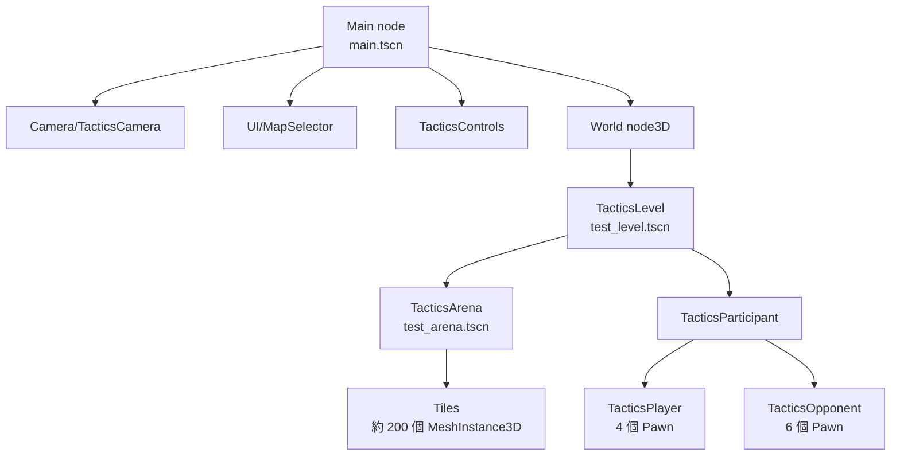

# godot-tactical-rpg — Level 1 初始探索：技術棧與整體架構概覽

> 路徑標註基準：以下相對路徑皆相對於 `projects/godot-tactical-rpg/`。

## 專案基本資訊

| 項目 | 內容 |
|---|---|
| 類型 | 戰棋 / 戰術角色扮演（Tactical RPG / SRPG）**範本**（template，非完整遊戲） |
| 引擎版本 | Godot Engine **4.3**（`project.godot:15-17`，`config/features=("4.3","Mobile")`） |
| 渲染器 | **mobile**（`project.godot:162`，`renderer/rendering_method="mobile"`） |
| 語言 | 純 GDScript（4.3 typed 風格，開啟 untyped/unsafe 警告，`project.godot:24-29`） |
| 授權 | MIT（`LICENSE`） |
| 作者 | @ramaureirac（原作者）、@mbusson（4.3 架構重構） |
| 視覺風格 | 3D 場地 + 2D billboard 角色立繪（`Sprite3D` 朝相機翻面） |
| 主場景 | `res://assets/scene/main.tscn`（`project.godot:16`） |
| Autoload | 僅 `DebugMenu`（第三方除錯外掛，`project.godot:22`） |

> 官方 Wiki／教學連結記錄於 `README.md`，本範本同時發佈於 Godot Asset Library（asset id 1295）。各舊版引擎對應 git branch（3.4 / 4.0 / 4.2）僅存於遠端，本地僅 4.3。

---

## 頂層目錄結構

```
godot-tactical-rpg/
├── project.godot          # 專案設定（Input Map、資料夾顏色、mobile 渲染）
├── README.md / LICENSE
├── assets/                # 「素材」：場景、貼圖、地圖（藝術資產）
│   ├── scene/main.tscn        # 入口場景（地圖選擇器 + 攝影機 + 控制 UI）
│   ├── maps/level/            # 關卡場景（test_level.tscn）與 arena 子場景
│   └── textures/              # 角色立繪、UI 圖示、手把/鍵鼠提示圖
├── data/                  # 「程式邏輯」：採 Model / Module 雙層架構
│   ├── main.gd                # 關卡載入器（placeholder，可被替換）
│   ├── models/                # 純資料 + service 邏輯（class_name，不掛進場景樹）
│   └── modules/               # 可重用的 Godot 節點場景（掛進場景樹）
├── docs/                  # 文件與圖片（含 Blender 製圖教學）
└── addons/                # 第三方編輯器外掛（debug_menu 等）
```

`project.godot:37-46` 用資料夾顏色標示這套架構：`addons/` 紅、`assets/` 藍、`data/models/` 綠、`data/modules/` 黃。

---

## 核心架構模式：Model / Module / Service 三層（類 MVC）

這是本專案最重要、與其他 Godot 範本最大不同之處。**每個系統都被切成三個檔案**：

| 層 | 位置慣例 | 基底類別 | 職責 |
|---|---|---|---|
| **Module（節點層）** | `data/modules/**/<name>.gd` + `.tscn` | `Node3D` / `CharacterBody3D` / `Control` 等 | 真正掛進場景樹的節點；持有 `res` 與 `serv`，把工作**轉發**給 service |
| **Service（邏輯層）** | `data/models/**/service/*.gd` | `RefCounted`（少數 `Node`） | 無狀態的演算法／流程；接收 module 與 resource 當參數操作 |
| **Resource（資料層）** | `data/models/**/<name>_res.gd` + `.tres` | `Resource` | 持有狀態（變數、訊號、常數）；可在 Inspector 編輯、可被多個節點共享 |

典型範例（攝影機，`data/modules/tactics/camera/camera.gd`）：
```gdscript
class_name TacticsCamera extends CharacterBody3D
@export var res: TacticsCameraResource = load(".../camera.tres")  # 資料層
static var serv: TacticsCameraService                              # 邏輯層
func _process(delta): serv.process(delta, self)                    # 節點僅轉發
```

### Service 階層化（service of services）
較大的系統的 service 還會再持有子 service。例如：
- `TacticsCameraService`（`data/models/view/camera/tactics/service/t_cam_serv.gd`）持有 `move / zoom / rotate / pan` 四個子 service。
- `TacticsPawnService`（`data/models/world/combat/participant/pawn/service/pawn_serv.gd`）持有 `movement / combat / animation / ui` 四個子 service。
- `TacticsParticipantService` 持有 `turn_service / combat_service`。

> 觀察：多處同時存在 `service.gd` 與 `<name>_serv.gd` 兩個**內容完全相同**的檔案（同一 `class_name`），疑為重構期的命名過渡遺留。詳見 `others/observations.md`。

---

## `data/models/` 子樹（資料 + 邏輯）

```
data/models/
├── config/                 # 全域靜態設定
│   ├── tactics_config.gd       # TacticsConfig：顏色/材質/pawn 速度/視野（static）
│   └── debug.gd                # DebugLog：彩色防洗版除錯日誌（static）
├── view/                   # 「呈現/輸入」相關（攝影機、控制、游標）
│   ├── camera/tactics/         # 攝影機 resource + 5 個 service
│   └── control/                # 控制 resource + input/selection/ui/camera service
└── world/                  # 「遊戲世界」相關
    ├── combat/
    │   ├── arena/              # 場地：tile 轉換、BFS 走訪、pathfinding、目標搜尋
    │   └── participant/        # 參與者：player / opponent / pawn 各自的 res + service
    ├── stats/                  # StatsResource + 各 hero/mob 的 .tres
    └── utilities/vector.gd     # CalcVector：去掉 Y 的距離計算工具
```

## `data/modules/` 子樹（場景節點）

```
data/modules/
├── stats/                  # Expertise / Stats 節點（把 StatsResource 灌入 pawn）
├── tactics/
│   ├── camera/camera.tscn      # TacticsCamera（TwistPivot→PitchPivot→Camera3D）
│   ├── controls/controls.tscn  # TacticsControls（動作選單 + InputCapture）
│   └── level/
│       ├── tactics_level.gd        # TacticsLevel：頂層回合驅動器
│       ├── arena/                  # TacticsArena + TacticsTile + RayCasting
│       ├── participants/           # TacticsParticipant / Player / Opponent
│       └── pawn/pawn.tscn          # TacticsPawn（單一棋子）
└── ui/                     # InputCapture（滑鼠→3D 射線）、InputHints
```

---

## 入口與初始化流程

| 順序 | 節點 / 函式 | 動作 |
|---|---|---|
| 1 | `main.tscn` → `data/main.gd::_ready` | 顯示地圖選擇器，焦點放在「Load Map 0」按鈕 |
| 2 | 玩家按鈕 → `main.gd::_on_load_map_0_pressed` | 呼叫 `load_level("test")` |
| 3 | `main.gd::load_level:36` | 載入 `res://assets/maps/level/test_level.tscn` 並 `add_child` 到 `World` 節點 |
| 4 | `tactics_level.gd::_ready:28` | 取得 arena/participant/player/opponent 參照；`arena.configure_tiles()`、`participant.configure(...)` |
| 5 | `tactics_level.gd::_physics_process:47` | 每物理影格依 `turn_stage`（0 init / 1 handle）驅動整局回合 |

> `main.gd` 開頭明示「A placeholder script that is meant to be replaced by your own level loader system」——關卡載入是刻意留白讓使用者替換的。

---

## 構建與執行方式

- **執行**：用 Godot 4.3 編輯器開啟專案資料夾 → 按 F5（或執行主場景 `main.tscn`）→ 點「Load Map 0」進入 `test_level`。
- **匯出**：標準 Godot 匯出流程（features 含 `Mobile`，預設 mobile 渲染器，適合行動裝置）。
- **除錯開關**：`DebugLog.debug_enabled`（`data/models/config/debug.gd:9`）預設 `true`，輸出彩色回合/AI 日誌到 Output；`visual_debug`（同檔 :10）預設 `false`，開啟後會畫出滑鼠射線。README 提到也可在 `TacticsConfig` 關閉。
- **無自動化測試**：專案沒有 `tests/` 或 GUT 等測試框架，驗證以手動遊玩為主。

---

## 場景節點概觀（`test_level.tscn`）



注意：`TacticsCamera` 與 `TacticsControls` 屬於 `main.tscn`（全域常駐），不在關卡內；關卡只負責場地與參與者。攝影機/控制與關卡之間透過共享的 `.tres` Resource（`camera.tres`、`control.tres`）耦合。
