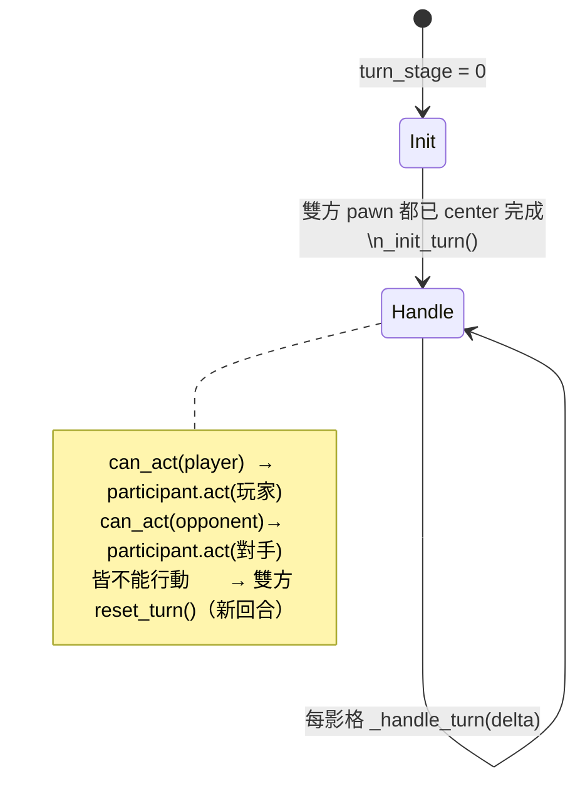
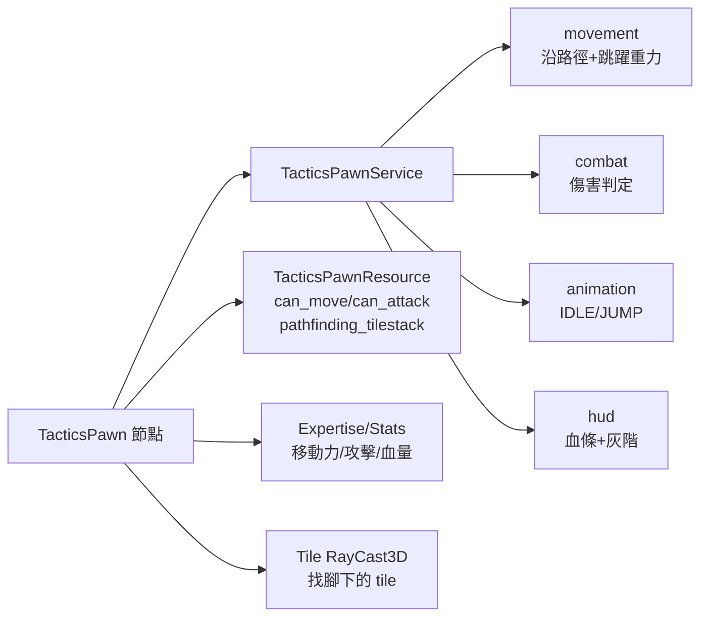
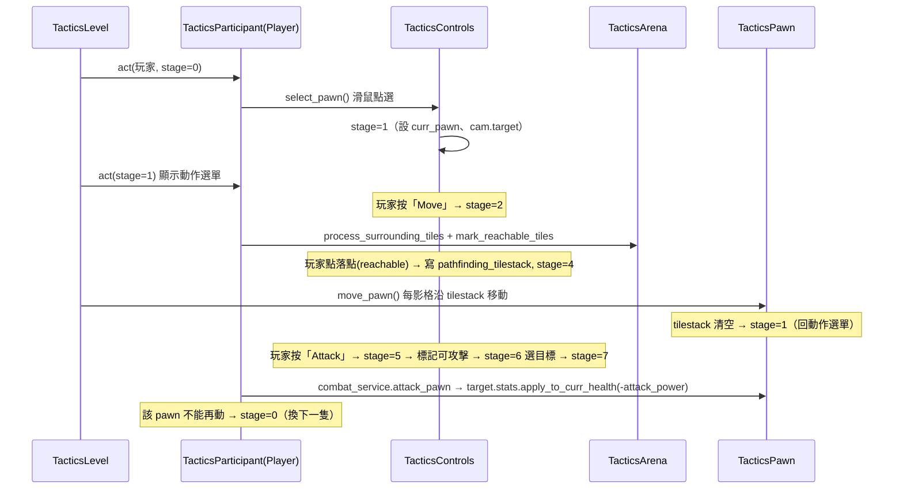

# godot-tactical-rpg — Level 2 核心模組職責與資料流

> 路徑相對於 `projects/godot-tactical-rpg/`。建議先讀 `level1_overview.md` 了解 Model/Module/Service 三層慣例。

本層聚焦五大核心模組的**權責劃分**與**耦合點**：場地（Arena/Tile）、棋子（Pawn）、參與者與回合（Participant/Turn）、攝影機（Camera）、控制與 UI（Controls）。

---

## 1. 五大模組的職責一覽

| 模組 | 節點層 | 邏輯層（service） | 資料層（resource） | 一句話職責 |
|---|---|---|---|---|
| 場地 Arena | `TacticsArena` | `TacticsArenaService` + `TacticsTileService` | `TacticsArenaResource` | 把網格 mesh 轉成可走訪 tile、做 BFS 移動範圍、pathfinding、目標搜尋 |
| 格子 Tile | `TacticsTile` | （沿用 ArenaService） + `TacticsTileRaycast` | （無獨立 res，狀態存節點上） | 單格的可達/可攻擊/hover 狀態與材質、用射線找鄰居與佔用者 |
| 棋子 Pawn | `TacticsPawn` | `TacticsPawnService`（movement/combat/animation/ui） | `TacticsPawnResource` | 單一棋子的移動物理、攻擊、動畫、血條、回合旗標 |
| 參與者 Participant | `TacticsParticipant`→`TacticsPlayer`/`TacticsOpponent` | `TacticsParticipantService`（turn/combat）+ player/opponent service | `TacticsParticipantResource` | 持有一方所有 pawn、推進回合 stage、玩家輸入 vs AI 決策的分流 |
| 攝影機 Camera | `TacticsCamera` | `TacticsCameraService`（move/zoom/rotate/pan） | `TacticsCameraResource` | 平移/邊緣捲動/自由視角/旋轉/縮放/聚焦目標 |
| 控制 Controls | `TacticsControls` | `TacticsControlsService`（input/selection/ui/camera）+ `CursorService` | `TacticsControlsResource` | 動作選單 UI、滑鼠/手把拾取 tile/pawn、把玩家意圖轉成 stage |
| 輸入捕捉 InputCapture | `InputCapture` | `InputCaptureService` | `InputCaptureResource` | 滑鼠座標→3D 射線投影；鍵鼠/手把事件 → 攝影機輸入 |
| 統計 Stats | `Expertise`/`Stats` | （無） | `StatsResource` | 把 .tres 的職業數值灌進每個 pawn |

---

## 2. 頂層回合驅動器：`TacticsLevel`

**節點位置**：`data/modules/tactics/level/tactics_level.gd`

這是整局的「心臟」。`_physics_process` 用 `turn_stage` 兩段式狀態驅動（`tactics_level.gd:47-51`）：



- `_init_turn`（`tactics_level.gd:55`）：等待 `participant.is_configured(player/opponent)`（即所有 pawn 都已對齊到 tile 中心）才進入 stage 1。
- `_handle_turn`（`tactics_level.gd:60`）：**玩家優先**——只要玩家還有任一 pawn 能行動就讓玩家行動；玩家全部行動完才換對手；雙方都行動完則 `reset_turn` 重置（所有 pawn 恢復 `can_move/can_attack`），形成下一回合。

> 這是一種「**雙方陣營制**」而非「個別單位速度制」的回合：先把己方所有 pawn 都動完才換邊。

---

## 3. 參與者與回合 stage 機（核心調度層）

**資源**：`TacticsParticipantResource`（`data/models/world/combat/participant/particpt_res.gd`）

整局的細部流程由一個 `stage: int` 變數驅動，0~7 共 8 個階段（`particpt_res.gd:12-28`）：

| stage | 常數名 | 玩家行為（`turn.gd::handle_player_turn`） | 對手行為（`turn.gd::handle_opponent_turn`） |
|---|---|---|---|
| 0 | STAGE_SELECT_PAWN | `controls.select_pawn` 滑鼠選棋 | `opponent.choose_pawn` 挑第一個能動的 pawn |
| 1 | STAGE_SHOW_ACTIONS | 顯示動作選單 | `opponent.chase_nearest_enemy`（算路徑） |
| 2 | STAGE_SHOW_MOVEMENTS | 標記可達 tile | `opponent.is_pawn_done_moving` |
| 3 | STAGE_SELECT_LOCATION | 滑鼠選落點 | `opponent.choose_pawn_to_attack` |
| 4 | STAGE_MOVE_PAWN | `player.move_pawn` 等待移動完 | `combat_service.attack_pawn`（AI 攻擊） |
| 5 | STAGE_DISPLAY_TARGETS | 標記可攻擊 tile | — |
| 6 | STAGE_SELECT_ATTACK_TARGET | 滑鼠選攻擊目標 | — |
| 7 | STAGE_ATTACK | `combat_service.attack_pawn`（玩家攻擊） | — |

**關鍵不對稱**：玩家走完 0→7 全部 8 個 stage（移動與攻擊是分開兩條動作分支）；對手只走 0→4（`turn.gd:58` 有 `if res.stage > 4: res.stage = 0`），把「選棋→追擊→移動→選目標→攻擊」壓縮成 5 步自動完成。

**呼叫鏈**（玩家為例）：
```
TacticsLevel._handle_turn
 └─ TacticsParticipant.act(delta, is_player=true, player)
     └─ TacticsParticipantService.act  (service.gd:50)
         └─ turn_service.handle_player_turn  (turn.gd:31)
             └─ match res.stage → controls.* / player.* / combat_service.attack_pawn
```

`TacticsPlayer` / `TacticsOpponent` 都 `extends TacticsParticipant`（`tactics_player.gd:2`、`tactics_opponent.gd:2`），各自再持有一個 `player_serv` / `opponent_serv` 提供陣營專屬行為。

---

## 4. 棋子 Pawn 的職責切分

**節點**：`TacticsPawn extends CharacterBody3D`（`data/modules/tactics/level/pawn/pawn.gd`）

`TacticsPawn` 自己幾乎只做「狀態查詢」與「轉發」，實作全在 4 個子 service（`pawn_serv.gd:18-23`）：



每物理影格 `pawn_serv.process`（`pawn_serv.gd:36`）一次做完：朝相機翻面 → 沿路徑移動 → 動畫 → 灰階（不能行動時）→ 更新血條。

- **找自己站的 tile**：`pawn.gd::get_tile:54` 用一條向下的 `$Tile` RayCast3D 取得腳下 tile（`get_collider`）。
- **回合旗標**：`res.can_move` / `res.can_attack`（`pawn_res.gd:24-25`）；`reset_turn` 復原、`end_pawn_turn` 清空並 emit `turn_ended`。
- **能否行動**：`can_act() = (can_move or can_attack) and is_alive()`（`pawn.gd:82`）。

---

## 5. 模組間的耦合點與資料流

### 共享 Resource 是主要耦合媒介
多個節點透過 `load(".../*.tres")` 載入**同一份**資源實例而相互通訊，而非直接持有節點參照：

| Resource（.tres） | 被誰共享 |
|---|---|
| `camera.tres`（`TacticsCameraResource`） | `TacticsCamera`、`TacticsParticipant`、`TacticsControls`、`TacticsLevel` |
| `control.tres`（`TacticsControlsResource`） | `TacticsControls`、`TacticsParticipant`、`TacticsPawn`、`TacticsLevel` |
| `participant.tres`（`TacticsParticipantResource`） | `TacticsParticipant`、`TacticsControls` |
| `arena.tres`（`TacticsArenaResource`） | `TacticsArena`、`TacticsControls` |

例如「玩家選好落點」這件事：`TacticsControlsSelectionService.select_new_location`（`selection.gd:64`）直接寫 `ctrl.curr_pawn.res.pathfinding_tilestack = ...` 並把 `participant.stage = 4`，下一影格 `TacticsLevel` 讀到 stage 變化就讓 pawn 開始移動。**沒有自訂全域事件匯流排，stage 變數＋共享 res 就是事件機制。**

### Signal（訊號）耦合
- `TacticsCameraResource` / `TacticsControlsResource` / `TacticsArenaResource` 各自定義 `called_*` 訊號，在 `setup()` 裡把訊號接到對應節點的方法上（例：`arena/service/service.gd:23-25`、`controls/service/t_ctrl_serv.gd:43-48`）。讓 service（RefCounted，不在場景樹）能「請節點代為執行」需要場景樹的操作。
- `TacticsPawnResource` 的 `pawn_moved` / `pawn_attacked` / `turn_ended`（`pawn_res.gd:6-10`）供日後擴充掛鉤（目前範本內訂閱者不多）。

### 跨層的 `cam.target` 焦點機制
攝影機聚焦完全靠資料層的 `TacticsCameraResource.target: Node3D`：誰想讓鏡頭看某物，就把 `camera.target = 某節點`，`TacticsCameraMovementService.focus_on_target`（`camera/service/movement.gd:52`）每影格把鏡頭推向 target，抵達後自動把 target 設回 null。AI 與玩家流程到處在改它（`turn.gd:33`、`selection.gd:41`、`combat.gd:40` 等）。

---

## 6. 整體資料流（一次玩家「移動 + 攻擊」）


